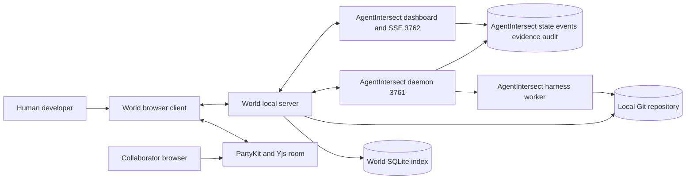
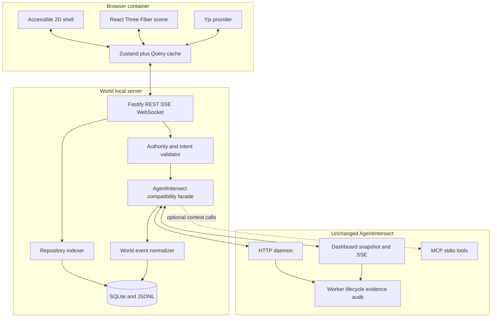
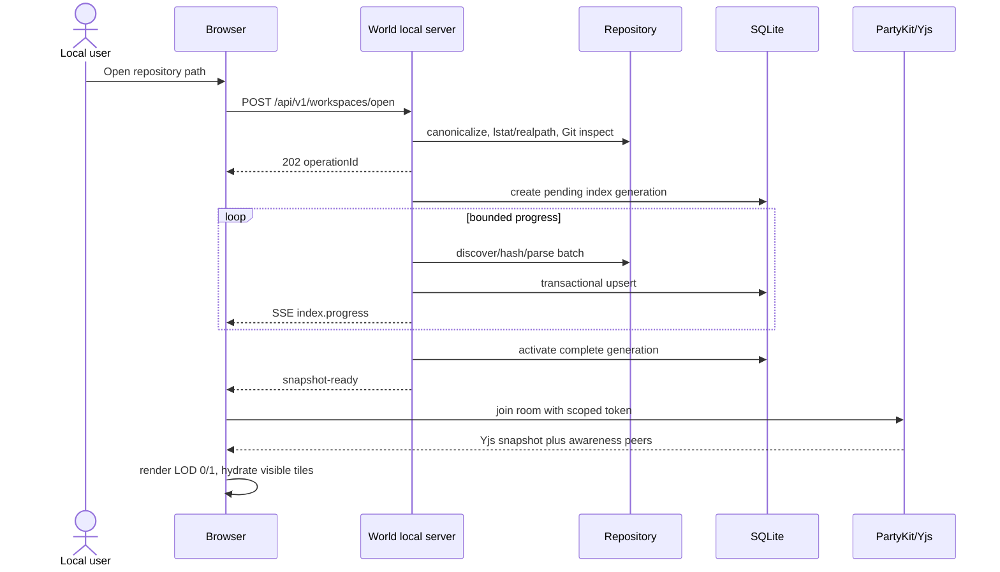
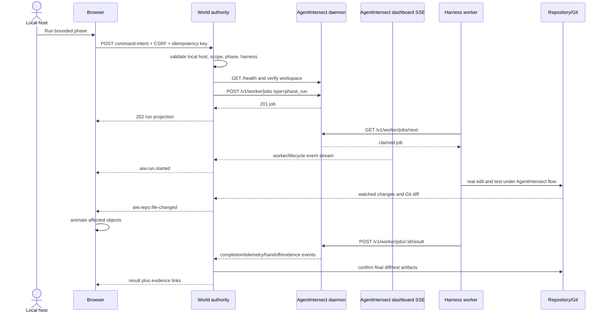
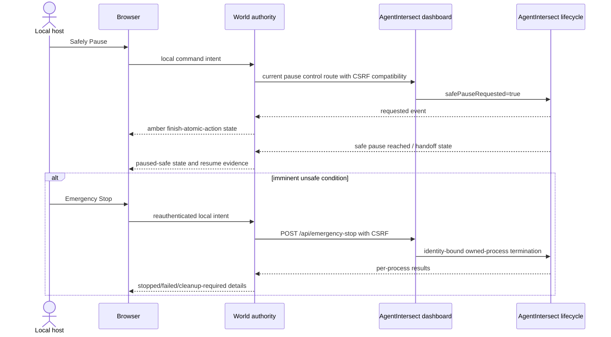
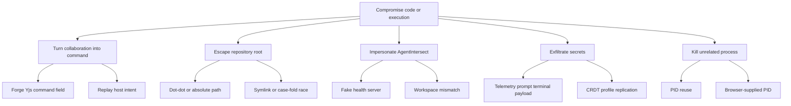

# AgentIntersect World — Canonical Product and Implementation Design

## Document status

**Status:** Canonical active design. Phase 0 is complete; Phase 1 is next and follows the project-local rules in `AGENTS.md`.

**Canonical product and repository name:** **AgentIntersect World**.

**Decision:** AgentIntersect World is a new, separate project and repository. The original AgentIntersect repository remains untouched. Phase 0 established a one-time compatibility baseline; normal World development no longer repeatedly inspects or verifies the original checkout. When baseline code is needed, the required code may be copied into World with provenance recorded once and is then maintained as World-owned code. World may still consume compatible local HTTP/SSE/MCP/worker surfaces, but the original AgentIntersect repository is not an ongoing phase gate.

This document uses three maturity labels:

- **Current AgentIntersect** — behavior verified in the private source tree as of 2026-07-19. It is current source/runtime behavior, not a published SDK promise.
- **AgentIntersect World v0.1** — a contract this design proposes for the first World release.
- **Future/Deferred** — explicitly outside the v0.1 cutline and not implied by current AgentIntersect.

No code, package, repository, release, or external configuration change is authorized by this document.

### Development operating rules — 2026-07-19 override

These rules supersede older phase text when there is a conflict:

1. Build functional vertical slices first. Use focused tests during implementation and integrated/full tests once the slice works.
2. Require one worker report, then independent Mr Fluff functional proof and prompt first-hand operator testing. Worker prose is not evidence.
3. Audit only when first-hand testing exposes a concrete issue or the user explicitly requests one. Do not make routine audits or targeted re-audits automatic build-stage gates.
4. Fix observed defects with focused regressions and rerun the affected proof; move speculative or theoretical hardening to backlog.
5. Defer broad security hardening, internet threat models, enterprise controls, supply-chain ceremony, and speculative abuse-case work until a dedicated hardening milestone after the product path functions.
6. Retain only inexpensive baseline safeguards against accidental data loss, destructive mutation, secret leakage, and unintended exposure beyond the configured loopback/trusted-LAN boundary.
7. “Multiplayer” means one human/operator using one or more agents owned by that human on the same computer or trusted LAN. Multiple browser views represent that same operator. Unrelated users, outside agents, public rooms, cloud multi-tenancy, and internet collaboration are out of scope.
8. Do not recheck the original AgentIntersect repository unless the user explicitly requests a baseline refresh/original-project change or a concrete live compatibility failure requires diagnosis.
9. `AGENTS.md` is the authoritative project-local workflow contract for implementation agents.

### Source provenance

The authoritative concept inputs are the relocated Obsidian copies `AgentIntersect World.docx` and `AIW tech stack.docx`, read together with [[agentintersect-agentworld-studio-base-evaluation|the AgentIntersect World base evaluation]] and current private AgentIntersect source. The Word filenames and opening titles are semantically reversed: `AgentIntersect World.docx` contains the longer v0.1 tech-stack proposal, while `AIW tech stack.docx` contains the concept/opportunity proposal. This is provenance only, not a blocker. The historical OneDrive document and relocated `AgentIntersect World.docx` were verified byte-for-byte identical; the Obsidian copy is canonical.

## Decision summary

| Decision                           | Maturity                  | Consequence                                                              |
| ---------------------------------- | ------------------------- | ------------------------------------------------------------------------ |
| Independent World repository       | AgentIntersect World v0.1 | Original AgentIntersect remains untouched and is not a recurring gate    |
| World-owned baseline reuse         | AgentIntersect World v0.1 | Needed copied code is owned and evolved here after one provenance record |
| Browser-first spatial IDE/world    | AgentIntersect World v0.1 | React/R3F canvas with an accessible 2D operational shell                 |
| Local/LAN-first runtime            | AgentIntersect World v0.1 | One trusted operator; loopback default and explicit trusted-LAN support  |
| Presentation sync for one operator | AgentIntersect World v0.1 | Multi-view/multi-agent state, not unrelated-user collaboration           |
| Functional vertical slices first   | AgentIntersect World v0.1 | Build → test → parent proof → first-hand testing; audit observed issues  |
| Broad security hardening           | Future/Deferred           | Dedicated milestone after the main product path functions                |
| XR, physics, cloud execution       | Future/Deferred           | Optional adapters; not v0.1 dependencies                                 |

## Executive summary

**One-sentence pitch:** AgentIntersect World lets people enter a live spatial model of a repository and watch real AI agents build software as visible, evidence-backed collaborators.

AgentIntersect World is a spatial embodied AI development world, not a decorative code city. A browser turns packages, directories, files, symbols, tests, dependencies, issues, phases, and runs into a navigable Spatial Code Graph. A local World server indexes the repository and coordinates one human operator with one or more of that operator’s local/LAN agents. World may reuse a copied AgentIntersect baseline and compatible local control-plane surfaces while remaining independently developed. Presentation synchronization is for the same trusted operator’s browser views and agents, not unrelated internet users.

The v0.1 proof is deliberately narrow: open one repository, render one island, open one or more views for the same local operator, run one or more of that operator’s agents, observe real edits and test results, animate affected objects, and expose the diff, telemetry, evidence, and lifecycle outcome. If this path is reliable, the system can widen language support, graph semantics, avatar modules, and local multi-agent coordination.

## Product thesis, category, and value

### Thesis

Modern coding agents are operationally capable but perceptually thin. Their work is flattened into chat, terminal streams, file lists, and diffs. Code-graph tools make structure visible but usually omit live agency, phase ownership, evidence, and shared presence. AgentIntersect World combines these into a persistent spatial interaction substrate while retaining a conventional 2D shell for precision and accessibility.

### Category

The product category is **spatial agentic development**: a repo-first development environment in which humans and agents share a live world model tied to real repository state and a verifiable execution ledger. It is adjacent to agentic IDEs, code visualization, multiplayer development, and embodied-agent interfaces, but it is not a full IDE replacement, a generic metaverse, a game engine, or an agent safety approval product.

### Differentiators

1. **Real execution:** visual actions are projections of real AgentIntersect jobs and filesystem/Git outcomes.
2. **Visible evidence:** every construction animation resolves to a diff, test, event, handoff, or evidence link; animation is never proof by itself.
3. **Embodied continuity:** agent identity, phase, status, and work location become legible without copying private raw memory into a room.
4. **Shared operator context:** one human can coordinate multiple owned agents and browser views around the same repo model.
5. **Baseline reuse without coupling:** useful AgentIntersect behavior may seed World, but World evolves independently without recurring original-repository checks.
6. **Arbitrary-repo opening with bounded detail:** any safe local repository can degrade to searchable hierarchy and summary geometry even when full symbol rendering is impossible.

### Personas

| Persona                       | Need                                          | World value                                                                |
| ----------------------------- | --------------------------------------------- | -------------------------------------------------------------------------- |
| Solo agent-heavy developer    | Understand what a long-running agent is doing | Spatial affected-area animation plus exact diff/evidence                   |
| Tech lead/reviewer            | See phase, risk, tests, and ownership         | Phase zones, run timeline, evidence panel, no execution from peers         |
| New contributor               | Learn an unfamiliar repository                | District hierarchy, dependency bridges, search-to-focus                    |
| Solo multi-agent operator     | Coordinate several owned agents               | Multi-view presence, agent status, pointers, annotations                   |
| Agent-platform maintainer     | Verify World-owned integration behavior       | Tests against World fixtures and locally owned baseline code               |
| Accessibility-first developer | Operate without 3D navigation                 | Complete keyboard-accessible 2D tree, command palette, inspector, timeline |

### Jobs to be done

- When an agent works across a repository, show where it is acting and what evidence supports the claimed outcome.
- When entering an unfamiliar repo, provide a stable spatial map without forcing the user to learn a new source of truth.
- When using multiple agents or views, synchronize focus and annotations for the same trusted local/LAN operator.
- When a run fails or reconnects, reconstruct what happened from durable events and current AgentIntersect state.
- When motion or 3D is unsuitable, preserve the full workflow through a 2D operational shell.

### Primary demo

“I walked into my repo and watched my AI agent build a real feature.” The demo opens a small repository, renders its `src` district, displays one agent avatar, enqueues a real bounded job through AgentIntersect, highlights touched file buildings, runs a real test, shows red/yellow/green test beacons with text and icons, reveals the exact diff and evidence, and mirrors presence in a second browser.

## Goals, non-goals, and scope

### v0.1 goals

- Open and safely index a local Git repository.
- Build a deterministic, searchable Spatial Code Graph with progressive LOD.
- Reuse the Phase 0 baseline through World-owned code/fixtures and compatible local interfaces without repeatedly verifying the original repository.
- Normalize AgentIntersect snapshot, event, telemetry, worker, phase, handoff, and evidence signals into a versioned World protocol.
- Submit bounded `phase_run` command intents only after local authority validation.
- Show real changes, tests, evidence, safe pause, and emergency-stop state.
- Provide same-operator multi-view presence and durable annotations locally or on the trusted LAN.
- Provide an accessible 2D shell equivalent for every required operation.
- Persist graph/cache/run projections locally and rebuild deterministically after loss.

### Non-goals

- Replacing AgentIntersect, changing its source, or treating it as a public SDK.
- Directly launching Codex, Claude Code, Hermes, or OpenClaw from generic World PTYs for AgentIntersect-managed work.
- Letting CRDT peers execute commands, enqueue jobs, change files, approve lifecycle gates, or stop processes.
- Full IDE/editor replacement, arbitrary binary editing, perfect semantic parsing, or full-repo high-detail rendering.
- A long-lived AgentIntersect branch, shared-package extraction, public publishing, or repository release.
- VR-first UX, full physics, AI-generated meshes, cloud-hosted arbitrary execution, or enterprise administration.
- Recreating AgentClutch’s pre-action Action Card/approval boundary.

### v0.1 cutline

The cutline contains one workspace, one active repo, hierarchy plus language Tier 1 symbol parsing, World-owned baseline integration, working local agent execution, same-operator multi-view presence, annotations, diff/evidence inspection, run replay, safe pause, emergency-stop projection, and deterministic recovery. Multiple repo continents, public/internet collaboration, unrelated-user access, XR, physics, plugin execution, and cloud sync are deferred. Trusted-LAN operation for the same human’s machines and agents is allowed when explicitly configured.

### Relationship to AgentIntersect and AgentClutch

**Phase 0 AgentIntersect baseline** documented the lifecycle/execution behavior from which World begins. The original repository remains untouched and is no longer a routine verification dependency. World may consume compatible running surfaces or own copied baseline code inside this repository.

**AgentIntersect World v0.1** owns repository indexing, spatial layout, world-object identity, normalized events, browser UI, same-operator multi-agent/multi-view presence, annotations, and its local/LAN execution integration.

**AgentClutch** remains a separate product lane centered on the pre-action consequential-control boundary. World may display an external approval state in the future, but it does not clone or bypass AgentClutch controls.

## Design principles

1. **Repo-first:** geometry is subordinate to the real repository and Git state.
2. **Local/LAN-first:** code, paths, events, and evidence remain on the operator’s computer or trusted LAN.
3. **Browser-first:** one URL, desktop browser, progressive enhancement; XR is optional later.
4. **Real execution:** World depicts AgentIntersect-managed work; it does not simulate success.
5. **Visible evidence:** every status links to durable, inspectable evidence or says that evidence is unavailable.
6. **One-human multi-agent operation:** all agents and views belong to the same trusted operator.
7. **LOD-first:** every graph feature declares aggregation and degradation behavior before detailed rendering.
8. **Independent evolution:** copied baseline code becomes World-owned code; do not couple phase progress to the original checkout.
9. **Accessible dual representation:** every spatial object and state has a semantic 2D representation.
10. **Functionality before hardening:** keep cheap data-loss/exposure safeguards, then defer broad hardening until the working product path exists.

## Current AgentIntersect capability inventory

### Package and runtime facts

**Current AgentIntersect:** private Node `>=24` ESM package `@contextloop/manager`, version `0.1.0`, with no claim of an already published public SDK. The daemon defaults to `127.0.0.1:3761`; the dashboard server defaults to `127.0.0.1:3762` and rejects non-loopback binding. The daemon request-body ceiling is 256 KiB.

### Verified daemon routes

| Method and path                      | Current purpose                                                       |
| ------------------------------------ | --------------------------------------------------------------------- |
| `GET /health`                        | Service, process-start, protocol, and canonical workspace attestation |
| `GET /v1/state`                      | Authoritative current state snapshot                                  |
| `GET /v1/instructions?phase_id=...`  | Portable phase instructions and endpoints                             |
| `GET /v1/resume-packet?phase_id=...` | Validated resume context                                              |
| `POST /v1/worker/jobs`               | Create a bounded worker job                                           |
| `GET /v1/worker/jobs/next`           | Claim next job, filtered by harness/worker/job                        |
| `POST /v1/worker/jobs/:jobId/result` | Complete the active claimed job; claim owner required                 |
| `POST /v1/events`                    | Append external event                                                 |
| `POST /v1/telemetry`                 | Normalize and persist phase telemetry                                 |
| `POST /v1/claude-code/hooks`         | Ingest Claude Code lifecycle hook payload                             |
| `POST /v1/handoffs`                  | Record external handoff event                                         |

### Verified dashboard integration candidates

**Current AgentIntersect, not yet promised as a separately versioned public API:**

- Stable candidates: `GET /api/health`, `GET /api/snapshot`, `GET /api/events`, `GET /api/events/stream` (SSE), and `GET /api/dashboard-state`.
- Current setup/connectors/onboarding families: `/api/setup/*`, `/api/connectors/:connectorId/{config-preview|test}`, `/api/onboarding/*`.
- Current design/worker/progress families: `/api/design-doc/*`, `/api/worker/*`, `POST /api/progress/reconcile`.
- Current control families: `POST /api/phases/:phaseId/:action`, `POST /api/auto-advance/:action`, `POST /api/pause/:action`, and `POST /api/emergency-stop`.

World v0.1 reads the candidate snapshot/event surfaces and uses daemon worker routes for the vertical slice. It does not couple its core schema to every dashboard route. Mutating dashboard routes are compatibility candidates only after contract tests establish CSRF/origin requirements and response stability.

### Verified MCP surface

**Current AgentIntersect:** a stdio JSON-RPC MCP server advertising protocol `2024-11-05`, server `agentintersect-clm` version `0.1.0`, and tool capability only. It implements exactly five tools:

- `clm_get_current_phase`
- `clm_report_telemetry`
- `clm_request_handoff`
- `clm_get_resume_packet`
- `clm_record_evidence`

It does **not** advertise MCP resources today. `repo://`, `world://`, `run://`, or similar resources described later are **proposed AgentIntersect World surfaces**, not current AgentIntersect behavior.

### Capability mapping

| Concern                 | Current AgentIntersect                                            | World v0.1 use                           | Proposed/new in World                    |
| ----------------------- | ----------------------------------------------------------------- | ---------------------------------------- | ---------------------------------------- |
| Phase/session lifecycle | Engine, dashboard controls, state                                 | Read/project; request via approved route | Spatial phase zones/timeline             |
| Worker orchestration    | Durable create/claim/complete; claim identity; bounded completion | Enqueue one `phase_run`, observe result  | Intent validation and projection         |
| Harnesses               | Codex, Claude Code, Hermes, OpenClaw connector/adapter surfaces   | Use selected AgentIntersect harness      | No duplicate CLI runner                  |
| Process safety          | Owned manifests, PID/start identity, emergency stop               | Display/control through local authority  | No World kill-by-PID                     |
| Workspace identity      | Canonical realpath + daemon health attestation                    | Mandatory discovery gate                 | World workspace ID mapped to attestation |
| Telemetry               | Normalization, bounded ingress, state/event persistence           | Normalize into World events              | Visual affected-object mapping           |
| Handoffs                | Required sections, digest signing, path/symlink checks            | Link and render validation               | Spatial handoff beacon                   |
| Evidence/audit          | Managed evidence, reports, redaction/export                       | Read safe metadata/content on demand     | Evidence panel and privacy export        |
| Replay                  | Dashboard bounded event replay and SSE                            | Resume cursor and reconcile              | World event store/dedupe                 |
| Repo graph              | None                                                              | —                                        | Git/ripgrep/tree-sitter/SQLite indexer   |
| 3D renderer             | None                                                              | —                                        | React/R3F/drei/postprocessing            |
| Multiplayer             | None                                                              | —                                        | Yjs/PartyKit presentation state          |

### Source anchors

Key current behavior is anchored in `package.json`; `src/daemon.mjs`; `src/mcp-surface.mjs`; `src/worker-queue.mjs`; `src/dashboard-server.mjs`; `src/dashboard.mjs`; `src/engine.mjs`; `src/platform-bridges.mjs`; `src/owned-processes.mjs`; `src/workspace-identity.mjs`; `src/audit.mjs`; `src/audit-export.mjs`; `src/redaction.mjs`; `src/ingress.mjs`; `src/handoff.mjs`; `src/onboarding.mjs`; `src/harness-connectors.mjs`; and the dashboard auto-advance, safe-pause, phase-control, and progress-reconcile modules. Detailed anchors appear in Source references.

## System context





## Authority and trust split

| Component          | Authoritative for                                                              | Must never be authoritative for                      |
| ------------------ | ------------------------------------------------------------------------------ | ---------------------------------------------------- |
| Browser            | Local input focus, ephemeral camera, rendering                                 | Execution, files, lifecycle, durable audit           |
| World local server | Repo-index cache, World API auth, intent validation, projection ledger         | AgentIntersect phase truth or process ownership      |
| PartyKit/Yjs       | Shared layout, annotations, durable room presentation                          | Commands, files, secrets, raw memory, evidence truth |
| AgentIntersect     | Jobs, claims, lifecycle, telemetry, handoffs, evidence, audit, owned processes | Spatial layout or multiplayer presence               |
| Harness workers    | Execution under an AgentIntersect claim                                        | Global lifecycle truth or room authority             |
| Filesystem/Git     | File bytes and repository history/status                                       | Phase completion by itself                           |
| Future cloud       | Opt-in relay/account services                                                  | Implicit access to local code or command authority   |

The browser sends a `CommandIntent`; the local server authenticates the local session, verifies workspace and AgentIntersect attestation, checks CSRF/origin, validates phase/harness/operation allowlists, binds a correlation/idempotency key, and only then calls AgentIntersect. PartyKit may relay a visual “request” to the host, but the host must convert it into a separately confirmed local intent. CRDT updates never enter the command dispatch function.

## Repository and package architecture

```text
agentintersect-world/
├─ apps/
│  ├─ web/                       # Vite React 19 browser application
│  ├─ local-server/              # Fastify local authority and integration facade
│  └─ party-server/              # PartyKit/Yjs presentation rooms
├─ packages/
│  ├─ world-schema/              # canonical Zod schemas and generated JSON Schema
│  ├─ agentintersect-client/      # current compatibility facade; no copied runtime
│  ├─ world-event-protocol/       # normalization, cursor, dedupe, replay
│  ├─ repo-indexer/               # filesystem/Git/parser pipeline
│  ├─ spatial-code-graph/         # hierarchy, layout, LOD-independent graph
│  ├─ renderer-r3f/               # rendering and visual effects only
│  ├─ sync-yjs/                   # Y.Doc layout, awareness, room protocol
│  ├─ avatar-system/              # schema-first modular avatars
│  ├─ persistence/                # SQLite migrations, repositories, JSONL ledger
│  ├─ config/                     # config and environment validation
│  ├─ observability/              # logs, metrics, correlation, diagnostic bundle
│  └─ ui/                         # accessible DOM components and design tokens
├─ examples/
│  ├─ vertical-slice-repo/
│  └─ large-repo-fixture/
├─ tooling/
│  ├─ contract-fixtures/
│  └─ scripts/
├─ docs/
├─ pnpm-workspace.yaml
├─ turbo.json
└─ package.json
```

### Ownership and dependency direction

- `world-schema` and `config` are leaf contracts and import no app or renderer package.
- `agentintersect-client` depends only on schemas, transport primitives, and Zod; never on UI or indexer.
- `repo-indexer` produces graph records but never imports Three.js, Yjs, Fastify routes, or AgentIntersect internals.
- `spatial-code-graph` consumes index DTOs and emits deterministic layout DTOs; renderer-specific objects remain in `renderer-r3f`.
- `sync-yjs` imports shareable presentation schemas only. It cannot import command dispatch or filesystem adapters; enforce with ESLint dependency rules and package exports.
- `local-server` is the composition root for authority, repository, persistence, and AgentIntersect clients.
- `web` is the browser composition root. It cannot import Node-only modules.
- `party-server` validates room messages and stores presentation documents; it has no network route to the AgentIntersect daemon.
- No deep imports across packages; public `exports` define all seams. Cycles fail CI.

## Technology decisions and tradeoffs

| Layer             | Decision                                                              | Rationale and constraint                                                      | Alternative                                                                                      |
| ----------------- | --------------------------------------------------------------------- | ----------------------------------------------------------------------------- | ------------------------------------------------------------------------------------------------ |
| Workspace         | pnpm + Turborepo                                                      | Strict workspace linking, task graph, cacheable builds                        | npm workspaces; less strict                                                                      |
| Web               | Vite, React 19, TypeScript strict                                     | Fast browser loop and R3F ecosystem                                           | Next.js adds server assumptions not needed locally                                               |
| 3D                | Three.js, React Three Fiber, drei                                     | Web-native scene components beside DOM UI                                     | Babylon.js fuller engine; Unity harms browser/contributor fit                                    |
| Effects           | postprocessing, maath                                                 | Selective outline/glow and stable interpolation                               | Custom shaders later only if measured                                                            |
| Client state      | Zustand + TanStack Query                                              | Ephemeral UI versus remote server state separation                            | Redux unnecessary for v0.1                                                                       |
| Optional motion   | Rapier                                                                | Only if collision/navigation proves necessary                                 | Simple raycast/nav plane preferred initially                                                     |
| Optional XR       | `@react-three/xr`                                                     | Progressive enhancement                                                       | Deferred until desktop UX meets targets                                                          |
| Local server      | Node 24 + Fastify                                                     | Matches supported runtime generation; typed plugins and schemas               | Native HTTP is lower dependency but more plumbing                                                |
| Live transport    | SSE for ordered projections; WebSocket for local interactive channels | SSE mirrors current AgentIntersect; WS reserved for bidirectional World needs | Polling fallback supported                                                                       |
| Processes         | AgentIntersect worker/process surfaces                                | Avoid duplicate authority                                                     | `execa`/`node-pty` only for a World-owned, non-AgentIntersect PTY feature explicitly added later |
| Collaboration     | Yjs + PartyKit/Y-PartyKit                                             | CRDT presentation, awareness, offline merge                                   | y-websocket self-host later; provider is abstracted                                              |
| Local persistence | SQLite + JSONL                                                        | Queryable graph plus inspectable append-only projection ledger                | Postgres is wrong for local v0.1                                                                 |
| Repo tools        | Git, ripgrep, tree-sitter                                             | Cheap hierarchy/search plus incremental symbols                               | LSP integration deferred                                                                         |
| Validation        | Zod + generated JSON Schema                                           | Runtime boundary checks and TS inference                                      | Hand-written guards are drift-prone                                                              |
| Tests             | Vitest, Node test/undici, Playwright, axe, Storybook/visual snapshots | Contracts through two-browser E2E                                             | Keep runners bounded and purpose-specific                                                        |

### Process ownership rule

World does not launch AgentIntersect-managed harness processes via `execa` or `node-pty`. It creates jobs through AgentIntersect and observes their lifecycle. If a future direct World terminal is approved, it must be explicitly separate, visibly labeled “World-owned terminal,” confined to a user-opened PTY, covered by its own manifest/termination design, and prohibited from impersonating AgentIntersect job execution.

## Spatial Code Graph domain

### Hierarchy and metaphors

| Domain object         | Spatial form               | Source                       |
| --------------------- | -------------------------- | ---------------------------- |
| Workspace world       | Scene and coordinate frame | World configuration          |
| Repo continent/island | Top-level landmass         | Git worktree                 |
| Package district      | Cluster/plate              | Workspace manifests          |
| Directory block       | Nested parcel              | Filesystem hierarchy         |
| File building         | Instanced building         | File record                  |
| Symbol room           | Interior/overlay           | Parser symbol                |
| Function machine      | Focus-only object          | Function/method symbol       |
| Test beacon           | Lamp plus icon/text        | Test discovery/result        |
| Dependency bridge     | Aggregated edge            | import/call/package edge     |
| Issue marker          | Pin/placard                | Optional issue adapter       |
| Phase zone            | Overlay/work area          | AgentIntersect phase mapping |

The world is a projection. Moving a file building changes presentation coordinates only; it never renames a file. Any future refactor interaction must produce a reviewed command intent through an authoritative service.

## Stable identity and URI strategy

### Identity layers

- `workspaceId`: `aiw_ws_<base32(sha256(canonical-realpath + device/inode salt))>`; local and non-exportable by default.
- `repoId`: `aiw_repo_<base32(sha256(workspaceId + git-common-dir-realpath + initial-root-commit-or-empty))>`.
- `fileId`: stable database UUID associated with `(repoId, canonicalPathKey)` and rename history.
- `symbolId`: `aiw_sym_<hash(fileId + parserNamespace + language + qualifiedName + signatureFingerprint)>`.
- `runId`: World projection UUID; maps to AgentIntersect `jobId`, `phaseId`, and `sessionId` without replacing them.
- `objectId`: `aiw_obj_<kind>_<sourceId>` when one-to-one; deterministic edge IDs hash endpoints and edge kind.

### URI forms

```text
aiw://workspace/{workspaceId}
aiw://repo/{repoId}
aiw://repo/{repoId}/file/{percent-encoded-posix-path}
aiw://repo/{repoId}/symbol/{symbolId}
aiw://run/{runId}
aiw://world/{workspaceId}/object/{objectId}
```

These are **AgentIntersect World v0.1** internal URIs. A proposed future MCP resource may reuse them, but no current AgentIntersect resource exists.

### Canonicalization and rename handling

1. Resolve the user-selected root once; reject a non-directory, inaccessible path, or disallowed symlink root.
2. Store display paths as repo-relative POSIX separators; store OS-native absolute paths only in a protected local table.
3. Normalize Unicode to NFC for comparison while preserving original display spelling.
4. On case-insensitive filesystems, maintain a folded unique key and preserve display case.
5. Never resolve a child path by string concatenation. Join, `lstat`, `realpath` as policy requires, and verify containment relative to the canonical root.
6. During Git refresh, use rename similarity results as a hint. Confirm old/new file fingerprints; transfer `fileId` and record `path_history`. Ambiguous many-to-many changes create new IDs and tombstone old IDs.
7. Symbol identity survives line movement if qualified name and normalized signature fingerprint remain stable. A rename creates a new symbol ID with `supersedesSymbolId` unless a parser-specific confidence threshold is met.

## Repository indexer and persistence

### Pipeline

```mermaid
flowchart LR
  Open[Open request] --> Guard[Canonicalize and policy guard]
  Guard --> Discover[Git and filesystem discovery]
  Discover --> Ignore[Ignore and size filtering]
  Ignore --> Classify[Language package test classification]
  Classify --> Parse[Tree-sitter or fallback parser]
  Parse --> Edges[Import dependency test edges]
  Edges --> Persist[Transactional SQLite upsert]
  Persist --> Layout[Deterministic cluster and layout]
  Layout --> Project[World snapshot and progress event]
```



Stages accept an `AbortSignal`, report monotonic progress, and checkpoint by generation. A canceled generation never becomes active. Discovery uses Git tracked/untracked metadata where available, applies `.gitignore` plus World excludes, never traverses `.git`, and caps individual file bytes, total candidates, parser time, and symlink behavior. `ripgrep --files` may accelerate discovery/search; arguments are arrays, never shell interpolation.

### Language tiers

- **Tier 1 v0.1:** TypeScript/TSX, JavaScript/JSX, JSON, Markdown, CSS, HTML; hierarchy, imports, exported and major symbols, tests.
- **Tier 2 v0.1 best effort:** Python, Go, Rust, Java; hierarchy plus tree-sitter symbols/imports when grammar available.
- **Tier 3 fallback:** any text file gets metadata, language guess, size, Git state, and search; no fabricated symbols.
- **Binary/generated/vendor:** summarized or excluded by policy with an explicit reason and counts.

Parser errors are records, not fatal exceptions. An unsupported grammar falls back to file-level visualization. The UI reports coverage such as “1,842 files indexed; 71% symbol parsed; 24% file-only; 5% excluded.”

### Incremental invalidation

File-watch events are debounced by path and generation. Content hash, stat tuple, parser version, grammar version, config hash, and index schema version form the cache key. A manifest/config/lockfile change invalidates package/dependency clustering; a normal source edit invalidates the file, its symbols, outgoing edges, affected incoming aggregate counts, and nearby layout—not the entire repo. Git HEAD/index changes refresh status separately. Overflow or missed-watch detection schedules a bounded rescan.

### SQLite DDL

The following is implementation-ready illustrative SQL; migration numbering is normative, exact SQLite bindings are implementation details.

```sql
PRAGMA foreign_keys = ON;
PRAGMA journal_mode = WAL;

CREATE TABLE schema_migrations (
  version INTEGER PRIMARY KEY,
  name TEXT NOT NULL,
  checksum TEXT NOT NULL,
  applied_at TEXT NOT NULL
);

CREATE TABLE workspaces (
  workspace_id TEXT PRIMARY KEY,
  display_name TEXT NOT NULL,
  canonical_root_ciphertext BLOB NOT NULL,
  created_at TEXT NOT NULL,
  last_opened_at TEXT NOT NULL
);

CREATE TABLE repos (
  repo_id TEXT PRIMARY KEY,
  workspace_id TEXT NOT NULL REFERENCES workspaces(workspace_id) ON DELETE CASCADE,
  display_name TEXT NOT NULL,
  vcs_kind TEXT NOT NULL CHECK (vcs_kind IN ('git','none')),
  root_commit TEXT,
  active_generation INTEGER NOT NULL DEFAULT 0,
  config_hash TEXT NOT NULL,
  created_at TEXT NOT NULL
);

CREATE TABLE files (
  file_id TEXT PRIMARY KEY,
  repo_id TEXT NOT NULL REFERENCES repos(repo_id) ON DELETE CASCADE,
  path_posix TEXT NOT NULL,
  path_folded TEXT NOT NULL,
  language TEXT,
  kind TEXT NOT NULL CHECK (kind IN ('source','test','config','doc','asset','binary','generated','vendor')),
  byte_size INTEGER NOT NULL CHECK (byte_size >= 0),
  content_hash TEXT,
  git_status TEXT,
  parse_status TEXT NOT NULL,
  generation INTEGER NOT NULL,
  tombstoned_at TEXT,
  UNIQUE(repo_id, path_folded)
);

CREATE TABLE file_path_history (
  file_id TEXT NOT NULL REFERENCES files(file_id) ON DELETE CASCADE,
  old_path_posix TEXT NOT NULL,
  new_path_posix TEXT NOT NULL,
  confidence REAL NOT NULL,
  changed_at TEXT NOT NULL,
  PRIMARY KEY(file_id, changed_at)
);

CREATE TABLE symbols (
  symbol_id TEXT PRIMARY KEY,
  file_id TEXT NOT NULL REFERENCES files(file_id) ON DELETE CASCADE,
  parser_namespace TEXT NOT NULL,
  kind TEXT NOT NULL,
  name TEXT NOT NULL,
  qualified_name TEXT NOT NULL,
  signature_fingerprint TEXT NOT NULL,
  start_line INTEGER NOT NULL,
  end_line INTEGER NOT NULL,
  exported INTEGER NOT NULL DEFAULT 0,
  complexity REAL,
  generation INTEGER NOT NULL,
  supersedes_symbol_id TEXT REFERENCES symbols(symbol_id)
);

CREATE TABLE graph_edges (
  edge_id TEXT PRIMARY KEY,
  repo_id TEXT NOT NULL REFERENCES repos(repo_id) ON DELETE CASCADE,
  from_object_id TEXT NOT NULL,
  to_object_id TEXT NOT NULL,
  kind TEXT NOT NULL,
  weight REAL NOT NULL DEFAULT 1,
  confidence REAL NOT NULL DEFAULT 1,
  generation INTEGER NOT NULL
);

CREATE TABLE world_objects (
  object_id TEXT PRIMARY KEY,
  repo_id TEXT NOT NULL REFERENCES repos(repo_id) ON DELETE CASCADE,
  source_kind TEXT NOT NULL,
  source_id TEXT NOT NULL,
  parent_object_id TEXT REFERENCES world_objects(object_id),
  lod_min INTEGER NOT NULL,
  bounds_json TEXT NOT NULL,
  style_key TEXT NOT NULL,
  generation INTEGER NOT NULL,
  UNIQUE(repo_id, source_kind, source_id)
);

CREATE TABLE runs (
  run_id TEXT PRIMARY KEY,
  workspace_id TEXT NOT NULL REFERENCES workspaces(workspace_id) ON DELETE CASCADE,
  agentintersect_job_id TEXT,
  phase_id TEXT,
  session_id TEXT,
  correlation_id TEXT NOT NULL UNIQUE,
  status TEXT NOT NULL,
  started_at TEXT,
  completed_at TEXT,
  last_event_id TEXT
);

CREATE TABLE event_dedupe (
  source TEXT NOT NULL,
  source_event_id TEXT NOT NULL,
  world_event_id TEXT NOT NULL UNIQUE,
  observed_at TEXT NOT NULL,
  PRIMARY KEY(source, source_event_id)
);

CREATE INDEX idx_files_repo_generation ON files(repo_id, generation);
CREATE INDEX idx_files_repo_git_status ON files(repo_id, git_status) WHERE tombstoned_at IS NULL;
CREATE INDEX idx_symbols_file_lines ON symbols(file_id, start_line, end_line);
CREATE INDEX idx_symbols_qname ON symbols(qualified_name);
CREATE INDEX idx_edges_from_kind ON graph_edges(from_object_id, kind);
CREATE INDEX idx_edges_to_kind ON graph_edges(to_object_id, kind);
CREATE INDEX idx_world_parent_lod ON world_objects(parent_object_id, lod_min);
CREATE INDEX idx_runs_phase ON runs(phase_id, started_at DESC);
```

Migrations are forward-only in normal use, transactionally applied, checksum verified, and backed up before destructive shape changes. If migration fails, World opens read-only diagnostics and offers rebuild for derivable graph tables while preserving annotations and run mappings.

## World schema and versioning

```ts
// AgentIntersect World v0.1 — implementation-ready contract
import { z } from "zod";

export const SchemaVersion = z.literal("aiw.world/0.1");
export const Id = z.string().regex(/^aiw_[a-z]+_[a-z0-9_-]{8,}$/);
export const Vec3 = z.tuple([
  z.number().finite(),
  z.number().finite(),
  z.number().finite(),
]);

export const CodeObjectKind = z.enum([
  "workspace",
  "repo",
  "package",
  "directory",
  "file",
  "symbol",
  "function",
  "test",
  "dependency",
  "issue",
  "phase",
]);

export const WorldObjectSchema = z
  .object({
    schemaVersion: SchemaVersion,
    objectId: Id,
    kind: CodeObjectKind,
    sourceUri: z.string().max(2048),
    parentObjectId: Id.nullable(),
    label: z.string().max(256),
    position: Vec3,
    bounds: z.object({ center: Vec3, size: Vec3 }),
    lod: z.object({
      min: z.number().int().min(0).max(4),
      aggregateKey: z.string().max(256),
    }),
    state: z.object({
      git: z
        .enum([
          "clean",
          "added",
          "modified",
          "deleted",
          "conflicted",
          "unknown",
        ])
        .optional(),
      test: z
        .enum(["unknown", "running", "passed", "failed", "skipped"])
        .optional(),
      activity: z
        .enum(["idle", "queued", "working", "changed", "verified", "blocked"])
        .default("idle"),
    }),
    revision: z.number().int().nonnegative(),
  })
  .strict();

export type WorldObject = z.infer<typeof WorldObjectSchema>;

export const WorldSnapshotSchema = z
  .object({
    schemaVersion: SchemaVersion,
    workspaceId: Id,
    repoId: Id,
    generation: z.number().int().nonnegative(),
    createdAt: z.string().datetime(),
    objects: z.array(WorldObjectSchema),
    coverage: z.object({
      discovered: z.number().int().nonnegative(),
      parsed: z.number().int().nonnegative(),
      fileOnly: z.number().int().nonnegative(),
      excluded: z.number().int().nonnegative(),
      errors: z.number().int().nonnegative(),
    }),
  })
  .strict();
```

All durable records include a namespaced string version. Patch releases may add optional fields. A minor schema change requires a parser that accepts the prior minor version and an explicit migration. Unknown event types are retained as opaque metadata, never treated as actionable. Browser and server negotiate supported ranges; incompatible clients receive an upgrade-required envelope before loading a room.

## LOD, virtualization, and performance

### LOD levels

| LOD        | Visible content                                           | Typical threshold                       |
| ---------- | --------------------------------------------------------- | --------------------------------------- |
| 0 World    | Repo continents, package labels, aggregate activity       | > 2,000 projected objects or camera far |
| 1 District | Packages/directories, major dependency bundles            | focused continent                       |
| 2 File     | File buildings, Git/test badges, selected edges           | focused district                        |
| 3 Symbol   | Important symbol rooms/functions                          | selected file or agent locus            |
| 4 Detail   | Diff/evidence overlays in DOM, never full code as 3D text | explicit selection                      |

```ts
export function selectLod(input: {
  projectedPixels: number;
  visibleDescendants: number;
  selected: boolean;
  activeAgentDistance: number | null;
  reducedMotion: boolean;
}): 0 | 1 | 2 | 3 | 4 {
  if (input.selected) return input.projectedPixels > 600 ? 4 : 3;
  if (input.activeAgentDistance !== null && input.activeAgentDistance < 12)
    return 3;
  if (input.visibleDescendants > 20_000 || input.projectedPixels < 24) return 0;
  if (input.visibleDescendants > 2_000 || input.projectedPixels < 80) return 1;
  return input.projectedPixels < 240 ? 2 : 3;
}
```

Buildings, beacons, and low-detail avatars use instancing with palette/animation attributes. Text is DOM/atlas pooled and capped. Frustum culling, spatial tiles, edge bundling, occlusion heuristics, selection-only detail, and worker-thread layout keep main-thread work bounded. React components do not mirror every graph node; visible instance buffers are derived selectors. Pointer hit-testing uses a coarse spatial index then instance lookup.

### Budgets and degradation

- Target 60 fps on the reference machine; 30 fps minimum during bounded construction effects.
- Main-thread frame p95 under 16.7 ms at reference scale; no single indexing message over 8 ms decode on the browser main thread.
- Initial interactive shell under 2 seconds warm and 5 seconds cold for the demo repo.
- Reference detailed viewport: 10,000 instanced objects and 2,000 bundled edges; larger repositories aggregate.
- Memory target under 750 MiB browser and 1.5 GiB local server at the 100k-file stress fixture.
- At 100k+ files, disable symbol parsing outside selected packages, omit low-confidence edges, paginate search, render package/directory aggregates, and show an explicit degradation banner.
- Index progress emits at most 10 updates/second. Cancel acknowledgment target is under 500 ms; parsers with no cooperative cancel run in bounded workers that can be terminated.

## Normalized World event protocol

### Envelope

```ts
export const WorldEventSchema = z
  .object({
    schema: z.literal("aiw.event/0.1"),
    id: z.string().regex(/^we_[0-9A-HJKMNP-TV-Z]{26}$/), // monotonic ULID
    source: z.enum([
      "agentintersect-daemon",
      "agentintersect-dashboard",
      "filesystem",
      "git",
      "indexer",
      "world",
      "party",
    ]),
    sourceEventId: z.string().max(256),
    type: z
      .string()
      .regex(/^aiw\.[a-z0-9_.-]+$/)
      .max(128),
    occurredAt: z.string().datetime(),
    observedAt: z.string().datetime(),
    workspaceId: Id,
    repoId: Id.optional(),
    correlationId: z.string().uuid(),
    causationId: z.string().max(256).optional(),
    sequence: z.number().int().nonnegative().optional(),
    sensitivity: z.enum(["public-room", "local", "secret-redacted"]),
    payload: z.record(z.string(), z.unknown()),
    truncated: z.boolean().default(false),
  })
  .strict();
```

### Mapping

| Source signal                          | World type                      | Visual effect                           |
| -------------------------------------- | ------------------------------- | --------------------------------------- |
| `worker.job.created`/queued snapshot   | `aiw.run.queued`                | Agent appears at phase zone             |
| claimed/running job                    | `aiw.run.started`               | Avatar moves to affected area if known  |
| `external.telemetry` / `mcp.telemetry` | `aiw.run.telemetry`             | Progress/evidence annotations           |
| filesystem diff                        | `aiw.repo.file-changed`         | Building scaffold/glow                  |
| test telemetry/evidence                | `aiw.test.result`               | Beacon state plus text/icon             |
| `handoff.created`                      | `aiw.lifecycle.handoff-ready`   | Durable handoff marker                  |
| `phase.completed`                      | `aiw.lifecycle.phase-completed` | Zone completes after evidence link      |
| dashboard safe-pause events            | `aiw.lifecycle.safe-pause-*`    | Amber stop-at-boundary state            |
| emergency-stop result                  | `aiw.lifecycle.emergency-stop`  | Red stopped state, no success animation |

### Ordering, dedupe, replay, and backpressure

AgentIntersect event IDs are used when present. Otherwise World derives a source ID from source file cursor/byte offset plus a canonical payload hash. `event_dedupe(source, sourceEventId)` is inserted in the same transaction as the normalized event and projection update. ULIDs order observation, not causal truth. Per-source `sequence` is monotonic where available. Cross-source conflicts are reconciled by authority: AgentIntersect lifecycle state wins over animation state; filesystem bytes win over claimed file lists.

SSE clients send `Last-Event-ID`. The server replays from the local ledger, then tails live events. If the cursor is older than retention, return a `aiw.stream.reset-required` event with a snapshot URL. Slow clients have a bounded queue (default 1,000 events or 4 MiB). Coalescible progress/file-refresh events collapse by object; lifecycle/evidence/error events never silently drop. On overflow, close with a resumable cursor and structured reason. Large text is omitted and linked by safe resource ID; payloads pass redaction and byte/depth limits before persistence and again before multiplayer projection.

```ts
export async function normalizeOnce(raw: RawSourceEvent, tx: WorldTx) {
  const sourceEventId =
    raw.id ?? stableHash({ cursor: raw.cursor, body: raw.body });
  const prior = await tx.findDedupe(raw.source, sourceEventId);
  if (prior)
    return { duplicate: true, worldEventId: prior.worldEventId } as const;

  const event = WorldEventSchema.parse(mapAndRedact(raw));
  await tx.insertEvent(event);
  await tx.insertDedupe(raw.source, sourceEventId, event.id);
  await tx.applyProjection(event);
  return { duplicate: false, event } as const;
}
```

## AgentIntersect integration contract

### Discovery and health attestation

World accepts an explicit AgentIntersect base URL or discovers the default `http://127.0.0.1:3761`. Discovery is not trust. Before any mutation it calls `GET /health` and verifies:

1. HTTP 200 and JSON content type.
2. Exact current service identity `agentintersect-daemon/v1` and health protocol `1`.
3. `ok: true`, a live non-protected PID, and a process-start identity consistent with the local process table where supported.
4. `workspaceIdentity` equals the canonical realpath identity of the World-opened workspace.
5. The response contains only/at least the expected attestation contract fields according to the pinned compatibility fixture.

Attestation is cached briefly (default five seconds) and repeated before a mutating call after reconnect, PID/start change, workspace switch, or health failure. A generic HTTP server returning `{ok:true}` is insufficient. A mismatch sets integration state `blocked_workspace_mismatch` and exposes diagnostics without a bypass button. A future explicitly approved remote bridge needs a different signed trust design; v0.1 is loopback only.

### Workspace identity mapping

World preserves two identities: its privacy-preserving `workspaceId` and AgentIntersect’s current canonical workspace identity. The protected mapping is local-only. Repository room IDs never reveal absolute paths or AgentIntersect identity strings. Opening a symlinked alias normalizes to the same canonical workspace only when containment and policy checks succeed.

### Compatibility facade

```ts
// AgentIntersect World v0.1 — implementation-ready facade, not current SDK code.
export interface AgentIntersectHealth {
  ok: true;
  pid: number;
  processStartTime: string;
  protocol: 1;
  service: "agentintersect-daemon/v1";
  workspaceIdentity: string;
}

export interface AgentIntersectClient {
  attest(signal?: AbortSignal): Promise<AgentIntersectHealth>;
  getState(signal?: AbortSignal): Promise<unknown>;
  getInstructions(phaseId: string, signal?: AbortSignal): Promise<unknown>;
  getResumePacket(phaseId: string, signal?: AbortSignal): Promise<unknown>;
  createWorkerJob(
    input: CurrentWorkerJobInput,
    idempotencyKey: string,
  ): Promise<CurrentWorkerJob>;
  getNextWorkerJob(query: {
    harness?: string;
    workerId?: string;
    jobId?: string;
  }): Promise<CurrentWorkerJob | null>;
  completeWorkerJob(jobId: string, body: unknown): Promise<unknown>; // used by workers, not browser
  postEvent(body: unknown): Promise<void>;
  postTelemetry(body: unknown): Promise<void>;
  postClaudeHook(body: unknown): Promise<unknown>;
  postHandoff(body: unknown): Promise<void>;
}

export interface CurrentWorkerJobInput {
  type: "phase_run" | "design_doc_request";
  harness: "codex" | "claude-code" | "hermes" | "openclaw";
  phase_id?: string;
  transportMode?: "local" | "lan";
  baseUrl?: string;
  payload?: Record<string, unknown>;
}
```

The World client uses a pinned adapter per tested AgentIntersect version/commit. It parses current responses into internal DTOs at the boundary. Raw state never crosses directly into React components, SQLite domain tables, or Yjs. Compatibility behavior lives in `packages/agentintersect-client`; when a response changes, only fixtures and this facade change.

### HTTP client example

```ts
// AgentIntersect World v0.1 pseudocode with production error semantics.
const DAEMON_BODY_LIMIT = 256 * 1024;

class CurrentAgentIntersectHttpClient implements AgentIntersectClient {
  constructor(
    private readonly base = new URL("http://127.0.0.1:3761"),
    private readonly expectedWorkspaceIdentity: string,
  ) {}

  private async json<T>(
    path: string,
    init: RequestInit = {},
    schema: z.ZodType<T>,
  ): Promise<T> {
    const url = new URL(path, this.base);
    if (url.origin !== this.base.origin)
      throw new Error("AgentIntersect origin escape");
    const bodyBytes =
      typeof init.body === "string" ? Buffer.byteLength(init.body) : 0;
    if (bodyBytes > DAEMON_BODY_LIMIT)
      throw new Error("AgentIntersect request exceeds 256 KiB");
    const response = await fetch(url, {
      ...init,
      redirect: "error",
      headers: { accept: "application/json", ...init.headers },
      signal: AbortSignal.any([
        init.signal ?? new AbortController().signal,
        AbortSignal.timeout(10_000),
      ]),
    });
    const text = await response.text();
    if (!response.ok) throw AgentIntersectHttpError.from(response.status, text);
    if (!response.headers.get("content-type")?.includes("application/json")) {
      throw new Error("Unexpected AgentIntersect content type");
    }
    return schema.parse(JSON.parse(text));
  }

  async attest(signal?: AbortSignal) {
    const health = await this.json(
      "/health",
      { signal },
      AgentIntersectHealthSchema,
    );
    if (health.workspaceIdentity !== this.expectedWorkspaceIdentity) {
      throw new AuthorityError("workspace_mismatch");
    }
    await verifyLocalProcessIdentity(health.pid, health.processStartTime);
    return health;
  }

  async createWorkerJob(input: CurrentWorkerJobInput, idempotencyKey: string) {
    await this.attest();
    return this.json(
      "/v1/worker/jobs",
      {
        method: "POST",
        headers: {
          "content-type": "application/json",
          "x-aiw-idempotency-key": idempotencyKey,
        },
        body: JSON.stringify(input),
      },
      CurrentCreateWorkerResponseSchema,
    ).then((x) => x.job);
  }
  // Remaining exact route methods follow the same bounded pattern.
}
```

The current daemon does not document `x-aiw-idempotency-key`; therefore v0.1 must implement idempotency in the World intent ledger and reconcile by observed job ID, not assume daemon support. The header may be omitted until an AgentIntersect contract accepts it.

### Dashboard SSE adapter

```ts
// Parses Current AgentIntersect dashboard SSE into raw source events.
export async function* dashboardEventStream(
  base: URL,
  cursor: string | undefined,
  signal: AbortSignal,
): AsyncIterable<RawSourceEvent> {
  const response = await fetch(new URL("/api/events/stream", base), {
    headers: {
      accept: "text/event-stream",
      ...(cursor ? { "last-event-id": cursor } : {}),
    },
    redirect: "error",
    signal,
  });
  if (!response.ok || !response.body) throw new StreamError(response.status);
  for await (const frame of decodeSse(response.body, {
    maxFrameBytes: 256 * 1024,
  })) {
    if (frame.retry) continue;
    yield {
      source: "agentintersect-dashboard",
      id: frame.id,
      cursor: frame.id,
      event: frame.event || "message",
      body: safeJson(frame.data, { maxDepth: 6, maxBytes: 256 * 1024 }),
      observedAt: new Date().toISOString(),
    };
  }
}
```

On connection: fetch `/api/snapshot`, persist an observation watermark, open `/api/events/stream`, and reconcile against `/api/events` if the stream cursor is absent or reset. On disconnect use exponential backoff with full jitter (250 ms–15 s), do not replay visual effects twice, and re-attest workspace identity before accepting lifecycle updates after a process restart.

### MCP client use

World may use the current stdio tools for explicit context/evidence workflows when HTTP does not provide an equivalent and when the local server starts/connects to the MCP process under an approved adapter. It must initialize with the current protocol, list tools, verify the exact required tool names, and reject resource assumptions. The HTTP/SSE vertical slice does not depend on MCP resources.

**Proposed AgentIntersect World MCP surfaces — Future/Deferred:** a separate World MCP server may advertise read-only resources such as `aiw://repo/{id}`, `aiw://run/{id}`, and `aiw://world/{id}/object/{id}`, with bounded `resources/list` and `resources/read`. Any future command tool routes through the same local authority validator; resources never expose raw memory or unrestricted absolute paths.

### Lifecycle mapping and failure handling

| AgentIntersect fact          | World projection             | Failure behavior                                  |
| ---------------------------- | ---------------------------- | ------------------------------------------------- |
| Current phase/status         | Phase zone and board         | Show stale timestamp; never infer completion      |
| Session/job running          | Agent activity               | Reconcile snapshot before declaring orphaned      |
| Telemetry changed files      | Candidate affected objects   | Confirm with filesystem/Git before “changed”      |
| Job completion               | Run outcome                  | Require matching claim/lifecycle result; dedupe   |
| Handoff record               | Handoff evidence             | Display validation/integrity state, not only path |
| Evidence record              | Evidence link                | Resolve only via safe local resource endpoint     |
| Audit report                 | Audit badge/details          | Redacted export; schema validate                  |
| Safe pause requested/reached | Amber requested/paused state | Do not cancel current atomic action               |
| Emergency stop               | Stop request/results         | Never claim all processes died without evidence   |

Timeouts are classified as discovery, attestation, transport, validation, conflict, lifecycle, or unknown errors. Retry only idempotent reads automatically. A create-job timeout enters `reconciling`, queries current worker jobs/snapshot, and requires operator confirmation if it cannot establish whether a job was created. World never retries a mutation blindly. Circuit breaking opens after bounded consecutive transport failures and continues offline visualization with a prominent “execution control unavailable” state.

## End-to-end data and control flows

### Open, index, and join



### Queue a real worker job and observe construction



### Safe pause and emergency stop



Safe pause is the normal boundary-aware stop. Emergency stop is exceptional and targets only AgentIntersect-owned processes using AgentIntersect’s manifest and process identity rules. World never calls `kill(pid)` itself.

### Reconnect and recovery

```mermaid
sequenceDiagram
  participant B as Browser
  participant W as World server
  participant DB as Projection ledger
  participant AI as AgentIntersect
  participant P as Yjs room
  B-xW: connection lost
  B->>B: mark control stale; retain read-only scene
  B->>P: continue/offline CRDT edits if allowed
  B->>W: reconnect with last World event ID
  W->>AI: re-attest and fetch current snapshot
  W->>DB: replay/dedupe/reconcile source cursor
  W-->>B: missed events or reset-required snapshot
  B->>P: exchange state vectors and awareness
  B->>B: apply final projection without duplicate effects
```

Recovery rules: rebuild derivable graph data from the repository; rebuild World lifecycle projection from the retained event ledger plus current AgentIntersect snapshot; preserve Yjs annotations using snapshot/update logs; never synthesize a successful completion from an animation or missing event.

## Command-intent authority

```ts
const CommandIntentSchema = z
  .object({
    schema: z.literal("aiw.command/0.1"),
    intentId: z.string().uuid(),
    workspaceId: Id,
    operation: z.enum([
      "worker.enqueue-phase",
      "lifecycle.safe-pause",
      "lifecycle.emergency-stop",
    ]),
    phaseId: z
      .string()
      .regex(/^[a-z][a-z0-9_]*$/)
      .optional(),
    harness: z.enum(["codex", "claude-code", "hermes", "openclaw"]).optional(),
    expectedRevision: z.number().int().nonnegative(),
    requestedBy: z.string().max(128),
  })
  .strict();

export async function executeLocalIntent(
  raw: unknown,
  ctx: LocalAuthorityContext,
) {
  const intent = CommandIntentSchema.parse(raw);
  if (!ctx.session.isLoopback || !ctx.session.isHost)
    throw new AuthorityError("local_host_required");
  await ctx.csrf.verify();
  if (intent.workspaceId !== ctx.workspace.id)
    throw new AuthorityError("workspace_mismatch");
  if (intent.expectedRevision !== ctx.workspace.revision)
    throw new ConflictError("stale_revision");
  const existing = await ctx.intentLedger.find(intent.intentId);
  if (existing) return existing.result;

  const health = await ctx.agentIntersect.attest();
  if (health.workspaceIdentity !== ctx.workspace.agentIntersectIdentity) {
    throw new AuthorityError("agentintersect_attestation_failed");
  }

  switch (intent.operation) {
    case "worker.enqueue-phase":
      if (!intent.phaseId || !intent.harness)
        throw new ValidationError("phase_and_harness_required");
      await ctx.policy.assertPhaseRunnable(intent.phaseId, intent.harness);
      return ctx.intentLedger.commitOnce(intent.intentId, () =>
        ctx.agentIntersect.createWorkerJob(
          {
            type: "phase_run",
            harness: intent.harness,
            phase_id: intent.phaseId,
            transportMode: "local",
            baseUrl: ctx.agentIntersectBaseUrl.toString(),
          },
          intent.intentId,
        ),
      );
    case "lifecycle.safe-pause":
      return ctx.dashboardCompatibility.requestSafePause(intent.intentId);
    case "lifecycle.emergency-stop":
      await ctx.session.requireRecentReauthentication();
      return ctx.dashboardCompatibility.emergencyStop(intent.intentId);
  }
}

// No Y.Doc, awareness message, PartyKit socket, or peer identity is accepted here.
```

## Multiplayer and CRDT design

### Yjs ownership

| Data                                            | Store                    | Durability                       |
| ----------------------------------------------- | ------------------------ | -------------------------------- |
| User cursor, camera ray, speaking/typing        | Awareness                | Ephemeral; expires on disconnect |
| Avatar pose and focus                           | Awareness                | Ephemeral                        |
| Presenter/follow relationship                   | Awareness                | Ephemeral                        |
| Object presentation positions/overrides         | Y.Map                    | Durable room state               |
| Annotations/bookmarks/phase-board visual layout | Y.Map/Y.Array            | Durable room state               |
| Shared selection set                            | Y.Map or awareness by UX | Bounded                          |
| Repo graph, file bytes, diffs, terminal output  | Never Yjs                | Local server/SQLite/filesystem   |
| AgentIntersect state/jobs/handoffs/evidence     | Never Yjs                | AgentIntersect                   |
| Command intents, tokens, secrets, raw memory    | Never Yjs                | Local authority/protected store  |

```ts
export function createWorldDoc() {
  const doc = new Y.Doc({ gc: true });
  return {
    doc,
    meta: doc.getMap<{ schema: string; repoId: string }>("meta"),
    layout: doc.getMap<Y.Map<unknown>>("layout"),
    annotations: doc.getMap<Y.Map<unknown>>("annotations"),
    bookmarks: doc.getArray<Y.Map<unknown>>("bookmarks"),
    phaseBoardLayout: doc.getMap<Y.Map<unknown>>("phaseBoardLayout"),
    // Deliberately absent: commands, files, terminal, evidence, tokens, raw profiles.
  };
}

export const AwarenessStateSchema = z
  .object({
    peerId: z.string().max(128),
    displayName: z.string().max(64),
    colorToken: z.string().regex(/^presence-[1-9][0-9]?$/),
    objectId: Id.nullable(),
    cursorRay: z.object({ origin: Vec3, direction: Vec3 }).optional(),
    camera: z.object({ position: Vec3, target: Vec3 }).optional(),
    status: z.enum(["active", "idle", "presenting"]),
  })
  .strict();
```

Yjs transactions use named origins (`local-drag`, `remote-sync`, `migration`) to prevent feedback loops. Values are schema-validated on entry and projection; invalid peer updates are ignored, counted, and may close the connection. Arrays/maps have explicit count and string-size limits. Object locks are advisory UI leases, not security controls; concurrent position edits converge with last-writer CRDT semantics and an activity note. Annotations use stable IDs and field-level maps to reduce conflicts.

### PartyKit room lifecycle

1. Local host requests a short-lived room token from World.
2. The token contains opaque room ID, role (`host-presenter` or `collaborator`), expiry, allowed document namespaces, and a nonce; no absolute path.
3. PartyKit validates issuer/signature/audience, origin, expiry, nonce policy, and message size before connection.
4. Server loads the latest encrypted-at-rest Yjs snapshot plus bounded update tail, then compacts when thresholds are met.
5. Awareness is rate limited and never persisted. Durable updates are schema/size checked and assigned a server sequence.
6. On last disconnect, the room remains for configured retention; tokens expire independently.

```ts
// PartyKit/Yjs conceptual skeleton; exact library APIs must be pinned during Phase 4.
export default class WorldRoom implements Party.Server {
  constructor(readonly room: Party.Room) {}
  async onConnect(conn: Party.Connection, ctx: Party.ConnectionContext) {
    const claims = await verifyRoomToken(ctx.request, this.room.id);
    const guarded = withYjsGuards({
      maxMessageBytes: 128 * 1024,
      maxDocBytes: 8 * 1024 * 1024,
      allowedRoots: [
        "meta",
        "layout",
        "annotations",
        "bookmarks",
        "phaseBoardLayout",
      ],
      claims,
    });
    return guarded.onConnect(conn, this.room);
  }
}
```

Offline edits merge on reconnect by Yjs state vector. Repo graph generation changes do not delete annotations immediately: unresolved object references enter an orphan tray with old label/path and possible successor suggestions. Host authority affects only local command confirmation; it does not override CRDT merge mechanics.

## Security and threat model

### Assets, actors, and boundaries

Protected assets include source code, Git metadata, absolute paths, secrets, AgentIntersect tokens/config, process authority, terminal/test output, prompts, telemetry, handoffs, evidence, audit reports, agent profiles, room tokens, and collaboration annotations. Actors include the local host, invited collaborator, malicious/compromised peer, malicious repository content, compromised browser extension, hostile local process, dependency attacker, and future cloud operator.

Trust boundaries exist at browser↔World, World↔filesystem/Git, World↔AgentIntersect, World/browser↔PartyKit, AgentIntersect↔workers, parser worker↔server, and diagnostic export↔recipient.

### Misuse/attack tree



Primary mitigations are architectural: no command fields in Yjs; local host/CSRF/intent-ledger validation; realpath containment and post-open checks; AgentIntersect health/workspace/process-start attestation; bounded/redacted payload projection; no raw memory in multiplayer; and delegation of process termination to AgentIntersect owned-process identity logic.

### Required controls

- **Binding:** World and AgentIntersect bind `127.0.0.1`/`::1` by default. World v0.1 has no LAN bind flag. A future LAN opt-in requires TLS, authentication, threat review, explicit interface allowlist, and separate UX.
- **Origin/CORS/CSRF:** deny cross-origin by default; exact local origin allowlist; no wildcard credentials; SameSite strict session cookie where used; per-session CSRF token on mutations; validate `Origin`, `Host`, and fetch metadata. WebSocket validates origin and token during upgrade.
- **Authentication:** local boot token is generated with high entropy, passed via fragment or one-time exchange rather than query logs, then stored in memory/secure cookie. Room tokens are separate, scoped, expiring, and never grant local API authority.
- **Path safety:** reject NUL/control characters, absolute child paths, `..`, Windows device paths, unsafe URL decoding, and overlong paths. Verify lexical containment, `lstat` components, canonical realpath, root device where policy requires, and no symlink traversal for writes. World v0.1 indexing is read-only to arbitrary repo content.
- **Arbitrary repository safety:** parsers run without executing repository scripts, configs, hooks, postinstall, language build tools, or editor extensions. Git commands disable hooks/pagers and use argument arrays. Binary/huge/decompression-bomb-like content is capped. Tree-sitter grammars are pinned and parsers time/memory bounded.
- **CRDT peers:** schema, rate, size, namespace, token, and room-retention limits; peers cannot introduce executable URLs/HTML; annotations render escaped/plain text; URLs follow an allowlist and confirmation flow.
- **Prompt/event safety:** repository text, prompts, tool output, and telemetry are untrusted data. They cannot alter system policy, route names, UI HTML, or command arguments. Render with escaping and explicit “untrusted content” provenance.
- **Secrets/redaction:** redact configured keys, token formats, home/absolute paths where exported, and entropy-like candidates before logs/rooms/diagnostics. Preserve local evidence only under policy. Redaction failures fail closed for export, not for local source truth.
- **Process ownership:** World submits jobs and requests control through AgentIntersect. It never trusts a browser PID, enumerates arbitrary processes for stopping, or duplicates PID/start-time logic.
- **Emergency stop:** recent local reauthentication, prominent scope, single-use intent ID, AgentIntersect CSRF compatibility, per-process result display, immutable audit entry. It cannot promise rollback of file edits.
- **Supply chain:** exact lockfile, provenance/SBOM, dependency review, no install scripts unless approved, pinned PartyKit/tree-sitter packages, vulnerability policy, reproducible fresh-clone test.
- **Plugins/adapters:** v0.1 has no third-party in-process plugins. Future adapters are capability manifests, isolated processes/workers, deny-by-default filesystem/network permissions, signed/approved installation, and audited command intents.
- **Privacy/retention:** local by default; explicit room-sharing preview; no raw repository graph or paths sent to PartyKit beyond opaque IDs/labels needed for presentation; configurable annotation retention; delete/export flows; diagnostics opt-in.

### Security invariants

1. **CRDT changes never directly execute commands or mutate files.**
2. Only an attested local AgentIntersect workspace may receive a World execution intent.
3. Only AgentIntersect terminates AgentIntersect-owned workers.
4. A visual success state requires an authoritative lifecycle result and evidence reference, not merely client state.
5. Arbitrary repository content is parsed as data and never executed by indexing.

## Avatar and profile system

Avatars are schema-first assemblies from bundled, accessible parts. v0.1 does not generate arbitrary meshes. Inputs may include the current AgentIntersect onboarding/profile summary, selected harness, user-selected palette/silhouette/tools, and consented derived traits. Raw `SOUL.md`, `MEMORY.md`, second-brain content, transcript history, prompts, or private memory are never replicated to Yjs or PartyKit.

```ts
export const AvatarProfileSchema = z
  .object({
    schema: z.literal("aiw.avatar/0.1"),
    avatarId: Id,
    agentRef: z.string().max(128),
    displayName: z.string().max(64),
    form: z.enum(["humanoid", "orb", "drone", "abstract", "text-only"]),
    silhouette: z.enum([
      "builder",
      "analyst",
      "navigator",
      "guardian",
      "neutral",
    ]),
    palette: z.tuple([z.string(), z.string()]),
    accessories: z
      .array(z.enum(["terminal-orb", "wrench", "map", "beacon", "none"]))
      .max(4),
    statusMotion: z.record(
      z.enum(["idle", "queued", "working", "waiting", "blocked", "done"]),
      z.string(),
    ),
    consent: z.object({
      derivedFromProfile: z.boolean(),
      shareDisplayName: z.boolean(),
      shareDerivedTraits: z.boolean(),
    }),
    sourceDisclosure: z.enum(["default", "user-configured", "profile-derived"]),
  })
  .strict();
```

Status mapping is deterministic: queued waits at the phase board; working uses a tool animation near confirmed/candidate affected objects; waiting becomes a calm idle with a textual badge; blocked uses a distinct shape/icon, not color alone; done celebrates only after authoritative completion. Reduced-motion mode replaces locomotion/construction with cross-fades and focus rings. Non-humanoid and text-only modes are first-class, not fallbacks.

## UX and information architecture

### Primary layout

- **World viewport:** spatial map, focus navigation, agent/object presence, selection.
- **Command/inspection shell:** semantic repo tree, search, command palette, current status; fully usable without canvas.
- **Minimap:** districts, collaborators, active run locus, viewport frustum.
- **Object inspector:** path/URI, metrics, dependencies, Git/test state, source provenance.
- **Diff/evidence panel:** exact diff, commands/tests, handoff/evidence links, redaction state.
- **Run timeline:** queued→claimed→working→changed→tested→handoff→completed/failed with correlation IDs.
- **Phase board:** AgentIntersect phases, acceptance criteria, telemetry, safe pause/auto-advance state.
- **Agent roster:** harness/profile-safe display, current run/status, privacy disclosure.
- **Terminal drawer fallback:** read-only streamed/captured output by default; no implicit direct PTY.
- **Collaboration bar:** presence, presenter follow, annotations, room privacy.

### Accepted AgentIntersect visual-shell inheritance

The user has explicitly approved a one-time reuse of the original AgentIntersect opening identity screen, dashboard composition, graphics, avatar artwork, hero harness selector, navigation bar, and menu-toggle interaction model. This is an intentional visual-product inheritance decision, not a continuing runtime or repository dependency.

**Authorized source baseline:** original AgentIntersect commit `14c620271cd02e455d3244241de951e00ef77a4d`, limited during the Phase 5 extraction to `src/dashboard-ui.mjs`, `src/dashboard-assets/`, and the directly relevant dashboard visual-asset tests. World must not modify the source repository. Required assets are copied with a provenance manifest and SHA-256 hashes, then maintained as World-owned files without recurring checks against AgentIntersect.

**Graphics and visual behavior to preserve:**

- the full-screen terminal-style `identify_` opening transition;
- the static dark-square header mark, animated AgentIntersect hero mark, avatar sheets, layered male/female puppet artwork, state artwork, orb/ring treatments, and the existing smooth avatar compositor where selected for the World shell;
- the source logo artwork remains byte-identical; adjacent accessible text and the typed product title identify the product as **AgentIntersect World** rather than silently renaming or editing the source SVG;
- the dark neon/terminal visual language, typewriter text, blinking cursors, hero composition, status pills, card surfaces, and responsive layout behavior;
- the navigation interaction: cursor-led category buttons, first click opens the associated overlay panel, second click closes it, selected cursors remain inline, and opening a panel does not push or reposition the hero card;
- the persistent visible output/status area so every action exposes current state, result, and next step.

**World opening flow:**

1. On first open, show the inherited identity presentation before the main dashboard.
2. Let the operator build and preview a local avatar appearance from the inherited visual layers/presets rather than only choosing a hidden profile value. Persist the selected World avatar profile locally and provide an accessible non-animated/reduced-motion preview.
3. Transition into the dashboard using the inherited visual effect and restore the saved profile on later opens; Settings can reopen the avatar builder.
4. In the hero card, present the inherited harness choices—OpenClaw, Hermes, Claude Code, and Codex—as the origin/default harness for the operator's World agent or agents. Selection must be visible and durable. Phase 5 stores intent only; Phase 6 adds truthful connection/readiness projection and Phase 7 enables the first real bounded worker action.
5. When multiple owned agents arrive, each roster entry may retain its own harness origin while the hero selection remains the default/current harness.

**World navigation taxonomy:** reuse the original navigation bar and overlay/toggle functionality, but replace AgentIntersect's `connect`, `onboarding`, `design`, `control`, `workers`, and `records` menu bodies with World-owned categories:

- **World** — repository island, viewport, minimap, and current selection;
- **Repositories** — open/index/rescan, hierarchy, search, and index diagnostics;
- **Agents** — harness selection, owned-agent roster, current work, and status;
- **Activity** — operations, normalized timeline, progress, and run lifecycle;
- **Evidence** — diffs, tests, telemetry, handoffs, and provenance;
- **Settings** — avatar appearance, accessibility, local/LAN configuration, and diagnostics.

The logo remains a home/reset action. Categories may initially expose truthful unavailable/coming-phase states, but they must never imply an unimplemented connection or command succeeded. Existing Phase 2/3 functional flows are migrated into the matching World panels when the Phase 5 shell lands; they are not discarded.

**What is not reused:** the original AgentIntersect menu contents, control-plane route assumptions, Connect/OnBoarding/Design/Control/Workers/Records business logic, external configuration writes, worker authority, or monolithic server-rendered implementation. World ports the accepted visual and interaction design into typed React components backed only by World APIs.

**Phase placement:** Phase 3 continues its frozen repository-index functionality without interruption. Phase 4 builds deterministic World identity/layout data. Phase 5 performs the one-time asset extraction and implements the opening avatar builder, inherited dashboard shell, World navigation taxonomy, hero harness selection state, accessibility equivalents, and first repository island. Phase 6 makes harness/AgentIntersect readiness observationally real; Phase 7 activates one bounded agent job.

### Onboarding

The first-run experience begins with the inherited `identify_` avatar-appearance builder and then transitions into the World dashboard. The dashboard checks browser capabilities, opens a repo, explains local data boundaries, shows the selected harness and truthful readiness without modifying external config, builds the initial index, offers an optional room, and enters a guided camera/search tour. If AgentIntersect is absent, World opens in visualization-only mode and provides exact setup diagnostics; it does not auto-install or mutate AgentIntersect.

### Errors and recovery

Every error has: human summary, affected capability, whether data is safe, retry/reconcile action, diagnostics ID, and technical disclosure. Examples: index canceled (old generation remains active), parser degraded (file view available), AgentIntersect workspace mismatch (execution blocked), SSE gap (snapshot reconciliation), room offline (local annotations pending), database corruption (read-only/rebuild choices). Never hide control-plane unavailability behind an avatar animation.

### Accessibility

All objects have semantic roles/labels in a synchronized DOM tree. Keyboard controls cover search, tree navigation, select, inspect, follow, and commands. Focus never becomes trapped in canvas. Provide skip-to-shell, logical tab order, configurable keymap, screen-reader live regions for run state, captions for spatial audio, reduced motion, camera-sickness controls, high contrast, text scaling, and color-independent status through shape/icon/text. Automated axe tests and manual keyboard/screen-reader checks are release gates.

## CLI and developer experience

### v0.1 workspace commands

```text
pnpm aiw dev              # run web/local server/optional local PartyKit dev
pnpm aiw open .           # workspace script form during development
pnpm aiw doctor           # read-only environment and integration checks
pnpm aiw demo             # disposable vertical-slice fixture; explicit real-job gate
pnpm test
pnpm test:contract
pnpm test:e2e
pnpm build
```

**Future/Deferred distribution syntax:** `npx agentintersect-world open .`. It must not be documented as available until a package is actually approved and published.

### Configuration

Project config is `.agentintersect-world/config.json` or `agentintersect-world.config.ts`; v0.1 prefers JSON for non-executable safety. User secrets live in the OS credential store or protected local state, never project config.

```ts
export const WorldConfigSchema = z
  .object({
    schema: z.literal("aiw.config/0.1"),
    server: z.object({
      host: z.enum(["127.0.0.1", "::1"]).default("127.0.0.1"),
      port: z.number().int().min(1024).max(65535).default(3770),
    }),
    agentIntersect: z.object({
      daemonUrl: z.string().url().default("http://127.0.0.1:3761"),
      dashboardUrl: z.string().url().default("http://127.0.0.1:3762"),
      required: z.boolean().default(false),
    }),
    index: z.object({
      excludes: z.array(z.string().max(256)).max(100).default([]),
      maxFileBytes: z.number().int().positive().default(2_000_000),
      parseConcurrency: z.number().int().min(1).max(16).default(4),
      followFileSymlinks: z.literal(false).default(false),
    }),
    collaboration: z.object({
      enabled: z.boolean().default(false),
      roomRetentionHours: z.number().int().min(1).max(720).default(24),
    }),
    privacy: z.object({
      shareLabels: z.boolean().default(true),
      sharePaths: z.literal(false).default(false),
      eventRetentionDays: z.number().int().min(1).max(365).default(30),
    }),
  })
  .strict();
```

```json
{
  "schema": "aiw.config/0.1",
  "server": { "host": "127.0.0.1", "port": 3770 },
  "agentIntersect": {
    "daemonUrl": "http://127.0.0.1:3761",
    "dashboardUrl": "http://127.0.0.1:3762",
    "required": true
  },
  "index": {
    "excludes": ["dist/**", "coverage/**", "vendor/**"],
    "maxFileBytes": 2000000,
    "parseConcurrency": 4,
    "followFileSymlinks": false
  },
  "collaboration": { "enabled": true, "roomRetentionHours": 24 },
  "privacy": {
    "shareLabels": true,
    "sharePaths": false,
    "eventRetentionDays": 30
  }
}
```

Environment variables override non-secret operational settings: `AIW_HOST`, `AIW_PORT`, `AIW_AGENTINTERSECT_DAEMON_URL`, `AIW_AGENTINTERSECT_DASHBOARD_URL`, `AIW_LOG_LEVEL`, `AIW_DB_PATH`, and `AIW_PARTYKIT_HOST`. Values are Zod validated, secrets are never printed by `doctor`, and precedence is CLI > environment > project config > defaults. Suggested local ports are 3770 (World API), 5173 (Vite dev only), and the PartyKit development port assigned by its tooling; collision detection must report alternatives rather than silently changing an integration URL.

`doctor` checks Node/pnpm, writable World data directory, repository safety, SQLite, browser/API ports, AgentIntersect health/workspace attestation, dashboard snapshot/SSE reachability, optional MCP tool list, parser availability, and room connectivity. It is read-only. Logs are JSON in production and pretty in local dev, always carrying `correlationId` and redaction metadata.

## AgentIntersect World local server API

These are **proposed AgentIntersect World v0.1 routes**, distinct from all current AgentIntersect routes.

### Conventions

- Base: `http://127.0.0.1:3770/api/v1`.
- JSON bodies default max 256 KiB; route-specific lower limits; uploads/diagnostics use explicit streaming limits.
- `X-AIW-CSRF` required on mutations; local secure session cookie or bearer boot token; exact Origin/Host validation.
- `X-Correlation-ID` accepted only if UUID, otherwise generated; always returned.
- Mutation requests use `Idempotency-Key` UUID and `expectedRevision` where stateful.

```ts
type ApiResult<T> = {
  ok: true;
  data: T;
  meta: { correlationId: string; schema: "aiw.api/0.1"; revision?: number };
};

type ApiError = {
  ok: false;
  error: {
    code:
      | "validation"
      | "unauthorized"
      | "forbidden"
      | "conflict"
      | "not_found"
      | "authority_unavailable"
      | "upstream"
      | "rate_limited"
      | "internal";
    message: string;
    retryable: boolean;
    details?: Record<string, unknown>;
  };
  meta: { correlationId: string; schema: "aiw.api/0.1" };
};
```

### Route catalog

| Method/path                                  | Purpose                                                                           |
| -------------------------------------------- | --------------------------------------------------------------------------------- |
| `GET /health`                                | Liveness, version, no sensitive workspace data                                    |
| `GET /ready`                                 | DB/index/AgentIntersect readiness by capability                                   |
| `POST /session/exchange`                     | One-time boot-token exchange                                                      |
| `POST /workspaces/open`                      | Canonicalize and start/reuse indexing operation                                   |
| `GET /operations/:id`                        | Index/control operation status                                                    |
| `POST /operations/:id/cancel`                | Cooperative cancel                                                                |
| `GET /world/snapshot`                        | Current graph/layout projection, tile/LOD query                                   |
| `GET /world/events`                          | Cursor-based bounded replay                                                       |
| `GET /world/events/stream`                   | SSE normalized event stream                                                       |
| `GET /objects/:objectId`                     | Object metadata and safe references                                               |
| `GET /objects/:objectId/diff`                | Bounded real Git/worktree diff                                                    |
| `GET /runs` / `GET /runs/:runId`             | Run projection and evidence refs                                                  |
| `POST /commands/intents`                     | Local authority command validation/dispatch                                       |
| `GET /integration/agentintersect`            | Attestation/compatibility state                                                   |
| `POST /integration/agentintersect/reconcile` | Read-only re-attest/snapshot reconcile                                            |
| `POST /rooms`                                | Create scoped room/token preview                                                  |
| `POST /rooms/:roomId/token`                  | Host issues expiring collaborator token                                           |
| `GET /diagnostics/summary`                   | Privacy-safe doctor data                                                          |
| `POST /diagnostics/export`                   | Explicit redacted bundle creation                                                 |
| `WS /interactive`                            | Optional low-volume local selection/control acknowledgements; no terminal in v0.1 |

### Examples

```http
POST /api/v1/workspaces/open HTTP/1.1
Host: 127.0.0.1:3770
Content-Type: application/json
X-AIW-CSRF: <session-token>
Idempotency-Key: 019122d5-7c41-7a71-8900-11d884965a2a

{"path":".","mode":"read-write-worktree-observation"}
```

```json
{
  "ok": true,
  "data": {
    "operationId": "aiw_op_01j5m...",
    "workspaceId": "aiw_ws_h6k...",
    "status": "indexing",
    "events": "/api/v1/world/events/stream"
  },
  "meta": {
    "correlationId": "7dc2d8ec-7710-49aa-a3ee-517d68dc5ff1",
    "schema": "aiw.api/0.1",
    "revision": 1
  }
}
```

```http
POST /api/v1/commands/intents HTTP/1.1
Content-Type: application/json
X-AIW-CSRF: <session-token>
Idempotency-Key: 93eec5a4-154b-49d2-a023-98fd45cdcb82

{"schema":"aiw.command/0.1","intentId":"93eec5a4-154b-49d2-a023-98fd45cdcb82","workspaceId":"aiw_ws_h6k...","operation":"worker.enqueue-phase","phaseId":"phase_1","harness":"codex","expectedRevision":12,"requestedBy":"local-host"}
```

Fastify skeleton:

```ts
const app = Fastify({
  bodyLimit: 256 * 1024,
  trustProxy: false,
  requestIdHeader: "x-correlation-id",
});
app.addHook("onRequest", enforceLoopbackHostOrigin);
app.addHook("preValidation", authenticateLocalSession);
app.addHook("onSend", redactResponseHeaders);

app.get("/api/v1/health", async () =>
  ok({ service: "agentintersect-world", version: build.version }),
);
app.post(
  "/api/v1/workspaces/open",
  { schema: OpenWorkspaceRouteSchema },
  async (req, reply) => {
    await req.csrf.verify();
    const operation = await workspaceService.open(req.body, req.id);
    return reply.code(202).send(ok(operation, req.id));
  },
);
app.post(
  "/api/v1/commands/intents",
  { schema: CommandIntentRouteSchema },
  async (req, reply) => {
    const result = await executeLocalIntent(req.body, req.localAuthority);
    return reply.code(202).send(ok(result, req.id));
  },
);
app.get("/api/v1/world/events/stream", worldSseHandler);
```

## Persistence ownership and recovery

| Store                     | Owns                                                                 | Not source of truth for              | Retention/recovery                                                |
| ------------------------- | -------------------------------------------------------------------- | ------------------------------------ | ----------------------------------------------------------------- |
| SQLite                    | Graph/index, layout projection, run mappings, dedupe, local settings | File bytes, AgentIntersect lifecycle | WAL/checkpoint; backup before migration; rebuild derivable tables |
| JSONL                     | Append-only normalized event/run ledger and audit trail              | Current snapshot alone               | Rotate by size/day; checksum segments; retention policy           |
| Yjs snapshots/update tail | Annotations and presentation layout                                  | Execution/files/evidence             | Compact; encrypted provider storage; export/delete room           |
| Git/filesystem            | Repository bytes/status/history                                      | Phase completion                     | Normal Git recovery; World never auto-reverts                     |
| AgentIntersect state      | Jobs/phases/sessions/handoff/evidence/audit                          | Spatial layout                       | Reconcile via current API and retained events                     |

Writes use temp/atomic rename where applicable and SQLite transactions. On unclean shutdown, integrity-check SQLite, recover WAL, validate last JSONL segment checksum, and replay events idempotently. If SQLite is corrupt, preserve a copy, start read-only diagnostics, and offer deterministic graph rebuild plus run-map reconstruction. Yjs corruption restores last valid snapshot and update prefix; report lost update range. Backups exclude secrets by default and include a manifest/schema/checksum.

## Observability and evidence

Structured logs contain timestamp, level, service, event, correlation ID, workspace pseudonym, run/job/phase IDs, duration, outcome, and redaction counts. They exclude file contents, prompts, raw terminal output, tokens, raw paths in export mode, and CRDT update bodies. Metrics include index throughput/errors/cancel latency, parse coverage, DB latency, scene object/edge counts, SSE lag/reconnects/overflows, event dedupe ratio, AgentIntersect attestation failures, intent outcomes, room peers/update rates, and redaction counts. OpenTelemetry traces are optional local export and propagate correlation IDs through World calls; current AgentIntersect may not preserve them, so mapping records the upstream job/event IDs.

The run ledger links:

```text
World runId
  ↔ intentId / correlationId
  ↔ AgentIntersect jobId / phaseId / sessionId
  ↔ normalized event IDs and source cursors
  ↔ Git diff snapshot or worktree observation
  ↔ test result evidence
  ↔ handoff validation/integrity metadata
  ↔ audit/evidence safe resource IDs
```

`/health` means process liveness; `/ready` reports capability readiness (`index`, `database`, `agentIntersectRead`, `agentIntersectMutate`, `collaboration`). A diagnostics bundle contains versions, config with secrets removed, health/attestation summary, migration status, index coverage, recent structured errors, redaction report, dependency/SBOM metadata, and optional bounded event samples. Export requires explicit preview and fails if redaction validation cannot complete.

## Rendering skeleton

```tsx
type RepoWorldProps = {
  tile: VisibleWorldTile;
  activity: Map<string, ObjectActivity>;
};

export function RepoWorld({ tile, activity }: RepoWorldProps) {
  const reducedMotion = useReducedMotion();
  return (
    <Canvas dpr={[1, 1.75]} frameloop="demand" aria-hidden="true">
      <Suspense fallback={null}>
        <WorldLighting quality={tile.quality} />
        <InstancedBuildings
          objects={tile.files}
          activity={activity}
          reducedMotion={reducedMotion}
        />
        <InstancedBeacons tests={tile.tests} />
        <BundledDependencyEdges edges={tile.edges} />
        <AgentAvatars agents={tile.agents} reducedMotion={reducedMotion} />
        <SelectionOutline objectId={tile.selectedObjectId} />
      </Suspense>
    </Canvas>
  );
}

function useAffectedObjectAnimation(event: WorldEvent) {
  const invalidate = useThree((s) => s.invalidate);
  const apply = useActivityStore((s) => s.apply);
  useEffect(() => {
    if (event.type !== "aiw.repo.file-changed") return;
    apply(event.payload.objectId as string, {
      state: "changed",
      effect: matchMedia("(prefers-reduced-motion: reduce)").matches
        ? "outline"
        : "scaffold-pulse",
      evidenceRef: event.payload.evidenceRef as string | undefined,
    });
    invalidate();
  }, [event.id, apply, invalidate]);
}
```

The canvas is marked presentation-only because the synchronized DOM tree provides semantics and interaction. Effects are idempotent by event ID and time-bounded; replay restores final state without replaying every animation.

## Test strategy and quality gates

### Test layers

- **Unit (Routine):** IDs, path normalization, LOD, clustering, schema transforms, redaction, dedupe, reducers.
- **Schema/property (Standard):** Zod/JSON Schema round trips, forward-compatible optional fields, fuzzed hostile payloads, migration fixtures.
- **AgentIntersect contract (High-risk):** pinned unchanged checkout; exact health, daemon routes, dashboard snapshot/events/SSE, five MCP tools/protocol/no resources, worker claim/completion conflicts, safe pause, emergency stop results.
- **Integration (Standard/High-risk by boundary):** temporary World DB + disposable repo + fake and real AgentIntersect modes; reconnect, overflow, corruption, cancellation.
- **Collaboration (High-risk):** two browser contexts, concurrent annotations/layout, offline updates, awareness expiry, hostile message rejection, proof that Yjs cannot reach dispatch.
- **E2E vertical slice (High-risk):** disposable repo, one real AgentIntersect job and agent, one real edit/test, exact diff/evidence, second browser presence.
- **Visual regression (Routine):** deterministic camera/seed, LOD states, reduced motion, high contrast, WebGL fallback.
- **Accessibility (Standard):** axe plus keyboard, screen-reader smoke, 200% zoom, contrast, no-color state.
- **Load/large repo (Standard):** synthetic 10k/100k files, parser timeout, watch overflow, 10k instances, slow SSE client.
- **Security/boundary (High-risk):** traversal/symlink races, origin/CSRF, fake health, workspace mismatch, token replay, CRDT command injection, HTML payloads, secret export.
- **Packaging/fresh clone (Standard):** locked install, build, doctor, demo fixture, no hidden global dependencies.

### Example tests

```ts
it("pins the unchanged AgentIntersect MCP contract", async () => {
  const mcp = await spawnPinnedAgentIntersectMcp();
  const init = await mcp.initialize("2024-11-05");
  expect(init.capabilities).toEqual({ tools: {} });
  expect((await mcp.listTools()).map((t) => t.name).sort()).toEqual([
    "clm_get_current_phase",
    "clm_get_resume_packet",
    "clm_record_evidence",
    "clm_report_telemetry",
    "clm_request_handoff",
  ]);
  expect(init.capabilities).not.toHaveProperty("resources");
});

it("never dispatches a CRDT command-shaped update", async () => {
  const dispatch = vi.fn();
  const room = createGuardedRoom({ dispatch });
  await room.applyPeerUpdate(
    encodeYMap("commands", { operation: "worker.enqueue-phase" }),
  );
  expect(dispatch).not.toHaveBeenCalled();
  expect(room.securityEvents()).toContainEqual(
    expect.objectContaining({ code: "forbidden_yjs_root" }),
  );
});

test("two browsers converge presentation without sharing execution authority", async ({
  browser,
}) => {
  const a = await browser.newContext();
  const b = await browser.newContext();
  const pageA = await a.newPage();
  const pageB = await b.newPage();
  await joinSameRoom(pageA, pageB);
  await pageA.getByRole("button", { name: "Annotate selected file" }).click();
  await expect(pageB.getByRole("note")).toContainText("Review this boundary");
  await pageB.evaluate(() => maliciousYjsCommandInjection());
  await expect.poll(() => agentIntersectJobCount()).toBe(0);
});
```

### Bounded review policy

High-risk changes require written threat-model invariants, focused abuse/boundary/race tests, one full suite, one fresh independent boundary review, and one targeted blocker re-review after corrections. Standard changes require focused RED→GREEN tests, impacted and full suites at the verification milestone, and one consequential review when warranted. Routine changes use relevant syntax/lint/unit or visual checks without independent security review by default. A failed review yields a bounded issue list; after fixes, re-review changed areas and prior blockers once. Further loops require a concrete failing test or new risk evidence—not indefinite subjective polishing.

## Budgets and SLO-like targets

| Area            | v0.1 target                                                                                                 |
| --------------- | ----------------------------------------------------------------------------------------------------------- |
| API             | local read p95 <100 ms excluding index/diff; intent acknowledgment p95 <500 ms excluding upstream job start |
| Event freshness | AgentIntersect event observed in World p95 <750 ms under normal local load                                  |
| Reconnect       | World SSE resumes/reconciles within 5 s p95; Yjs convergence within 3 s p95 after reconnect                 |
| Reliability     | No duplicate dispatch under timeout/retry tests; zero lifecycle success without authoritative result        |
| Index           | Demo repo interactive <5 s cold; 10k-file metadata index <60 s reference machine; cancel <500 ms            |
| Rendering       | 60 fps target, 30 fps floor during effects at reference scene; input response <100 ms                       |
| Accessibility   | WCAG 2.2 AA target; all primary workflows keyboard/DOM operable; zero serious axe findings                  |
| Privacy         | Zero known secrets in default room/diagnostic fixtures; redaction suite 100% required patterns              |
| Compatibility   | Pinned AgentIntersect commit contract suite green; fail closed on unsupported contract                      |
| Data loss       | Derivable graph RPO 0 via rebuild; local event/Yjs configured retention; crash recovery tested              |

Targets are engineering budgets, not public uptime promises. Reference hardware, repo fixtures, and measurement procedure must be committed before claims are made.

## Implementation plan

Every phase is a bounded approval unit. Phase numbering is ordered, but measured research tasks may overlap only when their dependencies and write scopes are explicit. “Exit gate” means evidence exists and the next phase may be proposed; it is not release authorization.

## Phase 0 — Contract and protocol proof

**Objective:** Prove the minimum unchanged AgentIntersect read/write contract and freeze fixtures before building product layers.

**Rationale:** The highest architectural risk is building World around undocumented shapes or accidentally duplicating lifecycle authority. A contract harness turns the current private runtime into an explicit tested dependency without pretending it is a public SDK.

**In scope:** Pin an approved unchanged AgentIntersect checkout/commit; verify package/runtime identity, health attestation, exact daemon routes, dashboard snapshot/events/SSE candidates, worker create/claim/result semantics, current MCP protocol and five tools, phase/handoff/evidence mappings, safe pause, and emergency-stop response behavior. Define compatibility matrix and raw fixtures with secrets/paths sanitized.

**Out of scope:** World UI, repository indexing, AgentIntersect edits, public API commitments, MCP resources, package extraction.

**Dependencies:** Design approval; access to the private unchanged AgentIntersect checkout; disposable workspace.

**Concrete tasks:**

1. Record pinned commit, Node version, package identity, default ports, and request limits.
2. Build a read-only fixture capture harness plus deliberate disposable worker-job fixture.
3. Test workspace attestation against correct, aliased, mismatched, dead, reused-PID, and fake health cases.
4. Capture dashboard snapshot/event/SSE framing and reconnect behavior.
5. Initialize MCP `2024-11-05`, list exactly five tools, and assert no resource capability.
6. Exercise create→claim→complete, wrong-worker conflict, duplicate completion reconciliation, failed result, safe pause, handoff integrity, and emergency-stop-owned-process boundary in disposable state.
7. Write a versioned `AgentIntersectCompatibility` adapter contract and unsupported-version policy.

**Code/artifacts:** `packages/agentintersect-client` contract types; sanitized fixtures; contract-test utilities; compatibility matrix; no AgentIntersect files changed.

**Tests/evidence:** Command transcripts, exact response fixtures, negative attestation tests, MCP list assertion, worker identity conflict test, current route catalog, hash of pinned checkout.

**Acceptance criteria:** All required current facts in this document have executable assertions; no test assumes resources or a public SDK; no mutation touches a non-disposable workspace; compatibility failure is fail-closed.

**Exit gate:** Independent High-risk contract review signs the fixture set and confirms unchanged AgentIntersect status.

**Risks:** Private source drift, nondeterministic event timing, unsafe fixture cleanup. Mitigate with pinning, tolerant timing/exact schema assertions, and isolated temporary workspaces.

## Phase 1 — Monorepo and engineering foundations

**Completion:** COMPLETE on 2026-07-19. See `PHASE_1_REPORT.md`. The functioning pnpm/Turborepo workspace, Vite/React app, Fastify health server, typed shared packages, architecture checks, 13 tests, 1 Playwright E2E, clean-browser bootstrap, smoke, aggregate check, and 107-file fresh-copy verification are green. One bounded audit found two automation blockers; one targeted correction fixed both, parent verification passed, and no second broad review was run.

**Objective:** Establish a functioning pnpm/Turborepo TypeScript foundation with runnable Vite and Fastify applications, dependable tests/builds, and clear package boundaries.

**Rationale:** The project needs a working development loop and maintainable package graph before larger features are added. Broad security hardening is deliberately deferred.

**In scope:** Workspace manifests, strict TypeScript configs, package exports, lint/dependency rules, functioning Vite/Fastify minimal apps, Vitest/Playwright scaffolds, formatting, build metadata, lockfile policy, CI tasks, and lightweight architecture tests.

**Out of scope:** Full product features, 3D assets, changes to the original AgentIntersect repository, PartyKit/public-room deployment, internet multi-tenancy, and broad security hardening.

**Dependencies:** Phase 0 contract names and supported Node 24 baseline.

**Concrete tasks:** Create the structure in this design; configure incremental builds and deterministic task outputs; keep browser packages free of accidental Node-only imports; create shared result/error/correlation types; provide working development entry points; define reference hardware and fixture sizes.

**Code/artifacts:** Root manifests/configs; empty public packages; minimal health endpoints/pages; CI workflow proposal; architecture-dependency tests.

**Tests/evidence:** Locked fresh install, typecheck, lint, unit smoke, build, fresh-clone script, deliberate forbidden-import test.

**Acceptance criteria:** One command runs the usable minimal apps; one command builds/tests; package cycles and forbidden dependency directions fail; any copied baseline code lives only in World with recorded provenance; the original AgentIntersect checkout is untouched and not revalidated as a phase gate.

**Exit gate:** Functional apps plus green fresh-clone build, followed by one bounded review/audit, one targeted defect-fix pass if needed, and final relevant test/build verification.

**Risks:** Tooling sprawl and premature abstractions. Keep packages skeletal and add dependencies only for an immediate phase.

## Phase 2 — Local authority server and configuration

**Completion:** COMPLETE on 2026-07-19. See `PHASE_2_REPORT.md`. The validated loopback/trusted-LAN configuration, health/readiness/configuration/doctor/OpenAPI surface, correlated errors, bounded idempotent/cancellable demo operations, graceful process lifecycle, numbered operator UI, 40-test suite, 9 architecture regressions, 2 Playwright flows, and 123-file fresh-copy verification are green. The single bounded audit returned PASS with no blockers; no correction worker or second broad review was required.

**Objective:** Evolve the Phase 1 Fastify shell into a functioning local composition root with observable configuration, readiness, stable error envelopes, correlation, cancellable operations, graceful shutdown, and explicit loopback/trusted-LAN behavior.

**Rationale:** Later product features need a dependable working local server before repository, spatial, and multi-agent functionality can build on it. The project-level functionality-first and bounded-review rules supersede the older security-first sequencing.

**In scope:** Configuration precedence/validation, `GET /health`, `GET /ready`, stable typed error envelopes, correlation propagation, cancellable operation/idempotency interfaces, graceful shutdown, port-collision reporting, loopback default, explicit trusted-LAN opt-in, and minimal operator-visible readiness/configuration.

**Out of scope:** Broad security hardening, enterprise auth/CSRF/rate-limit matrices, public or unrelated-user access, cloud multi-tenancy, repository parsing, PartyKit, real AgentIntersect mutation, job execution, and arbitrary PTY.

**Dependencies:** Phase 1 schema/config packages.

**Concrete tasks:** Freeze a minimal vertical slice, then implement `/ready`, typed errors, config readback/validation, correlation, graceful shutdown, port collision reporting, and operation/idempotency interfaces; expose the useful readiness state in the local UI.

**Code/artifacts:** `apps/local-server`; `packages/config`, `observability`; local API OpenAPI/JSON Schema output; threat-boundary tests.

**Tests/evidence:** Working configuration/readiness paths, stable typed errors, correlation propagation, invalid local configuration, port collision, cancellation/idempotency behavior, graceful shutdown, loopback default, and trusted-LAN opt-in smoke when available.

**Acceptance criteria:** The operator can start the server, inspect readiness/configuration, receive stable correlated errors, run/cancel a bounded local operation, stop cleanly, and explicitly choose loopback or trusted-LAN scope. Public-internet or unrelated-user infrastructure is not required.

**Exit gate:** Working vertical slice plus focused/integrated tests, one bounded post-build audit, one confirmed-defect correction pass if needed, and final relevant test/build verification.

**Risks:** Browser boot-token leakage and proxy ambiguity. Disable proxy trust and exchange one-time fragments/tokens without query logging.

## Phase 3 — Repository discovery and metadata index

**Completion:** Completed on 2026-07-19. See `PHASE_3_REPORT.md` and `docs/PHASE_3_SCOPE.md`. The final slice includes deterministic Git/non-Git metadata, bounded hashing, progress/cancellation/last-good behavior, local APIs, a numbered browser flow, one audit, one targeted correction pass, and green parent retesting.

**Objective:** Open a user-selected local repository and build a deterministic, cancellable metadata index of its directories, files, languages/kinds, package manifests, hashes, and Git status without executing repository content.

**Rationale:** File-level hierarchy is the first useful repository-world input and the degradation floor for every language. A working discovery/index loop should exist before symbol parsing or spatial layout begins.

**In scope:** Canonical root selection, Git/non-Git discovery, ignores/vendor/binary handling, language/kind classification, package manifests, deterministic hashes and generation identity, Git status, progress/cancellation, last-good generation behavior, bounded watch/rescan, and an operator-visible open/index/cancel/progress/results flow. Local persistence is included only when required by the frozen smallest working slice.

**Out of scope:** Executing repository scripts/hooks/binaries, inspecting or modifying the original AgentIntersect checkout, symbol parsing, dependency/call graphs, 3D layout/rendering, worker/agent mutations, PartyKit/Yjs, public ingress, unrelated users, and Phase 4+ behavior.

**Dependencies:** Phase 2 operation framework and persistence interfaces.

**Concrete tasks:** Freeze a representative temporary-repository fixture and bounded limits; implement canonical root validation, deterministic traversal/classification/hashing, package discovery, non-executing Git metadata reads, progress/cancellation, last-good generation activation, and a minimal browser/API flow. Add persistence/watch behavior only to support the accepted vertical slice.

**Code/artifacts:** `repo-indexer` discovery pipeline, persistence repositories/migrations, 10k/100k synthetic fixtures, index coverage DTOs.

**Tests/evidence:** Real temporary Git and non-Git repositories; ignored/vendor/binary handling; deterministic rebuild; cancellation; failed-generation preservation; symlink/path boundaries; package and Git status metadata; live API/browser progress/results; fresh-copy build.

**Acceptance criteria:** The operator can select a valid local repository, start/cancel an index, inspect deterministic file/package/Git metadata and progress in the browser, and rebuild the same generation from unchanged input. No repository content executes, and canceled/failed generations never replace the last good result.

**Exit gate:** Working vertical slice plus focused/full/temporary-repository/browser/fresh-copy evidence, one bounded audit, one confirmed-defect correction pass if needed, and final parent verification.

**Risks:** Filesystem races, huge directories, watcher gaps. Verify containment at access, cap work, and reconcile periodically.

## Phase 4 — World schema, identity, and deterministic layout

**Status:** COMPLETE on 2026-07-19. Evidence: `PHASE_4_REPORT.md`, `docs/PHASE_4_SCOPE.md`, and `docs/PHASE_4_ENGINEERING.md`.

**Objective:** Turn metadata into stable, versioned World objects with deterministic positions and LOD aggregates.

**Rationale:** Multiplayer annotations and event animation require identities that survive refresh and a layout independent of rendering.

**In scope:** Workspace/repo/file/object IDs, path history, hierarchy objects, seeded district/block/building layout, bounds, aggregate tiles, Zod/JSON Schema, migrations from fixtures.

**Out of scope:** Symbols, rich dependencies, animations, editing/refactor gestures.

**Dependencies:** Phase 3 active index generation and Phase 1 schemas.

**Concrete tasks:** Implement ID service and privacy mapping; rename detection with confidence; layout seed/version; collision-free packing; LOD tile query; orphan/tombstone rules; schema negotiation and snapshot API.

**Code/artifacts:** `world-schema`, `spatial-code-graph`, layout golden fixtures, URI resolver.

**Tests/evidence:** Determinism across processes/OS path separators; rename/case/Unicode fixtures; property tests for containment/bounds; snapshot schema compatibility; 100k aggregate size.

**Acceptance criteria:** Same input/config/version produces stable IDs/positions; ambiguous rename behavior is explicit; snapshot remains bounded via tiles/LOD; absolute paths are absent from shareable DTOs.

**Exit gate:** SATISFIED. Schema/identity ADRs are implemented in `aiw.world/0.4` / `aiw.identity/1`, golden fixtures were reviewed, one bounded audit and one correction pass completed, targeted re-review passed 5/5, and parent aggregate/live/fresh-copy evidence is green.

**Risks:** Visual instability and identity collisions. Version seeds, use strong hashes/UUID mappings, and retain migration metadata.

## Phase 5 — Inherited identity/dashboard shell and first repository island

**Status:** COMPLETE on 2026-07-19. Evidence: `PHASE_5_REPORT.md`, `docs/PHASE_5_SCOPE.md`, and `docs/PHASE_5_ASSET_PROVENANCE.md`.

**Direction frozen 2026-07-19:** Use the balanced vertical slice: inherited dashboard shell, inherited 2D avatar appearance, and one hybrid semantic-DOM + R3F repository island. Prove the complete identity-to-repository workflow before heavier avatar, Blender, environment-art, or renderer expansion.

**Future avatar architecture frozen 2026-07-19:** Every embodied avatar uses one shared biped core rig and one reusable primary animation set. Humans and animal agents share the same locomotion/action skeleton; cats, dogs, and future animal forms vary through modular species parts and surfaces such as fur, tails, ears, muzzles, paw-shaped hands/feet, and optional claws. Optional tail/ear secondary joints or procedural motion must not create separate primary locomotion animation sets. Phase 5 uses the inherited 2D avatar artwork only; 3D modeling, rigging, animation production, and Blender work begin only after the functional avatar/dashboard/island interaction is proven.

**Objective:** Port the accepted AgentIntersect identity/avatar/dashboard visual baseline into World-owned React components and render one useful repo island with a complete semantic 2D navigation path.

**Rationale:** The first serious visual proof should begin from the already accepted AgentIntersect opening and dashboard rather than inventing a second visual language. World-specific information architecture, accessibility, and repository-island behavior remain authoritative.

**In scope:** One-time bounded source extraction with provenance/hashes; byte-identical copies of only the selected original dashboard graphics used by the slice; `identify_` opening and inherited 2D local avatar-appearance builder; inherited transition, header, hero, output/status area, typewriter/cursor navigation and overlay toggle behavior; durable default/current harness selection for OpenClaw/Hermes/Claude Code/Codex; World/Repositories/Agents/Activity/Evidence/Settings panels; React 19/Vite app, TanStack Query, Zustand, one R3F repository-island scene, package/directory/file instancing, DOM tree/search/inspector/minimap, shared canvas/DOM selection, WebGL failure fallback, and keyboard/reduced-motion/high-contrast modes.

**Out of scope:** Copying original AgentIntersect menu bodies/backend authority, claiming a harness is connected, real worker runs, 3D avatar models/rigs/animations, Blender production, broad environment-art production, in-world autonomous agent locomotion, symbols, multiplayer, fancy physics/XR.

**Dependencies:** Phase 4 snapshot/tile API.

**Concrete tasks:** Freeze the minimal original dashboard source/asset manifest; copy selected graphics byte-for-byte; port the identity/2D-avatar/hero/nav/output behaviors into scoped React components; persist avatar appearance and harness intent locally; map existing Phase 2/3 flows into World panels; build the responsive shell; add one demand-rendered repository-island canvas with instanced geometry/picking and camera focus; synchronize semantic object list, search, inspector, minimap, and canvas selection; add a deterministic visual fixture and measured 10k-instance proof.

**Code/artifacts:** `apps/web`, `renderer-r3f`, `ui`; World-owned dashboard assets and provenance manifest; avatar profile and harness-selection schemas; Storybook states; screenshot fixtures.

**Tests/evidence:** Source/copy hash equality for selected graphics; first-open identify→avatar preview→dashboard transition; saved-profile restore and Settings reopen; hero harness persistence; double-action menu toggles; overlay geometry does not move the hero; selected cursor stays inline; World category mapping; keyboard-only open/search/select/inspect; axe; WebGL disabled; reduced motion; screenshot regression; 10k instance frame measurements.

**Acceptance criteria:** The accepted identity/dashboard look is recognizably preserved; the operator can build an avatar appearance, enter the dashboard, choose a default/current harness, and operate the World-specific menu shell; copied graphics match the authorized source bytes; repo is understandable in both canvas and DOM; no required action depends on color/motion; unsupported-language repos still work; no UI claims an unimplemented connector or worker action succeeded.

**Exit gate:** SATISFIED. The complete first-open/avatar/harness/navigation/repository-island workflow is recorded; 18 selected inherited assets match the authorized source bytes; five visual baselines, Storybook, axe, keyboard/reduced-motion/forced-colors/mobile/WebGL-fallback evidence, operation recovery, path redaction, and measured 10k proof are green. One bounded UX/code audit, one four-blocker correction pass, targeted 4/4 re-review, and parent aggregate/fresh-copy verification completed with no residual blocker.

**Risks:** A monolithic copy could import obsolete control-plane assumptions, and 3D novelty could overwhelm precision. Copy graphics, port interactions into scoped React modules, keep data/authority World-owned, keep selection linked, and use restrained/reduced-motion equivalents.

## Phase 6 — AgentIntersect read integration and normalized replay

**Objective:** Project current AgentIntersect state and events into a durable, idempotent World timeline without mutation.

**Rationale:** Read integration proves compatibility and recovery before command authority is enabled.

**In scope:** Health/workspace attestation, `/v1/state`, dashboard `/api/snapshot`, `/api/events`, `/api/events/stream`, normalized event envelope, SQLite dedupe, JSONL ledger, replay cursor, backpressure/reset, phase board and roster projections, and truthful readiness/connection state for the Phase 5 hero harness selection.

**Out of scope:** Job enqueue, safe pause mutation, emergency stop, MCP resources.

**Dependencies:** Phase 0 fixtures, Phase 2 authority/readiness, Phase 4 IDs, Phase 5 UI.

**Concrete tasks:** Implement compatibility facade; source cursor and canonical fallback IDs; reconciliation on startup/reconnect; redaction/truncation; phase/session/job/run mapping; stale/offline UI; replay final-state reducer; diagnostic integration state.

**Code/artifacts:** `agentintersect-client`, `world-event-protocol`, event migrations, timeline UI, contract fixtures.

**Tests/evidence:** Duplicate frames, out-of-order cross-source events, SSE gaps/overflow/restart, fake health, workspace mismatch, redacted hostile telemetry, snapshot reconciliation.

**Acceptance criteria:** Restart/replay yields identical final projection; no duplicate animation IDs; the selected hero harness displays real ready/offline/mismatch state without implying execution; execution controls remain disabled; unsupported AgentIntersect contract fails closed with diagnostics.

**Exit gate:** COMPLETE. The read facade, `aiw.event/0.6` normalization, SQLite dedupe/checkpoint state, JSONL accepted-event replay, fail-closed corrupt-tail recovery, startup/SSE reconciliation, strict GET-only APIs, and Phase 5 shell projections are implemented at `0.6.0-phase6`. Focused and complete tests, formatting, lint, typecheck, architecture, production build, smoke, Playwright, Storybook, production advisory, 222-file fresh-copy verification, live A→B→A/restart/reconnect/malformed/oversized/redaction/disabled-execution proof, and first-hand desktop/mobile browser checks are green. No routine re-audit was required. Exact final commit/CI evidence belongs in the external Phase 6 concept and handoff to avoid a self-referential design commit.

**Risks:** Current dashboard routes are not separately versioned public APIs. Isolate all parsing and maintain pinned compatibility matrix.

## Phase 7 — Local command intent and real worker vertical core

**Status:** COMPLETE. The frozen scope and full independent/live evidence are recorded in `docs/PHASE_7_SCOPE.md` and `PHASE_7_REPORT.md`.

**Objective:** Enqueue one real bounded AgentIntersect `phase_run` job through a validated local intent and observe its lifecycle.

**Rationale:** This is the decisive real-worker proof and the main mutation-authority boundary.

**In scope:** Loopback plus explicitly authorized trusted-LAN `worker.enqueue-phase`; Phase 5 default/current harness selection; phase/harness/session/revision validation; durable intent identity, duplicate replay, and ambiguous-create reconciliation; daemon attestation immediately before mutation; `POST /v1/worker/jobs`; exact intent/correlation/phase/session/job/run mapping; current lifecycle observation; fixture-only artifact/result view.

**Out of scope:** Browser or World launching harness commands, LAN workers, multiple simultaneous demo jobs, direct completion submission by World, general repository diffs, and lifecycle controls.

**Dependencies:** Phase 6 stable read projection and Phase 0 worker contract.

**Implemented artifacts:** `aiw.command-intent/0.7`; checksum-protected durable ledger; host/LAN policy and dedicated token; `/commands/intents`; pinned worker-create adapter; read-path reconciliation; Activity run detail; bounded local raw records; disposable fixture.

**Verification:** Duplicate/retry/restart remains one dispatch/job; wrong token/revision/harness/phase/workspace/process/session/stale authority rejects before mutation; actual pinned AgentIntersect payloads normalize correctly; uncertain create remains ambiguous without resend; queued-to-complete lifecycle and fixture artifact survive restart; sanitized UI and bounded raw evidence are proven. Final gates are 187/187 Vitest, 20/20 Playwright, 25/25 typecheck, 9/9 architecture, 14/14 build, smoke, Storybook, 230-file fresh-copy verification, and a clean production advisory audit.

**Acceptance criteria:** COMPLETE. Real unchanged AgentIntersect owned queue, claim, disposable offline execution, and completion; World did not spawn or complete the worker; ambiguous creation cannot silently retry; the exact job and fixture result are visible end to end on loopback and explicit trusted LAN.

**Exit gate:** COMPLETE after one bounded implementation round, independent parent source/live review, first-hand unchanged-AgentIntersect job/browser/restart/LAN proof, concrete defect corrections, and complete retest. No routine broad or targeted re-audit ran.

**Risks/backlog:** The pinned create contract still lacks a proven idempotency key and enforceable model-token/cost ceiling. The pinned AgentIntersect Codex executor output schema is incompatible with the configured contemporary Codex CLI, so the acceptance job used AgentIntersect's disposable offline executor override; model-backed executor compatibility remains separate work and the original repository remains unchanged.

## Phase 8 — File diff, test, evidence, and construction projection

**Status:** LOCAL COMPLETE / EXACT-SHA CI PENDING. The frozen decisions, implementation, parent corrections, and independent local/browser verification are recorded in `docs/PHASE_8_SCOPE.md` and `PHASE_8_REPORT.md`. Phase 9 is locally implemented pending parent proof.

**Objective:** Bind real run effects to repository objects and evidence-backed visual states.

**Rationale:** A moving avatar is theater unless World can show exact real changes and tests.

**In scope:** File watcher/Git reconciliation during run, before/after fingerprints, bounded diff endpoint, changed-object animation, telemetry candidate mapping, test beacons, handoff/evidence/audit safe refs, timeline causality disclosure.

**Out of scope:** Editing files from World, auto-revert, semantic diff for every language, claiming tests when no evidence exists.

**Dependencies:** Phase 7 run IDs and Phase 5 renderer.

**Concrete tasks:** Capture run observation baseline; associate confirmed changes; mark telemetry-only paths “reported” until confirmed; render construction scaffolds; sanitize diffs; parse/label test evidence conservatively; link handoff validation/integrity; provide DOM equivalents.

**Code/artifacts:** Diff/evidence service and panel, affected-object reducer/effects, test beacon component, evidence reference schema.

**Tests/evidence:** Create/modify/delete/rename/binary/secret-like diff; concurrent human edit attribution ambiguity; failed/no tests; handoff missing/tampered; animation idempotency/reduced motion.

**Acceptance criteria:** Every changed visual links to confirmed diff or is labeled candidate/reported; success never derives from green animation alone; secret fixtures are redacted from shareable/export views.

**Exit gate:** Worker implementation, parent source/probe correction, full/fresh-copy gates, and first-hand operator-browser proof are complete. Private commit/push and exact-SHA CI remain pending; no routine audit or re-audit was run.

**Risks:** Misattribution under concurrent edits. Show observation windows/provenance and avoid exclusive authorship claims.

## Phase 9 — Local multi-agent presence and presentation synchronization

**Status:** COMPLETE. The frozen local/self-hosted provider, strict presentation-only document, local snapshot/update durability, HTTP ticket/status/export/delete API, WebSocket synchronization, fresh-ticket reconnect, authoritative World/roster projection, accepted-shell presentation lane, and bounded two-context journey are implemented at `0.9.0-phase9`. Independent parent focused/full/restart/reconnect/fresh-copy/browser proof and private exact-SHA GitHub Actions run `29758484323` are green. Verification is recorded in `PHASE_9_REPORT.md`; release, publication, public ingress, visibility changes, and Phase 10 implementation remain excluded.

**Objective:** Enable the same human operator to see and coordinate one or more owned agents across local or trusted-LAN browser views.

**Rationale:** The operator needs a shared view of multiple agents and devices without building unrelated-user or public-internet collaboration infrastructure.

**In scope:** Local or self-hosted trusted-LAN synchronization, awareness cursor/avatar/focus, durable annotations/bookmarks/layout, offline/reconnect, orphan references, and presenter/follow mode for the same operator.

**Out of scope:** Unrelated users or agents, public rooms, cloud relay/multi-tenancy, internet discovery, enterprise roles, and commands over presentation synchronization.

**Dependencies:** Phase 4 stable IDs, Phase 5 UI, and a local/self-hosted synchronization provider selected when implementation begins.

**Concrete tasks:** Implement the smallest working presentation document, awareness, snapshots/update compaction, local/offline provider, trusted-LAN connection option, and a two-context same-operator harness.

**Code/artifacts:** Presentation-sync package, optional local sync server, multi-agent UI, and local retention/delete/export support.

**Tests/evidence:** Same-machine two-browser convergence, trusted-LAN smoke when available, concurrent presentation edits, offline merge, reconnect, and confirmation that presentation messages do not directly trigger commands.

**Acceptance criteria:** The same operator’s second browser sees owned-agent presence and annotations; disconnect clears awareness; durable presentation state recovers; no public/internet room service is required.

**Exit gate:** Working local multi-view demo, focused/integrated tests, one bounded functional review/audit, defect fixes, and retest.

**Risks:** Provider API drift and document bloat. Pin versions, abstract provider, cap/compact updates, measure doc sizes.

## Phase 10 — Symbols, dependencies, LOD, and large-repo hardening

**Status:** COMPLETE; private implementation SHA `5ccb0656798f27cec85512282422a5c058f992f2` passed exact-SHA Actions run `29780316891`. The frozen contract is `docs/PHASE_10_SCOPE.md`; measured evidence and parser provenance are recorded in `docs/PHASE_10_PERFORMANCE.md` and `docs/PHASE_10_PARSER_PROVENANCE.md`. The completed bounded slice supports checksummed TypeScript/TSX/JavaScript/JSX WASM parser readiness before file-budget dispatch, static dependency truth, generation-coupled recovery, aggregate/focus-only LOD, semantic DOM/R3F bridges, a code-split two-CPU browser path, and enforced 10k/100k ceilings without executing selected-repository code.

**Objective:** Add language Tier 1 symbol/dependency structure and prove bounded performance/degradation.

**Rationale:** Symbol rooms and dependency bridges deliver the Spatial Code Graph promise, but only after the file-level vertical slice is correct.

**In scope:** Pinned tree-sitter grammars, symbols/import edges/tests, parser workers/timeouts, incremental invalidation, bundled edges, focus-only functions, LOD selection, virtualization/culling/instancing, 10k/100k fixtures.

**Out of scope:** Perfect call graphs, language execution/LSP servers, all languages, full-detail whole repo.

**Dependencies:** Phase 3 pipeline, Phase 4 layout, Phase 5 renderer.

**Concrete tasks:** Parser registry and tier/fallback; package/import resolution within safe rules; symbol IDs; edge confidence; worker isolation; aggregation; visible tile streaming; quality auto-scaling; cancellation and coverage UI.

**Code/artifacts:** Parser plugins bundled in core, symbol migrations, dependency bridge renderer, performance benchmark suite.

**Tests/evidence:** Malformed/adversarial parser inputs, grammar unavailable, incremental edit invalidation, rename, large fixtures, frame/main-thread/memory/index measurements.

**Acceptance criteria:** Language Tier 1 fixtures map accurately; unsupported/broken parsing degrades to file level; budgets are met or explicit thresholds adjusted with approval; browser never attempts all-detail 100k rendering.

**Exit gate:** Performance report and parser supply-chain review.

**Risks:** Native/Wasm grammar vulnerabilities and graph clutter. Sandbox/cap parsing and aggressively aggregate low-confidence edges.

## Phase 11 — Avatar profiles and embodied status

**Status:** NEXT SESSION / NOT STARTED. The user selected Phase 11 as next, and `docs/PHASE_11_SCOPE.md` is the draft restart artifact. This marker does not authorize implementation during the current closeout: a fresh session must verify the Phase 10 baseline, refresh jCodeMunch, and freeze the smallest observable avatar/profile/status slice, consent mapper, embodiment medium, shared-rig contract, authoritative status mapping, asset/provenance/performance budgets, and acceptance transcript before production edits.

**Objective:** Introduce privacy-safe modular agent/user avatars driven by authoritative status.

**Rationale:** Embodiment is a differentiator only if it improves legibility and respects identity/privacy.

**In scope:** One shared biped core rig and reusable primary animation set for every embodied avatar; modular human/cat/dog/future-species parts and surfaces including fur, tails, ears, muzzles, paws, claws, markings, palettes, clothing, and terminal accents; avatar schema, bundled parts/forms, defaults, opt-in AgentIntersect onboarding/profile-derived traits, roster, deterministic status animation, text-only/reduced-motion options.

**Out of scope:** Separate quadruped or per-species primary locomotion rigs/animation sets, raw memory ingestion, multiplayer memory replication, generative meshes, biometric inference, autonomous social behavior.

**Dependencies:** Phase 6 status projection, Phase 9 awareness.

**Concrete tasks:** Build consent flow/source disclosure; safe profile mapper; shared biped skeleton and animation contract; modular species-part attachment/surface system; optional secondary tail/ear motion that does not fork the primary animation set; asset budget/license manifest; avatar LOD/instancing; status state machine; accessibility announcements; user preferences stored locally.

**Code/artifacts:** `avatar-system`, avatar editor/roster, asset manifest, motion tokens.

**Tests/evidence:** Consent off/on, raw-memory canaries absent from traffic, every lifecycle state, reduced motion, non-humanoid/text-only, visual/accessibility snapshots.

**Acceptance criteria:** Avatar exposes no raw private profile data; status never outruns authoritative run state; all forms remain distinguishable without color; asset/performance budgets hold.

**Exit gate:** Privacy/accessibility review.

**Risks:** Anthropomorphic overclaiming or identity leakage. Use explicit provenance, neutral defaults, and no inferred personality claims.

## Phase 12 — Safe pause, emergency stop, and recovery UX

**Objective:** Expose lifecycle controls through the local authority while preserving exact AgentIntersect semantics.

**Rationale:** Long-running real work needs a normal safe boundary and an exceptional owned-process stop with truthful recovery.

**In scope:** Current dashboard compatibility for safe pause/cancel, phase controls needed by demo, emergency stop with recent reauthentication, per-process results, reconnect/reconcile UI, cleanup-required state, recovery guidance.

**Out of scope:** World PID signaling, auto-rollback, remote peer controls, broad dashboard API adoption.

**Dependencies:** Phase 0 control fixtures, Phase 7 validator, Phase 8 evidence UI.

**Concrete tasks:** Implement compatibility calls including dashboard CSRF/token handling established by tests; single-use intents; distinguish requested vs reached; expose auto-advance interaction; emergency confirmation and immutable ledger entry; rebuild projection after restart.

**Code/artifacts:** Lifecycle control service and dialogs; recovery state machine; failure-injection fixtures.

**Tests/evidence:** Safe pause during atomic action, cancel, reached/handoff, auto-advance gate, emergency stop owned process, PID reuse/protected process, partial termination, daemon/dashboard loss, duplicate intent.

**Acceptance criteria:** World never reports “paused safely” at request time; only AgentIntersect-owned processes are targeted; remote peers cannot invoke controls; partial failure and cleanup needs are explicit.

**Exit gate:** High-risk lifecycle/security review.

**Risks:** Dashboard routes are current but unversioned. Keep the adapter narrow and disable control on fixture mismatch.

## Phase 13 — Observability, diagnostics, and deterministic recovery

**Objective:** Make the vertical slice supportable and privacy-safe under failures.

**Rationale:** Alpha users need actionable evidence without sending source/secrets, and developers need replayable bugs.

**In scope:** Structured logs/metrics/local traces, readiness matrix, run ledger, JSONL checksums/rotation, DB backup/migration verification, diagnostic preview/export, crash recovery, corruption drills.

**Out of scope:** Mandatory cloud telemetry, production SaaS monitoring, unlimited retention.

**Dependencies:** All prior data/event sources.

**Concrete tasks:** Standardize event/log keys; metrics endpoint/local UI; correlation propagation; privacy-safe bundle; retention scheduler; startup integrity/replay; rebuild command; Yjs snapshot recovery; documented incident playbooks.

**Code/artifacts:** `observability`, diagnostic manifest/schema, recovery CLI, support runbook.

**Tests/evidence:** Kill -9 at transaction stages, corrupt last JSONL/SQLite/Yjs update, disk full/read-only, clock skew, secret canaries, bundle reproducibility and deletion.

**Acceptance criteria:** Derivable state rebuilds; preserved data loss range is explicit; exports pass redaction scan; readiness identifies precise degraded capability.

**Exit gate:** Recovery drill report and privacy review.

**Risks:** Diagnostics themselves become an exfiltration channel. Default to summaries, require preview, and fail closed on redaction error.

## Phase 14 — Vertical-slice acceptance and bounded hardening

**Objective:** Execute the canonical end-to-end scenario and close only evidenced High-risk/Standard gaps.

**Rationale:** The product decision is validated by a real integrated experience, not component completion.

**In scope:** Fresh disposable repo; unchanged pinned AgentIntersect; one real job/edit/test; file construction/diff/evidence; two browsers; reconnect; safe pause and emergency-stop drills; accessibility/performance/security gates.

**Out of scope:** New features, extra agent adapters, visual polish unrelated to acceptance, public release.

**Dependencies:** Phases 0–13 required paths green.

**Concrete tasks:** Script reproducible demo setup; record expected and failure paths; run full risk-tier matrix; triage findings into must-fix/defer; perform one bounded independent review and targeted re-review; produce readiness scorecard.

**Code/artifacts:** Vertical-slice Playwright spec, demo fixture, evidence bundle, acceptance report, residual-risk register.

**Tests/evidence:** The complete scenario below; clean clone; offline/reconnect; hostile CRDT; workspace mismatch; large repo degradation; keyboard-only workflow.

**Acceptance criteria:** All v0.1 definition-of-done items are evidenced; no High-risk open defect; Standard deferrals have owner/mitigation; acceptance recording shows real AgentIntersect IDs, real diff/test/evidence, and second-browser presence.

**Exit gate:** User reviews the acceptance report and explicitly decides whether private alpha preparation may begin.

**Risks:** Demo-only shortcuts. Tests must use production boundaries, and any fixture-only path is labeled/non-shipping.

## Phase 15 — Private alpha readiness (no release authorization)

**Objective:** Prepare a reversible private-alpha candidate without publishing or releasing it.

**Rationale:** Operational packaging, documentation, privacy, and compatibility need validation before any users beyond the core team.

**In scope:** Version proposal, changelog draft, install/uninstall/upgrade docs, compatibility declaration, signed artifact/reproducibility plan, SBOM/licenses, data deletion/export, feedback template, rollback instructions, limited tester criteria.

**Out of scope:** npm publish, GitHub release, public repository, deployment, marketing, telemetry enablement, user invitations.

**Dependencies:** Phase 14 approval to prepare; all gates green.

**Concrete tasks:** Build candidate locally; test fresh install/upgrade/uninstall and data backup; document known risks; prepare opt-in consent and issue template; verify no private AgentIntersect source/artifacts are bundled; draft go/no-go checklist.

**Code/artifacts:** Candidate artifact in approved local staging, SBOM/license report, install docs, release checklist draft, rollback drill evidence.

**Tests/evidence:** Reproducible build, checksum, malware/dependency scan, fresh machine/container smoke, private-source leakage scan, retention/deletion test.

**Acceptance criteria:** Candidate is technically ready for a separate release decision; nothing is published; AgentIntersect remains private/unchanged/independently versioned.

**Exit gate:** Explicit user authorization is required for any actual private alpha distribution or later public-readiness work.

**Risks:** Accidental publication or source leakage. Keep all external actions out of automation and require explicit separate authorization.

## Vertical-slice acceptance scenario

The canonical acceptance scenario is normative for v0.1:

1. From a fresh clone of World and a pinned unchanged private AgentIntersect checkout, run locked setup and `pnpm aiw doctor` against a disposable small repository.
2. Start AgentIntersect on its current defaults (`127.0.0.1:3761` daemon and `127.0.0.1:3762` dashboard), with verified onboarding/design/phase prerequisites.
3. Run `pnpm aiw dev`, open the repository, and see one repo island with package/directory/file hierarchy. Search and inspect work through keyboard/DOM and canvas.
4. The World server attests `agentintersect-daemon/v1`, protocol 1, process identity, and exact workspace identity. The UI shows a fresh control connection.
5. Open a second browser context, join a scoped room, see both users’ presence, add an annotation, and confirm no absolute path, file content, raw memory, or command authority entered the room.
6. As the local host, submit one `worker.enqueue-phase` intent for a real approved harness. One and only one current AgentIntersect `phase_run` job is created.
7. The AgentIntersect worker claims and runs the job. World projects queued/started status and an avatar near the affected district without launching the harness itself.
8. The real agent makes at least one real repository edit and runs a real bounded test command. Filesystem/Git observation confirms the diff.
9. The affected building shows construction state; the test beacon shows running then pass/fail with text/icon; selecting the building reveals the exact bounded diff and provenance.
10. AgentIntersect receives completion telemetry and, as policy requires, lifecycle/handoff/evidence. World links job, phase, session, diff, test, handoff integrity, and evidence in the run ledger.
11. The second browser sees allowed world activity/presence but cannot view unshared sensitive content or invoke execution. A synthetic command-shaped Yjs update creates no job.
12. Disconnect/reconnect one browser and restart the World server. Event dedupe/replay restores the same final state without duplicate job or construction animation.
13. Exercise safe pause in a separate run: requested and reached are distinct. Exercise emergency stop against a disposable AgentIntersect-owned process and display per-process result without World signaling a PID directly.

**Pass statement:** one repo island, one unchanged-AgentIntersect real agent job, one real edit and test result, visible evidence-backed construction/diff, and two-browser Yjs presence—all across the specified authority boundary.

## Release and readiness plan

### Private alpha

Entry requires the Phase 14 scenario, zero open High-risk issues, documented Standard risks, pinned AgentIntersect compatibility, signed local candidate, privacy/retention documentation, and a rollback/data-delete drill. Alpha remains opt-in, small, and private. Collection of feedback/diagnostics is explicit and redacted.

### Private beta

Requires evidence from multiple repository shapes, supported OS matrix, migration compatibility, crash/error telemetry that is local or explicitly consented, stable configuration, and resolution of alpha boundary defects. Additional harnesses are not entry requirements unless separately approved.

### Eventual public readiness

Future public consideration requires legal/license/security review, public documentation, threat-model reassessment, vulnerability reporting policy, dependency/SBOM automation, reproducible packages, supported compatibility policy, privacy policy, accessible onboarding, abuse/rate controls for any hosted room service, and confirmation that no private AgentIntersect code or secrets ship. Public release and repository visibility remain separate explicit decisions. This design authorizes neither.

## Risk register

| ID  | Risk                                           | Probability | Impact   | Mitigation                                                  | Trigger                         | Owner role          |
| --- | ---------------------------------------------- | ----------- | -------- | ----------------------------------------------------------- | ------------------------------- | ------------------- |
| R1  | Current AgentIntersect surface changes         | Medium      | High     | Pinned contract fixtures, compatibility facade, fail closed | Contract CI diff                | Integration owner   |
| R2  | World duplicates execution authority           | Low         | Critical | Import rules, architecture tests, no harness PTY            | New process dependency/path     | Security owner      |
| R3  | CRDT peer causes execution                     | Low         | Critical | Separate networks/types, no command root, boundary tests    | Dispatch call from sync package | Security owner      |
| R4  | Repo path/symlink escape                       | Medium      | Critical | lstat/realpath containment, no index writes, race tests     | Containment mismatch            | Indexer owner       |
| R5  | Fake/mismatched daemon                         | Medium      | High     | Health/service/protocol/workspace/PID-start attestation     | PID/workspace change            | Integration owner   |
| R6  | Visual status misrepresents truth              | Medium      | High     | Evidence links, candidate labels, authoritative reducer     | Animation lacks evidence        | Product owner       |
| R7  | Large repo freezes browser/server              | High        | High     | LOD, caps, worker parsing, aggregation, cancellation        | Budget breach                   | Performance owner   |
| R8  | Tree-sitter/dependency compromise              | Medium      | High     | Pinning, SBOM, sandbox/caps, no repo code execution         | Advisory/grammar crash          | Supply-chain owner  |
| R9  | Secrets leak to room/export/log                | Medium      | Critical | Minimal projection, redaction twice, canary tests, preview  | Canary detected                 | Privacy owner       |
| R10 | Event gaps/duplicates corrupt projection       | Medium      | High     | Cursor, snapshot reconcile, transactional dedupe            | Reset/duplicate rate            | Protocol owner      |
| R11 | Mutation timeout creates duplicate job         | Medium      | High     | World idempotency ledger, reconcile, no blind retry         | Ambiguous response              | Authority owner     |
| R12 | Yjs document grows without bound               | Medium      | Medium   | Limits, compaction, retention, metrics                      | Size/update threshold           | Collaboration owner |
| R13 | 3D excludes keyboard/screen-reader users       | Medium      | High     | Equivalent DOM workflow, gates, manual testing              | Accessibility finding           | UX owner            |
| R14 | Agent/avatar privacy overreach                 | Medium      | High     | Explicit consent, derived safe fields, no raw memory        | Sensitive field on wire         | Avatar owner        |
| R15 | Emergency stop harms unrelated process         | Low         | Critical | Delegate entirely to AgentIntersect identity manifests      | Browser PID/kill code appears   | Security owner      |
| R16 | SQLite/Yjs corruption loses annotations/ledger | Low         | High     | WAL/checksums/snapshots/backups/recovery drills             | Integrity failure               | Persistence owner   |
| R17 | PartyKit lock-in/API drift                     | Medium      | Medium   | Provider abstraction, pinned proof, exportable Yjs docs     | Breaking update                 | Collaboration owner |
| R18 | Scope expands before slice proves value        | High        | High     | Phase gates, explicit non-goals/backlog                     | New subsystem before Phase 14   | Product owner       |
| R19 | Private AgentIntersect source ships publicly   | Low         | Critical | Separate repo, bundle scan, license/release gate            | Artifact contains source/path   | Release owner       |
| R20 | Real-agent E2E is flaky/costly                 | High        | Medium   | Bounded fixture, deterministic acceptance, recorded IDs     | Repeated nondeterminism         | QA owner            |

## Architecture decision records

### ADR-001 — Separate sibling repository

**Status:** Accepted product decision. **Decision:** AgentIntersect World is separate; AgentIntersect stays private and unchanged. **Why:** Different UI/runtime/dependency/release models and security surfaces. **Rejected:** long-lived AgentIntersect branch. **Revisit:** never for v0.1; shared packages only after measured stable seams.

### ADR-002 — AgentIntersect is execution authority

**Status:** Accepted invariant. **Decision:** World enqueues and observes; AgentIntersect owns workers/processes/lifecycle. **Rejected:** generic World CLI adapters for managed work. **Consequence:** integration outage disables mutation but not visualization.

### ADR-003 — Presentation-only CRDT

**Status:** Accepted invariant. **Decision:** Yjs stores layout/annotations/presence, never commands/files/secrets. **Rejected:** Yjs as whole-world source of truth. **Consequence:** local authoritative intent confirmation is always separate.

### ADR-004 — Web-native R3F client with DOM-equivalent shell

**Status:** Accepted. **Decision:** React 19/Vite/R3F plus a semantic 2D shell, using the approved AgentIntersect visual-shell inheritance in ADR-011. **Rejected:** Unity, VR-first, canvas-only UI. **Consequence:** contributor-friendly and accessible, but requires explicit performance discipline.

### ADR-005 — SQLite graph plus JSONL ledger

**Status:** Proposed for approval. **Decision:** SQLite for query/projection, JSONL for inspectable append-only events, Git/filesystem and AgentIntersect remain sources of truth. **Rejected:** Postgres/cloud-first and Yjs for all state.

### ADR-006 — Deterministic LOD before full semantics

**Status:** Accepted and implemented in Phase 4. **Decision:** file hierarchy and aggregation precede broad symbol graphs. **Rejected:** render every symbol/edge. **Consequence:** arbitrary repos degrade honestly.

### ADR-007 — Current compatibility facade, not public SDK claim

**Status:** Accepted constraint. **Decision:** pin and test current AgentIntersect source behavior behind World adapters. **Rejected:** importing private internals or claiming versioned public stability. **Consequence:** fixture mismatch blocks controls.

### ADR-008 — World internal URIs and stable ID mapping

**Status:** Accepted and implemented in Phase 4. **Decision:** opaque stable IDs plus `aiw://` URIs, with local protected path mapping. **Rejected:** absolute paths as shared IDs. **Consequence:** rename/history machinery required.

### ADR-009 — No third-party plugins in v0.1

**Status:** Proposed for approval. **Decision:** ship bounded core adapters/parsers only. **Rejected:** early in-process plugin marketplace. **Consequence:** smaller surface; capability-isolated plugin design deferred.

### ADR-010 — Bounded review by risk tier

**Status:** Accepted and exercised through Phases 1–4. **Decision:** one independent High-risk review plus targeted blocker re-review, driven by tests/evidence. **Rejected:** infinite review loops or equal process for all changes.

### ADR-011 — Inherit AgentIntersect identity/dashboard visuals, not its menus or authority

**Status:** Accepted by the user on 2026-07-19. **Decision:** Phase 5 performs one bounded extraction of the original AgentIntersect identity screen, avatar/dashboard graphics, hero harness selector, navigation appearance, typewriter/cursor behavior, overlay toggles, and visible output pattern. Selected graphics remain byte-identical; interactions are ported into World-owned React components. Original menu bodies and control-plane authority are replaced by World/Repositories/Agents/Activity/Evidence/Settings and World APIs. **Rejected:** inventing a disconnected second visual language, wholesale copying the monolithic dashboard, retaining Connect/OnBoarding/Design/Control/Workers/Records business logic, or maintaining a live source dependency. **Consequence:** provenance/hashes and visual comparison are Phase 5 gates; later source sync is not.

## Open questions requiring user approval

1. Approve this design and Phase 0 only, or request design revisions? No implementation begins without this choice.
2. Which exact AgentIntersect commit becomes the initial pinned compatibility baseline?
3. Which harness and disposable demo task are approved for the one real-job acceptance test (Codex is the design default, not an authorization)?
4. Is PartyKit acceptable for the first multiplayer proof, and may its hosted service receive opaque room presentation data, or must the proof be entirely local/self-hosted?
5. What OS/browser/reference-hardware matrix is required for v0.1 acceptance?
6. Should repo labels (not paths/content) be shared by default in an explicitly created room, or require per-room opt-in?
7. What default retention is approved for local World events, Yjs room snapshots, annotations, and diagnostics?
8. Must the vertical slice support non-Git directories, or may that remain visualization-only/best effort?
9. Is safe-pause/emergency-stop control required for v0.1 acceptance or a private-alpha gate? This design includes both before acceptance because they are high-risk lifecycle boundaries.
10. Resolved: v0.1 avatar appearance is manually configured by the operator in the inherited `identify_` opening flow; no traits are inferred from private profiles.
11. Which language Tier 2 languages, if any, are required beyond TypeScript/JavaScript for v0.1?
12. May World retain a sanitized copy of current AgentIntersect dashboard fixtures in its private repo for contract tests?

## Definition of done for v0.1

v0.1 is done only when all statements are true and evidenced:

- Product/repo is AgentIntersect World, separate from unchanged private AgentIntersect.
- Fresh clone/install/build/doctor succeeds on the approved matrix with locked dependencies.
- One arbitrary safe local repo opens; hierarchy/search/inspection works with deterministic stable IDs and clear parse coverage.
- One repo island renders within budgets, with complete keyboard/DOM equivalent, reduced motion, and color-independent state.
- First open presents the inherited `identify_` avatar builder, then the accepted dashboard shell; selected source graphics are byte-identical, World navigation categories are used, and avatar/default harness selections restore truthfully.
- Health attestation confirms service/protocol/process/workspace; mismatches block mutation.
- Current AgentIntersect contract tests pass against the pinned unchanged checkout, including exact daemon routes, dashboard snapshot/events/SSE candidates, worker semantics, MCP five tools/protocol/no resources, and lifecycle controls used.
- A local host intent creates at most one real `phase_run`; World does not launch or stop the harness process directly.
- One real edit and test outcome appear as confirmed diff/evidence-backed spatial and DOM states.
- Run ledger links World correlation/run IDs to AgentIntersect job/phase/session, events, telemetry, handoff/evidence/audit references.
- SSE reconnect/replay/dedupe and World restart recover identical final projection without duplicate effects or mutation.
- Two browsers share presence and durable annotations through Yjs; offline/reconnect converges.
- Captured multiplayer traffic contains no file content, raw memory, tokens, absolute paths, terminal output, or executable intent.
- CRDT command injection, CSRF/origin bypass, traversal/symlink, fake health/workspace mismatch, secret export, and PID-boundary tests pass.
- Safe pause distinguishes requested/reached; emergency stop delegates to AgentIntersect and shows per-process outcomes.
- Large repo degradation, index cancellation, parser failure, DB/event/Yjs corruption, and WebGL absence have truthful recovery paths.
- Zero open High-risk defects; Standard residuals are documented with owner/mitigation/trigger.
- No npm publish, public release, visibility change, AgentIntersect source modification, or shared-package extraction occurred without separate authorization; the approved private World remote and one-time Phase 5 visual-asset copy are the only relevant exceptions.

## Explicit post-v0.1 backlog

**Future/Deferred:** multi-repo continents; more languages/LSP-derived semantics; multiple simultaneous agents; richer phase choreography; issue/PR integrations; optional WebXR; limited Rapier navigation; spatial audio; review/refactor command intents; World MCP read-only resources; capability-isolated plugins; self-hosted PartyServer option; end-to-end encrypted room payloads with key UX; enterprise roles; remote/LAN authority with TLS; cloud accounts/sync; team analytics; replay scrubbing; semantic hotspots; AI-assisted layout; avatar asset marketplace; public package/CLI; shared AgentIntersect packages only if the vertical slice proves stable common seams.

None of these may bypass the core authority invariants. In particular, multiplayer execution, cloud arbitrary agents, raw-memory avatars, and CRDT file editing require new threat models and ADRs.

## Quick-start implementation brief for the next approved session

**Stop condition now:** design approval. Do not scaffold, install, initialize packages, modify AgentIntersect, or run a real worker job during this design task.

If the user explicitly approves implementation, the next bounded session should perform **Phase 0 only**:

1. Confirm frozen scope: contract/protocol proof, no UI/indexer, no AgentIntersect edits.
2. Record the approved pinned AgentIntersect commit and verify its worktree is unchanged.
3. Create the minimal World monorepo test location only as needed for contract fixtures, using Node 24 and the explicitly approved package strategy.
4. Capture sanitized exact fixtures for `/health`, daemon state/instructions/resume/worker behavior, dashboard snapshot/events/SSE, and MCP initialization/tool list.
5. Exercise mutations only in a disposable workspace with an approved harness/mock/real boundary specified by the user.
6. Implement health/workspace/process attestation tests and worker claim-owner conflict tests.
7. Produce a short Phase 0 report: files changed, commands/results, fixture hashes, current compatibility matrix, residual risks, and proposed Phase 1 scope.
8. Stop for Phase 0 review; do not proceed automatically.

## Source references and AgentIntersect anchors

### Canonical concept sources reviewed completely

1. `/mnt/c/Fluff Obsidian Vault/_inbox/AgentIntersect World/AgentIntersect World.docx` — canonical relocated longer v0.1 tech-stack source despite its filename.
2. `/mnt/c/Fluff Obsidian Vault/_inbox/AgentIntersect World/AIW tech stack.docx` — companion concept/opportunity source despite its filename.
3. `/mnt/c/Fluff Obsidian Vault/comparisons/agentintersect-agentworld-studio-base-evaluation.md` — accepted sibling/control-plane evaluation and provenance.

The historical `/mnt/c/Users/Mela AI/OneDrive/Documents/Mela AI/AgentWorld Studio/AI Agent World.docx` was verified byte-for-byte identical to the relocated canonical `AgentIntersect World.docx` and is not treated as a competing source.

### Current private AgentIntersect source anchors reviewed

| File                                   | Anchor used in this design                                                                                                                                          |
| -------------------------------------- | ------------------------------------------------------------------------------------------------------------------------------------------------------------------- |
| `package.json`                         | private `@contextloop/manager` 0.1.0, Node >=24, ESM, CLI/test metadata                                                                                             |
| `src/daemon.mjs`                       | loopback 3761 default, exact routes, 256 KiB JSON body bound, errors                                                                                                |
| `src/mcp-surface.mjs`                  | exact five tools, stdio JSON-RPC, protocol `2024-11-05`, tool-only capabilities, evidence path guard                                                                |
| `src/worker-queue.mjs`                 | job types/status/transport, create/claim/complete ownership, completion bounding, local/LAN URL rules, auto-advance finalization                                    |
| `src/dashboard-server.mjs`             | loopback 3762 default, health/snapshot/events/SSE/dashboard state and current setup/connector/onboarding/design/worker/progress/control routes, CSRF/emergency stop |
| `src/dashboard.mjs`                    | bounded snapshot, worker/evidence/handoff/audit summaries, replay and safe managed-path reads                                                                       |
| `src/engine.mjs`                       | onboarding/design readiness, sessions, adapter turn, handoff digest/path integrity, resume/rollover/complete/audit                                                  |
| `src/platform-bridges.mjs`             | phase instructions/resume packet and HTTP bridge templates/endpoints                                                                                                |
| `src/owned-processes.mjs`              | owned manifests, PID/process-start identity, protected-process rules, identity-bound termination/emergency stop                                                     |
| `src/workspace-identity.mjs`           | `agentintersect-daemon/v1`, protocol 1, canonical workspace identity and health attestation                                                                         |
| `src/audit.mjs`                        | bounded audit execution/report creation and phase status summary                                                                                                    |
| `src/audit-export.mjs`                 | managed export paths and redacted audit bundle behavior                                                                                                             |
| `src/redaction.mjs`                    | compiled redaction policy and recursive redaction behavior                                                                                                          |
| `src/ingress.mjs`                      | bounded JSON/telemetry normalization, unsafe key and completion-shape controls                                                                                      |
| `src/handoff.mjs`                      | required handoff structure, signing, validation, SHA-256 integrity verification                                                                                     |
| `src/onboarding.mjs`                   | normalized profile/memory/second-brain/skill continuity metadata and managed portable packs                                                                         |
| `src/harness-connectors.mjs`           | Hermes/Claude Code/Codex/OpenClaw connector capabilities, safe IDs, external-config-write posture                                                                   |
| `src/dashboard-auto-advance.mjs`       | enable/disable/disable-after-current gates, safe pause/handoff checks                                                                                               |
| `src/dashboard-safe-pause.mjs`         | requested versus reached semantics and prompt boundary                                                                                                              |
| `src/dashboard-phase-control.mjs`      | safe phase IDs and start/handoff/resume/complete/blocked actions                                                                                                    |
| `src/dashboard-progress-reconcile.mjs` | telemetry/handoff-based reconcile, completed-job cancellation, optional next-job queue                                                                              |

### Important interpretation limits

- Source references describe current private implementation as inspected on 2026-07-19; they are not public API guarantees.
- The dashboard route families are current integration candidates, not a separately versioned published API.
- AgentIntersect MCP resources do not exist in the current source. All `aiw://`/World resource discussion is proposed or deferred.
- The current AgentIntersect dashboard implementation must not be described as React, React Three Fiber, or Yjs. Those are new World decisions.
- Examples in this document marked World v0.1 or pseudocode are implementation-ready design examples, not claims that code already exists.

### Related Obsidian notes

- [[agentintersect-agentworld-studio-base-evaluation|AgentIntersect World base evaluation]]
- [[DashFlow]]
- [[Aintersectv2]] — separate design-only continuity concept; not part of AgentIntersect World
- [[pragmatic-secure-delivery]]

## Final design approval gate

This document intentionally stops at design. Approval should state one of:

- **Approve Phase 0 only** with answers to the blocking open questions needed for contract proof;
- **Approve the design with revisions** and list the revisions; or
- **Do not approve** and identify the product/authority decision to reconsider.

No implementation, dependency installation, repository publication, AgentIntersect modification, or real execution is authorized by the existence of this document.
