# AgentIntersect World — Canonical Product and Implementation Design

## Document status

**Status:** Canonical active design, re-baselined on 2026-07-20 around free-form embodied agent sessions and approved by the user as the forward product direction. Phases 0–12 are complete with private exact-SHA CI evidence. Phase 13 is complete under the user's 2026-07-22 live-gate waiver: its local navigation/World Action slice and non-live gates are accepted, while exact-root Discord → World assistant-final/action-tour continuity remains FAIL/deferred rather than green and was not retried. Phase 14 is complete and sealed with retained evidence, independent parent proof, private push, and green exact-SHA GitHub Actions run `29963116363` for commit `68a41925fa93fca23c8b2efffd56e8869d6676a0`. CI maintenance is complete on clean private `main` at `dba11b88f92d90df718d2068d98110d35201d296`; exact-SHA run `29966798446`, job `89079968383`, succeeded with zero annotations. Phase 15 is **USER ACCEPTED / SEALED / COMPLETE / PROVIDER STAGED AND UNACTIVATED**. The bounded artifact gate and implementation report verify immutable runtime/model hashes, safe inventory, exact-provider execution, deterministic browser/media behavior, canonical authority, accessibility, performance, recovery, and cleanup. On 2026-07-24 the operator completed and explicitly accepted the real Microsoft Edge physical-microphone journey, exact-session Hermes/Discord canonical reply, optional browser/system TTS, and cleanup recorded in `artifacts/phase15/physical-microphone-acceptance.json`. The provider remains under private `.staging` storage and was not promoted or activated. Phase 16 is **USER ACCEPTED / SEALED / COMPLETE** under `docs/PHASE_16_SCOPE.md`, `docs/PHASE_16_IMPLEMENTATION_CONTRACT.md`, `PHASE_16_REPORT.md`, and `artifacts/phase16/final-live-proof.json`. Exactly Mr Fluff/Hermes and Beans/OpenClaw produced isolated attributable branches; parent full/fresh/browser/recovery proof is green; browser approval preserved `mergeRun:false`; and manual Git integration surfaced and resolved the real conflict. After technical completion and exact-SHA `phase-1-checks` run `29995642552` / job `89168556242` succeeded for status-record SHA `3cf9e53b2c9e05f232d68d61a7ee029f2ff946f0`, the user authorized acceptance in the new session. Phase 17 is **USER ACCEPTED / SEALED / COMPLETE** under `docs/PHASE_17_SCOPE.md`, `docs/PHASE_17_IMPLEMENTATION_CONTRACT.md`, `PHASE_17_REPORT.md`, and `artifacts/phase17/recovery-drill.json`; its required fresh privacy/recovery review completed, the one bounded correction pass addressed the reported blockers, and independent parent focused/full/runtime/browser/cleanup/fresh-copy proof is green. The technical implementation/evidence tree at `bdfb1c8ae58303e8afad41f6a2411fd8adfeef93` passed private exact-SHA `phase-1-checks` run `30019778458`, job `89249166240`; after that proof, the user explicitly accepted Phase 17 in the new session. The future status-only seal commit and its CI remain external records because a tracked file cannot self-reference its own future commit. Phase 15 is sealed with the local STT provider staged/unactivated; Phase 13 Discord → World continuity remains FAIL/deferred under waiver; revised Phase 18 is independently parent verified and awaiting explicit user-facing acceptance; and no release, publication, deployment, public ingress, or visibility change is claimed.

**Canonical product and repository name:** **AgentIntersect World**.

**Superseding Phase 18 status (2026-07-25):** The bounded correction has fresh independent parent verification and private exact-SHA CI green. Aaron's subsequent clean native fixture-assisted retest passed first launch, avatar creation, chat/transcript/status presentation, and repository-floor transformation, but found the seven concrete correction families frozen in `docs/PHASE_18_ACCEPTANCE_BACKLOG.md`. Those corrections, reverification, and another first-hand retest are next. Phase 18 is not user accepted, sealed, released, deployed, or published.

**Decision:** AgentIntersect World is a new, separate project and repository. The original AgentIntersect repository remains untouched. Phase 0 established a one-time compatibility baseline; normal World development no longer repeatedly inspects or verifies the original checkout. When baseline code is needed, the required code may be copied into World with provenance recorded once and is then maintained as World-owned code. World may still consume compatible local HTTP/SSE/MCP/worker surfaces, but the original AgentIntersect repository is not an ongoing phase gate.

This document uses three maturity labels:

- **Current AgentIntersect** — behavior verified in the private source tree as of 2026-07-19. It is current source/runtime behavior, not a published SDK promise.
- **AgentIntersect World v0.1** — a contract this design proposes for the first World release.
- **Future/Deferred** — explicitly outside the v0.1 cutline and not implied by current AgentIntersect.

No code, package, repository, release, or external configuration change is authorized by this document.

### World-entry UI/UX product re-baseline — 2026-07-25

**Precedence:** This section is the governing product-experience baseline. It supersedes any older language that presents the inherited dashboard, diagnostics, readiness, recovery, evidence, connector, lifecycle, or control-plane panels as the normal World experience. It does not reopen or invalidate completed Phases 0–17, their reports, scopes, artifacts, or acceptance evidence. First-hand testing reopened revised Phase 18; the bounded controls/transcript/activity/responsive correction now has fresh independent parent verification green, with private exact-SHA CI and a new full-browser user retest next. User acceptance and sealing remain open. The accepted Phase 5–17 dashboard-oriented machinery remains available only behind the explicit local developer flag and exact internal route.

**Product principle:** The normal product journey is identity → embodiment → agent calling/connection → enter a 3D space → direct agents by chat or voice → conversationally load a repository, causing the existing floor to transform into the repository landscape. Existing operational machinery remains available only behind an explicit local developer flag and internal route, with no link from the normal experience.

The following ten decisions are frozen and must not be reinterpreted:

1. **Multi Agent:** each named agent connects immediately; after at least two agents are connected **and** their avatars have been explicitly created, `Enter World` appears. The user may add more agents before entering.
2. **First launch:** show the animated logo, then `identify_`, then `Create Avatar`. **Later launches:** show the personalized logo/name, replay `AgentIntersect_`, and offer session selection without forcing avatar creation.
3. Every first-time newly connected agent must pass through an explicit avatar creator before `Enter World`; no invisible default avatar is allowed.
4. Multi Agent repeats this exact sequence: connect one agent → immediately create its avatar → return to the constellation → repeat.
5. A Hermes/OpenClaw name miss types `agent not found_` and allows immediate retry without technical details.
6. Inside World, the only required persistent HUD is a minimal bottom-center chat field with an adjacent push-to-talk control.
7. An unaddressed Multi Agent message goes to all connected agents; clicking an avatar or using `@name` targets one.
8. Loading a repository transforms the entire existing floor into the repository landscape; there is no portal or separate repository space.
9. The default camera is third-person behind the user avatar; a first-person toggle is optional later.
10. The existing admin/developer dashboard is retained only behind an explicit local developer flag/internal route and is not linked from the normal user experience.

The visual and interaction invariants are also frozen:

- Opening is full-screen with one large existing animated AgentIntersect logo and nothing else.
- All World text uses Consolas.
- Typed labels animate character-by-character and end with a blinking underscore cursor.
- After user-avatar creation, the user’s name overlays the center of the logo’s X.
- `AgentIntersect_` appears centered below the logo; `Single Agent` materializes left and `Multi Agent` right below it.
- Four clickable harness terminal labels sit at the colored logo endpoints: `openclaw_` upper-left/red, `hermes_` upper-right/yellow, `claude_` lower-left/orange, and `codex_` lower-right/blue-cyan.
- A harness click advances the cursor like a terminal newline, types `agent name?`, advances again, and accepts typed input.
- Codex and Claude use the entered name as the World agent identity. Hermes and OpenClaw resolve an existing local harness identity.
- A large translucent Consolas overlay subtly pulses `connecting agent` / `connecting agents`, then `agent connected` / `agents connected`.
- `Enter World` materializes centered only after truthful connection readiness and every required avatar is complete.
- The initial 3D environment is a small, open, blank floor room with capacity for later walls or a skybox; the user and agents can navigate freely.
- Same-PC active-harness connection is invisible. LAN/different-PC setup UI is deferred.
- Enabled actions are blue and unavailable actions are grey. Reduced motion, keyboard access, captions, responsive containment, and truthful current/previous state remain mandatory without becoming admin chrome.

`docs/WORLD_ENTRY_EXPERIENCE.md` is the concise normative interaction specification for this direction. Where it and older normal-experience prose conflict, this 2026-07-25 re-baseline and that specification govern. Implementation still requires a separately frozen scope and explicit user authorization.

### Development operating rules — 2026-07-19 override

These rules supersede older phase text when there is a conflict:

1. Build functional vertical slices first. Use focused tests during implementation and integrated/full tests once the slice works.
2. Require one worker report, then independent Mr Fluff functional proof and prompt first-hand operator testing. Worker prose is not evidence.
3. Audit only when first-hand testing exposes a concrete issue or the user explicitly requests one. Do not make routine audits or targeted re-audits automatic build-stage gates.
4. Fix observed defects with focused regressions and rerun the affected proof; move speculative or theoretical hardening to backlog.
5. Defer broad security hardening, internet threat models, enterprise controls, supply-chain ceremony, and speculative abuse-case work until a dedicated hardening milestone after the product path functions.
6. Retain only inexpensive baseline safeguards against accidental data loss, destructive mutation, secret leakage, and unintended exposure beyond the configured loopback/trusted-LAN boundary.
7. “Multiplayer” means one human/operator using one or more agents owned by that human on the same computer or trusted LAN. Multiple browser views represent that same operator. Unrelated users, outside agents, public rooms, cloud multi-tenancy, and internet collaboration are out of scope.
8. Do not recheck the original AgentIntersect repository unless the user explicitly requests a baseline refresh/original-project change or a concrete live compatibility failure requires diagnosis.
9. `AGENTS.md` is the authoritative project-local workflow contract for implementation agents.

### Embodied-session product re-baseline — 2026-07-20

The user approved a product-direction re-baseline after Phase 11. The original v0.1 plan proved the repository world, evidence model, multi-view projection, code graph, and embodied avatar foundation, but its remaining roadmap was too narrowly centered on reproducing AgentIntersect dashboard lifecycle controls. The product is now explicitly an **embodied spatial development environment** in which one human and one or more persistent AI agents can inhabit, discuss, inspect, modify, test, and demonstrate a real codebase.

The re-baseline makes these decisions normative and supersedes narrower pre-Phase-11 language when there is a conflict:

1. **Free-form collaboration is a first-class primary experience.** A session may be conversational and open-ended; a design document is optional.
2. **Guided Build remains supported.** A session may instead begin with a design document, phases, acceptance criteria, handoffs, and explicit or automatic advancement.
3. **Session mode is explicit.** Explore, Collaborate, Autonomous, and Guided Build modes determine mutation authority, approvals, persistence, and lifecycle controls.
4. **Persistent agent sessions replace one-shot prompt dispatch as the conversational unit.** Messages such as “find handoff,” “show how these systems connect,” and “complete the next feature” enter the same resumable harness session with its approved skills, identity, tools, memory, and project context.
5. **World integrates agents through a normalized Agent Session Gateway.** Hermes is the first deep adapter; AgentIntersect Guided Build, Codex, Claude Code, OpenClaw, and future agents map onto the same versioned protocol without making raw PTY scraping the primary contract.
6. **Agents act spatially through semantic World Actions.** Models select repository objects and high-level intents such as navigate, focus, trace, compare, annotate, and present; deterministic browser systems perform pathfinding, camera movement, animation, and rendering.
7. **Visible activity is evidence-backed.** Tool events, file changes, tests, previews, and lifecycle state drive movement and effects. World never exposes hidden chain-of-thought or fabricates emotional/cognitive state.
8. **Agent identity is proposed, not inferred as fact.** An agent may propose an avatar from allowlisted local identity/persona fields, including a sanitized self-description derived locally from `SOUL.md` when supported, but the operator previews and approves the bounded avatar profile. Raw identity, memory, transcripts, and private files do not enter presentation synchronization.
9. **Text proves the core loop before voice.** The first magic slice is one operator, one repository, one persistent Hermes agent, text chat, semantic navigation, visible tool use, one bounded code change, tests, and a local project preview. Voice and multiple agents follow only after that loop is reliable.
10. **Completed Phases 0–11 remain accepted foundations.** This re-baseline does not reopen their implementation or weaken their evidence. It replaces the old Phases 12–15 roadmap with revised Phases 12–19.

The 2026-07-21 Phase 12 authorization supersedes the earlier documentation-only gate only for the frozen Phase 12 scope. It does not authorize Phase 13, modification of the original AgentIntersect repository, release, deployment, public ingress, package publication, or repository visibility changes.

### Source provenance

The authoritative concept inputs are the relocated Obsidian copies `AgentIntersect World.docx` and `AIW tech stack.docx`, read together with [[agentintersect-agentworld-studio-base-evaluation|the AgentIntersect World base evaluation]] and current private AgentIntersect source. The Word filenames and opening titles are semantically reversed: `AgentIntersect World.docx` contains the longer v0.1 tech-stack proposal, while `AIW tech stack.docx` contains the concept/opportunity proposal. This is provenance only, not a blocker. The historical OneDrive document and relocated `AgentIntersect World.docx` were verified byte-for-byte identical; the Obsidian copy is canonical.

## Decision summary

| Decision                             | Maturity                  | Consequence                                                              |
| ------------------------------------ | ------------------------- | ------------------------------------------------------------------------ |
| Independent World repository         | AgentIntersect World v0.1 | Original AgentIntersect remains untouched and is not a recurring gate    |
| World-owned baseline reuse           | AgentIntersect World v0.1 | Needed copied code is owned and evolved here after one provenance record |
| Browser-first spatial IDE/world      | AgentIntersect World v0.1 | React/R3F canvas with an accessible 2D operational shell                 |
| Local/LAN-first runtime              | AgentIntersect World v0.1 | One trusted operator; loopback default and explicit trusted-LAN support  |
| Presentation sync for one operator   | AgentIntersect World v0.1 | Multi-view/multi-agent state, not unrelated-user collaboration           |
| Functional vertical slices first     | AgentIntersect World v0.1 | Build → test → parent proof → first-hand testing; audit observed issues  |
| Free-form collaboration primary      | 2026-07-20 re-baseline    | Open conversation is first-class; design plans are optional              |
| Guided Build as an explicit mode     | 2026-07-20 re-baseline    | AgentIntersect retains plan/phase/job/process authority                  |
| Persistent Agent Session Gateway     | 2026-07-20 re-baseline    | Hermes first; other adapters normalize behind a versioned contract       |
| Semantic World Actions               | 2026-07-20 re-baseline    | Agents choose objects/intents; deterministic clients navigate/render     |
| Structured, evidence-backed activity | 2026-07-20 re-baseline    | Tool/file/test/preview events drive effects; no hidden-thought theater   |
| Consentful avatar/voice proposals    | 2026-07-20 re-baseline    | Bounded local proposal, operator preview/edit/accept/revoke              |
| Text magic slice before expansion    | 2026-07-20 re-baseline    | One agent/repo/edit/test/preview precedes voice and multi-agent editing  |
| Worktree-isolated parallel agents    | 2026-07-20 re-baseline    | Simultaneous editors do not silently share one mutable checkout          |
| Embodied entry is the normal product | 2026-07-25 re-baseline    | Identity, agents, World, chat/voice, then conversational repository load |
| Dashboard is internal machinery      | 2026-07-25 re-baseline    | Local developer flag/internal route only; no normal-experience link      |
| Repository replaces the floor        | 2026-07-25 re-baseline    | The current floor transforms in place; no portal or separate code space  |
| Broad security hardening             | Future/Deferred           | Dedicated milestone after the main product path functions                |
| XR, physics, cloud execution         | Future/Deferred           | Optional adapters; not v0.1 dependencies                                 |

## Executive summary

**One-sentence pitch:** AgentIntersect World lets a developer create an identity, call one or more embodied AI agents into a shared 3D space, direct them through chat or voice, and transform the floor into a live repository landscape.

AgentIntersect World is a browser-first spatial agentic development environment, not a decorative code city and not an admin/developer dashboard rendered in 3D. The normal product is the embodied journey: establish or restore the user identity, connect named local agents and create their avatars, enter a blank shared 3D room, converse through the minimal chat/push-to-talk HUD, and ask an agent to load a repository. Packages, directories, files, symbols, tests, dependencies, issues, sessions, tools, previews, phases, and runs then become addressable World objects as the room’s existing floor transforms into the repository landscape.

The corrected revised Phase 18 proof is deliberately narrow: reach clean or returning identity; choose `Single Agent` and `hermes_`; enter `Mr Fluff`; truthfully resolve the exact safe native label; explicitly create Mr Fluff’s avatar; enter and continuously control one third-person blank floor room; retain chat and canonical activity truth; and watch the whole floor transform into its repository landscape. Fresh independent parent verification and explicit user-facing acceptance remain open; the slice is not sealed, committed, pushed, released, or deployed.

## Product thesis, category, and value

### Thesis

Modern coding agents are operationally capable but perceptually thin. Their work is flattened into chat, terminal streams, file lists, and diffs. Code-graph tools make structure visible but usually omit live agency, conversational continuity, tool use, evidence, and spatial attention. AgentIntersect World combines a real persistent agent session, a deterministic spatial model of real code, structured/redacted tool events, and high-level World Actions into an embodied collaboration substrate while retaining a conventional 2D shell for precision, accessibility, and recovery.

### Category

The product category is **embodied spatial agentic development**: an identity-and-agent-first environment in which one trusted human and their owned agents enter a shared World, then bring repository state, tools, and evidence into that space through conversation. It is adjacent to agentic IDEs, game-like code visualization, voice assistants, collaborative development, and digital-twin interfaces. It is not a generic metaverse, a replacement for Git/source editors, a hidden chain-of-thought visualizer, an admin console as the normal product, or an unrestricted cloud agent host.

### Differentiators

1. **Real execution:** visual actions are projections of real AgentIntersect jobs and filesystem/Git outcomes.
2. **Visible evidence:** every construction animation resolves to a diff, test, event, handoff, or evidence link; animation is never proof by itself.
3. **Embodied continuity:** agent identity, phase, status, and work location become legible without copying private raw memory into a room.
4. **Shared operator context:** one human can coordinate multiple owned agents and browser views around the same repo model.
5. **Baseline reuse without coupling:** useful AgentIntersect behavior may seed World, but World evolves independently without recurring original-repository checks.
6. **Arbitrary-repo opening with bounded detail:** any safe local repository can degrade to searchable hierarchy and summary geometry even when full symbol rendering is impossible.
7. **Persistent embodied sessions:** an avatar represents a resumable harness session with identity, context, permissions, and activity—not a disposable animation.
8. **Free-form and guided operation:** conversation-driven work and phase-driven design execution coexist through explicit session modes.
9. **Visual explanations:** an answer can include synchronized object focus, dependency traces, comparisons, annotations, and camera tours.
10. **Local preview:** an agent can demonstrate finished work in a health-checked browser or in-world display without automatic public exposure.

### Personas

| Persona                       | Need                                          | World value                                                                |
| ----------------------------- | --------------------------------------------- | -------------------------------------------------------------------------- |
| Solo agent-heavy developer    | Understand what a long-running agent is doing | Spatial affected-area animation plus exact diff/evidence                   |
| Tech lead/reviewer            | See phase, risk, tests, and ownership         | Phase zones, run timeline, evidence panel, no execution from peers         |
| New contributor               | Learn an unfamiliar repository                | District hierarchy, dependency bridges, search-to-focus                    |
| Solo multi-agent operator     | Coordinate several owned agents               | Multi-view presence, agent status, pointers, annotations                   |
| Agent-platform maintainer     | Verify World-owned integration behavior       | Tests against World fixtures and locally owned baseline code               |
| Accessibility-first developer | Operate without 3D navigation                 | Complete keyboard-accessible 2D tree, command palette, inspector, timeline |

### Jobs to be done

- When an agent works across a repository, show where it is acting and what evidence supports the claimed outcome.
- When entering an unfamiliar repo, provide a stable spatial map without forcing the user to learn a new source of truth.
- When using multiple agents or views, synchronize focus and annotations for the same trusted local/LAN operator.
- When a run fails or reconnects, reconstruct what happened from durable events and current AgentIntersect state.
- When motion or 3D is unsuitable, preserve the full workflow through a 2D operational shell.
- When I connect an agent, resume its approved identity, skills, memory, tools, and session rather than starting an amnesiac one-shot prompt.
- When I ask a question, let the agent answer in chat and optionally show the answer by navigating, highlighting, tracing, comparing, or presenting code objects.
- When I ask for work, show real tool activity and affected code without exposing secrets, private chain-of-thought, or fabricated progress.
- When work is done, let the agent run the project locally and connect the preview to exact diff/test/evidence.
- When I choose Guided Build, preserve phases and lifecycle gates without forcing them onto open collaboration.

### Primary magic-slice demo

“I called my AI agent into a World, then asked it to bring in my repository.” On a later launch, the user sees the personalized animated logo, their name centered on the X, and the typed `AgentIntersect_` session choice. They choose `Single Agent`, click `hermes_`, enter `Mr Fluff`, see truthful connecting/connected state, explicitly create Mr Fluff’s avatar, and enter a small blank room in third-person. The only persistent HUD is bottom-center chat and push-to-talk. The user asks Mr Fluff to load one repository; the entire existing floor transforms into the repository landscape. The user can then converse, navigate, and continue into the already accepted repository, session, action, evidence, and preview capabilities without seeing control-plane panels.

### Secondary Guided Build demo

The operator selects a design document, sees compiled phases and acceptance criteria, assigns an approved harness, and starts the current phase. AgentIntersect owns phase/job/process truth. World presents progress, affected objects, chat, evidence, handoff, safe pause, emergency results, and explicit or automatic advancement.

## Goals, non-goals, and scope

### v0.1 goals

- Open and safely index a local Git repository.
- Build a deterministic, searchable Spatial Code Graph with progressive LOD.
- Reuse the Phase 0 baseline through World-owned code/fixtures and compatible local interfaces without repeatedly verifying the original repository.
- Normalize AgentIntersect snapshot, event, telemetry, worker, phase, handoff, and evidence signals into a versioned World protocol.
- Submit bounded `phase_run` command intents only after local authority validation.
- Add explicit Explore, Collaborate, Autonomous, and Guided Build session modes.
- Attach one persistent Hermes session through a versioned Agent Session Gateway before expanding adapters.
- Stream bounded assistant text, tool lifecycle, approvals, artifacts, status, and interruption as structured events.
- Add a versioned World Action Protocol using opaque repository object IDs.
- Add semantic user and agent navigation, visual code explanations, text chat, tool visualization, and local project previews.
- Add voice and simultaneous multi-agent work only after the one-agent text magic slice is reliable.
- Show real changes, tests, evidence, safe pause, and emergency-stop state.
- Provide same-operator multi-view presence and durable annotations locally or on the trusted LAN.
- Provide an accessible 2D shell equivalent for every required operation.
- Persist graph/cache/run projections locally and rebuild deterministically after loss.
- Make the normal experience identity/embodiment/agent connection/World entry/chat-or-voice/repository transformation rather than dashboard operation.
- Keep diagnostics, evidence, recovery, readiness, connectors, lifecycle, and control-plane capabilities invisible until an explicit local developer flag/internal route is used.

### Non-goals

- Replacing AgentIntersect, changing its source, or treating it as a public SDK.
- Treating raw PTY scraping as the stable agent protocol or directly launching AgentIntersect-managed work outside AgentIntersect. Explicit session adapters may connect to Hermes, Codex, Claude Code, OpenClaw, or future agents under declared capabilities and local authority.
- Letting CRDT peers execute commands, enqueue jobs, change files, approve lifecycle gates, or stop processes.
- Full IDE/editor replacement, arbitrary binary editing, perfect semantic parsing, or full-repo high-detail rendering.
- A long-lived AgentIntersect branch, shared-package extraction, public publishing, or repository release.
- VR-first UX, full physics, AI-generated meshes, cloud-hosted arbitrary execution, unrelated-user collaboration, or enterprise administration.
- Claiming model consciousness/emotion, exposing private chain-of-thought, or sending raw `SOUL.md`, memory, prompts, transcripts, secrets, or unrestricted tool arguments into shared presentation state.
- Letting an LLM emit per-frame movement; agent navigation is high-level and deterministic.
- Running multiple editing agents in one mutable checkout without explicit isolation/coordination.
- Automatically exposing previews through public tunnels, deployment, publication, or release.
- Recreating AgentClutch’s pre-action Action Card/approval boundary.

### v0.1 cutline

The current cutline records the revised Phase 18 Single-Agent Hermes feature loop as complete and manually accepted. Its independently verified layered composition combines the Workstream orchestration/restoration correction, the accepted repository-city movement feature, and the proven developer-gated pointer recovery. Exact private-delivery commit, parity, and hosted-CI evidence are retained in the external handoff rather than recursively encoded here. Aaron authorized Phase 19 on 2026-08-11; Tasks 1–8 passed parent verification under Node 24. Aaron selected exactly `1A 2A 3A 4A 5A` for Task 7, retained and accepted the technically verified Task 8 durable constellation candidate, and explicitly authorized Task 9 as the first bounded task of a new session. Phase 19 is now **AUTHORIZED / IN PROGRESS — TASK 8 PARENT-ACCEPTED; TASK 9 AUTHORIZED NEXT IN A NEW SESSION / NOT STARTED**. Task 10 and later require fresh authorization. Revised Phase 20 remains separately gated. LAN setup UI, custom Mr Fluff voice, public collaboration, XR, physics, cloud sync, release, and publication remain deferred or separately gated.

### Relationship to AgentIntersect and AgentClutch

**Phase 0 AgentIntersect baseline** documented the lifecycle/execution behavior from which World begins. The original repository remains untouched and is no longer a routine verification dependency. World may consume compatible running surfaces or own copied baseline code inside this repository.

**AgentIntersect World** owns repository indexing, spatial layout, world-object identity, normalized events, browser/voice interaction, session-mode policy, local authority, World Actions, presentation projection, tool/evidence visualization, preview lifecycle, and same-operator multi-view/multi-agent UX.

**Hermes** is the first deep free-form adapter because it already provides persistent sessions, skills, memory, profiles, voice capabilities, tools, browser automation, worktrees, and project context. World integrates through a versioned adapter/API seam rather than assuming private internals. Codex, Claude Code, OpenClaw, and future agents map to the same capability-declared protocol.

**AgentClutch** remains a separate product lane centered on the pre-action consequential-control boundary. World may display an external approval state in the future, but it does not clone or bypass AgentClutch controls.

## Design principles

1. **Repository truth first:** geometry, narration, and animation remain subordinate to real repository, Git, test, and lifecycle state.
2. **Persistent session identity:** an avatar maps to a durable adapter/session record, not merely a harness logo or transient socket.
3. **Free-form by default, structure by choice:** open collaboration is first-class; Guided Build adds design phases when the operator chooses it.
4. **Explicit authority modes:** Explore, Collaborate, Autonomous, and Guided Build have visible permissions and escalation rules.
5. **Local/LAN first:** code, sessions, voice, paths, events, and evidence stay on the operator’s machine or trusted LAN unless a provider is specifically approved.
6. **Semantic action over simulated control:** models choose stable objects and high-level actions; deterministic systems handle movement, cameras, animation, and rendering.
7. **Structured events over terminal theater:** display real assistant, tool, file, test, preview, and lifecycle events; never invent hidden thoughts or progress.
8. **Evidence always reachable:** construction, completion, success, and failure link to inspectable evidence or explicitly say evidence is unavailable.
9. **Consentful embodiment:** appearance, voice, labels, and identity-derived traits are previewed, editable, revocable, and bounded.
10. **One-human multi-agent ownership:** every connected agent, browser view, worktree, and preview belongs to the same trusted operator in this design.
11. **Isolation before parallelism:** simultaneous editing agents receive separate worktrees or a comparably explicit ownership boundary.
12. **Embodied product, invisible machinery:** normal users see identity, agents, the World, and chat/voice; administrative machinery is internal and unlinked.
13. **Truth before affordance:** `Enter World` exists only when required connections and explicit avatars are ready; enabled actions are blue and unavailable actions are grey.
14. **Transform in place:** a repository request transforms the current floor instead of opening a portal or moving the user to a separate code space.
15. **LOD and accessibility first:** every graph/embodiment feature declares degradation and a semantic DOM equivalent before visual scale-up.
16. **Adapter capability honesty:** unsupported resume, tool telemetry, approvals, voice, memory, or World Actions stay visibly unavailable.
17. **Independent evolution:** completed World code and fixtures are owned here; original projects are consulted or modified only with explicit authorization.
18. **Functionality before broad hardening:** preserve inexpensive safety boundaries, prove the experience, then perform bounded hardening where supported workflows create concrete risk.

## Current AgentIntersect capability inventory

### Package and runtime facts

**Current AgentIntersect:** private Node `>=24` ESM package `@contextloop/manager`, version `0.1.0`, with no claim of an already published public SDK. The daemon defaults to `127.0.0.1:3761`; the dashboard server defaults to `127.0.0.1:3762` and rejects non-loopback binding. The daemon request-body ceiling is 256 KiB.

### Verified daemon routes

| Method and path                      | Current purpose                                                       |
| ------------------------------------ | --------------------------------------------------------------------- |
| `GET /health`                        | Service, process-start, protocol, and canonical workspace attestation |
| `GET /v1/state`                      | Authoritative current state snapshot                                  |
| `GET /v1/instructions?phase_id=...`  | Portable phase instructions and endpoints                             |
| `GET /v1/resume-packet?phase_id=...` | Validated resume context                                              |
| `POST /v1/worker/jobs`               | Create a bounded worker job                                           |
| `GET /v1/worker/jobs/next`           | Claim next job, filtered by harness/worker/job                        |
| `POST /v1/worker/jobs/:jobId/result` | Complete the active claimed job; claim owner required                 |
| `POST /v1/events`                    | Append external event                                                 |
| `POST /v1/telemetry`                 | Normalize and persist phase telemetry                                 |
| `POST /v1/claude-code/hooks`         | Ingest Claude Code lifecycle hook payload                             |
| `POST /v1/handoffs`                  | Record external handoff event                                         |

### Verified dashboard integration candidates

**Current AgentIntersect, not yet promised as a separately versioned public API:**

- Stable candidates: `GET /api/health`, `GET /api/snapshot`, `GET /api/events`, `GET /api/events/stream` (SSE), and `GET /api/dashboard-state`.
- Current setup/connectors/onboarding families: `/api/setup/*`, `/api/connectors/:connectorId/{config-preview|test}`, `/api/onboarding/*`.
- Current design/worker/progress families: `/api/design-doc/*`, `/api/worker/*`, `POST /api/progress/reconcile`.
- Current control families: `POST /api/phases/:phaseId/:action`, `POST /api/auto-advance/:action`, `POST /api/pause/:action`, and `POST /api/emergency-stop`.

World v0.1 reads the candidate snapshot/event surfaces and uses daemon worker routes for the vertical slice. It does not couple its core schema to every dashboard route. Mutating dashboard routes are compatibility candidates only after contract tests establish CSRF/origin requirements and response stability.

### Verified MCP surface

**Current AgentIntersect:** a stdio JSON-RPC MCP server advertising protocol `2024-11-05`, server `agentintersect-clm` version `0.1.0`, and tool capability only. It implements exactly five tools:

- `clm_get_current_phase`
- `clm_report_telemetry`
- `clm_request_handoff`
- `clm_get_resume_packet`
- `clm_record_evidence`

It does **not** advertise MCP resources today. `repo://`, `world://`, `run://`, or similar resources described later are **proposed AgentIntersect World surfaces**, not current AgentIntersect behavior.

### Capability mapping

| Concern                 | Current AgentIntersect                                            | World v0.1 use                           | Proposed/new in World                    |
| ----------------------- | ----------------------------------------------------------------- | ---------------------------------------- | ---------------------------------------- |
| Phase/session lifecycle | Engine, dashboard controls, state                                 | Read/project; request via approved route | Spatial phase zones/timeline             |
| Worker orchestration    | Durable create/claim/complete; claim identity; bounded completion | Enqueue one `phase_run`, observe result  | Intent validation and projection         |
| Harnesses               | Codex, Claude Code, Hermes, OpenClaw connector/adapter surfaces   | Use selected AgentIntersect harness      | No duplicate CLI runner                  |
| Process safety          | Owned manifests, PID/start identity, emergency stop               | Display/control through local authority  | No World kill-by-PID                     |
| Workspace identity      | Canonical realpath + daemon health attestation                    | Mandatory discovery gate                 | World workspace ID mapped to attestation |
| Telemetry               | Normalization, bounded ingress, state/event persistence           | Normalize into World events              | Visual affected-object mapping           |
| Handoffs                | Required sections, digest signing, path/symlink checks            | Link and render validation               | Spatial handoff beacon                   |
| Evidence/audit          | Managed evidence, reports, redaction/export                       | Read safe metadata/content on demand     | Evidence panel and privacy export        |
| Replay                  | Dashboard bounded event replay and SSE                            | Resume cursor and reconcile              | World event store/dedupe                 |
| Repo graph              | None                                                              | —                                        | Git/ripgrep/tree-sitter/SQLite indexer   |
| 3D renderer             | None                                                              | —                                        | React/R3F/drei/postprocessing            |
| Multiplayer             | None                                                              | —                                        | Yjs/PartyKit presentation state          |

### Source anchors

Key current behavior is anchored in `package.json`; `src/daemon.mjs`; `src/mcp-surface.mjs`; `src/worker-queue.mjs`; `src/dashboard-server.mjs`; `src/dashboard.mjs`; `src/engine.mjs`; `src/platform-bridges.mjs`; `src/owned-processes.mjs`; `src/workspace-identity.mjs`; `src/audit.mjs`; `src/audit-export.mjs`; `src/redaction.mjs`; `src/ingress.mjs`; `src/handoff.mjs`; `src/onboarding.mjs`; `src/harness-connectors.mjs`; and the dashboard auto-advance, safe-pause, phase-control, and progress-reconcile modules. Detailed anchors appear in Source references.

## System context

### Product-level topology

```mermaid
flowchart LR
  Human[Human operator and avatar] --> Browser[World browser: FPS, shell, chat, voice]
  Browser <--> WorldServer[World local authority server]
  Browser <--> Presentation[Yjs same-operator presentation]
  WorldServer --> RepoModel[(Repository and Spatial Code Graph)]
  WorldServer --> SessionStore[(Session, chat, event, evidence stores)]
  WorldServer --> SessionGateway[Agent Session Gateway]
  WorldServer --> ActionService[World Action validator/projector]
  WorldServer --> Preview[Local Preview Manager]
  SessionGateway <--> Hermes[Hermes persistent session adapter]
  SessionGateway <--> Guided[AgentIntersect Guided Build adapter]
  SessionGateway <--> Other[Codex / Claude Code / OpenClaw adapters]
  Hermes --> Tools[Agent tools and approvals]
  Guided --> Workers[AgentIntersect jobs and owned processes]
  Other --> Tools
  Tools --> Worktrees[(Repository or isolated worktrees)]
  Workers --> Worktrees
  ActionService --> RepoModel
  Preview --> Worktrees
  Preview --> BrowserPreview[Browser or in-world display]
  Voice[Approved STT/TTS provider] <--> WorldServer
```

### Component topology

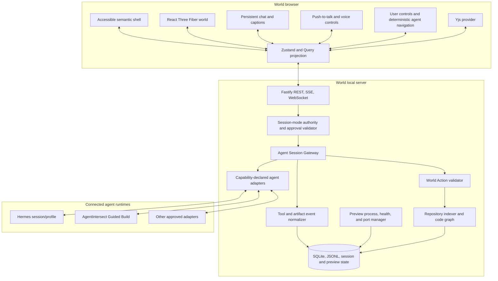

### Authority and trust split

| Component              | Authoritative for                                                                                   | Must never be authoritative for                                      |
| ---------------------- | --------------------------------------------------------------------------------------------------- | -------------------------------------------------------------------- |
| Browser                | Local input focus, camera, ephemeral controls, rendering, draft message                             | Files, durable audit, process ownership, claimed tool success        |
| World local server     | Session-mode policy, local auth, adapter permissions, World Actions, projections, preview lifecycle | Fabricated agent output, hidden reasoning, external process identity |
| Agent Session Gateway  | Session/adaptor identity mapping, normalized message/tool/action stream                             | Capabilities the adapter did not declare or prove                    |
| Hermes adapter         | Hermes session IDs, assistant messages, Hermes tool/approval events it can attest                   | AgentIntersect phase/process truth                                   |
| AgentIntersect adapter | Guided Build phase/job/lifecycle/handoff/evidence and owned-process control                         | Free-form Hermes memory or spatial presentation                      |
| Other agent adapter    | Its declared session, message, tool, artifact, and interrupt contract                               | Unsupported memory/resume/tool semantics                             |
| World Action service   | Validation and deterministic execution of spatial actions                                           | Repository mutation or model intent beyond the signed action         |
| Preview Manager        | World-owned local preview process, readiness, port, teardown, evidence                              | Deployment, public ingress, or AgentIntersect-owned process control  |
| Yjs/presentation       | Shared camera/layout/annotation/presence for the same operator                                      | Prompts, commands, tools, files, secrets, session authority          |
| Filesystem/Git         | Repository bytes and history/status                                                                 | Agent/session/task completion by itself                              |
| Agent runtime/worktree | Tool execution under its approved session/worktree authority                                        | Global World truth or other agents’ worktrees                        |

An incoming chat message is user intent, not automatic unrestricted authority. The local server binds it to one session, repository, mode, permission revision, and adapter. Explore rejects mutations. Collaborate uses normal adapter approvals. Autonomous permits only the explicitly granted capability envelope. Guided Build routes phase and lifecycle authority through AgentIntersect. Presentation peers may propose visual focus or annotations but cannot send agent prompts or tool approvals unless the same local host converts the request into a separately authenticated action.

## Repository and package architecture

The completed Phase 11 workspace remains valid. The following additions describe the intended Phase 12+ seams; exact package creation is phase-scoped and not authorized by this document alone.

```text
agentintersect-world/
├─ apps/
│  ├─ web/                         # Vite React browser: world, shell, chat, voice
│  ├─ local-server/                # local authority, session gateway, composition root
│  └─ party-server/                # same-operator Yjs presentation rooms
├─ packages/
│  ├─ world-schema/                # canonical schemas and generated JSON Schema
│  ├─ agent-session-protocol/      # session/message/tool/action/approval envelopes
│  ├─ agent-adapters/              # Hermes first; AgentIntersect and later adapters
│  ├─ world-action-protocol/       # semantic spatial actions and validation
│  ├─ agentintersect-client/       # current Guided Build compatibility facade
│  ├─ world-event-protocol/        # normalization, cursor, dedupe, replay
│  ├─ repo-indexer/                # filesystem/Git/parser pipeline
│  ├─ spatial-code-graph/          # hierarchy, layout, LOD, object addressing
│  ├─ navigation/                  # user collision/camera and deterministic agent paths
│  ├─ renderer-r3f/                # scene rendering and visual effects only
│  ├─ sync-yjs/                    # presentation documents and awareness
│  ├─ avatar-system/               # approved modular avatars and activity mapping
│  ├─ preview-manager/             # local process, readiness, port, teardown contracts
│  ├─ voice/                       # optional STT/TTS adapters and caption contracts
│  ├─ persistence/                 # SQLite migrations, repositories, JSONL ledgers
│  ├─ config/                      # configuration and environment validation
│  ├─ observability/               # logs, metrics, correlation, diagnostics
│  └─ ui/                          # accessible DOM components and design tokens
├─ examples/
│  ├─ embodied-magic-slice/        # one agent, explanation, edit, test, preview
│  ├─ guided-build-repo/           # design-document/phase fixture
│  └─ large-repo-fixture/
├─ tooling/
│  ├─ adapter-contract-fixtures/
│  ├─ voice-fixtures/
│  └─ scripts/
├─ docs/
├─ pnpm-workspace.yaml
├─ turbo.json
└─ package.json
```

### Ownership and dependency direction

- `world-schema`, `agent-session-protocol`, `world-action-protocol`, and `config` are leaf contracts; they import no app, adapter implementation, renderer, or process code.
- `agent-adapters` implement versioned capability manifests behind the session protocol. Adapter-specific payloads are normalized at the boundary and never leak directly into React state, Yjs, or the code graph.
- `agentintersect-client` remains the narrow Guided Build compatibility facade and does not become the generic free-form agent runtime.
- `repo-indexer` and `spatial-code-graph` never import agent adapters, voice providers, Three.js, or process launchers.
- `navigation` consumes world bounds/object targets and emits deterministic poses/paths. It never dispatches prompts, tools, or file mutations.
- `renderer-r3f` consumes projections and effects only. It cannot infer completion, execute World Actions, or parse agent prose for authority.
- `preview-manager` is Node-only, launches only approved World-owned preview commands inside the assigned workspace/worktree, and has no dependency on browser UI.
- `voice` exposes bounded audio/transcript contracts. Provider implementations receive only the audio/text explicitly approved for that turn.
- `sync-yjs` imports presentation schemas only and cannot import session prompts, command dispatch, tool approval, filesystem, preview, or adapter modules.
- `local-server` is the composition root for authority, sessions, adapters, persistence, previews, repository state, and AgentIntersect compatibility.
- `web` is the browser composition root and imports browser-safe protocol/schema entry points only.
- Dependency cycles, browser-to-Node leaks, adapter-to-renderer coupling, and presentation-to-authority imports fail architecture checks.

## Technology decisions and tradeoffs

| Layer             | Decision                                                              | Rationale and constraint                                                      | Alternative                                                   |
| ----------------- | --------------------------------------------------------------------- | ----------------------------------------------------------------------------- | ------------------------------------------------------------- |
| Workspace         | pnpm + Turborepo                                                      | Strict workspace linking, task graph, cacheable builds                        | npm workspaces; less strict                                   |
| Web               | Vite, React 19, TypeScript strict                                     | Fast browser loop and R3F ecosystem                                           | Next.js adds server assumptions not needed locally            |
| 3D                | Three.js, React Three Fiber, drei                                     | Web-native scene components beside DOM UI                                     | Babylon.js fuller engine; Unity harms browser/contributor fit |
| Effects           | postprocessing, maath                                                 | Selective outline/glow and stable interpolation                               | Custom shaders later only if measured                         |
| Client state      | Zustand + TanStack Query                                              | Ephemeral UI versus remote server state separation                            | Redux unnecessary for v0.1                                    |
| Optional motion   | Rapier                                                                | Only if collision/navigation proves necessary                                 | Simple raycast/nav plane preferred initially                  |
| Optional XR       | `@react-three/xr`                                                     | Progressive enhancement                                                       | Deferred until desktop UX meets targets                       |
| Local server      | Node 24 + Fastify                                                     | Matches supported runtime generation; typed plugins and schemas               | Native HTTP is lower dependency but more plumbing             |
| Live transport    | SSE for ordered projections; WebSocket for local interactive channels | SSE mirrors current AgentIntersect; WS reserved for bidirectional World needs | Polling fallback supported                                    |
| Agent sessions    | Versioned adapters behind Agent Session Gateway                       | Persistent chat/tool/action streams with capability honesty                   | Raw PTY scraping is labeled fallback only                     |
| Guided processes  | AgentIntersect worker/process surfaces                                | Preserve phase/job/owned-process authority                                    | World never impersonates AgentIntersect execution             |
| Preview processes | World-owned bounded Preview Manager                                   | Health-checked local demonstration in assigned repo/worktree                  | No deployment or public tunnel by default                     |
| Collaboration     | Yjs + PartyKit/Y-PartyKit                                             | CRDT presentation, awareness, offline merge                                   | y-websocket self-host later; provider is abstracted           |
| Local persistence | SQLite + JSONL                                                        | Queryable graph plus inspectable append-only projection ledger                | Postgres is wrong for local v0.1                              |
| Repo tools        | Git, ripgrep, tree-sitter                                             | Cheap hierarchy/search plus incremental symbols                               | LSP integration deferred                                      |
| Validation        | Zod + generated JSON Schema                                           | Runtime boundary checks and TS inference                                      | Hand-written guards are drift-prone                           |
| Tests             | Vitest, Node test/undici, Playwright, axe, Storybook/visual snapshots | Contracts through two-browser E2E                                             | Keep runners bounded and purpose-specific                     |

### Process and session ownership rule

World does not launch or terminate AgentIntersect-managed harness processes through generic `execa`, `node-pty`, browser PIDs, or raw kill calls. Guided Build creates and controls work only through AgentIntersect and observes its authoritative lifecycle.

Free-form agents connect through explicit adapters. An adapter may attach to an existing runtime, start an approved local session process, or use a documented API/platform seam only when its capability manifest declares ownership, resume, interrupt, tool, approval, and shutdown behavior. Raw PTY capture is compatibility-only, visibly labeled, bounded, and never treated as structured evidence unless independently confirmed.

The Preview Manager owns only the preview processes it started for a specific session/worktree. It records command identity, PID/start identity, port, health signal, and teardown result; it never stops an AgentIntersect worker or unrelated process.

## Spatial Code Graph domain

### Hierarchy and metaphors

| Domain object         | Spatial form                     | Source                             |
| --------------------- | -------------------------------- | ---------------------------------- |
| Workspace world       | Scene and coordinate frame       | World configuration                |
| Repo continent/island | Top-level landmass               | Git worktree                       |
| Package district      | Cluster/plate                    | Workspace manifests                |
| Directory block       | Nested parcel                    | Filesystem hierarchy               |
| File building         | Instanced building               | File record                        |
| Symbol room           | Interior/overlay                 | Parser symbol                      |
| Function machine      | Focus-only object                | Function/method symbol             |
| Test beacon           | Lamp plus icon/text              | Test discovery/result              |
| Dependency bridge     | Aggregated edge                  | import/call/package edge           |
| Issue marker          | Pin/placard                      | Optional issue adapter             |
| Phase zone            | Overlay/work area                | AgentIntersect phase mapping       |
| User avatar           | First-person/third-person body   | Approved local user profile        |
| Agent avatar          | Persistent embodied collaborator | Agent session plus approved avatar |
| Chat bubble/indicator | Bounded world-space UI           | Assistant/message state            |
| Tool effect           | Contextual motion/effect         | Structured tool event              |
| Task marker           | Placard/waypoint                 | Session task or Guided phase       |
| Preview portal/screen | Local live artifact surface      | Preview Manager                    |

The world is a projection. Moving a file building changes presentation coordinates only; it never renames a file. Any future refactor interaction must produce a reviewed command intent through an authoritative service.

### Navigation semantics

The user may navigate through pointer-lock mouse look, configurable WASD/keyboard controls, click-to-move, minimap focus, search-to-focus, follow-agent, or the semantic tree. Camera comfort settings include motion reduction, turn sensitivity, field-of-view limits, optional head-bob disablement, collision bypass for accessibility, and an immediate return-to-shell command.

Agents never emit frame-by-frame movement. They request a stable target object plus a high-level action. The navigation subsystem resolves the current world bounds, computes a deterministic path or teleport/focus fallback, drives the shared skeleton locomotion, and reports reached/blocked/stale-target truth. An agent may roam only within its current session/repository scope; idle wandering is optional presentation and never changes its semantic focus.

## Stable identity and URI strategy

### Identity layers

- `workspaceId`: `aiw_ws_<base32(sha256(canonical-realpath + device/inode salt))>`; local and non-exportable by default.
- `repoId`: `aiw_repo_<base32(sha256(workspaceId + git-common-dir-realpath + initial-root-commit-or-empty))>`.
- `fileId`: stable database UUID associated with `(repoId, canonicalPathKey)` and rename history.
- `symbolId`: `aiw_sym_<hash(fileId + parserNamespace + language + qualifiedName + signatureFingerprint)>`.
- `runId`: World projection UUID; maps to AgentIntersect `jobId`, `phaseId`, and `sessionId` without replacing them.
- `objectId`: `aiw_obj_<kind>_<sourceId>` when one-to-one; deterministic edge IDs hash endpoints and edge kind.

### URI forms

```text
aiw://workspace/{workspaceId}
aiw://repo/{repoId}
aiw://repo/{repoId}/file/{percent-encoded-posix-path}
aiw://repo/{repoId}/symbol/{symbolId}
aiw://run/{runId}
aiw://world/{workspaceId}/object/{objectId}
```

These are **AgentIntersect World v0.1** internal URIs. A proposed future MCP resource may reuse them, but no current AgentIntersect resource exists.

### Canonicalization and rename handling

1. Resolve the user-selected root once; reject a non-directory, inaccessible path, or disallowed symlink root.
2. Store display paths as repo-relative POSIX separators; store OS-native absolute paths only in a protected local table.
3. Normalize Unicode to NFC for comparison while preserving original display spelling.
4. On case-insensitive filesystems, maintain a folded unique key and preserve display case.
5. Never resolve a child path by string concatenation. Join, `lstat`, `realpath` as policy requires, and verify containment relative to the canonical root.
6. During Git refresh, use rename similarity results as a hint. Confirm old/new file fingerprints; transfer `fileId` and record `path_history`. Ambiguous many-to-many changes create new IDs and tombstone old IDs.
7. Symbol identity survives line movement if qualified name and normalized signature fingerprint remain stable. A rename creates a new symbol ID with `supersedesSymbolId` unless a parser-specific confidence threshold is met.

## Repository indexer and persistence

### Pipeline

```mermaid
flowchart LR
  Open[Open request] --> Guard[Canonicalize and policy guard]
  Guard --> Discover[Git and filesystem discovery]
  Discover --> Ignore[Ignore and size filtering]
  Ignore --> Classify[Language package test classification]
  Classify --> Parse[Tree-sitter or fallback parser]
  Parse --> Edges[Import dependency test edges]
  Edges --> Persist[Transactional SQLite upsert]
  Persist --> Layout[Deterministic cluster and layout]
  Layout --> Project[World snapshot and progress event]
```

Stages accept an `AbortSignal`, report monotonic progress, and checkpoint by generation. A canceled generation never becomes active. Discovery uses Git tracked/untracked metadata where available, applies `.gitignore` plus World excludes, never traverses `.git`, and caps individual file bytes, total candidates, parser time, and symlink behavior. `ripgrep --files` may accelerate discovery/search; arguments are arrays, never shell interpolation.

### Language tiers

- **Tier 1 v0.1:** TypeScript/TSX, JavaScript/JSX, JSON, Markdown, CSS, HTML; hierarchy, imports, exported and major symbols, tests.
- **Tier 2 v0.1 best effort:** Python, Go, Rust, Java; hierarchy plus tree-sitter symbols/imports when grammar available.
- **Tier 3 fallback:** any text file gets metadata, language guess, size, Git state, and search; no fabricated symbols.
- **Binary/generated/vendor:** summarized or excluded by policy with an explicit reason and counts.

Parser errors are records, not fatal exceptions. An unsupported grammar falls back to file-level visualization. The UI reports coverage such as “1,842 files indexed; 71% symbol parsed; 24% file-only; 5% excluded.”

### Incremental invalidation

File-watch events are debounced by path and generation. Content hash, stat tuple, parser version, grammar version, config hash, and index schema version form the cache key. A manifest/config/lockfile change invalidates package/dependency clustering; a normal source edit invalidates the file, its symbols, outgoing edges, affected incoming aggregate counts, and nearby layout—not the entire repo. Git HEAD/index changes refresh status separately. Overflow or missed-watch detection schedules a bounded rescan.

### SQLite DDL

The following is implementation-ready illustrative SQL; migration numbering is normative, exact SQLite bindings are implementation details.

```sql
PRAGMA foreign_keys = ON;
PRAGMA journal_mode = WAL;

CREATE TABLE schema_migrations (
  version INTEGER PRIMARY KEY,
  name TEXT NOT NULL,
  checksum TEXT NOT NULL,
  applied_at TEXT NOT NULL
);

CREATE TABLE workspaces (
  workspace_id TEXT PRIMARY KEY,
  display_name TEXT NOT NULL,
  canonical_root_ciphertext BLOB NOT NULL,
  created_at TEXT NOT NULL,
  last_opened_at TEXT NOT NULL
);

CREATE TABLE repos (
  repo_id TEXT PRIMARY KEY,
  workspace_id TEXT NOT NULL REFERENCES workspaces(workspace_id) ON DELETE CASCADE,
  display_name TEXT NOT NULL,
  vcs_kind TEXT NOT NULL CHECK (vcs_kind IN ('git','none')),
  root_commit TEXT,
  active_generation INTEGER NOT NULL DEFAULT 0,
  config_hash TEXT NOT NULL,
  created_at TEXT NOT NULL
);

CREATE TABLE files (
  file_id TEXT PRIMARY KEY,
  repo_id TEXT NOT NULL REFERENCES repos(repo_id) ON DELETE CASCADE,
  path_posix TEXT NOT NULL,
  path_folded TEXT NOT NULL,
  language TEXT,
  kind TEXT NOT NULL CHECK (kind IN ('source','test','config','doc','asset','binary','generated','vendor')),
  byte_size INTEGER NOT NULL CHECK (byte_size >= 0),
  content_hash TEXT,
  git_status TEXT,
  parse_status TEXT NOT NULL,
  generation INTEGER NOT NULL,
  tombstoned_at TEXT,
  UNIQUE(repo_id, path_folded)
);

CREATE TABLE file_path_history (
  file_id TEXT NOT NULL REFERENCES files(file_id) ON DELETE CASCADE,
  old_path_posix TEXT NOT NULL,
  new_path_posix TEXT NOT NULL,
  confidence REAL NOT NULL,
  changed_at TEXT NOT NULL,
  PRIMARY KEY(file_id, changed_at)
);

CREATE TABLE symbols (
  symbol_id TEXT PRIMARY KEY,
  file_id TEXT NOT NULL REFERENCES files(file_id) ON DELETE CASCADE,
  parser_namespace TEXT NOT NULL,
  kind TEXT NOT NULL,
  name TEXT NOT NULL,
  qualified_name TEXT NOT NULL,
  signature_fingerprint TEXT NOT NULL,
  start_line INTEGER NOT NULL,
  end_line INTEGER NOT NULL,
  exported INTEGER NOT NULL DEFAULT 0,
  complexity REAL,
  generation INTEGER NOT NULL,
  supersedes_symbol_id TEXT REFERENCES symbols(symbol_id)
);

CREATE TABLE graph_edges (
  edge_id TEXT PRIMARY KEY,
  repo_id TEXT NOT NULL REFERENCES repos(repo_id) ON DELETE CASCADE,
  from_object_id TEXT NOT NULL,
  to_object_id TEXT NOT NULL,
  kind TEXT NOT NULL,
  weight REAL NOT NULL DEFAULT 1,
  confidence REAL NOT NULL DEFAULT 1,
  generation INTEGER NOT NULL
);

CREATE TABLE world_objects (
  object_id TEXT PRIMARY KEY,
  repo_id TEXT NOT NULL REFERENCES repos(repo_id) ON DELETE CASCADE,
  source_kind TEXT NOT NULL,
  source_id TEXT NOT NULL,
  parent_object_id TEXT REFERENCES world_objects(object_id),
  lod_min INTEGER NOT NULL,
  bounds_json TEXT NOT NULL,
  style_key TEXT NOT NULL,
  generation INTEGER NOT NULL,
  UNIQUE(repo_id, source_kind, source_id)
);

CREATE TABLE runs (
  run_id TEXT PRIMARY KEY,
  workspace_id TEXT NOT NULL REFERENCES workspaces(workspace_id) ON DELETE CASCADE,
  agentintersect_job_id TEXT,
  phase_id TEXT,
  session_id TEXT,
  correlation_id TEXT NOT NULL UNIQUE,
  status TEXT NOT NULL,
  started_at TEXT,
  completed_at TEXT,
  last_event_id TEXT
);

CREATE TABLE event_dedupe (
  source TEXT NOT NULL,
  source_event_id TEXT NOT NULL,
  world_event_id TEXT NOT NULL UNIQUE,
  observed_at TEXT NOT NULL,
  PRIMARY KEY(source, source_event_id)
);

CREATE INDEX idx_files_repo_generation ON files(repo_id, generation);
CREATE INDEX idx_files_repo_git_status ON files(repo_id, git_status) WHERE tombstoned_at IS NULL;
CREATE INDEX idx_symbols_file_lines ON symbols(file_id, start_line, end_line);
CREATE INDEX idx_symbols_qname ON symbols(qualified_name);
CREATE INDEX idx_edges_from_kind ON graph_edges(from_object_id, kind);
CREATE INDEX idx_edges_to_kind ON graph_edges(to_object_id, kind);
CREATE INDEX idx_world_parent_lod ON world_objects(parent_object_id, lod_min);
CREATE INDEX idx_runs_phase ON runs(phase_id, started_at DESC);
```

Migrations are forward-only in normal use, transactionally applied, checksum verified, and backed up before destructive shape changes. If migration fails, World opens read-only diagnostics and offers rebuild for derivable graph tables while preserving annotations and run mappings.

## World schema and versioning

```ts
// AgentIntersect World v0.1 — implementation-ready contract
import { z } from "zod";

export const SchemaVersion = z.literal("aiw.world/0.1");
export const Id = z.string().regex(/^aiw_[a-z]+_[a-z0-9_-]{8,}$/);
export const Vec3 = z.tuple([
  z.number().finite(),
  z.number().finite(),
  z.number().finite(),
]);

export const CodeObjectKind = z.enum([
  "workspace",
  "repo",
  "package",
  "directory",
  "file",
  "symbol",
  "function",
  "test",
  "dependency",
  "issue",
  "phase",
]);

export const WorldObjectSchema = z
  .object({
    schemaVersion: SchemaVersion,
    objectId: Id,
    kind: CodeObjectKind,
    sourceUri: z.string().max(2048),
    parentObjectId: Id.nullable(),
    label: z.string().max(256),
    position: Vec3,
    bounds: z.object({ center: Vec3, size: Vec3 }),
    lod: z.object({
      min: z.number().int().min(0).max(4),
      aggregateKey: z.string().max(256),
    }),
    state: z.object({
      git: z
        .enum([
          "clean",
          "added",
          "modified",
          "deleted",
          "conflicted",
          "unknown",
        ])
        .optional(),
      test: z
        .enum(["unknown", "running", "passed", "failed", "skipped"])
        .optional(),
      activity: z
        .enum(["idle", "queued", "working", "changed", "verified", "blocked"])
        .default("idle"),
    }),
    revision: z.number().int().nonnegative(),
  })
  .strict();

export type WorldObject = z.infer<typeof WorldObjectSchema>;

export const WorldSnapshotSchema = z
  .object({
    schemaVersion: SchemaVersion,
    workspaceId: Id,
    repoId: Id,
    generation: z.number().int().nonnegative(),
    createdAt: z.string().datetime(),
    objects: z.array(WorldObjectSchema),
    coverage: z.object({
      discovered: z.number().int().nonnegative(),
      parsed: z.number().int().nonnegative(),
      fileOnly: z.number().int().nonnegative(),
      excluded: z.number().int().nonnegative(),
      errors: z.number().int().nonnegative(),
    }),
  })
  .strict();
```

All durable records include a namespaced string version. Patch releases may add optional fields. A minor schema change requires a parser that accepts the prior minor version and an explicit migration. Unknown event types are retained as opaque metadata, never treated as actionable. Browser and server negotiate supported ranges; incompatible clients receive an upgrade-required envelope before loading a room.

## LOD, virtualization, and performance

### LOD levels

| LOD        | Visible content                                           | Typical threshold                       |
| ---------- | --------------------------------------------------------- | --------------------------------------- |
| 0 World    | Repo continents, package labels, aggregate activity       | > 2,000 projected objects or camera far |
| 1 District | Packages/directories, major dependency bundles            | focused continent                       |
| 2 File     | File buildings, Git/test badges, selected edges           | focused district                        |
| 3 Symbol   | Important symbol rooms/functions                          | selected file or agent locus            |
| 4 Detail   | Diff/evidence overlays in DOM, never full code as 3D text | explicit selection                      |

```ts
export function selectLod(input: {
  projectedPixels: number;
  visibleDescendants: number;
  selected: boolean;
  activeAgentDistance: number | null;
  reducedMotion: boolean;
}): 0 | 1 | 2 | 3 | 4 {
  if (input.selected) return input.projectedPixels > 600 ? 4 : 3;
  if (input.activeAgentDistance !== null && input.activeAgentDistance < 12)
    return 3;
  if (input.visibleDescendants > 20_000 || input.projectedPixels < 24) return 0;
  if (input.visibleDescendants > 2_000 || input.projectedPixels < 80) return 1;
  return input.projectedPixels < 240 ? 2 : 3;
}
```

Buildings, beacons, and low-detail avatars use instancing with palette/animation attributes. Text is DOM/atlas pooled and capped. Frustum culling, spatial tiles, edge bundling, occlusion heuristics, selection-only detail, and worker-thread layout keep main-thread work bounded. React components do not mirror every graph node; visible instance buffers are derived selectors. Pointer hit-testing uses a coarse spatial index then instance lookup.

### Budgets and degradation

- Target 60 fps on the reference machine; 30 fps minimum during bounded construction effects.
- Main-thread frame p95 under 16.7 ms at reference scale; no single indexing message over 8 ms decode on the browser main thread.
- Initial interactive shell under 2 seconds warm and 5 seconds cold for the demo repo.
- Reference detailed viewport: 10,000 instanced objects and 2,000 bundled edges; larger repositories aggregate.
- Memory target under 750 MiB browser and 1.5 GiB local server at the 100k-file stress fixture.
- At 100k+ files, disable symbol parsing outside selected packages, omit low-confidence edges, paginate search, render package/directory aggregates, and show an explicit degradation banner.
- Index progress emits at most 10 updates/second. Cancel acknowledgment target is under 500 ms; parsers with no cooperative cancel run in bounded workers that can be terminated.

## Normalized World event protocol

### Envelope

```ts
export const WorldEventSchema = z
  .object({
    schema: z.literal("aiw.event/0.1"),
    id: z.string().regex(/^we_[0-9A-HJKMNP-TV-Z]{26}$/), // monotonic ULID
    source: z.enum([
      "agentintersect-daemon",
      "agentintersect-dashboard",
      "filesystem",
      "git",
      "indexer",
      "world",
      "party",
    ]),
    sourceEventId: z.string().max(256),
    type: z
      .string()
      .regex(/^aiw\.[a-z0-9_.-]+$/)
      .max(128),
    occurredAt: z.string().datetime(),
    observedAt: z.string().datetime(),
    workspaceId: Id,
    repoId: Id.optional(),
    correlationId: z.string().uuid(),
    causationId: z.string().max(256).optional(),
    sequence: z.number().int().nonnegative().optional(),
    sensitivity: z.enum(["public-room", "local", "secret-redacted"]),
    payload: z.record(z.string(), z.unknown()),
    truncated: z.boolean().default(false),
  })
  .strict();
```

### Mapping

| Source signal                          | World type                      | Visual effect                           |
| -------------------------------------- | ------------------------------- | --------------------------------------- |
| `worker.job.created`/queued snapshot   | `aiw.run.queued`                | Agent appears at phase zone             |
| claimed/running job                    | `aiw.run.started`               | Avatar moves to affected area if known  |
| `external.telemetry` / `mcp.telemetry` | `aiw.run.telemetry`             | Progress/evidence annotations           |
| filesystem diff                        | `aiw.repo.file-changed`         | Building scaffold/glow                  |
| test telemetry/evidence                | `aiw.test.result`               | Beacon state plus text/icon             |
| `handoff.created`                      | `aiw.lifecycle.handoff-ready`   | Durable handoff marker                  |
| `phase.completed`                      | `aiw.lifecycle.phase-completed` | Zone completes after evidence link      |
| dashboard safe-pause events            | `aiw.lifecycle.safe-pause-*`    | Amber stop-at-boundary state            |
| emergency-stop result                  | `aiw.lifecycle.emergency-stop`  | Red stopped state, no success animation |

### Ordering, dedupe, replay, and backpressure

AgentIntersect event IDs are used when present. Otherwise World derives a source ID from source file cursor/byte offset plus a canonical payload hash. `event_dedupe(source, sourceEventId)` is inserted in the same transaction as the normalized event and projection update. ULIDs order observation, not causal truth. Per-source `sequence` is monotonic where available. Cross-source conflicts are reconciled by authority: AgentIntersect lifecycle state wins over animation state; filesystem bytes win over claimed file lists.

SSE clients send `Last-Event-ID`. The server replays from the local ledger, then tails live events. If the cursor is older than retention, return a `aiw.stream.reset-required` event with a snapshot URL. Slow clients have a bounded queue (default 1,000 events or 4 MiB). Coalescible progress/file-refresh events collapse by object; lifecycle/evidence/error events never silently drop. On overflow, close with a resumable cursor and structured reason. Large text is omitted and linked by safe resource ID; payloads pass redaction and byte/depth limits before persistence and again before multiplayer projection.

```ts
export async function normalizeOnce(raw: RawSourceEvent, tx: WorldTx) {
  const sourceEventId =
    raw.id ?? stableHash({ cursor: raw.cursor, body: raw.body });
  const prior = await tx.findDedupe(raw.source, sourceEventId);
  if (prior)
    return { duplicate: true, worldEventId: prior.worldEventId } as const;

  const event = WorldEventSchema.parse(mapAndRedact(raw));
  await tx.insertEvent(event);
  await tx.insertDedupe(raw.source, sourceEventId, event.id);
  await tx.applyProjection(event);
  return { duplicate: false, event } as const;
}
```

## AgentIntersect integration contract

### Discovery and health attestation

World accepts an explicit AgentIntersect base URL or discovers the default `http://127.0.0.1:3761`. Discovery is not trust. Before any mutation it calls `GET /health` and verifies:

1. HTTP 200 and JSON content type.
2. Exact current service identity `agentintersect-daemon/v1` and health protocol `1`.
3. `ok: true`, a live non-protected PID, and a process-start identity consistent with the local process table where supported.
4. `workspaceIdentity` equals the canonical realpath identity of the World-opened workspace.
5. The response contains only/at least the expected attestation contract fields according to the pinned compatibility fixture.

Attestation is cached briefly (default five seconds) and repeated before a mutating call after reconnect, PID/start change, workspace switch, or health failure. A generic HTTP server returning `{ok:true}` is insufficient. A mismatch sets integration state `blocked_workspace_mismatch` and exposes diagnostics without a bypass button. A future explicitly approved remote bridge needs a different signed trust design; v0.1 is loopback only.

### Workspace identity mapping

World preserves two identities: its privacy-preserving `workspaceId` and AgentIntersect’s current canonical workspace identity. The protected mapping is local-only. Repository room IDs never reveal absolute paths or AgentIntersect identity strings. Opening a symlinked alias normalizes to the same canonical workspace only when containment and policy checks succeed.

### Compatibility facade

```ts
// AgentIntersect World v0.1 — implementation-ready facade, not current SDK code.
export interface AgentIntersectHealth {
  ok: true;
  pid: number;
  processStartTime: string;
  protocol: 1;
  service: "agentintersect-daemon/v1";
  workspaceIdentity: string;
}

export interface AgentIntersectClient {
  attest(signal?: AbortSignal): Promise<AgentIntersectHealth>;
  getState(signal?: AbortSignal): Promise<unknown>;
  getInstructions(phaseId: string, signal?: AbortSignal): Promise<unknown>;
  getResumePacket(phaseId: string, signal?: AbortSignal): Promise<unknown>;
  createWorkerJob(
    input: CurrentWorkerJobInput,
    idempotencyKey: string,
  ): Promise<CurrentWorkerJob>;
  getNextWorkerJob(query: {
    harness?: string;
    workerId?: string;
    jobId?: string;
  }): Promise<CurrentWorkerJob | null>;
  completeWorkerJob(jobId: string, body: unknown): Promise<unknown>; // used by workers, not browser
  postEvent(body: unknown): Promise<void>;
  postTelemetry(body: unknown): Promise<void>;
  postClaudeHook(body: unknown): Promise<unknown>;
  postHandoff(body: unknown): Promise<void>;
}

export interface CurrentWorkerJobInput {
  type: "phase_run" | "design_doc_request";
  harness: "codex" | "claude-code" | "hermes" | "openclaw";
  phase_id?: string;
  transportMode?: "local" | "lan";
  baseUrl?: string;
  payload?: Record<string, unknown>;
}
```

The World client uses a pinned adapter per tested AgentIntersect version/commit. It parses current responses into internal DTOs at the boundary. Raw state never crosses directly into React components, SQLite domain tables, or Yjs. Compatibility behavior lives in `packages/agentintersect-client`; when a response changes, only fixtures and this facade change.

### HTTP client example

```ts
// AgentIntersect World v0.1 pseudocode with production error semantics.
const DAEMON_BODY_LIMIT = 256 * 1024;

class CurrentAgentIntersectHttpClient implements AgentIntersectClient {
  constructor(
    private readonly base = new URL("http://127.0.0.1:3761"),
    private readonly expectedWorkspaceIdentity: string,
  ) {}

  private async json<T>(
    path: string,
    init: RequestInit = {},
    schema: z.ZodType<T>,
  ): Promise<T> {
    const url = new URL(path, this.base);
    if (url.origin !== this.base.origin)
      throw new Error("AgentIntersect origin escape");
    const bodyBytes =
      typeof init.body === "string" ? Buffer.byteLength(init.body) : 0;
    if (bodyBytes > DAEMON_BODY_LIMIT)
      throw new Error("AgentIntersect request exceeds 256 KiB");
    const response = await fetch(url, {
      ...init,
      redirect: "error",
      headers: { accept: "application/json", ...init.headers },
      signal: AbortSignal.any([
        init.signal ?? new AbortController().signal,
        AbortSignal.timeout(10_000),
      ]),
    });
    const text = await response.text();
    if (!response.ok) throw AgentIntersectHttpError.from(response.status, text);
    if (!response.headers.get("content-type")?.includes("application/json")) {
      throw new Error("Unexpected AgentIntersect content type");
    }
    return schema.parse(JSON.parse(text));
  }

  async attest(signal?: AbortSignal) {
    const health = await this.json(
      "/health",
      { signal },
      AgentIntersectHealthSchema,
    );
    if (health.workspaceIdentity !== this.expectedWorkspaceIdentity) {
      throw new AuthorityError("workspace_mismatch");
    }
    await verifyLocalProcessIdentity(health.pid, health.processStartTime);
    return health;
  }

  async createWorkerJob(input: CurrentWorkerJobInput, idempotencyKey: string) {
    await this.attest();
    return this.json(
      "/v1/worker/jobs",
      {
        method: "POST",
        headers: {
          "content-type": "application/json",
          "x-aiw-idempotency-key": idempotencyKey,
        },
        body: JSON.stringify(input),
      },
      CurrentCreateWorkerResponseSchema,
    ).then((x) => x.job);
  }
  // Remaining exact route methods follow the same bounded pattern.
}
```

The current daemon does not document `x-aiw-idempotency-key`; therefore v0.1 must implement idempotency in the World intent ledger and reconcile by observed job ID, not assume daemon support. The header may be omitted until an AgentIntersect contract accepts it.

### Dashboard SSE adapter

```ts
// Parses Current AgentIntersect dashboard SSE into raw source events.
export async function* dashboardEventStream(
  base: URL,
  cursor: string | undefined,
  signal: AbortSignal,
): AsyncIterable<RawSourceEvent> {
  const response = await fetch(new URL("/api/events/stream", base), {
    headers: {
      accept: "text/event-stream",
      ...(cursor ? { "last-event-id": cursor } : {}),
    },
    redirect: "error",
    signal,
  });
  if (!response.ok || !response.body) throw new StreamError(response.status);
  for await (const frame of decodeSse(response.body, {
    maxFrameBytes: 256 * 1024,
  })) {
    if (frame.retry) continue;
    yield {
      source: "agentintersect-dashboard",
      id: frame.id,
      cursor: frame.id,
      event: frame.event || "message",
      body: safeJson(frame.data, { maxDepth: 6, maxBytes: 256 * 1024 }),
      observedAt: new Date().toISOString(),
    };
  }
}
```

On connection: fetch `/api/snapshot`, persist an observation watermark, open `/api/events/stream`, and reconcile against `/api/events` if the stream cursor is absent or reset. On disconnect use exponential backoff with full jitter (250 ms–15 s), do not replay visual effects twice, and re-attest workspace identity before accepting lifecycle updates after a process restart.

### MCP client use

World may use the current stdio tools for explicit context/evidence workflows when HTTP does not provide an equivalent and when the local server starts/connects to the MCP process under an approved adapter. It must initialize with the current protocol, list tools, verify the exact required tool names, and reject resource assumptions. The HTTP/SSE vertical slice does not depend on MCP resources.

**Proposed AgentIntersect World MCP surfaces — Future/Deferred:** a separate World MCP server may advertise read-only resources such as `aiw://repo/{id}`, `aiw://run/{id}`, and `aiw://world/{id}/object/{id}`, with bounded `resources/list` and `resources/read`. Any future command tool routes through the same local authority validator; resources never expose raw memory or unrestricted absolute paths.

### Lifecycle mapping and failure handling

| AgentIntersect fact          | World projection             | Failure behavior                                  |
| ---------------------------- | ---------------------------- | ------------------------------------------------- |
| Current phase/status         | Phase zone and board         | Show stale timestamp; never infer completion      |
| Session/job running          | Agent activity               | Reconcile snapshot before declaring orphaned      |
| Telemetry changed files      | Candidate affected objects   | Confirm with filesystem/Git before “changed”      |
| Job completion               | Run outcome                  | Require matching claim/lifecycle result; dedupe   |
| Handoff record               | Handoff evidence             | Display validation/integrity state, not only path |
| Evidence record              | Evidence link                | Resolve only via safe local resource endpoint     |
| Audit report                 | Audit badge/details          | Redacted export; schema validate                  |
| Safe pause requested/reached | Amber requested/paused state | Do not cancel current atomic action               |
| Emergency stop               | Stop request/results         | Never claim all processes died without evidence   |

Timeouts are classified as discovery, attestation, transport, validation, conflict, lifecycle, or unknown errors. Retry only idempotent reads automatically. A create-job timeout enters `reconciling`, queries current worker jobs/snapshot, and requires operator confirmation if it cannot establish whether a job was created. World never retries a mutation blindly. Circuit breaking opens after bounded consecutive transport failures and continues offline visualization with a prominent “execution control unavailable” state.

## Embodied agent session architecture

### Session modes

Every session declares one mode at creation. The mode, permission revision, repository/worktree, adapter, and user identity are persisted and shown in the chat header, agent inspector, and world-space status. A more permissive transition requires explicit local confirmation; a less permissive transition is immediate and cancels or pauses newly forbidden operations according to adapter capability.

| Mode         | Intended experience                            | Repository mutation                                         | Tool approval                                 | Lifecycle authority                                              |
| ------------ | ---------------------------------------------- | ----------------------------------------------------------- | --------------------------------------------- | ---------------------------------------------------------------- |
| Explore      | Read, search, explain, navigate, annotate      | Denied                                                      | Read-only tools only                          | World may interrupt/close its session                            |
| Collaborate  | Free-form pair development                     | Allowed through adapter policy                              | Normal adapter/manual or smart approvals      | Adapter owns tools; World mediates user intent                   |
| Autonomous   | Bounded objective with reduced routine prompts | Allowed only inside granted repo/worktree/capability budget | Pre-approved envelope; scope expansion pauses | Adapter owns execution; World enforces envelope and interruption |
| Guided Build | Design document, phases, handoffs, advancement | Through AgentIntersect phase jobs                           | AgentIntersect/harness policy                 | AgentIntersect owns phase/job/process lifecycle                  |

A session may carry a standing goal, but World does not silently convert ordinary conversation into an autonomous goal. Voice and text use the same mode. Presentation peers cannot elevate mode, grant tools, approve dangerous commands, or start work.

### Persistent session record

```ts
export const AgentSessionSchema = z
  .object({
    schema: z.literal("aiw.agent-session/0.12"),
    sessionId: z.string().uuid(),
    adapterId: z.string().regex(/^[a-z][a-z0-9-]{0,63}$/),
    adapterSessionRef: z.string().min(1).max(256),
    workspaceId: Id,
    repositoryRef: z.string().max(256),
    worktreeRef: z.string().max(256).nullable(),
    mode: z.enum(["explore", "collaborate", "autonomous", "guided-build"]),
    permissionRevision: z.number().int().nonnegative(),
    capabilitySnapshotHash: z.string().regex(/^[a-f0-9]{64}$/),
    avatarProfileRef: z.string().max(256).nullable(),
    status: z.enum([
      "connecting",
      "ready",
      "thinking",
      "using-tool",
      "waiting-approval",
      "speaking",
      "paused",
      "offline",
      "error",
      "closed",
    ]),
    currentFocusObjectIds: z.array(Id).max(16),
    currentTaskRef: z.string().max(256).nullable(),
    lastEventSequence: z.number().int().nonnegative(),
    createdAt: z.string().datetime(),
    updatedAt: z.string().datetime(),
  })
  .strict();
```

The adapter session reference is protected local data and never enters Yjs. Display state uses an opaque World session ID. The session ledger stores message/event metadata and approved content; adapter-native transcripts remain owned by the adapter unless the user explicitly exports them.

### Agent Session Protocol

All adapters normalize into one ordered, versioned event envelope:

```ts
export const AgentSessionEventSchema = z
  .object({
    schema: z.literal("aiw.agent-event/0.12"),
    eventId: z.string().uuid(),
    sessionId: z.string().uuid(),
    sequence: z.number().int().nonnegative(),
    occurredAt: z.string().datetime(),
    correlationId: z.string().uuid(),
    type: z.enum([
      "session.connected",
      "session.capabilities",
      "session.status",
      "message.user-accepted",
      "message.assistant-delta",
      "message.assistant-final",
      "tool.requested",
      "tool.started",
      "tool.progress",
      "tool.completed",
      "tool.failed",
      "approval.requested",
      "approval.resolved",
      "artifact.created",
      "world-actions.proposed",
      "preview.requested",
      "preview.ready",
      "preview.stopped",
      "session.interrupted",
      "session.closed",
      "session.error",
    ]),
    payload: z.record(z.string(), z.unknown()),
    redaction: z.object({
      applied: z.boolean(),
      count: z.number().int().nonnegative(),
    }),
  })
  .strict();
```

Ordering is per session. Reconnect supplies the last accepted sequence; the adapter resumes where supported or emits an explicit reset/snapshot when not. Duplicate event IDs are ignored. Sequence gaps suspend animation and tool completion claims until reconciled. Assistant deltas are ephemeral display data; the bounded final message is the durable conversational unit.

No event type conveys hidden chain-of-thought. A model may explicitly publish a plan or concise status as user-visible text, but World never derives or displays private reasoning traces.

### Adapter capability contract

Each adapter must declare and prove capabilities before the UI enables them:

- create session;
- attach/resume existing session;
- send text and attachments;
- stream assistant deltas/final responses;
- structured tool events;
- structured approvals;
- interrupt/steer/pause/close;
- worktree awareness;
- artifact and preview references;
- model/provider identity disclosure;
- memory/skills/persona availability disclosure;
- voice input/output support;
- World Action support or text-only degradation.

The manifest includes version, transport, local/remote origin, auth state without secrets, supported modes, maximum payloads, event ordering guarantee, resume guarantee, and shutdown ownership. A contract fixture proves every advertised capability. Missing support remains disabled with an explanation; World does not infer a tool call from terminal color or prose.

**Hermes first adapter:** connect through a supported Hermes platform/API/plugin seam or a purpose-built local adapter. Preserve the same profile, session store, skills, memory, project context, tools, approvals, and resumability that the user would receive in Hermes CLI, desktop, or gateway surfaces. `SOUL.md` remains identity-only input inside Hermes; World receives only a user-approved avatar proposal or bounded self-description. Commands such as “find handoff” must enter the same Hermes session rather than a new one-shot process.

**AgentIntersect Guided Build adapter:** maps design readiness, phase state, worker jobs, telemetry, handoffs, evidence, safe pause, auto-advance, and emergency results. It remains authoritative for its owned processes. Conversational text may be relayed only through a tested AgentIntersect/harness surface; World does not pretend that phase telemetry is a free-form chat stream.

**Other adapters:** Codex, Claude Code, OpenClaw, and future agents implement the same protocol. A raw PTY bridge may provide text-only compatibility but is labeled non-structured, cannot claim reliable resume/tool telemetry unless separately attested, and cannot be the acceptance adapter for the magic slice.

### Text chat and turn handling

The primary chat surface includes session/mode/adapter/worktree identity, message history, attachments, model status, approvals, interrupt/steer controls, and a persistent results area. Sending a message performs:

1. local session and permission revision validation;
2. attachment size/type/path-scope validation;
3. explicit voice-transcript preview when applicable;
4. durable local intent/message metadata write;
5. adapter send with correlation ID;
6. ordered response/tool/event streaming;
7. final message persistence and world-space bubble projection.

Overhead bubbles are bounded previews, not the canonical transcript. They show typing/speaking state, a short final excerpt, emoji/activity icons from explicit safe presentation tags, and a control to open the full accessible chat. Long code, tool output, secrets, paths, and Markdown HTML never render above an avatar.

Busy-session input supports explicit queue, steer-after-current-tool, or interrupt semantics according to adapter capability. World never silently decides whether a new message interrupts active work.

### Voice pipeline

Voice is optional and disabled until configured. The first implementation is push-to-talk:

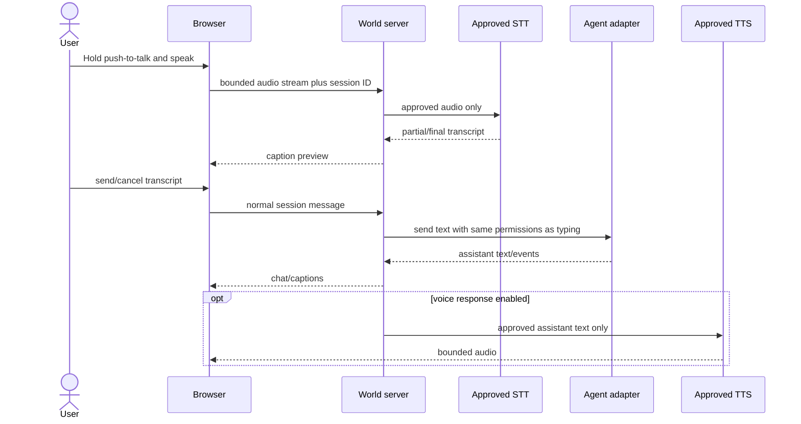

Provider choice may be local or external. The UI discloses where audio/text goes, retention, latency, and cost. Voice does not bypass approvals. Interruption stops playback immediately and requests adapter interruption separately. Captions remain available even when TTS fails. Per-agent voices are user-selected or agent-proposed and require preview/approval.

### World Action Protocol

Agent messages may include a separate structured action proposal. Prose is never parsed for authority.

```ts
export const WorldActionSchema = z
  .object({
    schema: z.literal("aiw.world-action/0.13"),
    actionId: z.string().uuid(),
    sessionId: z.string().uuid(),
    sequence: z.number().int().nonnegative(),
    kind: z.enum([
      "navigate",
      "focus",
      "inspect",
      "highlight",
      "trace",
      "compare",
      "annotate-temporary",
      "point-at",
      "follow",
      "present-evidence",
      "present-preview",
      "clear-presentation",
    ]),
    targetObjectIds: z.array(Id).max(64),
    edgeIds: z.array(Id).max(256).default([]),
    label: z.string().max(160).optional(),
    durationMs: z.number().int().min(0).max(120_000).optional(),
    expectedWorldRevision: z.number().int().nonnegative(),
  })
  .strict();
```

The local server validates session scope, target existence, repository identity, object/edge limits, action rate, and revision. The browser receives only accepted actions. Stale or missing objects produce a visible degraded result and may trigger a bounded refocus query; they never cause fuzzy movement to an unrelated object.

Action behavior:

- `navigate` moves the agent to a reachable interaction point near one object;
- `focus` frames selected objects without moving code or changing files;
- `trace` illuminates a bounded path supplied by the code-graph service;
- `compare` arranges a temporary visual/semantic comparison without changing durable layout;
- `annotate-temporary` creates session-local callouts that expire or can be pinned by the user;
- `present-evidence` opens exact diff/test/handoff/artifact references;
- `present-preview` opens an already-ready local preview; it cannot launch or deploy by itself.

### User and agent navigation

The user can use pointer-lock mouse look, configurable WASD, click-to-move, search-to-focus, minimap travel, follow-agent, or the semantic tree. Collision, camera speed, FOV, head bob, motion reduction, teleport fallback, and immediate escape to the shell are configurable.

Agents choose semantic destinations, never frame-by-frame movement. Deterministic navigation resolves interaction points and pathfinding, drives the shared locomotion clips, and reports reached, blocked, stale-target, or teleported-for-accessibility truth. Current semantic focus may update before locomotion finishes, but the UI distinguishes “attending to” from “arrived at.” Optional idle wandering does not change semantic focus or imply tool activity.

### Tool and activity visualization

Tool events map through a versioned, user-configurable presentation table:

| Authoritative event        | Default spatial presentation          | Required semantic truth                  |
| -------------------------- | ------------------------------------- | ---------------------------------------- |
| Search/query               | scanning pulse over bounded scope     | query category and result count          |
| Read/inspect file          | agent navigates/focuses file building | exact safe object reference              |
| Trace callers/dependencies | bounded illuminated graph path        | edge kinds/confidence/truncation         |
| Edit/patch                 | scaffold/construction state           | actual filesystem/Git confirmation       |
| Run tests                  | test beacon active                    | command class, running/result evidence   |
| Build                      | district/worktree activity beacon     | process status and artifact reference    |
| Browser/preview            | agent presents local portal/screen    | health-checked preview identity          |
| Approval requested         | avatar waits; visible approval marker | exact bounded approval request           |
| Success                    | subtle celebration                    | authoritative successful result/evidence |
| Failure                    | distinct error pose/marker            | exact failure and recovery action        |

Animation never proves an operation occurred. If an adapter lacks structured tool events, World shows conversational status only. Tool names, arguments, output, and artifacts are redacted/bounded before display; raw secrets and hidden reasoning never enter the scene.

### Agent-proposed identity and avatar flow

1. Connect or resume the agent session without publishing identity data.
2. Ask the adapter whether it supports a bounded self-description/avatar proposal.
3. The adapter may derive a proposal locally from its explicit persona, name, harness identity, and allowlisted fields. Hermes may use its own loaded `SOUL.md`, but returns only the proposal—not the file.
4. Validate the strict avatar schema and show form, parts, palette, clothing, voice, movement style, source disclosure, and short rationale.
5. The operator accepts, edits, randomizes, selects neutral default, or declines identity derivation.
6. Persist the approved profile locally with current/previous recovery and a revocation action.
7. Share only explicitly allowed display fields with same-operator presentation views.

An agent may later propose a change, but cannot silently mutate its durable appearance. User avatars are never inferred from private identity content.

### Preview Manager

A preview request is separate from a World Action. The local Preview Manager:

1. resolves the assigned repository/worktree and verifies it matches the session;
2. presents or validates an approved start command and environment profile;
3. refuses public host binding unless separately approved;
4. starts a World-owned process with PID/start identity and bounded logs;
5. detects the selected loopback port and performs explicit readiness/health checks;
6. records source revision, command hash, port, health result, owner session, and timestamps;
7. opens a normal browser tab or returns an embeddable local URL for an in-world screen;
8. allows screenshot/browser evidence to be linked to the session result;
9. tears down only the process identity it owns and reports partial cleanup honestly.

An in-world preview is an optional presentation surface, never a replacement for normal browser review. Cross-origin restrictions, authentication, unsupported embedding, WebGL load, or accessibility may force open-in-browser mode. No automatic cloud deployment, tunnel, DNS, release, or publication is permitted.

### Multi-agent coordination and worktrees

Each editing agent receives an isolated Git worktree by default. The session record exposes branch/worktree identity locally and a safe label in the UI. World visualizes object interest, active modifications, task ownership, pending integration, and conflicts without merging automatically.

A coordination layer may assign bounded tasks, dependencies, and handoffs. It cannot hide that two agents touched the same symbol/file. Shared-write mode requires a separately approved policy and is not the default. Agent-to-agent messages are explicit, attributable, bounded, and visible to the operator; one model’s message cannot silently become another model’s system instruction.

Suggested spatial conventions:

- avatar outline/marker identifies worktree, not personality rank;
- overlapping object interest shows a neutral contention indicator;
- uncommitted changes remain attached to the owning agent/worktree;
- merge candidates appear at an integration area with exact diff/tests;
- conflicts create explicit blocked state and require operator or approved coordinator resolution.

### Session recovery

On browser reload, World restores local session records, avatar profiles, chat metadata, accepted World Actions, current focus, and presentation state, then reattaches to each adapter. The adapter must report resumed, reset-required, unavailable, or closed. World never fabricates continuity when the underlying session is missing.

On World-server restart, recover SQLite/JSONL state, revalidate worktree and process identities, reconcile previews, reconnect adapters, and replay only idempotent projection events. In-flight tools become reconciling until the adapter confirms their result. Orphaned preview processes are never adopted solely by PID. Guided Build additionally reconciles AgentIntersect phase/job truth.

## End-to-end data and control flows

### Enter a free-form embodied session

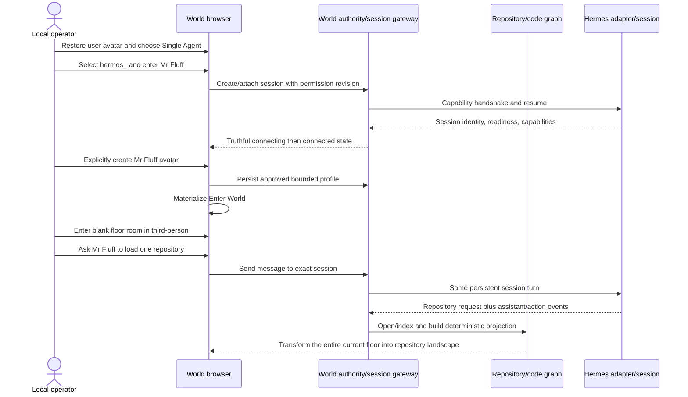

### Ask for a visual code explanation

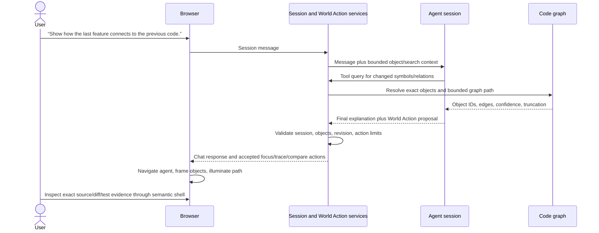

### Request work, observe tools, and present a preview

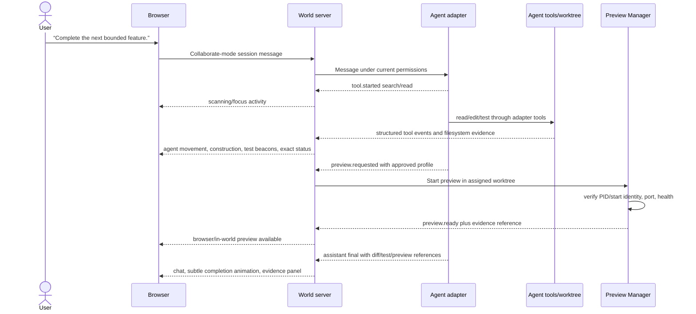

### Open, index, and join

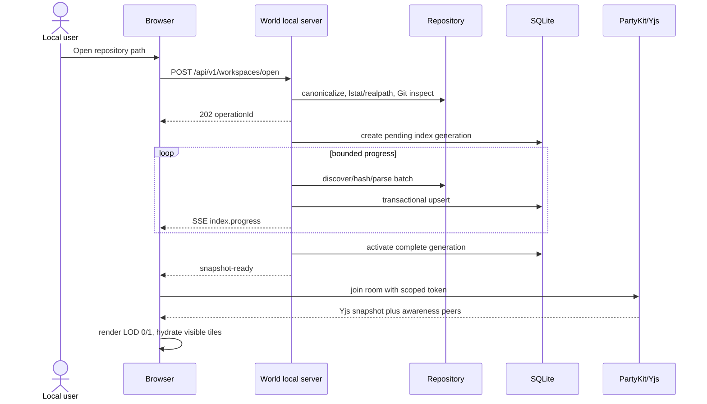

### Queue a real worker job and observe construction

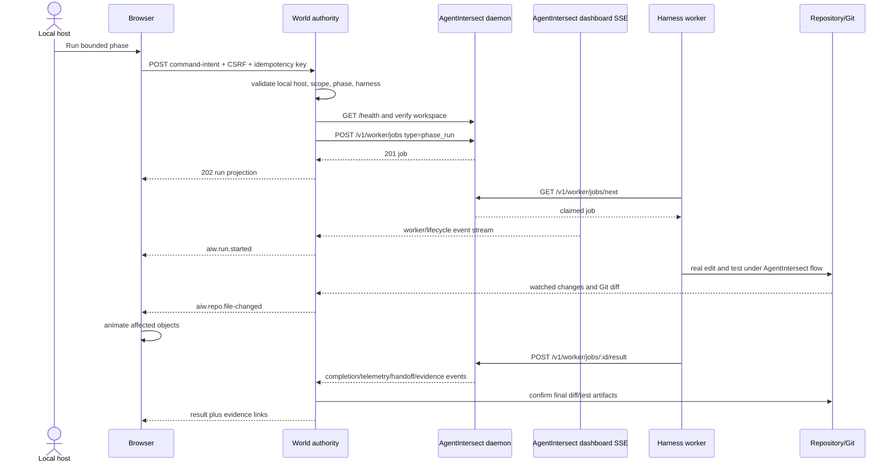

### Safe pause and emergency stop

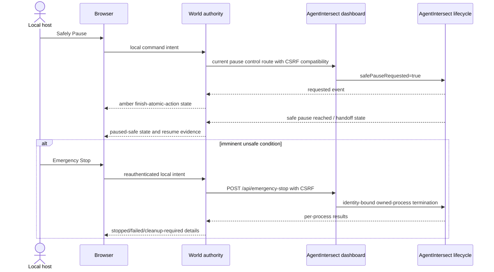

Safe pause is the normal boundary-aware stop. Emergency stop is exceptional and targets only AgentIntersect-owned processes using AgentIntersect’s manifest and process identity rules. World never calls `kill(pid)` itself.

### Reconnect and recovery

```mermaid
sequenceDiagram
  participant B as Browser
  participant W as World server
  participant DB as Projection ledger
  participant AI as AgentIntersect
  participant P as Yjs room
  B-xW: connection lost
  B->>B: mark control stale; retain read-only scene
  B->>P: continue/offline CRDT edits if allowed
  B->>W: reconnect with last World event ID
  W->>AI: re-attest and fetch current snapshot
  W->>DB: replay/dedupe/reconcile source cursor
  W-->>B: missed events or reset-required snapshot
  B->>P: exchange state vectors and awareness
  B->>B: apply final projection without duplicate effects
```

Recovery rules: rebuild derivable graph data from the repository; rebuild World lifecycle projection from the retained event ledger plus current AgentIntersect snapshot; preserve Yjs annotations using snapshot/update logs; never synthesize a successful completion from an animation or missing event.

## Command-intent authority

```ts
const CommandIntentSchema = z
  .object({
    schema: z.literal("aiw.command/0.1"),
    intentId: z.string().uuid(),
    workspaceId: Id,
    operation: z.enum([
      "worker.enqueue-phase",
      "lifecycle.safe-pause",
      "lifecycle.emergency-stop",
    ]),
    phaseId: z
      .string()
      .regex(/^[a-z][a-z0-9_]*$/)
      .optional(),
    harness: z.enum(["codex", "claude-code", "hermes", "openclaw"]).optional(),
    expectedRevision: z.number().int().nonnegative(),
    requestedBy: z.string().max(128),
  })
  .strict();

export async function executeLocalIntent(
  raw: unknown,
  ctx: LocalAuthorityContext,
) {
  const intent = CommandIntentSchema.parse(raw);
  if (!ctx.session.isLoopback || !ctx.session.isHost)
    throw new AuthorityError("local_host_required");
  await ctx.csrf.verify();
  if (intent.workspaceId !== ctx.workspace.id)
    throw new AuthorityError("workspace_mismatch");
  if (intent.expectedRevision !== ctx.workspace.revision)
    throw new ConflictError("stale_revision");
  const existing = await ctx.intentLedger.find(intent.intentId);
  if (existing) return existing.result;

  const health = await ctx.agentIntersect.attest();
  if (health.workspaceIdentity !== ctx.workspace.agentIntersectIdentity) {
    throw new AuthorityError("agentintersect_attestation_failed");
  }

  switch (intent.operation) {
    case "worker.enqueue-phase":
      if (!intent.phaseId || !intent.harness)
        throw new ValidationError("phase_and_harness_required");
      await ctx.policy.assertPhaseRunnable(intent.phaseId, intent.harness);
      return ctx.intentLedger.commitOnce(intent.intentId, () =>
        ctx.agentIntersect.createWorkerJob(
          {
            type: "phase_run",
            harness: intent.harness,
            phase_id: intent.phaseId,
            transportMode: "local",
            baseUrl: ctx.agentIntersectBaseUrl.toString(),
          },
          intent.intentId,
        ),
      );
    case "lifecycle.safe-pause":
      return ctx.dashboardCompatibility.requestSafePause(intent.intentId);
    case "lifecycle.emergency-stop":
      await ctx.session.requireRecentReauthentication();
      return ctx.dashboardCompatibility.emergencyStop(intent.intentId);
  }
}

// No Y.Doc, awareness message, PartyKit socket, or peer identity is accepted here.
```

## Multiplayer and CRDT design

### Yjs ownership

| Data                                            | Store                    | Durability                       |
| ----------------------------------------------- | ------------------------ | -------------------------------- |
| User cursor, camera ray, speaking/typing        | Awareness                | Ephemeral; expires on disconnect |
| Avatar pose and focus                           | Awareness                | Ephemeral                        |
| Presenter/follow relationship                   | Awareness                | Ephemeral                        |
| Object presentation positions/overrides         | Y.Map                    | Durable room state               |
| Annotations/bookmarks/phase-board visual layout | Y.Map/Y.Array            | Durable room state               |
| Shared selection set                            | Y.Map or awareness by UX | Bounded                          |
| Repo graph, file bytes, diffs, terminal output  | Never Yjs                | Local server/SQLite/filesystem   |
| AgentIntersect state/jobs/handoffs/evidence     | Never Yjs                | AgentIntersect                   |
| Command intents, tokens, secrets, raw memory    | Never Yjs                | Local authority/protected store  |

```ts
export function createWorldDoc() {
  const doc = new Y.Doc({ gc: true });
  return {
    doc,
    meta: doc.getMap<{ schema: string; repoId: string }>("meta"),
    layout: doc.getMap<Y.Map<unknown>>("layout"),
    annotations: doc.getMap<Y.Map<unknown>>("annotations"),
    bookmarks: doc.getArray<Y.Map<unknown>>("bookmarks"),
    phaseBoardLayout: doc.getMap<Y.Map<unknown>>("phaseBoardLayout"),
    // Deliberately absent: commands, files, terminal, evidence, tokens, raw profiles.
  };
}

export const AwarenessStateSchema = z
  .object({
    peerId: z.string().max(128),
    displayName: z.string().max(64),
    colorToken: z.string().regex(/^presence-[1-9][0-9]?$/),
    objectId: Id.nullable(),
    cursorRay: z.object({ origin: Vec3, direction: Vec3 }).optional(),
    camera: z.object({ position: Vec3, target: Vec3 }).optional(),
    status: z.enum(["active", "idle", "presenting"]),
  })
  .strict();
```

Yjs transactions use named origins (`local-drag`, `remote-sync`, `migration`) to prevent feedback loops. Values are schema-validated on entry and projection; invalid peer updates are ignored, counted, and may close the connection. Arrays/maps have explicit count and string-size limits. Object locks are advisory UI leases, not security controls; concurrent position edits converge with last-writer CRDT semantics and an activity note. Annotations use stable IDs and field-level maps to reduce conflicts.

### PartyKit room lifecycle

1. Local host requests a short-lived room token from World.
2. The token contains opaque room ID, role (`host-presenter` or `collaborator`), expiry, allowed document namespaces, and a nonce; no absolute path.
3. PartyKit validates issuer/signature/audience, origin, expiry, nonce policy, and message size before connection.
4. Server loads the latest encrypted-at-rest Yjs snapshot plus bounded update tail, then compacts when thresholds are met.
5. Awareness is rate limited and never persisted. Durable updates are schema/size checked and assigned a server sequence.
6. On last disconnect, the room remains for configured retention; tokens expire independently.

```ts
// PartyKit/Yjs conceptual skeleton; exact library APIs must be pinned during Phase 4.
export default class WorldRoom implements Party.Server {
  constructor(readonly room: Party.Room) {}
  async onConnect(conn: Party.Connection, ctx: Party.ConnectionContext) {
    const claims = await verifyRoomToken(ctx.request, this.room.id);
    const guarded = withYjsGuards({
      maxMessageBytes: 128 * 1024,
      maxDocBytes: 8 * 1024 * 1024,
      allowedRoots: [
        "meta",
        "layout",
        "annotations",
        "bookmarks",
        "phaseBoardLayout",
      ],
      claims,
    });
    return guarded.onConnect(conn, this.room);
  }
}
```

Offline edits merge on reconnect by Yjs state vector. Repo graph generation changes do not delete annotations immediately: unresolved object references enter an orphan tray with old label/path and possible successor suggestions. Host authority affects only local command confirmation; it does not override CRDT merge mechanics.

## Security and threat model

### Assets, actors, and boundaries

Protected assets include source code, Git metadata, absolute paths, secrets, AgentIntersect tokens/config, process authority, terminal/test output, prompts, telemetry, handoffs, evidence, audit reports, agent profiles, room tokens, and collaboration annotations. Actors include the local host, invited collaborator, malicious/compromised peer, malicious repository content, compromised browser extension, hostile local process, dependency attacker, and future cloud operator.

Trust boundaries exist at browser↔World, World↔filesystem/Git, World↔AgentIntersect, World/browser↔PartyKit, AgentIntersect↔workers, parser worker↔server, and diagnostic export↔recipient.

### Misuse/attack tree

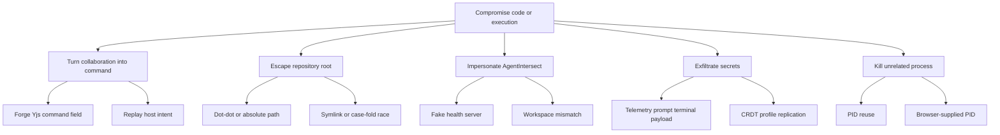

Primary mitigations are architectural: no command fields in Yjs; local host/CSRF/intent-ledger validation; realpath containment and post-open checks; AgentIntersect health/workspace/process-start attestation; bounded/redacted payload projection; no raw memory in multiplayer; and delegation of process termination to AgentIntersect owned-process identity logic.

### Required controls

- **Binding:** World and AgentIntersect bind `127.0.0.1`/`::1` by default. World v0.1 has no LAN bind flag. A future LAN opt-in requires TLS, authentication, threat review, explicit interface allowlist, and separate UX.
- **Origin/CORS/CSRF:** deny cross-origin by default; exact local origin allowlist; no wildcard credentials; SameSite strict session cookie where used; per-session CSRF token on mutations; validate `Origin`, `Host`, and fetch metadata. WebSocket validates origin and token during upgrade.
- **Authentication:** local boot token is generated with high entropy, passed via fragment or one-time exchange rather than query logs, then stored in memory/secure cookie. Room tokens are separate, scoped, expiring, and never grant local API authority.
- **Path safety:** reject NUL/control characters, absolute child paths, `..`, Windows device paths, unsafe URL decoding, and overlong paths. Verify lexical containment, `lstat` components, canonical realpath, root device where policy requires, and no symlink traversal for writes. World v0.1 indexing is read-only to arbitrary repo content.
- **Arbitrary repository safety:** parsers run without executing repository scripts, configs, hooks, postinstall, language build tools, or editor extensions. Git commands disable hooks/pagers and use argument arrays. Binary/huge/decompression-bomb-like content is capped. Tree-sitter grammars are pinned and parsers time/memory bounded.
- **CRDT peers:** schema, rate, size, namespace, token, and room-retention limits; peers cannot introduce executable URLs/HTML; annotations render escaped/plain text; URLs follow an allowlist and confirmation flow.
- **Prompt/event safety:** repository text, prompts, assistant messages, tool output, World Action proposals, voice transcripts, preview pages, and telemetry are untrusted data. They cannot alter system policy, adapter capabilities, session mode, route names, UI HTML, or command arguments. Validate structured actions separately from prose and render with escaping plus explicit provenance.
- **Secrets/redaction:** redact configured keys, token formats, home/absolute paths where exported, and entropy-like candidates before logs/rooms/diagnostics. Preserve local evidence only under policy. Redaction failures fail closed for export, not for local source truth.
- **Process/session ownership:** Guided Build submits jobs and control through AgentIntersect. Free-form sessions use explicit capability-declared adapters. Preview processes are World-owned and identity-bound. World never trusts a browser PID, enumerates arbitrary processes for stopping, adopts an orphan by PID alone, or confuses one ownership domain with another.
- **Emergency stop:** recent local reauthentication, prominent scope, single-use intent ID, AgentIntersect CSRF compatibility, per-process result display, immutable audit entry. It cannot promise rollback of file edits.
- **Supply chain:** exact lockfile, provenance/SBOM, dependency review, no install scripts unless approved, pinned PartyKit/tree-sitter packages, vulnerability policy, reproducible fresh-clone test.
- **Plugins/adapters:** v0.1 has no third-party in-process plugins. Future adapters are capability manifests, isolated processes/workers, deny-by-default filesystem/network permissions, signed/approved installation, and audited command intents.
- **Privacy/retention:** local by default; explicit room-sharing preview; no raw repository graph or paths sent to PartyKit beyond opaque IDs/labels needed for presentation; configurable annotation retention; delete/export flows; diagnostics opt-in.
- **Agent sessions:** adapter session refs, auth material, transcript locations, memory, and persona files remain protected local data. Capability manifests are pinned per connection and a reconnect cannot silently gain permissions.
- **World Actions:** schema/revision/object-scope/rate limits; accepted actions affect presentation only and never become file or tool commands.
- **Voice:** explicit provider disclosure, push-to-talk, transcript preview/cancel, bounded audio, no hot-mic default, and the same permission checks as text.
- **Preview:** loopback default, approved command/environment, assigned worktree, process identity, health check, bounded logs, and no automatic public tunnel/deployment.
- **Multi-agent:** isolated worktrees by default, visible task/file contention, explicit handoffs, and no hidden cross-agent prompt injection.

### Security invariants

1. **CRDT changes never directly send agent prompts, approve tools, execute commands, or mutate files.**
2. Session mode and permission revision are validated locally before every message/action that may produce side effects.
3. Only an attested AgentIntersect workspace receives Guided Build intents; only AgentIntersect terminates its owned workers.
4. Free-form adapters may use only capabilities they declared and proved during the current connection.
5. World Actions affect navigation/presentation only and cannot mutate repository or process state.
6. A visual success state requires an authoritative tool/lifecycle result and evidence reference, not client animation.
7. Arbitrary repository, chat, persona, tool, voice, and preview content is untrusted data.
8. Preview Manager stops only the process identity it created and never creates public ingress by default.
9. Simultaneous editing agents are isolated by worktree or an explicitly approved equivalent boundary.
10. Raw `SOUL.md`, memory, transcripts, secrets, chain-of-thought, and unrestricted tool output never enter shared presentation state.

## Avatar and profile system

Phase 11 delivered strict local `aiw.avatar/0.11` profiles, one shared Blender biped rig, six core body objects, eight attachment anchors, seven reusable actions, twelve human/dog/cat heads, modular hands/paws/claws/feet/fur/tails/markings, twelve colors, four branded tees, required above-head names, local current/previous recovery, and semantic/reduced-motion/WebGL-fallback equivalence. That accepted system is the base for embodied sessions.

### User avatar

The user creates or restores a local avatar before entering the World. Appearance never determines permissions. The profile can be reopened, exported, reset, or deleted. First-person view may hide or partially render the local body for comfort while third-person/photo views use the same approved profile.

### Agent avatar proposal

An agent may propose an avatar only through the bounded proposal flow:

```ts
export const AgentAvatarProposalSchema = z
  .object({
    schema: z.literal("aiw.avatar-proposal/0.15"),
    sessionId: z.string().uuid(),
    displayName: z.string().min(1).max(64),
    profile: AvatarProfileSchema,
    rationale: z.string().max(280),
    sourceDisclosure: z.enum([
      "harness-default",
      "explicit-persona",
      "agent-self-description",
      "neutral-default",
    ]),
    voiceProposal: z
      .object({
        providerVoiceId: z.string().max(128),
        label: z.string().max(64),
      })
      .nullable(),
  })
  .strict();
```

For Hermes, its own session may use `SOUL.md`, configured persona, profile name, skills, and harness identity to produce a short safe proposal. World never reads or publishes the raw file as avatar data. Other adapters expose only their supported allowlisted identity fields. The operator previews and accepts, edits, randomizes, uses neutral defaults, or declines. An agent cannot silently change its durable profile later.

No appearance is presented as objective personality, consciousness, protected trait, competency rank, or emotional truth. Expression and emoji are playful communication derived from explicit message tags or authoritative activity states.

### Activity and expression mapping

The shared skeleton maps authoritative session/tool state to bounded motion: idle, walk, run/urgent navigation, inspect/read, work/edit, wait-for-approval, speak, celebrate, error, and offline. Optional ear/tail secondary motion remains cosmetic and does not create separate primary locomotion rigs. Reduced motion uses pose changes, focus rings, text, and icons. Speaking indicators follow actual output/playback state; thinking indicators mean only that the adapter reports an active response turn.

Above-head UI shows the required name, concise status, typing/speaking indicator, and bounded bubble excerpt. It does not show secrets, raw code, long logs, hidden reasoning, cost/token details unless the user opens the semantic inspector.

## UX and information architecture

### Primary layout

- **Opening and constellation:** full-screen animated logo, typed identity/session choices, harness endpoint labels, truthful connection overlays, explicit per-agent avatar creation, and readiness-gated `Enter World`.
- **World viewport:** the normal product surface. It begins as a small open blank floor room, defaults to third-person behind the user avatar, supports free user/agent navigation, and transforms that complete floor into the requested repository landscape.
- **Persistent HUD:** only a minimal bottom-center chat field and adjacent push-to-talk control are required. Captions and truthful status use transient, contained presentation rather than permanent dashboard chrome.
- **Message targeting:** unaddressed text goes to all connected agents. Clicking an avatar or using `@name` targets one agent.
- **Accessible equivalents:** keyboard and semantic DOM paths remain available for every required operation, but they should feel like the same embodied journey rather than expose control-plane organization.
- **Internal developer surface:** session identity, capability details, repository tree/search, object inspector, minimap, diffs/evidence, run timeline, phase board, roster diagnostics, preview controls, terminal fallback, recovery, and collaboration diagnostics remain supported internal machinery behind an explicit local developer flag/internal route. The normal experience contains no link to it.

### Accepted AgentIntersect visual-shell inheritance

The user has explicitly approved a one-time reuse of the original AgentIntersect opening identity screen, dashboard composition, graphics, avatar artwork, hero harness selector, navigation bar, and menu-toggle interaction model. This is an intentional visual-product inheritance decision, not a continuing runtime or repository dependency.

**Authorized source baseline:** original AgentIntersect commit `14c620271cd02e455d3244241de951e00ef77a4d`, limited during the Phase 5 extraction to `src/dashboard-ui.mjs`, `src/dashboard-assets/`, and the directly relevant dashboard visual-asset tests. World must not modify the source repository. Required assets are copied with a provenance manifest and SHA-256 hashes, then maintained as World-owned files without recurring checks against AgentIntersect.

**Graphics and visual behavior to preserve:**

- the full-screen terminal-style `identify_` opening transition;
- the static dark-square header mark, animated AgentIntersect hero mark, avatar sheets, layered male/female puppet artwork, state artwork, orb/ring treatments, and the existing smooth avatar compositor where selected for the World shell;
- the source logo artwork remains byte-identical; adjacent accessible text and the typed product title identify the product as **AgentIntersect World** rather than silently renaming or editing the source SVG;
- the dark neon/terminal visual language, typewriter text, blinking cursors, hero composition, status pills, card surfaces, and responsive layout behavior;
- the navigation interaction: cursor-led category buttons, first click opens the associated overlay panel, second click closes it, selected cursors remain inline, and opening a panel does not push or reposition the hero card;
- the persistent visible output/status area so every action exposes current state, result, and next step.

**World opening flow:**

1. On first open, show the inherited identity presentation before the main dashboard.
2. Let the operator build and preview a local avatar appearance from the inherited visual layers/presets rather than only choosing a hidden profile value. Persist the selected World avatar profile locally and provide an accessible non-animated/reduced-motion preview.
3. Transition into the dashboard using the inherited visual effect and restore the saved profile on later opens; Settings can reopen the avatar builder.
4. In the hero card, present the inherited harness choices—OpenClaw, Hermes, Claude Code, and Codex—as the origin/default harness for the operator's World agent or agents. Selection must be visible and durable. Phase 5 stores intent only; Phase 6 adds truthful connection/readiness projection and Phase 7 enables the first real bounded worker action.
5. When multiple owned agents arrive, each roster entry may retain its own harness origin while the hero selection remains the default/current harness.

**World navigation taxonomy:** reuse the original navigation bar and overlay/toggle functionality, but replace AgentIntersect's `connect`, `onboarding`, `design`, `control`, `workers`, and `records` menu bodies with World-owned categories:

- **World** — repository island, viewport, minimap, and current selection;
- **Repositories** — open/index/rescan, hierarchy, search, and index diagnostics;
- **Agents** — harness selection, owned-agent roster, current work, and status;
- **Activity** — operations, normalized timeline, progress, and run lifecycle;
- **Evidence** — diffs, tests, telemetry, handoffs, and provenance;
- **Settings** — avatar appearance, accessibility, local/LAN configuration, and diagnostics.

The logo remains a home/reset action. Categories may initially expose truthful unavailable/coming-phase states, but they must never imply an unimplemented connection or command succeeded. Existing Phase 2/3 functional flows are migrated into the matching World panels when the Phase 5 shell lands; they are not discarded.

**What is not reused:** the original AgentIntersect menu contents, control-plane route assumptions, Connect/OnBoarding/Design/Control/Workers/Records business logic, external configuration writes, worker authority, or monolithic server-rendered implementation. World ports the accepted visual and interaction design into typed React components backed only by World APIs.

**Current versus proposed:** The completed Phase 5 dashboard and the Phase 6–17 operational panels remain accepted internal capability foundations. Revised Phase 18's Single-Agent Hermes feature loop is complete and manually accepted, including the real Workstream-owned repository-city movement correction and truthful validation evidence. The integrated source passed independent parent verification; exact private-delivery parity and hosted-CI state are retained in the external handoff. Revised Phase 19 was authorized on 2026-08-11; Tasks 1–2 passed parent verification and Task 3's capability/config-truth RED→GREEN slice is in progress under the canonical plan. Revised Phase 20 remains the later, separately gated integrated embodied acceptance and bounded-hardening milestone.

### Onboarding

On first launch, the browser shows only one large animated AgentIntersect logo, then types `identify_`, then presents `Create Avatar`. After the user creates the avatar, their name overlays the center of the X. `AgentIntersect_` types below the logo, followed by `Single Agent` on the left and `Multi Agent` on the right. On later launches, the personalized logo/name appears first, `AgentIntersect_` replays, and session selection follows without forcing user-avatar creation.

Single Agent exposes the four terminal harness labels at the logo endpoints. Selecting `hermes_` or `openclaw_` asks `agent name?` and resolves an existing local identity; a miss types `agent not found_` and immediately permits retry without technical detail. Selecting `codex_` or `claude_` uses the entered name as the World identity. Every newly connected agent must then pass through explicit avatar creation before readiness can reveal `Enter World`.

Multi Agent repeats connect one agent → immediately create that agent’s avatar → return to the constellation. `Enter World` is unavailable until at least two agents are truthfully connected and all their avatars are complete, though more agents may be added first. Same-PC harness attachment is invisible; LAN/different-PC setup UI is deferred.

### Errors and recovery

Normal-experience errors are brief, human, and actionable. A Hermes/OpenClaw identity miss is exactly `agent not found_` plus immediate retry; it does not expose connector diagnostics. Connection, avatar, repository, chat, voice, and World-entry state must remain truthful, including current versus previous/recovered state. Technical details, diagnostics IDs, recovery tools, and control-plane disclosures remain available only on the explicitly enabled internal developer surface. Never hide unavailability behind an avatar animation or enable a blue action before authority is ready.

### Accessibility

All objects have semantic roles/labels in a synchronized DOM tree. Keyboard controls cover identity, session choice, harness selection, name entry/retry, avatar creation, `Enter World`, navigation, chat, targeting, push-to-talk, and repository interaction. Focus never becomes trapped in canvas. Provide logical tab order, screen-reader live regions for typed/connection/repository state, captions for voice, reduced-motion equivalents for typewriter/pulse/floor transformation, camera-sickness controls, high contrast, text scaling, responsive containment, and color-independent enabled/unavailable truth in addition to blue/grey styling. Automated axe tests and manual keyboard/screen-reader checks remain acceptance gates without introducing admin chrome.

## CLI and developer experience

### v0.1 workspace commands

```text
pnpm aiw dev              # run web/local server/optional local PartyKit dev
pnpm aiw open .           # workspace script form during development
pnpm aiw doctor           # read-only environment and integration checks
pnpm aiw demo             # disposable vertical-slice fixture; explicit real-job gate
pnpm test
pnpm test:contract
pnpm test:e2e
pnpm build
```

**Future/Deferred distribution syntax:** `npx agentintersect-world open .`. It must not be documented as available until a package is actually approved and published.

### Configuration

Project config is `.agentintersect-world/config.json` or `agentintersect-world.config.ts`; v0.1 prefers JSON for non-executable safety. User secrets live in the OS credential store or protected local state, never project config.

```ts
export const WorldConfigSchema = z
  .object({
    schema: z.literal("aiw.config/0.1"),
    server: z.object({
      host: z.enum(["127.0.0.1", "::1"]).default("127.0.0.1"),
      port: z.number().int().min(1024).max(65535).default(3770),
    }),
    agentIntersect: z.object({
      daemonUrl: z.string().url().default("http://127.0.0.1:3761"),
      dashboardUrl: z.string().url().default("http://127.0.0.1:3762"),
      required: z.boolean().default(false),
    }),
    index: z.object({
      excludes: z.array(z.string().max(256)).max(100).default([]),
      maxFileBytes: z.number().int().positive().default(2_000_000),
      parseConcurrency: z.number().int().min(1).max(16).default(4),
      followFileSymlinks: z.literal(false).default(false),
    }),
    collaboration: z.object({
      enabled: z.boolean().default(false),
      roomRetentionHours: z.number().int().min(1).max(720).default(24),
    }),
    privacy: z.object({
      shareLabels: z.boolean().default(true),
      sharePaths: z.literal(false).default(false),
      eventRetentionDays: z.number().int().min(1).max(365).default(30),
    }),
  })
  .strict();
```

```json
{
  "schema": "aiw.config/0.1",
  "server": { "host": "127.0.0.1", "port": 3770 },
  "agentIntersect": {
    "daemonUrl": "http://127.0.0.1:3761",
    "dashboardUrl": "http://127.0.0.1:3762",
    "required": true
  },
  "index": {
    "excludes": ["dist/**", "coverage/**", "vendor/**"],
    "maxFileBytes": 2000000,
    "parseConcurrency": 4,
    "followFileSymlinks": false
  },
  "collaboration": { "enabled": true, "roomRetentionHours": 24 },
  "privacy": {
    "shareLabels": true,
    "sharePaths": false,
    "eventRetentionDays": 30
  }
}
```

Environment variables override non-secret operational settings: `AIW_HOST`, `AIW_PORT`, `AIW_AGENTINTERSECT_DAEMON_URL`, `AIW_AGENTINTERSECT_DASHBOARD_URL`, `AIW_LOG_LEVEL`, `AIW_DB_PATH`, and `AIW_PARTYKIT_HOST`. Values are Zod validated, secrets are never printed by `doctor`, and precedence is CLI > environment > project config > defaults. Suggested local ports are 3770 (World API), 5173 (Vite dev only), and the PartyKit development port assigned by its tooling; collision detection must report alternatives rather than silently changing an integration URL.

`doctor` checks Node/pnpm, writable World data directory, repository safety, SQLite, browser/API ports, AgentIntersect health/workspace attestation, dashboard snapshot/SSE reachability, optional MCP tool list, parser availability, and room connectivity. It is read-only. Logs are JSON in production and pretty in local dev, always carrying `correlationId` and redaction metadata.

## AgentIntersect World local server API

These are **proposed AgentIntersect World v0.1 routes**, distinct from all current AgentIntersect routes.

### Conventions

- Base: `http://127.0.0.1:3770/api/v1`.
- JSON bodies default max 256 KiB; route-specific lower limits; uploads/diagnostics use explicit streaming limits.
- `X-AIW-CSRF` required on mutations; local secure session cookie or bearer boot token; exact Origin/Host validation.
- `X-Correlation-ID` accepted only if UUID, otherwise generated; always returned.
- Mutation requests use `Idempotency-Key` UUID and `expectedRevision` where stateful.

```ts
type ApiResult<T> = {
  ok: true;
  data: T;
  meta: { correlationId: string; schema: "aiw.api/0.1"; revision?: number };
};

type ApiError = {
  ok: false;
  error: {
    code:
      | "validation"
      | "unauthorized"
      | "forbidden"
      | "conflict"
      | "not_found"
      | "authority_unavailable"
      | "upstream"
      | "rate_limited"
      | "internal";
    message: string;
    retryable: boolean;
    details?: Record<string, unknown>;
  };
  meta: { correlationId: string; schema: "aiw.api/0.1" };
};
```

### Route catalog

| Method/path                                  | Purpose                                                                                               |
| -------------------------------------------- | ----------------------------------------------------------------------------------------------------- |
| `GET /health`                                | Liveness, version, no sensitive workspace data                                                        |
| `GET /ready`                                 | DB/index/AgentIntersect readiness by capability                                                       |
| `POST /session/exchange`                     | One-time boot-token exchange                                                                          |
| `POST /workspaces/open`                      | Canonicalize and start/reuse indexing operation                                                       |
| `GET /operations/:id`                        | Index/control operation status                                                                        |
| `POST /operations/:id/cancel`                | Cooperative cancel                                                                                    |
| `GET /world/snapshot`                        | Current graph/layout projection, tile/LOD query                                                       |
| `GET /world/events`                          | Cursor-based bounded replay                                                                           |
| `GET /world/events/stream`                   | SSE normalized event stream                                                                           |
| `GET /objects/:objectId`                     | Object metadata and safe references                                                                   |
| `GET /objects/:objectId/diff`                | Bounded real Git/worktree diff                                                                        |
| `GET /runs` / `GET /runs/:runId`             | Run projection and evidence refs                                                                      |
| `POST /commands/intents`                     | Local authority command validation/dispatch                                                           |
| `GET /integration/agentintersect`            | Attestation/compatibility state                                                                       |
| `POST /integration/agentintersect/reconcile` | Read-only re-attest/snapshot reconcile                                                                |
| `GET /agent-adapters`                        | Capability-declared adapter readiness without secrets                                                 |
| `POST /agent-sessions`                       | Create/attach a session with mode and permission revision                                             |
| `GET /agent-sessions/:id`                    | Durable session, status, focus, capability snapshot                                                   |
| `POST /agent-sessions/:id/messages`          | Send bounded text/attachment message to exact session                                                 |
| `GET /agent-sessions/:id/events`             | Cursor-based session event replay                                                                     |
| `GET /agent-sessions/:id/events/stream`      | Ordered assistant/tool/action/approval SSE                                                            |
| `POST /agent-sessions/:id/control`           | Queue, steer, interrupt, pause, close, or mode-deescalate                                             |
| `POST /agent-sessions/:id/approvals/:aid`    | Resolve one adapter approval under current permission revision                                        |
| `POST /world-actions/validate`               | Validate bounded action proposal against current World revision                                       |
| `POST /previews`                             | Start approved loopback preview in assigned repo/worktree                                             |
| `GET /previews/:id`                          | Preview health, owner, port-safe URL, and evidence                                                    |
| `POST /previews/:id/stop`                    | Stop exact World-owned preview process identity                                                       |
| `POST /voice/transcribe`                     | Optional bounded push-to-talk transcription                                                           |
| `POST /voice/synthesize`                     | Optional bounded approved assistant speech                                                            |
| `POST /rooms`                                | Create scoped room/token preview                                                                      |
| `POST /rooms/:roomId/token`                  | Host issues expiring collaborator token                                                               |
| `GET /diagnostics/summary`                   | Privacy-safe doctor data                                                                              |
| `POST /diagnostics/export`                   | Explicit redacted bundle creation                                                                     |
| `WS /interactive`                            | Low-volume local chat/action acknowledgements and optional audio signaling; no raw terminal authority |

### Examples

```http
POST /api/v1/workspaces/open HTTP/1.1
Host: 127.0.0.1:3770
Content-Type: application/json
X-AIW-CSRF: <session-token>
Idempotency-Key: 019122d5-7c41-7a71-8900-11d884965a2a

{"path":".","mode":"read-write-worktree-observation"}
```

```json
{
  "ok": true,
  "data": {
    "operationId": "aiw_op_01j5m...",
    "workspaceId": "aiw_ws_h6k...",
    "status": "indexing",
    "events": "/api/v1/world/events/stream"
  },
  "meta": {
    "correlationId": "7dc2d8ec-7710-49aa-a3ee-517d68dc5ff1",
    "schema": "aiw.api/0.1",
    "revision": 1
  }
}
```

```http
POST /api/v1/commands/intents HTTP/1.1
Content-Type: application/json
X-AIW-CSRF: <session-token>
Idempotency-Key: 93eec5a4-154b-49d2-a023-98fd45cdcb82

{"schema":"aiw.command/0.1","intentId":"93eec5a4-154b-49d2-a023-98fd45cdcb82","workspaceId":"aiw_ws_h6k...","operation":"worker.enqueue-phase","phaseId":"phase_1","harness":"codex","expectedRevision":12,"requestedBy":"local-host"}
```

Fastify skeleton:

```ts
const app = Fastify({
  bodyLimit: 256 * 1024,
  trustProxy: false,
  requestIdHeader: "x-correlation-id",
});
app.addHook("onRequest", enforceLoopbackHostOrigin);
app.addHook("preValidation", authenticateLocalSession);
app.addHook("onSend", redactResponseHeaders);

app.get("/api/v1/health", async () =>
  ok({ service: "agentintersect-world", version: build.version }),
);
app.post(
  "/api/v1/workspaces/open",
  { schema: OpenWorkspaceRouteSchema },
  async (req, reply) => {
    await req.csrf.verify();
    const operation = await workspaceService.open(req.body, req.id);
    return reply.code(202).send(ok(operation, req.id));
  },
);
app.post(
  "/api/v1/commands/intents",
  { schema: CommandIntentRouteSchema },
  async (req, reply) => {
    const result = await executeLocalIntent(req.body, req.localAuthority);
    return reply.code(202).send(ok(result, req.id));
  },
);
app.get("/api/v1/world/events/stream", worldSseHandler);
```

## Persistence ownership and recovery

| Store                     | Owns                                                                                                                | Not source of truth for                                   | Retention/recovery                                                |
| ------------------------- | ------------------------------------------------------------------------------------------------------------------- | --------------------------------------------------------- | ----------------------------------------------------------------- |
| SQLite                    | Graph/index, layout, session metadata, mode/permissions, adapter refs, preview/run mappings, dedupe, local settings | File bytes, adapter-native transcript, external lifecycle | WAL/checkpoint; backup before migration; rebuild derivable tables |
| JSONL                     | Append-only World/session/tool/action/preview/run projection ledgers and audit trail                                | Current adapter/session snapshot alone                    | Rotate by size/day; checksum segments; retention policy           |
| Yjs snapshots/update tail | Annotations and presentation layout                                                                                 | Execution/files/evidence                                  | Compact; encrypted provider storage; export/delete room           |
| Git/filesystem            | Repository bytes/status/history                                                                                     | Phase completion                                          | Normal Git recovery; World never auto-reverts                     |
| Agent adapter state       | Native session transcript, model/tools, approvals, runtime continuity                                               | Spatial layout or World permissions                       | Reattach/resume/reset explicitly per capability                   |
| AgentIntersect state      | Guided jobs/phases/sessions/handoff/evidence/audit                                                                  | Free-form session or spatial layout                       | Reconcile via current API and retained events                     |
| Preview registry          | World-owned preview PID/start/command/port/health/owner evidence                                                    | Deployment or unrelated processes                         | Identity-bound probe and teardown; no PID adoption                |

Writes use temp/atomic rename where applicable and SQLite transactions. On unclean shutdown, integrity-check SQLite, recover WAL, validate last JSONL segment checksum, and replay events idempotently. If SQLite is corrupt, preserve a copy, start read-only diagnostics, and offer deterministic graph rebuild plus run-map reconstruction. Yjs corruption restores last valid snapshot and update prefix; report lost update range. Backups exclude secrets by default and include a manifest/schema/checksum.

## Observability and evidence

Structured logs contain timestamp, level, service, event, correlation ID, workspace pseudonym, run/job/phase IDs, duration, outcome, and redaction counts. They exclude file contents, prompts, raw terminal output, tokens, raw paths in export mode, and CRDT update bodies. Metrics include index throughput/errors/cancel latency, parse coverage, DB latency, scene object/edge counts, render/navigation budgets, session attach/resume/reset, message latency, tool duration/outcomes, approval wait, action acceptance/rejection, preview startup/health/teardown, voice latency/failure, worktree contention, SSE lag/reconnect/overflow, event dedupe, AgentIntersect attestation, room peers/update rates, and redaction counts. OpenTelemetry traces are optional local export and propagate correlation IDs through World calls; current AgentIntersect may not preserve them, so mapping records the upstream job/event IDs.

The run ledger links:

```text
World runId
  ↔ intentId / correlationId
  ↔ AgentIntersect jobId / phaseId / sessionId
  ↔ normalized event IDs and source cursors
  ↔ Git diff snapshot or worktree observation
  ↔ test result evidence
  ↔ handoff validation/integrity metadata
  ↔ audit/evidence safe resource IDs
```

`/health` means process liveness; `/ready` reports capability readiness (`index`, `database`, `agentIntersectRead`, `agentIntersectMutate`, `collaboration`). A diagnostics bundle contains versions, config with secrets removed, health/attestation summary, migration status, index coverage, recent structured errors, redaction report, dependency/SBOM metadata, and optional bounded event samples. Export requires explicit preview and fails if redaction validation cannot complete.

## Rendering skeleton

```tsx
type RepoWorldProps = {
  tile: VisibleWorldTile;
  activity: Map<string, ObjectActivity>;
};

export function RepoWorld({ tile, activity }: RepoWorldProps) {
  const reducedMotion = useReducedMotion();
  return (
    <Canvas dpr={[1, 1.75]} frameloop="demand" aria-hidden="true">
      <Suspense fallback={null}>
        <WorldLighting quality={tile.quality} />
        <InstancedBuildings
          objects={tile.files}
          activity={activity}
          reducedMotion={reducedMotion}
        />
        <InstancedBeacons tests={tile.tests} />
        <BundledDependencyEdges edges={tile.edges} />
        <AgentAvatars agents={tile.agents} reducedMotion={reducedMotion} />
        <SelectionOutline objectId={tile.selectedObjectId} />
      </Suspense>
    </Canvas>
  );
}

function useAffectedObjectAnimation(event: WorldEvent) {
  const invalidate = useThree((s) => s.invalidate);
  const apply = useActivityStore((s) => s.apply);
  useEffect(() => {
    if (event.type !== "aiw.repo.file-changed") return;
    apply(event.payload.objectId as string, {
      state: "changed",
      effect: matchMedia("(prefers-reduced-motion: reduce)").matches
        ? "outline"
        : "scaffold-pulse",
      evidenceRef: event.payload.evidenceRef as string | undefined,
    });
    invalidate();
  }, [event.id, apply, invalidate]);
}
```

The canvas is marked presentation-only because the synchronized DOM tree provides semantics and interaction. Effects are idempotent by event ID and time-bounded; replay restores final state without replaying every animation.

## Test strategy and quality gates

### Test layers

- **Unit (Routine):** IDs, path normalization, LOD, clustering, schema transforms, redaction, dedupe, reducers.
- **Schema/property (Standard):** Zod/JSON Schema round trips, forward-compatible optional fields, fuzzed hostile payloads, migration fixtures.
- **Agent adapter contracts (High-risk at authority boundaries):** Hermes first adapter plus later adapters; exact capability manifest, create/attach/resume, ordered message/tool/approval events, interrupt/close, payload bounds, and honest unsupported features.
- **AgentIntersect contract (High-risk):** pinned compatibility fixtures for Guided Build health, daemon routes, dashboard snapshot/events/SSE, MCP tools, worker claim/completion conflicts, safe pause, and emergency results.
- **Integration (Standard/High-risk by boundary):** temporary World DB + disposable repo + fake and real AgentIntersect modes; reconnect, overflow, corruption, cancellation.
- **Collaboration (High-risk):** two browser contexts, concurrent annotations/layout, offline updates, awareness expiry, hostile message rejection, proof that Yjs cannot reach dispatch.
- **Embodied magic-slice E2E:** one repo, one persistent Hermes session, approved agent avatar, text chat, visual explanation, structured tool activity, one bounded edit/test, local preview, reload/resume.
- **Guided Build E2E (High-risk):** disposable repo, one real AgentIntersect phase job, one real edit/test, exact diff/evidence, safe lifecycle.
- **Multi-agent E2E:** isolated worktrees, two sessions/avatars, task ownership, overlap/conflict truth, explicit handoff and merge candidate.
- **Visual regression (Routine):** deterministic camera/seed, first/third-person navigation, chat/bubbles, tool effects, avatars/voice state, previews, LOD, reduced motion, high contrast, WebGL fallback.
- **Accessibility (Standard):** axe plus keyboard, screen-reader smoke, 200% zoom, contrast, no-color state.
- **Load/large repo (Standard):** synthetic 10k/100k files, parser timeout, watch overflow, 10k instances, slow SSE client.
- **Security/boundary (High-risk where applicable):** traversal/symlink races, origin/CSRF, fake health, workspace mismatch, adapter capability/permission replay, CRDT prompt/tool injection, World Action confusion, voice/provider leakage, preview process/port ownership, cross-worktree writes, HTML payloads, and secret export.
- **Packaging/fresh clone (Standard):** locked install, build, doctor, demo fixture, no hidden global dependencies.

### Example tests

```ts
it("pins the unchanged AgentIntersect MCP contract", async () => {
  const mcp = await spawnPinnedAgentIntersectMcp();
  const init = await mcp.initialize("2024-11-05");
  expect(init.capabilities).toEqual({ tools: {} });
  expect((await mcp.listTools()).map((t) => t.name).sort()).toEqual([
    "clm_get_current_phase",
    "clm_get_resume_packet",
    "clm_record_evidence",
    "clm_report_telemetry",
    "clm_request_handoff",
  ]);
  expect(init.capabilities).not.toHaveProperty("resources");
});

it("never dispatches a CRDT command-shaped update", async () => {
  const dispatch = vi.fn();
  const room = createGuardedRoom({ dispatch });
  await room.applyPeerUpdate(
    encodeYMap("commands", { operation: "worker.enqueue-phase" }),
  );
  expect(dispatch).not.toHaveBeenCalled();
  expect(room.securityEvents()).toContainEqual(
    expect.objectContaining({ code: "forbidden_yjs_root" }),
  );
});

test("two browsers converge presentation without sharing execution authority", async ({
  browser,
}) => {
  const a = await browser.newContext();
  const b = await browser.newContext();
  const pageA = await a.newPage();
  const pageB = await b.newPage();
  await joinSameRoom(pageA, pageB);
  await pageA.getByRole("button", { name: "Annotate selected file" }).click();
  await expect(pageB.getByRole("note")).toContainText("Review this boundary");
  await pageB.evaluate(() => maliciousYjsCommandInjection());
  await expect.poll(() => agentIntersectJobCount()).toBe(0);
});
```

### Bounded review policy

High-risk changes require written threat-model invariants, focused abuse/boundary/race tests, one full suite, one fresh independent boundary review, and one targeted blocker re-review after corrections. Standard changes require focused RED→GREEN tests, impacted and full suites at the verification milestone, and one consequential review when warranted. Routine changes use relevant syntax/lint/unit or visual checks without independent security review by default. A failed review yields a bounded issue list; after fixes, re-review changed areas and prior blockers once. Further loops require a concrete failing test or new risk evidence—not indefinite subjective polishing.

## Budgets and SLO-like targets

| Area            | v0.1 target                                                                                                 |
| --------------- | ----------------------------------------------------------------------------------------------------------- |
| API             | local read p95 <100 ms excluding index/diff; intent acknowledgment p95 <500 ms excluding upstream job start |
| Event freshness | AgentIntersect event observed in World p95 <750 ms under normal local load                                  |
| Reconnect       | World SSE resumes/reconciles within 5 s p95; Yjs convergence within 3 s p95 after reconnect                 |
| Reliability     | No duplicate dispatch under timeout/retry tests; zero lifecycle success without authoritative result        |
| Index           | Demo repo interactive <5 s cold; 10k-file metadata index <60 s reference machine; cancel <500 ms            |
| Rendering       | 60 fps target, 30 fps floor during effects at reference scene; input response <100 ms                       |
| Accessibility   | WCAG 2.2 AA target; all primary workflows keyboard/DOM operable; zero serious axe findings                  |
| Privacy         | Zero known secrets in default room/diagnostic fixtures; redaction suite 100% required patterns              |
| Compatibility   | Pinned AgentIntersect commit contract suite green; fail closed on unsupported contract                      |
| Data loss       | Derivable graph RPO 0 via rebuild; local event/Yjs configured retention; crash recovery tested              |

Targets are engineering budgets, not public uptime promises. Reference hardware, repo fixtures, and measurement procedure must be committed before claims are made.

## Implementation plan

### Re-baselined roadmap map

Completed Phases 0–17 are accepted historical foundations and are not reopened by this design:

| Foundation   | Completed capabilities                                                               |
| ------------ | ------------------------------------------------------------------------------------ |
| Phases 0–2   | Compatibility baseline, monorepo, local authority/configuration                      |
| Phases 3–4   | Repository discovery/index, stable World identity, deterministic layout/LOD          |
| Phases 5–6   | Inherited shell/repository island, AgentIntersect read integration/replay            |
| Phases 7–8   | Real bounded phase intent, durable diff/test/evidence and construction projection    |
| Phases 9–10  | Same-operator presentation sync, symbols/dependencies/large-repo hardening           |
| Phases 11–14 | Modular avatars, persistent Hermes session, navigation/actions, tools and previews   |
| Phases 15–17 | Staged voice lane, isolated multi-agent coordination, diagnostics/recovery machinery |

The re-baselined product path is:

| Phase | Status                                                                 | Product question answered                                                       | Primary deliverable                                               |
| ----- | ---------------------------------------------------------------------- | ------------------------------------------------------------------------------- | ----------------------------------------------------------------- |
| 18    | Single-agent feature loop manually accepted and independently verified | Can one user call Mr Fluff into a World and complete a real repository feature? | Single-Agent Hermes World-entry and Workstream magic slice        |
| 19    | Next planning/authorization decision; not started                      | Can the frozen constellation work across agents and harnesses?                  | Multi-Agent sequence, targeting, and four-harness breadth         |
| 20    | Not started or authorized                                              | Does the embodied product work reliably across accepted foundations?            | Integrated acceptance and bounded hardening; old Phase 18 purpose |

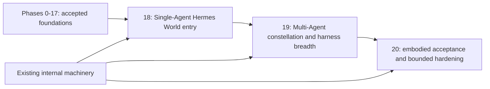

Delivery rule for any later authorized implementation: each phase freezes a scope, implements one observable slice, runs focused/full proof, receives independent Mr Fluff artifact and first-hand user verification, and stops. Commit/push and exact-SHA CI require their own included authorization. No phase auto-authorizes the next, and this documentation-only re-baseline authorizes none of Phases 18–20.

Every phase is a bounded approval unit. Phase numbering is ordered, but measured research tasks may overlap only when their dependencies and write scopes are explicit. “Exit gate” means evidence exists and the next phase may be proposed; it is not release authorization.

## Phase 0 — Contract and protocol proof

**Objective:** Prove the minimum unchanged AgentIntersect read/write contract and freeze fixtures before building product layers.

**Rationale:** The highest architectural risk is building World around undocumented shapes or accidentally duplicating lifecycle authority. A contract harness turns the current private runtime into an explicit tested dependency without pretending it is a public SDK.

**In scope:** Pin an approved unchanged AgentIntersect checkout/commit; verify package/runtime identity, health attestation, exact daemon routes, dashboard snapshot/events/SSE candidates, worker create/claim/result semantics, current MCP protocol and five tools, phase/handoff/evidence mappings, safe pause, and emergency-stop response behavior. Define compatibility matrix and raw fixtures with secrets/paths sanitized.

**Out of scope:** World UI, repository indexing, AgentIntersect edits, public API commitments, MCP resources, package extraction.

**Dependencies:** Design approval; access to the private unchanged AgentIntersect checkout; disposable workspace.

**Concrete tasks:**

1. Record pinned commit, Node version, package identity, default ports, and request limits.
2. Build a read-only fixture capture harness plus deliberate disposable worker-job fixture.
3. Test workspace attestation against correct, aliased, mismatched, dead, reused-PID, and fake health cases.
4. Capture dashboard snapshot/event/SSE framing and reconnect behavior.
5. Initialize MCP `2024-11-05`, list exactly five tools, and assert no resource capability.
6. Exercise create→claim→complete, wrong-worker conflict, duplicate completion reconciliation, failed result, safe pause, handoff integrity, and emergency-stop-owned-process boundary in disposable state.
7. Write a versioned `AgentIntersectCompatibility` adapter contract and unsupported-version policy.

**Code/artifacts:** `packages/agentintersect-client` contract types; sanitized fixtures; contract-test utilities; compatibility matrix; no AgentIntersect files changed.

**Tests/evidence:** Command transcripts, exact response fixtures, negative attestation tests, MCP list assertion, worker identity conflict test, current route catalog, hash of pinned checkout.

**Acceptance criteria:** All required current facts in this document have executable assertions; no test assumes resources or a public SDK; no mutation touches a non-disposable workspace; compatibility failure is fail-closed.

**Exit gate:** Independent High-risk contract review signs the fixture set and confirms unchanged AgentIntersect status.

**Risks:** Private source drift, nondeterministic event timing, unsafe fixture cleanup. Mitigate with pinning, tolerant timing/exact schema assertions, and isolated temporary workspaces.

## Phase 1 — Monorepo and engineering foundations

**Completion:** COMPLETE on 2026-07-19. See `PHASE_1_REPORT.md`. The functioning pnpm/Turborepo workspace, Vite/React app, Fastify health server, typed shared packages, architecture checks, 13 tests, 1 Playwright E2E, clean-browser bootstrap, smoke, aggregate check, and 107-file fresh-copy verification are green. One bounded audit found two automation blockers; one targeted correction fixed both, parent verification passed, and no second broad review was run.

**Objective:** Establish a functioning pnpm/Turborepo TypeScript foundation with runnable Vite and Fastify applications, dependable tests/builds, and clear package boundaries.

**Rationale:** The project needs a working development loop and maintainable package graph before larger features are added. Broad security hardening is deliberately deferred.

**In scope:** Workspace manifests, strict TypeScript configs, package exports, lint/dependency rules, functioning Vite/Fastify minimal apps, Vitest/Playwright scaffolds, formatting, build metadata, lockfile policy, CI tasks, and lightweight architecture tests.

**Out of scope:** Full product features, 3D assets, changes to the original AgentIntersect repository, PartyKit/public-room deployment, internet multi-tenancy, and broad security hardening.

**Dependencies:** Phase 0 contract names and supported Node 24 baseline.

**Concrete tasks:** Create the structure in this design; configure incremental builds and deterministic task outputs; keep browser packages free of accidental Node-only imports; create shared result/error/correlation types; provide working development entry points; define reference hardware and fixture sizes.

**Code/artifacts:** Root manifests/configs; empty public packages; minimal health endpoints/pages; CI workflow proposal; architecture-dependency tests.

**Tests/evidence:** Locked fresh install, typecheck, lint, unit smoke, build, fresh-clone script, deliberate forbidden-import test.

**Acceptance criteria:** One command runs the usable minimal apps; one command builds/tests; package cycles and forbidden dependency directions fail; any copied baseline code lives only in World with recorded provenance; the original AgentIntersect checkout is untouched and not revalidated as a phase gate.

**Exit gate:** Functional apps plus green fresh-clone build, followed by one bounded review/audit, one targeted defect-fix pass if needed, and final relevant test/build verification.

**Risks:** Tooling sprawl and premature abstractions. Keep packages skeletal and add dependencies only for an immediate phase.

## Phase 2 — Local authority server and configuration

**Completion:** COMPLETE on 2026-07-19. See `PHASE_2_REPORT.md`. The validated loopback/trusted-LAN configuration, health/readiness/configuration/doctor/OpenAPI surface, correlated errors, bounded idempotent/cancellable demo operations, graceful process lifecycle, numbered operator UI, 40-test suite, 9 architecture regressions, 2 Playwright flows, and 123-file fresh-copy verification are green. The single bounded audit returned PASS with no blockers; no correction worker or second broad review was required.

**Objective:** Evolve the Phase 1 Fastify shell into a functioning local composition root with observable configuration, readiness, stable error envelopes, correlation, cancellable operations, graceful shutdown, and explicit loopback/trusted-LAN behavior.

**Rationale:** Later product features need a dependable working local server before repository, spatial, and multi-agent functionality can build on it. The project-level functionality-first and bounded-review rules supersede the older security-first sequencing.

**In scope:** Configuration precedence/validation, `GET /health`, `GET /ready`, stable typed error envelopes, correlation propagation, cancellable operation/idempotency interfaces, graceful shutdown, port-collision reporting, loopback default, explicit trusted-LAN opt-in, and minimal operator-visible readiness/configuration.

**Out of scope:** Broad security hardening, enterprise auth/CSRF/rate-limit matrices, public or unrelated-user access, cloud multi-tenancy, repository parsing, PartyKit, real AgentIntersect mutation, job execution, and arbitrary PTY.

**Dependencies:** Phase 1 schema/config packages.

**Concrete tasks:** Freeze a minimal vertical slice, then implement `/ready`, typed errors, config readback/validation, correlation, graceful shutdown, port collision reporting, and operation/idempotency interfaces; expose the useful readiness state in the local UI.

**Code/artifacts:** `apps/local-server`; `packages/config`, `observability`; local API OpenAPI/JSON Schema output; threat-boundary tests.

**Tests/evidence:** Working configuration/readiness paths, stable typed errors, correlation propagation, invalid local configuration, port collision, cancellation/idempotency behavior, graceful shutdown, loopback default, and trusted-LAN opt-in smoke when available.

**Acceptance criteria:** The operator can start the server, inspect readiness/configuration, receive stable correlated errors, run/cancel a bounded local operation, stop cleanly, and explicitly choose loopback or trusted-LAN scope. Public-internet or unrelated-user infrastructure is not required.

**Exit gate:** Working vertical slice plus focused/integrated tests, one bounded post-build audit, one confirmed-defect correction pass if needed, and final relevant test/build verification.

**Risks:** Browser boot-token leakage and proxy ambiguity. Disable proxy trust and exchange one-time fragments/tokens without query logging.

## Phase 3 — Repository discovery and metadata index

**Completion:** Completed on 2026-07-19. See `PHASE_3_REPORT.md` and `docs/PHASE_3_SCOPE.md`. The final slice includes deterministic Git/non-Git metadata, bounded hashing, progress/cancellation/last-good behavior, local APIs, a numbered browser flow, one audit, one targeted correction pass, and green parent retesting.

**Objective:** Open a user-selected local repository and build a deterministic, cancellable metadata index of its directories, files, languages/kinds, package manifests, hashes, and Git status without executing repository content.

**Rationale:** File-level hierarchy is the first useful repository-world input and the degradation floor for every language. A working discovery/index loop should exist before symbol parsing or spatial layout begins.

**In scope:** Canonical root selection, Git/non-Git discovery, ignores/vendor/binary handling, language/kind classification, package manifests, deterministic hashes and generation identity, Git status, progress/cancellation, last-good generation behavior, bounded watch/rescan, and an operator-visible open/index/cancel/progress/results flow. Local persistence is included only when required by the frozen smallest working slice.

**Out of scope:** Executing repository scripts/hooks/binaries, inspecting or modifying the original AgentIntersect checkout, symbol parsing, dependency/call graphs, 3D layout/rendering, worker/agent mutations, PartyKit/Yjs, public ingress, unrelated users, and Phase 4+ behavior.

**Dependencies:** Phase 2 operation framework and persistence interfaces.

**Concrete tasks:** Freeze a representative temporary-repository fixture and bounded limits; implement canonical root validation, deterministic traversal/classification/hashing, package discovery, non-executing Git metadata reads, progress/cancellation, last-good generation activation, and a minimal browser/API flow. Add persistence/watch behavior only to support the accepted vertical slice.

**Code/artifacts:** `repo-indexer` discovery pipeline, persistence repositories/migrations, 10k/100k synthetic fixtures, index coverage DTOs.

**Tests/evidence:** Real temporary Git and non-Git repositories; ignored/vendor/binary handling; deterministic rebuild; cancellation; failed-generation preservation; symlink/path boundaries; package and Git status metadata; live API/browser progress/results; fresh-copy build.

**Acceptance criteria:** The operator can select a valid local repository, start/cancel an index, inspect deterministic file/package/Git metadata and progress in the browser, and rebuild the same generation from unchanged input. No repository content executes, and canceled/failed generations never replace the last good result.

**Exit gate:** Working vertical slice plus focused/full/temporary-repository/browser/fresh-copy evidence, one bounded audit, one confirmed-defect correction pass if needed, and final parent verification.

**Risks:** Filesystem races, huge directories, watcher gaps. Verify containment at access, cap work, and reconcile periodically.

## Phase 4 — World schema, identity, and deterministic layout

**Status:** COMPLETE on 2026-07-19. Evidence: `PHASE_4_REPORT.md`, `docs/PHASE_4_SCOPE.md`, and `docs/PHASE_4_ENGINEERING.md`.

**Objective:** Turn metadata into stable, versioned World objects with deterministic positions and LOD aggregates.

**Rationale:** Multiplayer annotations and event animation require identities that survive refresh and a layout independent of rendering.

**In scope:** Workspace/repo/file/object IDs, path history, hierarchy objects, seeded district/block/building layout, bounds, aggregate tiles, Zod/JSON Schema, migrations from fixtures.

**Out of scope:** Symbols, rich dependencies, animations, editing/refactor gestures.

**Dependencies:** Phase 3 active index generation and Phase 1 schemas.

**Concrete tasks:** Implement ID service and privacy mapping; rename detection with confidence; layout seed/version; collision-free packing; LOD tile query; orphan/tombstone rules; schema negotiation and snapshot API.

**Code/artifacts:** `world-schema`, `spatial-code-graph`, layout golden fixtures, URI resolver.

**Tests/evidence:** Determinism across processes/OS path separators; rename/case/Unicode fixtures; property tests for containment/bounds; snapshot schema compatibility; 100k aggregate size.

**Acceptance criteria:** Same input/config/version produces stable IDs/positions; ambiguous rename behavior is explicit; snapshot remains bounded via tiles/LOD; absolute paths are absent from shareable DTOs.

**Exit gate:** SATISFIED. Schema/identity ADRs are implemented in `aiw.world/0.4` / `aiw.identity/1`, golden fixtures were reviewed, one bounded audit and one correction pass completed, targeted re-review passed 5/5, and parent aggregate/live/fresh-copy evidence is green.

**Risks:** Visual instability and identity collisions. Version seeds, use strong hashes/UUID mappings, and retain migration metadata.

## Phase 5 — Inherited identity/dashboard shell and first repository island

**Status:** COMPLETE on 2026-07-19. Evidence: `PHASE_5_REPORT.md`, `docs/PHASE_5_SCOPE.md`, and `docs/PHASE_5_ASSET_PROVENANCE.md`.

**Direction frozen 2026-07-19:** Use the balanced vertical slice: inherited dashboard shell, inherited 2D avatar appearance, and one hybrid semantic-DOM + R3F repository island. Prove the complete identity-to-repository workflow before heavier avatar, Blender, environment-art, or renderer expansion.

**Future avatar architecture frozen 2026-07-19:** Every embodied avatar uses one shared biped core rig and one reusable primary animation set. Humans and animal agents share the same locomotion/action skeleton; cats, dogs, and future animal forms vary through modular species parts and surfaces such as fur, tails, ears, muzzles, paw-shaped hands/feet, and optional claws. Optional tail/ear secondary joints or procedural motion must not create separate primary locomotion animation sets. Phase 5 uses the inherited 2D avatar artwork only; 3D modeling, rigging, animation production, and Blender work begin only after the functional avatar/dashboard/island interaction is proven.

**Objective:** Port the accepted AgentIntersect identity/avatar/dashboard visual baseline into World-owned React components and render one useful repo island with a complete semantic 2D navigation path.

**Rationale:** The first serious visual proof should begin from the already accepted AgentIntersect opening and dashboard rather than inventing a second visual language. World-specific information architecture, accessibility, and repository-island behavior remain authoritative.

**In scope:** One-time bounded source extraction with provenance/hashes; byte-identical copies of only the selected original dashboard graphics used by the slice; `identify_` opening and inherited 2D local avatar-appearance builder; inherited transition, header, hero, output/status area, typewriter/cursor navigation and overlay toggle behavior; durable default/current harness selection for OpenClaw/Hermes/Claude Code/Codex; World/Repositories/Agents/Activity/Evidence/Settings panels; React 19/Vite app, TanStack Query, Zustand, one R3F repository-island scene, package/directory/file instancing, DOM tree/search/inspector/minimap, shared canvas/DOM selection, WebGL failure fallback, and keyboard/reduced-motion/high-contrast modes.

**Out of scope:** Copying original AgentIntersect menu bodies/backend authority, claiming a harness is connected, real worker runs, 3D avatar models/rigs/animations, Blender production, broad environment-art production, in-world autonomous agent locomotion, symbols, multiplayer, fancy physics/XR.

**Dependencies:** Phase 4 snapshot/tile API.

**Concrete tasks:** Freeze the minimal original dashboard source/asset manifest; copy selected graphics byte-for-byte; port the identity/2D-avatar/hero/nav/output behaviors into scoped React components; persist avatar appearance and harness intent locally; map existing Phase 2/3 flows into World panels; build the responsive shell; add one demand-rendered repository-island canvas with instanced geometry/picking and camera focus; synchronize semantic object list, search, inspector, minimap, and canvas selection; add a deterministic visual fixture and measured 10k-instance proof.

**Code/artifacts:** `apps/web`, `renderer-r3f`, `ui`; World-owned dashboard assets and provenance manifest; avatar profile and harness-selection schemas; Storybook states; screenshot fixtures.

**Tests/evidence:** Source/copy hash equality for selected graphics; first-open identify→avatar preview→dashboard transition; saved-profile restore and Settings reopen; hero harness persistence; double-action menu toggles; overlay geometry does not move the hero; selected cursor stays inline; World category mapping; keyboard-only open/search/select/inspect; axe; WebGL disabled; reduced motion; screenshot regression; 10k instance frame measurements.

**Acceptance criteria:** The accepted identity/dashboard look is recognizably preserved; the operator can build an avatar appearance, enter the dashboard, choose a default/current harness, and operate the World-specific menu shell; copied graphics match the authorized source bytes; repo is understandable in both canvas and DOM; no required action depends on color/motion; unsupported-language repos still work; no UI claims an unimplemented connector or worker action succeeded.

**Exit gate:** SATISFIED. The complete first-open/avatar/harness/navigation/repository-island workflow is recorded; 18 selected inherited assets match the authorized source bytes; five visual baselines, Storybook, axe, keyboard/reduced-motion/forced-colors/mobile/WebGL-fallback evidence, operation recovery, path redaction, and measured 10k proof are green. One bounded UX/code audit, one four-blocker correction pass, targeted 4/4 re-review, and parent aggregate/fresh-copy verification completed with no residual blocker.

**Risks:** A monolithic copy could import obsolete control-plane assumptions, and 3D novelty could overwhelm precision. Copy graphics, port interactions into scoped React modules, keep data/authority World-owned, keep selection linked, and use restrained/reduced-motion equivalents.

## Phase 6 — AgentIntersect read integration and normalized replay

**Objective:** Project current AgentIntersect state and events into a durable, idempotent World timeline without mutation.

**Rationale:** Read integration proves compatibility and recovery before command authority is enabled.

**In scope:** Health/workspace attestation, `/v1/state`, dashboard `/api/snapshot`, `/api/events`, `/api/events/stream`, normalized event envelope, SQLite dedupe, JSONL ledger, replay cursor, backpressure/reset, phase board and roster projections, and truthful readiness/connection state for the Phase 5 hero harness selection.

**Out of scope:** Job enqueue, safe pause mutation, emergency stop, MCP resources.

**Dependencies:** Phase 0 fixtures, Phase 2 authority/readiness, Phase 4 IDs, Phase 5 UI.

**Concrete tasks:** Implement compatibility facade; source cursor and canonical fallback IDs; reconciliation on startup/reconnect; redaction/truncation; phase/session/job/run mapping; stale/offline UI; replay final-state reducer; diagnostic integration state.

**Code/artifacts:** `agentintersect-client`, `world-event-protocol`, event migrations, timeline UI, contract fixtures.

**Tests/evidence:** Duplicate frames, out-of-order cross-source events, SSE gaps/overflow/restart, fake health, workspace mismatch, redacted hostile telemetry, snapshot reconciliation.

**Acceptance criteria:** Restart/replay yields identical final projection; no duplicate animation IDs; the selected hero harness displays real ready/offline/mismatch state without implying execution; execution controls remain disabled; unsupported AgentIntersect contract fails closed with diagnostics.

**Exit gate:** COMPLETE. The read facade, `aiw.event/0.6` normalization, SQLite dedupe/checkpoint state, JSONL accepted-event replay, fail-closed corrupt-tail recovery, startup/SSE reconciliation, strict GET-only APIs, and Phase 5 shell projections are implemented at `0.6.0-phase6`. Focused and complete tests, formatting, lint, typecheck, architecture, production build, smoke, Playwright, Storybook, production advisory, 222-file fresh-copy verification, live A→B→A/restart/reconnect/malformed/oversized/redaction/disabled-execution proof, and first-hand desktop/mobile browser checks are green. No routine re-audit was required. Exact final commit/CI evidence belongs in the external Phase 6 concept and handoff to avoid a self-referential design commit.

**Risks:** Current dashboard routes are not separately versioned public APIs. Isolate all parsing and maintain pinned compatibility matrix.

## Phase 7 — Local command intent and real worker vertical core

**Status:** COMPLETE. The frozen scope and full independent/live evidence are recorded in `docs/PHASE_7_SCOPE.md` and `PHASE_7_REPORT.md`.

**Objective:** Enqueue one real bounded AgentIntersect `phase_run` job through a validated local intent and observe its lifecycle.

**Rationale:** This is the decisive real-worker proof and the main mutation-authority boundary.

**In scope:** Loopback plus explicitly authorized trusted-LAN `worker.enqueue-phase`; Phase 5 default/current harness selection; phase/harness/session/revision validation; durable intent identity, duplicate replay, and ambiguous-create reconciliation; daemon attestation immediately before mutation; `POST /v1/worker/jobs`; exact intent/correlation/phase/session/job/run mapping; current lifecycle observation; fixture-only artifact/result view.

**Out of scope:** Browser or World launching harness commands, LAN workers, multiple simultaneous demo jobs, direct completion submission by World, general repository diffs, and lifecycle controls.

**Dependencies:** Phase 6 stable read projection and Phase 0 worker contract.

**Implemented artifacts:** `aiw.command-intent/0.7`; checksum-protected durable ledger; host/LAN policy and dedicated token; `/commands/intents`; pinned worker-create adapter; read-path reconciliation; Activity run detail; bounded local raw records; disposable fixture.

**Verification:** Duplicate/retry/restart remains one dispatch/job; wrong token/revision/harness/phase/workspace/process/session/stale authority rejects before mutation; actual pinned AgentIntersect payloads normalize correctly; uncertain create remains ambiguous without resend; queued-to-complete lifecycle and fixture artifact survive restart; sanitized UI and bounded raw evidence are proven. Final gates are 187/187 Vitest, 20/20 Playwright, 25/25 typecheck, 9/9 architecture, 14/14 build, smoke, Storybook, 230-file fresh-copy verification, and a clean production advisory audit.

**Acceptance criteria:** COMPLETE. Real unchanged AgentIntersect owned queue, claim, disposable offline execution, and completion; World did not spawn or complete the worker; ambiguous creation cannot silently retry; the exact job and fixture result are visible end to end on loopback and explicit trusted LAN.

**Exit gate:** COMPLETE after one bounded implementation round, independent parent source/live review, first-hand unchanged-AgentIntersect job/browser/restart/LAN proof, concrete defect corrections, and complete retest. No routine broad or targeted re-audit ran.

**Risks/backlog:** The pinned create contract still lacks a proven idempotency key and enforceable model-token/cost ceiling. The pinned AgentIntersect Codex executor output schema is incompatible with the configured contemporary Codex CLI, so the acceptance job used AgentIntersect's disposable offline executor override; model-backed executor compatibility remains separate work and the original repository remains unchanged.

## Phase 8 — File diff, test, evidence, and construction projection

**Status:** LOCAL COMPLETE / EXACT-SHA CI PENDING. The frozen decisions, implementation, parent corrections, and independent local/browser verification are recorded in `docs/PHASE_8_SCOPE.md` and `PHASE_8_REPORT.md`. Phase 9 is locally implemented pending parent proof.

**Objective:** Bind real run effects to repository objects and evidence-backed visual states.

**Rationale:** A moving avatar is theater unless World can show exact real changes and tests.

**In scope:** File watcher/Git reconciliation during run, before/after fingerprints, bounded diff endpoint, changed-object animation, telemetry candidate mapping, test beacons, handoff/evidence/audit safe refs, timeline causality disclosure.

**Out of scope:** Editing files from World, auto-revert, semantic diff for every language, claiming tests when no evidence exists.

**Dependencies:** Phase 7 run IDs and Phase 5 renderer.

**Concrete tasks:** Capture run observation baseline; associate confirmed changes; mark telemetry-only paths “reported” until confirmed; render construction scaffolds; sanitize diffs; parse/label test evidence conservatively; link handoff validation/integrity; provide DOM equivalents.

**Code/artifacts:** Diff/evidence service and panel, affected-object reducer/effects, test beacon component, evidence reference schema.

**Tests/evidence:** Create/modify/delete/rename/binary/secret-like diff; concurrent human edit attribution ambiguity; failed/no tests; handoff missing/tampered; animation idempotency/reduced motion.

**Acceptance criteria:** Every changed visual links to confirmed diff or is labeled candidate/reported; success never derives from green animation alone; secret fixtures are redacted from shareable/export views.

**Exit gate:** Worker implementation, parent source/probe correction, full/fresh-copy gates, and first-hand operator-browser proof are complete. Private commit/push and exact-SHA CI remain pending; no routine audit or re-audit was run.

**Risks:** Misattribution under concurrent edits. Show observation windows/provenance and avoid exclusive authorship claims.

## Phase 9 — Local multi-agent presence and presentation synchronization

**Status:** COMPLETE. The frozen local/self-hosted provider, strict presentation-only document, local snapshot/update durability, HTTP ticket/status/export/delete API, WebSocket synchronization, fresh-ticket reconnect, authoritative World/roster projection, accepted-shell presentation lane, and bounded two-context journey are implemented at `0.9.0-phase9`. Independent parent focused/full/restart/reconnect/fresh-copy/browser proof and private exact-SHA GitHub Actions run `29758484323` are green. Verification is recorded in `PHASE_9_REPORT.md`; release, publication, public ingress, visibility changes, and Phase 10 implementation remain excluded.

**Objective:** Enable the same human operator to see and coordinate one or more owned agents across local or trusted-LAN browser views.

**Rationale:** The operator needs a shared view of multiple agents and devices without building unrelated-user or public-internet collaboration infrastructure.

**In scope:** Local or self-hosted trusted-LAN synchronization, awareness cursor/avatar/focus, durable annotations/bookmarks/layout, offline/reconnect, orphan references, and presenter/follow mode for the same operator.

**Out of scope:** Unrelated users or agents, public rooms, cloud relay/multi-tenancy, internet discovery, enterprise roles, and commands over presentation synchronization.

**Dependencies:** Phase 4 stable IDs, Phase 5 UI, and a local/self-hosted synchronization provider selected when implementation begins.

**Concrete tasks:** Implement the smallest working presentation document, awareness, snapshots/update compaction, local/offline provider, trusted-LAN connection option, and a two-context same-operator harness.

**Code/artifacts:** Presentation-sync package, optional local sync server, multi-agent UI, and local retention/delete/export support.

**Tests/evidence:** Same-machine two-browser convergence, trusted-LAN smoke when available, concurrent presentation edits, offline merge, reconnect, and confirmation that presentation messages do not directly trigger commands.

**Acceptance criteria:** The same operator’s second browser sees owned-agent presence and annotations; disconnect clears awareness; durable presentation state recovers; no public/internet room service is required.

**Exit gate:** Working local multi-view demo, focused/integrated tests, one bounded functional review/audit, defect fixes, and retest.

**Risks:** Provider API drift and document bloat. Pin versions, abstract provider, cap/compact updates, measure doc sizes.

## Phase 10 — Symbols, dependencies, LOD, and large-repo hardening

**Status:** COMPLETE; private implementation SHA `5ccb0656798f27cec85512282422a5c058f992f2` passed exact-SHA Actions run `29780316891`. The frozen contract is `docs/PHASE_10_SCOPE.md`; measured evidence and parser provenance are recorded in `docs/PHASE_10_PERFORMANCE.md` and `docs/PHASE_10_PARSER_PROVENANCE.md`. The completed bounded slice supports checksummed TypeScript/TSX/JavaScript/JSX WASM parser readiness before file-budget dispatch, static dependency truth, generation-coupled recovery, aggregate/focus-only LOD, semantic DOM/R3F bridges, a code-split two-CPU browser path, and enforced 10k/100k ceilings without executing selected-repository code.

**Objective:** Add language Tier 1 symbol/dependency structure and prove bounded performance/degradation.

**Rationale:** Symbol rooms and dependency bridges deliver the Spatial Code Graph promise, but only after the file-level vertical slice is correct.

**In scope:** Pinned tree-sitter grammars, symbols/import edges/tests, parser workers/timeouts, incremental invalidation, bundled edges, focus-only functions, LOD selection, virtualization/culling/instancing, 10k/100k fixtures.

**Out of scope:** Perfect call graphs, language execution/LSP servers, all languages, full-detail whole repo.

**Dependencies:** Phase 3 pipeline, Phase 4 layout, Phase 5 renderer.

**Concrete tasks:** Parser registry and tier/fallback; package/import resolution within safe rules; symbol IDs; edge confidence; worker isolation; aggregation; visible tile streaming; quality auto-scaling; cancellation and coverage UI.

**Code/artifacts:** Parser plugins bundled in core, symbol migrations, dependency bridge renderer, performance benchmark suite.

**Tests/evidence:** Malformed/adversarial parser inputs, grammar unavailable, incremental edit invalidation, rename, large fixtures, frame/main-thread/memory/index measurements.

**Acceptance criteria:** Language Tier 1 fixtures map accurately; unsupported/broken parsing degrades to file level; budgets are met or explicit thresholds adjusted with approval; browser never attempts all-detail 100k rendering.

**Exit gate:** Performance report and parser supply-chain review.

**Risks:** Native/Wasm grammar vulnerabilities and graph clutter. Sandbox/cap parsing and aggressively aggregate low-confidence edges.

## Phase 11 — Avatar profiles and embodied status

**Status:** COMPLETE; private exact-SHA CI is green. The frozen contract is `docs/PHASE_11_SCOPE.md`; implementation, Blender provenance, performance, and independent parent evidence are recorded in `PHASE_11_REPORT.md`, `docs/PHASE_11_ASSET_PROVENANCE.md`, and `docs/PHASE_11_PERFORMANCE.md`.

**Objective:** Introduce privacy-safe modular agent/user avatars driven by authoritative status.

**Rationale:** Embodiment is a differentiator only if it improves legibility and respects identity/privacy.

**Delivered:** Strict local `aiw.avatar/0.11` profiles; one shared Blender biped rig, six core body objects, eight attachment anchors, and seven reusable multi-bone actions; four human, four dog, and four cat heads; modular hands/paws/claws/feet/fur/tails/markings; 12 body colors; fitted Codex/Claude/Hermes/OpenClaw tees; required above-head names; explicit safe roster opt-in/revocation; local current/previous recovery; deterministic authoritative status animation; lazy GLB roster/editor rendering; and equivalent semantic DOM, text-only, reduced-motion, forced-color, keyboard, mobile, and WebGL-fallback behavior.

**Out of scope:** Separate quadruped or per-species primary locomotion rigs/animation sets, raw memory ingestion, multiplayer memory replication, generative meshes, biometric inference, autonomous social behavior.

**Dependencies:** Phase 6 status projection, Phase 9 awareness.

**Concrete tasks:** Build consent flow/source disclosure; safe profile mapper; shared biped skeleton and animation contract; modular species-part attachment/surface system; optional secondary tail/ear motion that does not fork the primary animation set; asset budget/license manifest; avatar LOD/instancing; status state machine; accessibility announcements; user preferences stored locally.

**Code/artifacts:** `avatar-system`, numbered avatar editor/roster, skeleton-safe R3F renderer, deterministic Blender build/inspection/verification scripts, `.blend`, GLB, manifest, appearance board, motion board, Storybook states, and browser fixtures.

**Tests/evidence:** Two-process byte-identical GLB/render/structural regeneration; 22/22 focused tests; 311/311 complete Vitest; 28/28 Playwright; build/smoke; Storybook; zero-vulnerability production audit; 320-file fresh-copy verification; full-hardware 12-avatar/64-row 16.8 ms p95 proof; two-CPU zero-WebGL/64-row 16.7–16.8 ms p95 and 0 ms longest-task proof; first-hand Chromium visual/operator proof; and successful exact-SHA Actions run `29795954168` for correction `933fdd0725bc2631821ad0a5e5c3dd7506f34d0e`.

**Acceptance criteria:** Avatar exposes no raw private profile data; status never outruns authoritative run state; all forms remain distinguishable without color; asset/performance budgets hold.

**Exit gate:** Local privacy/accessibility/visual/performance/fresh-copy gates, private commit/push, and exact-SHA CI are green. Repository/vault continuity is synchronized during closeout; do not begin Phase 12 automatically.

**Risks:** Anthropomorphic overclaiming or identity leakage. Use explicit provenance, neutral defaults, and no inferred personality claims.

## Phase 12 — Session modes, Agent Session Gateway, and persistent Hermes text collaboration

**Status:** COMPLETE / PRIVATE EXACT-SHA CI GREEN. The user approved the re-baselined product direction on 2026-07-20, answered all eight Phase 12 choices on 2026-07-21, and authorized complete bounded implementation through Codex orchestration. Phase 11 is the accepted implementation baseline; `docs/PHASE_12_SCOPE.md` remains the controlling Phase 12 contract. Private implementation `a1ffdc36715d35c78693a49e797fa984ec5c3086` passed exact-SHA Actions run `29858950696` and job `88730418114`. Phase 13 is not started or authorized.

**Objective:** Establish the persistent conversational runtime that turns an avatar into a real resumable agent session and proves free-form text collaboration without weakening Guided Build authority.

**User-visible outcome:** The operator opens one repository, selects Explore or Collaborate mode, connects or resumes one Hermes profile/session, reviews capabilities and permissions, approves the agent’s bounded avatar proposal, enters the World with the agent, exchanges normal free-form text, sees ordered replies/tool status in chat and overhead indicators, interrupts or steers supported work, reloads the browser/server, and truthfully resumes or sees an explicit reset/unavailable state.

**In scope:**

- `aiw.agent-session/0.12` and `aiw.agent-event/0.12` schemas;
- Explore, Collaborate, Autonomous, and Guided Build mode model, but Autonomous remains disabled until a later scope explicitly enables its execution envelope;
- session-mode and permission-revision UI;
- Agent Session Gateway and adapter registry;
- one deep Hermes adapter through a supported local API/platform/plugin seam;
- create, attach, resume, send text, stream final/delta response, tool status, approval, interrupt/steer/close where supported;
- persistent accessible chat with exact adapter/session/repository identity;
- bounded overhead chat/typing/speaking indicators;
- agent avatar proposal from bounded self-description with preview/approval/current-previous recovery;
- current AgentIntersect Guided Build readiness preserved behind its own adapter;
- Guided Build front door for selecting/resuming an AgentIntersect-managed design, displaying phases and acceptance criteria, and routing bounded start/approve/advance controls without duplicating phase authority; new design import/authoring remains capability- and scope-dependent;
- safe pause/cancel/recovery controls needed for active sessions; AgentIntersect emergency stop remains delegated and identity-bound;
- restart/reconnect reconciliation, ordered event cursor, dedupe, gap/reset behavior;
- adapter capability fixture and honest unavailable states.

**Out of scope:** Voice/audio, FPS locomotion, agent pathfinding, rich World Actions, live project preview, simultaneous editing agents, arbitrary PTY automation, modifying Hermes or AgentIntersect without separate authorization, public/remote agent hosting.

**Dependencies:** Completed Phase 6 read projection, Phase 7 command authority, Phase 9 presentation boundary, Phase 11 avatars; supported Hermes adapter seam verified from current Hermes docs/runtime; existing local authority and persistence.

**Concrete tasks:**

1. Freeze the adapter/session/mode/permission contracts and migration strategy.
2. Implement capability-declared adapter registry with strict payload/event bounds.
3. Implement Hermes attach/resume/text stream using one persistent session rather than one-shot CLI calls.
4. Build durable session/message metadata and append-only event projection; keep adapter-native transcript ownership explicit.
5. Build numbered connector flow: detect → choose profile/session → inspect capabilities → select mode → review permissions → connect → test message → enter World.
6. Build persistent chat, status, queue/steer/interrupt controls, approvals, current/previous session truth, and accessible live regions.
7. Implement agent avatar proposal/approval without transmitting raw `SOUL.md`, memory, or transcript content.
8. Add AgentIntersect adapter identity and a bounded Guided Build front door so design/phase state remains AgentIntersect-owned while visible and operable from World.
9. Implement reconnect/restart, sequence-gap, adapter-reset, offline, and session-missing paths.
10. Add safe control compatibility and explicit cleanup-required outcomes without direct PID signaling.

**Code/artifacts:** `agent-session-protocol`, Hermes adapter, adapter manifest schema, session/event stores and migrations, chat/session UI, connector wizard, agent avatar proposal UI, OpenAPI routes, Storybook states, fixture Hermes adapter, first-hand runtime compatibility report, frozen Phase 12 scope/report.

**Tests/evidence:** Strict schema/adapter/recovery/redaction/consent fixtures; two actual persistent World-originated Hermes turns on the final discoverable Discord-backed session after expected compaction turnover; ordered unique deltas/tool/final events; duplicate-free Sessions API continuity; browser reload plus World and Hermes restart resume; mode escalation/de-escalation and wrong workspace/session cases; truthful unavailable approval/interrupt behavior; secret/persona canaries; Guided Build mutation-boundary proof; desktop/mobile/keyboard/reduced-motion/WebGL-fallback chat/avatar evidence; plugin conformance; 357/357 Vitest; 28/28 typecheck tasks; 15/15 builds; 32/32 Playwright; Storybook; zero-vulnerability production audit; and 344-file fresh-copy verification with the same 357 tests and 32 browser tests green again. Actual and isolated profile restore proofs both passed with no unrelated profile or service-unit drift.

**Acceptance criteria:** One persistent Hermes session receives normal free-form World chat and resumes truthfully; the same session retains approved Hermes skills/project context; Explore cannot mutate; Collaborate uses declared adapter approvals; unsupported capabilities remain disabled; agent avatar derivation is previewed and revocable; no raw identity/memory/transcript/secret enters presentation state; Guided Build authority remains AgentIntersect-owned; no public ingress or original-project modification occurs.

**Exit gate:** User reviews the first real text conversation and session continuity evidence before Phase 13. Exact-SHA private CI and repository/vault continuity are green. Phase 13 does not begin automatically.

**Risks:** Hermes/platform APIs may not expose every rich event needed. Prefer a first-class adapter/plugin seam; degrade to honest text/status rather than scrape/fabricate. Session identity confusion could direct messages to the wrong repo; bind every turn to session/workspace/permission revision and show them visibly.

## Phase 13 — Embodied user navigation and World Action Protocol

**Status:** COMPLETE UNDER USER WAIVER / LIVE DISCORD → WORLD CONTINUITY DEFERRED. The bounded local navigation/World Action implementation and all non-live closeout gates are accepted. Instrumented control runs isolated the intermittent memory runaway to headless Chromium's native pointer-lock path rather than World/R3F behavior, so exactly the two real `@pointer-lock` tests run in headed Chromium under Xvfb while strict performance and the remaining browser suite stay headless; repeated and fresh-process runs pass inside the unchanged 6 GiB RAM / 1 GiB swap boundary. The final exact-root retry resolved the Discord root through its effective compression continuation and persisted assistant deltas, then failed before a current-turn assistant final; no structured action tour, truthful arrival, or final World chat occurred. Per the user's final-attempt rule, that live feature was not retried and is pinned for a later milestone. The implementation and routing correction were privately pushed, and exact-SHA Actions run `29955237642` succeeded for `0d2ee8ac0724183ddc01c0a77773f0fd522a57af`. At Phase 13 closeout, release/tag/publication/deployment/public-ingress/visibility changes, original-AgentIntersect edits, and Phase 14 implementation still required separate authorization; Phase 14 was subsequently authorized under its own frozen contract.

**Objective:** Make the codebase inhabitable and let agents show spatial intent through deterministic semantic actions rather than decorative wandering.

**User-visible outcome:** The user enters a comfort-first third-person repository World, may explicitly opt into first-person pointer-lock traversal, and retains click/search/minimap, keyboard-only, touch, reduced-motion, and no-WebGL alternatives. Through a strict presentation-only Hermes helper, the connected agent can propose bounded action batches and lead one real `packages/spatial-code-graph` → `packages/renderer-r3f` tour while chat remains available.

**Live continuity contract:** Phase 13 proves one-way cross-origin continuity. The operator starts the exact logical conversation in Discord, explicitly supplies that Discord root for World attachment, and World follows only the effective compression continuation proven by `GET /api/sessions/{root}/messages`. Ordered World chat, the strict action proposal/tour, and a final World chat turn must succeed. Phase 13 does not require returning to the same pre-existing Discord route, a post-tour Discord message, or a gateway-restart round trip. The supported later re-entry path is `prep end session` while still in World, followed later by Discord `/new` and `find handoff`; the durable handoff carries project continuity.

**In scope:**

- `aiw.world-action/0.13` schema and validation service;
- `navigate`, `focus`, `inspect`, `highlight`, `trace`, `compare`, `point-at`, `follow`, temporary annotation, present-evidence, and clear actions;
- pointer-lock mouse look, configurable WASD, click-to-move, minimap travel, search-to-focus, follow-agent, and immediate shell escape;
- deterministic agent target resolution/pathfinding/locomotion using stable World object IDs;
- interaction points, collision policy, blocked/stale target truth, and teleport/focus fallback;
- first-person, optional third-person/photo, reduced-motion, camera-comfort, and semantic DOM equivalents;
- current semantic attention versus physical arrival distinction;
- bounded chat bubbles and status indicators anchored to avatars;
- code-graph edge/path validation with confidence/truncation labels;
- presentation-only action replay and reset.

**Out of scope:** Repository mutation from World Actions, model-generated per-frame controls, full physics, combat/game mechanics, procedural world generation, arbitrary durable layout mutation by agents, voice, multi-agent editing.

**Dependencies:** Phase 12 persistent session/actions proposal channel, completed Phase 4/10 stable objects and graph, Phase 11 shared skeleton/animations, existing semantic shell.

**Concrete tasks:** Define object interaction points and navigation bounds; implement user control abstraction; implement deterministic path planner and agent movement state machine; validate/replay World Actions; add adapter tool/helper for proposing actions; integrate code-graph traces; build camera tour/follow behavior; add semantic action timeline and cancel/clear controls; enforce LOD/culling budgets; add accessibility preferences and motion sickness controls.

**Code/artifacts:** `world-action-protocol`, `navigation`, browser control/camera systems, agent locomotion controller, trace/highlight layer, semantic action log, World Action adapter tool/contract, Storybook and Playwright navigation fixtures, Phase 13 performance/accessibility report.

**Tests/evidence:** Object-scope/revision/rate validation; stale/deleted/renamed targets; deterministic paths and blocked fallback; pointer-lock entry/escape; configurable controls; follow/interrupt; trace limits/confidence; no action mutates files or dispatches tools; 10k/100k LOD performance; two-CPU fallback; reduced motion/keyboard/screen reader/mobile; and a first-hand one-way Discord-root-to-World acceptance where ordered World chat and the strict agent-led tour show two connected code areas through a final World chat turn. Same-route Discord return and gateway-restart continuity are not acceptance evidence.

**Acceptance criteria:** The user can traverse and recover from the World without getting trapped; the agent can truthfully navigate and present existing objects through validated high-level actions; action prose is never treated as authority; movement remains performant and has complete semantic alternatives; repository state is unchanged by navigation/presentation.

**Exit gate:** Phase 13 closed under the explicit 2026-07-22 waiver after the local product, browser, performance, fresh-copy, cleanup, private-push, and exact-SHA CI gates passed. The failed one-way Discord-root-to-World assistant-final/action-tour criterion remains deferred and must never be described as passed. Phase 14 later received separate frozen-scope implementation authorization.

**Frozen implementation profile:** Use bounded 1–8 action batches, continuity-aware fail-closed target resolution, a deterministic versioned navigation mesh, explicit attention/path/movement/arrival/interruption state, third-person default with opt-in first-person pointer lock, a 256-object/512-edge/24-hop rich graph ceiling, seven-day/200-action replay with 32 pins and no automatic restart resume, a hybrid desktop budget of 16.7 ms main-thread render-work p95 plus 16.8 ms raw `requestAnimationFrame` cadence p95 with every sample retained, a 33.3 ms mobile/two-CPU cadence budget, and full clean-profile proof before private commit/push and exact-SHA CI. Release, deployment, publication, public ingress, visibility change, and Phase 14+ remain separate approval gates.

**Risks:** Game-like movement may become disorienting or decorative, and the selected rich graph/navmesh must still meet aggressive performance budgets. Preserve user-priority interruption, exact blocked/stale/confidence truth, useful search/focus/follow shortcuts, semantic alternatives, and progressive LOD; stop rather than weakening Phase 10/11 or implying simulated thought.

## Phase 14 — Structured tool visualization, visual code explanations, and local project preview

**Status:** COMPLETE / INDEPENDENT PARENT PROOF PASS / PRIVATE EXACT-SHA CI GREEN. On 2026-07-22 the user approved the exact disposable-fixture journey and `docs/PHASE_14_SCOPE.md` became controlling. The implemented slice supplies the strict protocols, approval/edit boundary, focused-test and loopback-preview profiles, bounded persistence/recovery, accessible presentation, performance evidence, screenshots, and trace required by that contract. Parent proof corrected the stale Phase 13 runtime metadata through RED→GREEN TDD, reran the real-process/browser/full/fresh-copy gates, and closed exact-SHA GitHub Actions run `29963116363` on commit `68a41925fa93fca23c8b2efffd56e8869d6676a0`. No release, deployment, publication, visibility change, Hermes edit, original-AgentIntersect inspection/modification, deferred-continuity retry, or Phase 15+ work occurred.

**Objective:** Complete the one-agent magic slice by connecting real tool use, code changes, tests, explanations, and a health-checked preview to embodied World presentation.

**User-visible outcome:** The Activity lane presents the exact ten-step fixture journey in semantic order: attach the deterministic existing fixture session, read/search and explain `greeting`, preview and approve one exact replacement, apply it atomically in a disposable copy, show current/previous truth, run the focused Node test, verify the loopback preview, stop it, and correlate evidence. Phase 12 chat remains independently usable and presentation/motion has no execution authority.

**Frozen in scope:**

- strict World-owned `aiw.tool-event/0.14` read/search/edit/test/preview events with requested/accepted/running/succeeded/failed/cancelled/superseded lifecycle;
- mapping search/read/trace/edit/test/build/browser/approval events to bounded spatial and semantic presentation;
- exact object/evidence correlation and candidate-versus-confirmed affected areas;
- visual explanation response contract combining text, object refs, graph paths, actions, evidence, confidence, and truncation;
- temporary/pinnable annotations and guided camera tours;
- one deterministic existing Hermes-compatible fixture session, without invoking the deferred current Discord session;
- one exact-text replacement of `src/greeting.mjs` in an attested disposable copy under `/tmp/agentintersect-world-phase14/`, gated by explicit single-use approval;
- existing Phase 8 diff/test/evidence integration for free-form sessions;
- one exact `node --test test/greeting.test.mjs` adapter and one exact `node preview.mjs` loopback Preview Manager profile with owned-process cleanup;
- project-preview status/result panel and current/previous truth;
- first complete magic-slice E2E.

**Out of scope:** Public or trusted-LAN preview, deployment/tunnels, production hosting, hidden chain-of-thought, arbitrary command reconstruction from prose, general/multi-file patching, Autonomous-mode execution, unsupported tool-event fabrication, simultaneous editing agents, voice, the deferred Phase 13 Discord → World continuity retry, and Phase 15+.

**Dependencies:** Phase 12 structured session events, Phase 13 World Actions/navigation, Phase 8 evidence, Phase 10 graph, existing browser/visual testing infrastructure.

**Concrete tasks:** Pin Hermes tool-event and approval contracts; normalize/redact tool metadata; correlate file/symbol targets; implement activity presentation table; implement explanation bundle and graph query helper; connect free-form edits to evidence store; implement preview command profiles and process registry; add readiness strategies and browser/in-world fallback; capture preview evidence; build complete request→tools→edit→test→preview→final response journey.

**Code/artifacts:** Browser-safe `tool-protocol`; cohesive local `phase14-service` and strict routes; narrow web client and semantic journey panel; Storybook states; tracked `examples/phase14-magic-slice`; real-process service/API/browser tests; `artifacts/phase14/` metrics/screenshots/trace; performance document; and Phase 14 worker report.

**Tests/evidence:** Strict unknown-field/schema/size/expiry/replay behavior; session/repository/revision/hash binding; redaction; approval expiry/revoke/single-use; stale/dirty/path/symlink/binary/NUL rejection; atomic edit; actual test success/failure/timeout/cancel/output truncation; preview ready/unhealthy/timeout/cancel/cleanup; checksum last-good recovery, duplicate replay, retention; current/previous truth; desktop/mobile/keyboard/touch/reduced-motion/forced-colors/no-WebGL browser proof; 120-sample performance artifacts; screenshot and trace; 35/35 focused conformance; 23/23 metadata-correction regression; complete repository gates with 473/473 Vitest and 40/40 Playwright; Storybook; zero-vulnerability audit; a clean 412-file fresh-copy rerun; and green exact-SHA GitHub Actions run `29963116363`.

**Acceptance criteria:** The exact ten-step disposable fixture journey attaches the deterministic Hermes-compatible fixture session, performs real World-owned read/search, produces a revision-bound explanation, previews and applies one explicitly approved atomic replacement, runs the real focused Node test, starts and health-checks the real loopback preview, stops it with port-closure proof, and correlates bounded evidence. Cancellation/recovery, accessible semantic operation, performance ceilings, and tracked-fixture/worktree non-mutation are proven. Every effect links to authoritative tool/repository/test/preview evidence; no hidden reasoning or secret is exposed.

**Exit gate:** Sealed. Local implementation, artifact inspection, parent functional proof, cleanup, fresh-copy acceptance, private push, and exact-SHA CI are green. No Phase 15 work begins automatically; separate user authorization is required.

**Risks:** Adapter telemetry may be incomplete and preview commands vary by repo. Capability-degrade honestly, require explicit preview profiles/approval, and keep open-in-browser as the universal fallback.

## Phase 15 — Voice, expressive presence, and consentful agent identity

**Selection status:** USER ACCEPTED / SEALED / COMPLETE / PROVIDER STAGED AND UNACTIVATED. The user approved and froze the ten decision classes and exact immutable runtime/model/download pin in `docs/PHASE_15_SCOPE.md` and `docs/PHASE_15_STT_PROVIDER_PIN.md`, accepted the separately verified artifact result, and explicitly authorized exactly one bounded Phase 15 implementation. `PHASE_15_REPORT.md` records the completed candidate, independent parent corrections, exact-provider/browser/performance/cleanup proof, and the final physical-microphone journey. On 2026-07-24 the operator completed real Edge microphone capture, exact-session Hermes/Discord send and canonical reply, optional browser/system TTS, cleanup, and explicit acceptance, then selected **“Seal Phase 15 now.”** The verified artifacts remain staged and unactivated outside the repository.

**Objective:** Add natural voice conversation and richer expressive presence without changing authority, leaking identity, or pretending presentation equals emotion.

**User-visible outcome:** The user can push to talk, inspect/cancel the transcript, send it into the same agent session, receive captions and optional spoken replies, interrupt playback, and see synchronized speaking/typing/activity indicators and subtle shared-skeleton expressions. Agents can propose an avatar/voice based on bounded self-description and the user can approve or change it.

**In scope:** A local/loopback-only STT baseline and optional truthfully disclosed browser/system TTS for the initial slice; strict adapter boundaries for future separately approved external STT/TTS providers; push-to-talk; bounded audio; partial/final captions; transcript preview/send/cancel; per-agent approved voice; streaming or chunked playback; barge-in/playback stop; voice/device/provider/privacy settings; proposal source disclosure; speaking/listening animations; emoji/activity tags; accessibility captions and text-only equivalence; voice latency/failure metrics.

**Out of scope:** Always-on hot microphone, emotion detection, biometric identification, voice cloning without explicit licensed consent, sending raw identity/memory to providers, voice authority bypass, spatial audio worlds, unrelated-user calls.

**Dependencies:** Phase 12 session messaging/permissions, Phase 11 avatar rig, Phase 14 stable chat/tool loop.

**Concrete tasks:** Define voice provider interface; implement local-first STT option and one TTS baseline; implement Web Audio capture/playback; bind transcript to exact session/mode; build device/provider disclosure and consent; extend avatar proposal/voice preview; map speaking/listening safely; add interruption and network/provider failure paths; measure latency and resource use.

**Code/artifacts:** `voice` package, provider manifests, audio/transcript schemas, voice settings and consent UI, caption/bubble integration, voice/avatar proposal boards, deterministic audio fixtures, Phase 15 privacy/performance report.

**Tests/evidence:** Permission denied/no device; local/external provider disclosure; audio size/time limits; transcript correction/cancel; same permissions as typed message; TTS failure with captions retained; interruption; secret canary; no raw persona export; reduced motion/forced colors/screen reader; first-hand text↔voice session continuity.

**Acceptance criteria:** Voice is optional, consentful, interruptible, captioned, and routes through the same persistent session and authority as text; external provider exposure is explicit; no voice/persona data enters presentation sync beyond approved fields; activity expression remains truthful and color-independent.

**Exit gate:** Sealed. Deterministic fixture, exact-provider, canonical-send, TTS/barge-in, recovery, accessibility, performance, cleanup, and fresh-copy proof were green before the operator completed and accepted the real physical-microphone journey on 2026-07-24. Sanitized acceptance evidence is retained at `artifacts/phase15/physical-microphone-acceptance.json`. The provider remains staged/unactivated; the seal does not promote it.

**Risks:** Latency can make presence feel worse and providers may retain data. Prefer push-to-talk/local STT, display latency/provider truth, keep text canonical, and never block the core product on voice.

## Phase 16 — Multi-agent coordination, isolated worktrees, and embodied handoffs

**Selection status:** USER ACCEPTED / SEALED / COMPLETE. The binding decision sheet is `docs/PHASE_16_SCOPE.md`; implementation and complete deterministic/parent/live/browser/recovery/integration evidence are in `docs/PHASE_16_IMPLEMENTATION_CONTRACT.md`, `PHASE_16_REPORT.md`, and `artifacts/phase16/final-live-proof.json`. The final proof used exactly Mr Fluff/Hermes and Beans/OpenClaw on isolated worktrees. Browser approval remained separate from merge execution (`mergeRun:false`); manual Git integration then exposed and resolved the real conflict while preserving both branch ancestries. Private exact-SHA CI is green. After technical completion and exact-SHA `phase-1-checks` run `29995642552` / job `89168556242` succeeded for status-record SHA `3cf9e53b2c9e05f232d68d61a7ee029f2ff946f0`, the user authorized acceptance in the new session; the Phase 16 exit gate is satisfied.

**Frozen Decisions 1–10:** (1) Mr Fluff/Hermes is Agent 1 and accountable orchestrator; (2) same-machine OpenClaw agent `beans` is Agent 2; (3) configured model defaults apply, with approved default `gpt-5.6-sol`; (4) the initial slice has exactly two agents; (5) it uses one private repository, defaulting to private `MelaBuilt-AI/AgentIntersect-World`; canonical AgentClutch is currently public and therefore requires a separately approved private mirror/fixture or visibility decision before it could replace that target; (6) each editing agent receives a separate validated worktree and branch; (7) tasks, ownership, contention, messages, and handoffs are visible and attributable; (8) integration is manual and user-approved, never automatic; (9) no public services or autonomous swarm, with bounded local resources and cleanup; and (10) all other details follow the canonical Phase 16 defaults and the phase exits only on explicit user approval of the two-agent integration demonstration.

**Objective:** Let one operator collaborate with multiple persistent agents without invisible file collisions, ambiguous ownership, or untraceable cross-agent instructions.

**User-visible outcome:** Two or more agents enter with distinct approved avatars, sessions, tasks, worktrees, focus, and tool streams. The operator assigns work, follows either agent, sees overlapping code interest, receives explicit handoffs, reviews merge candidates, and resolves conflicts with exact diffs/tests.

**In scope:** Multiple adapter sessions; one worktree per editing agent by default; task/dependency/ownership model; optional coordinator; agent-to-agent messages visible and attributable; object-interest and contention indicators; worktree/branch-safe labels; handoff artifacts; merge candidate and conflict visualization; agent roster/follow; per-agent voice/chat channels; bounded concurrency/resource controls; same-operator Yjs projection.

**Out of scope:** Unrelated users/agents, shared unisolated writes by default, automatic conflict resolution without evidence, invisible agent-to-agent system prompts, cloud agent marketplace, organizational RBAC.

**Dependencies:** Stable Phase 12 session model, Phase 13 navigation, Phase 14 evidence/preview, optional Phase 15 voice; Git worktree support and agent adapter isolation.

**Concrete tasks:** Define task/worktree/session schemas; implement worktree creation/validation/cleanup under approval; bind tools/previews to worktree; build task assignment/dependency UI; implement explicit agent messages/handoffs; detect overlapping object/file interest; visualize branch/merge/conflict state; add coordinator policy with no hidden authority; enforce CPU/memory/process budgets; test independent and integrated previews.

**Code/artifacts:** Multi-agent coordinator, task/worktree registry, conflict/merge projection, agent-to-agent event schema, worktree lifecycle UI, two-agent fixture, Phase 16 coordination report.

**Tests/evidence:** Two simultaneous agents on separate worktrees; same-file contention; conflicting edits; explicit handoff; merge candidate with tests; stale/deleted worktree; resource limits; wrong-session/worktree write refusal; agent message prompt-injection attribution; restart recovery; first-hand operator proof following both agents.

**Acceptance criteria:** Each editing agent’s session, task, worktree, tools, evidence, and avatar are unambiguous; no silent cross-worktree mutation occurs; contention/conflict is visible before integration; agent-to-agent communication is attributable and reviewable; one operator retains authority.

**Exit gate:** Satisfied. After technical completion and exact-SHA CI proof, the user authorized acceptance of the bounded two-agent collaboration and integration demonstration in the new session. Phase 16 is accepted, sealed, and complete. Phase 17 later received its own bounded authorization and is tracked separately below.

**Risks:** Coordination complexity can overwhelm the World and Git. Start with two agents, strict worktree ownership, visible tasks, and manual merge approval; avoid autonomous swarms.

## Phase 17 — Observability, diagnostics, and deterministic recovery

**Selection status:** USER ACCEPTED / SEALED / COMPLETE. The user-authorized bounded shape is frozen in `docs/PHASE_17_SCOPE.md`; architecture and authority boundaries are in `docs/PHASE_17_IMPLEMENTATION_CONTRACT.md`; independent parent evidence is in `PHASE_17_REPORT.md` and `artifacts/phase17/recovery-drill.json`. The required fresh privacy/recovery review completed, its blockers received the one authorized correction pass, and parent focused/full/runtime/browser/cleanup/fresh-copy proof is green. The technical implementation/evidence tree at `bdfb1c8ae58303e8afad41f6a2411fd8adfeef93` passed private exact-SHA `phase-1-checks` run `30019778458`, job `89249166240`; after that proof, the user explicitly accepted Phase 17 in the new session on 2026-07-23. Phase 17 is accepted, sealed, and complete. Revised Phase 18 is implemented but remains open; Phase 18.5 now has an uncommitted implementation candidate awaiting browser-capable parent proof and first-hand acceptance.

**Objective:** Make embodied sessions, tools, navigation, voice, previews, multi-agent worktrees, and Guided Build supportable and privacy-safe under failure.

**User-visible outcome:** Readiness identifies exactly which capability is degraded; sessions and World state recover deterministically where possible; data-loss ranges and orphaned work are explicit; the operator can preview/export a redacted diagnostic bundle and follow tested recovery playbooks.

**Frozen implementation slice:** One healthy exactly-two-agent Phase 16 fixture starts one World-owned bounded operation; the owned child is terminated after `operation-started` and before completion; authoritative Phase 17 state reloads and classifies the operation as interrupted/orphaned; current, previous, and non-derivable loss truth remain explicit; the operator previews and applies only safe derived-state/process reconciliation; then previews, locally exports, and deletes a privacy-safe diagnostic bundle. Production APIs, the thin CLI, and the lazy Diagnostics & Recovery shell share the same service and contracts.

**Implemented boundaries:** Strict `aiw.observability/0.17` identity; stable repository/session/agent/task/worktree/operation/capability/revision correlation; exactly eight derived readiness rows; checksummed atomic current/previous snapshots; a maximum-512 append-only event ledger; maximum-32 incidents; maximum-3 local diagnostic exports; 1 MiB bundle ceiling; corrupt-current preservation and `previous-recovered` truth; shared contained-path validation for fixed persistence targets; preview-before-export; exact persisted retry bindings for apply/export/delete; export file/byte/checksum/privacy revalidation; deletion absence proof including orphan files; and comprehensive local absolute-path/canary redaction.

**Out of scope:** Mandatory cloud telemetry, unlimited retention, silent transcript/persona export, automatic destructive recovery, production SaaS monitoring.

**Dependencies:** All prior event/data/process owners; completed Phase 13 navigation through Phase 16 coordination.

**Concrete tasks:** Standardize correlation keys; add capability readiness matrix; instrument session/tool/action/preview/voice/worktree flows; implement retention; add startup integrity and replay; build safe rebuild command; verify backups/migrations; implement adapter reset and orphan classification; produce privacy-safe diagnostic manifest and incident playbooks.

**Code/artifacts:** `observability`, diagnostic schema/manifest, recovery CLI, support runbook, retention scheduler, corruption fixtures, Phase 17 recovery drill report.

**Tests/evidence:** The bounded drill proves the owned-operation kill, absent completion, orphan classification across restart, exact current/previous/loss truth, safe preview/apply, repository/worktree hash preservation, secret/persona/absolute-path exclusion, local export/delete, replay idempotence, wrong-identity rejection, and zero process/listener/temp residue. Focused tests prove corrupt-current preservation with previous recovery; current/previous/ledger/preview target-symlink refusal with unchanged outside sentinels; three-export rotation; missing/corrupted export refusal; exact apply/export/delete retry receipts; orphan-pair/one-file/absent deletion truth; termination authority; comprehensive POSIX/Windows/UNC redaction across persisted diagnostic surfaces; and CLI/API/UI equivalence. No focused dual-corruption, generic-traversal, event-cap, or incident-cap claim is made.

**Acceptance criteria:** Derivable state rebuilds; non-derivable loss range is explicit; no tool/preview/session completion is fabricated; exports pass redaction/privacy scans; readiness names precise degraded capabilities; recovery preserves repository/worktree safety.

**Exit gate:** Satisfied. Independent parent inspection, focused privacy review/correction, direct recovery challenges, full repository proof, first-hand production browser QA, cleanup, fresh-copy confirmation, private exact-SHA CI, and explicit user acceptance are complete. Phase 17 is accepted, sealed, and complete. Revised Phase 18 remains open with preserved camera/live single-agent gates; Aaron separately authorized Phase 18.5, whose visual/hardware-accepted implementation candidate now has complete local and fresh-copy proof and awaits private delivery, exact-SHA CI, and explicit user acceptance.

**Risks:** Diagnostics can become an exfiltration channel and recovery can damage work. Default to summaries, require preview, fail closed on export redaction errors, preserve corrupt data before repair, and never auto-delete worktrees.

## Phase 18 — World Entry Experience — Single-Agent Hermes magic slice

**Status:** SINGLE-AGENT FEATURE LOOP COMPLETE / MANUALLY ACCEPTED / INDEPENDENT PARENT VERIFICATION GREEN. Aaron accepted the real Hermes/Mr Fluff Workstream journey and its repository-city movement feature on 2026-08-11. Exact private-delivery commit, remote parity, and hosted-CI state remain external delivery evidence rather than product-acceptance claims.

**2026-08-03 user-ordering update:** Before voice, bounded live coding, or later-phase progression, complete three user-prioritized milestones in order: (1) correct Space/`Jump` and the exact `/dance`, `/clap`, `/cheer`, `/wave`, `/bow`, `/agree`, `/angry`, and `/laugh` animation semantics; (2) complete autonomous agent movement so validated agent intent drives truthful navigation plus correct locomotion and stationary actions; and (3) ingest and integrate Aaron's 26 labeled code/repository/action assets as deterministic, authority-bound World visuals. `docs/PRE_VOICE_ANIMATION_MOVEMENT_AND_CODE_VISUALS.md` is the concrete task and acceptance contract. This ordering does not mark those tasks complete or waive any existing Phase 18/18.5 gate.

**2026-08-11 acceptance update:** The ordered animation, autonomous-movement, repository-visual, and bounded single-agent coding path is complete through first-hand acceptance. The accepted feature loop used one real Workstream and retained exact session/worktree/task/diff/test evidence. The integrated source also passed independent parent verification. Commit, parity, and hosted-CI receipts live in the external delivery handoff; this product update does not claim merge, release, or publication.

**Objective:** Replace the normal dashboard-first journey with one coherent embodied entry slice that reuses accepted Phase 0–17 capabilities beneath a user-facing identity, Hermes connection, explicit agent-avatar, World entry, chat, and repository-floor transformation.

**User-visible outcome:** A returning user sees their personalized animated logo and name, replays `AgentIntersect_`, chooses `Single Agent` → `hermes_`, enters `Mr Fluff`, truthfully connects the existing local identity, explicitly creates Mr Fluff’s avatar, enters a blank room in third-person, and asks through bottom-center chat to load one repository. The entire current floor transforms into that repository landscape.

**In scope:** Existing user-avatar restore; full-screen animated logo; Consolas/typewriter/cursor behavior; personalized name centered on the X; `AgentIntersect_`; Single/Multi choice with Single active for this slice; four correctly positioned harness labels; terminal identity input/retry; truthful connecting/connected overlay; mandatory explicit agent avatar; readiness-gated `Enter World`; blank floor room; third-person-behind-user camera; free user/agent navigation; bottom-center chat and adjacent push-to-talk control; full-floor repository transformation; keyboard/reduced-motion/captions/responsive/current-vs-previous truth; local developer-flag/internal-route retention of the old dashboard with no normal link; a real Hermes session response through normal World; one bounded disposable-project feature completed by Hermes/Mr Fluff as the sole connected agent; equivalent live single-agent coding acceptance for every other harness truthfully presented as enabled; coherent visible chat, tool, coding, change, test/build, result, and cleanup evidence.

**Out of scope:** Multi-agent entry/broadcast/targeting; unsupported or unconfigured harnesses; LAN/different-PC setup; custom Mr Fluff voice; first-person mode; new repository indexing/graph semantics; Phase 13 Discord continuity retry; broad admin redesign; original AgentIntersect or Hermes/OpenClaw core/profile changes; persistent provider activation; public/release/deploy/tag/publish actions.

**Dependencies:** Accepted Phases 0–17; existing persisted user avatar and animated logo asset; Hermes exact-session capability/list/attach/history/message/avatar-consent surfaces; avatar system; repository index/World snapshot; third-person navigation; R3F repository-island rendering. The user-authorized frozen boundary and exact evidence paths are recorded in `docs/PHASE_18_SCOPE.md`.

**Concrete tasks:**

1. Add a deterministic World-entry state machine with explicit first/repeat launch, session, harness prompt, resolving, connected, agent-avatar, ready, entering, blank-world, repository-loading, repository-world, and recoverable error states.
2. Recompose the current app entry around the animated logo and user profile without deleting the accepted internal dashboard.
3. Implement the Single Agent constellation and Hermes terminal prompt, including `agent not found_` retry and current/previous recovery.
4. Attach the exact existing Mr Fluff Hermes identity through the accepted gateway, then require explicit agent-avatar creation/consent before readiness.
5. Enter a small blank floor room with third-person camera and only chat/push-to-talk as persistent HUD.
6. Interpret one explicit chat repository-load request through a bounded World-owned interaction, reuse repository indexing/projection, and transform the current floor in place.
7. Gate the internal dashboard behind an explicit local developer flag/internal route with no normal-experience link.
8. Add semantic, keyboard, reduced-motion, captions, forced-colors, no-WebGL, mobile containment, and truthful unavailable/current/previous coverage.
9. Prove a real Hermes identity/session responds inside the normal World transcript through live chat or a truthfully enabled live voice path; fixture/canned output cannot satisfy this gate.
10. Prove Hermes/Mr Fluff and every other truthfully enabled Single Agent harness independently complete one bounded disposable-project feature while World shows real progress, tool events, chat responsiveness or truthful queuing, changes, tests/build, user-visible result, and cleanup.

**Code/artifacts:** The bounded implementation is in `apps/web/src/App.tsx`, `apps/web/src/world-entry/`, `apps/web/src/styles.css`, and `packages/renderer-r3f/src/world-room-canvas.tsx`, with focused Vitest/Playwright coverage and retained evidence under `artifacts/phase18/`. The implementation intentionally reused existing session/avatar/repository/navigation authority without local-server, protocol, provider, Hermes/OpenClaw, or original-AgentIntersect changes. Exact paths/results are recorded in `PHASE_18_REPORT.md`.

**Tests/evidence:** Historical corrected UI and repository-city candidates retain their focused unit/browser, independent, build, delivery, and first-hand evidence. The final single-agent feature loop used real Workstream authority and received Aaron's explicit acceptance with source-grounded repository geometry, autonomous/follow traversal, World-boundary cancellation, and 19 validation receipts. The combined source passed independent parent verification, including the complete serial unit suite, type/format/lint/architecture/build/smoke gates, and selected production-browser journeys; private-delivery receipts are retained externally.

**Acceptance criteria:** The exact journey completes without visiting or linking to the dashboard; no first-time agent avatar is silently defaulted; `Enter World` is absent until the selected agent is truthfully connected and the avatar is complete; the camera begins third-person behind the user; only chat and push-to-talk persist in World; one repository request transforms the whole existing floor; physical-mouse held-right look passes; Hermes replies live inside World; every truthfully enabled Single Agent harness completes the bounded coding journey with real evidence; errors are brief and retryable; internal machinery remains available only under the explicit local developer flag/internal route; accessibility and truthful state invariants pass.

**Exit gate:** The Phase 18 Single-Agent Hermes product journey and real bounded feature loop are manually accepted, and the layered source composition passed independent parent verification. Exact private-delivery parity and hosted-CI receipts are maintained in the external handoff. The next product decision is Phase 19 planning/authorization; this acceptance does not itself authorize Phase 19 implementation, provider activation, or any public action.

**Risks:** Existing panel-oriented composition may leak admin chrome; native Hermes identity matching may expose technical detail; blank-room and repository renderers may become separate spaces; persisted state may reveal `Enter World` early. Mitigate through an explicit state machine, semantic truth selectors, one floor scene identity, internal-route boundary tests, and end-to-end readiness assertions.

## Phase 18.5 — Avatar and World Visual Production

**Status:** VISUAL/HARDWARE ACCEPTED / COMPLETE LOCAL AND FRESH PROOF GREEN / PRIVATE DELIVERY AND USER ACCEPTANCE PENDING. Aaron explicitly chose this milestone on 2026-07-26 while preserving every open Phase 18 acceptance gate. Parent proof includes production Edge/RTX visual and performance acceptance, the complete canonical check, a clean production audit, historical-artifact reconciliation, and a 596-file disposable fresh-copy verification. Private commit/push and exact-SHA CI are the remaining technical closeout steps; explicit user acceptance remains a separate exit gate.

**Objective:** Replace the lightweight modular-avatar and box-only repository-art prototypes with one coherent, original, high-detail, game-ready visual system while preserving truthful semantics, modularity, accessibility, and local runtime performance.

**User-visible outcome:** Aaron can choose richly detailed modular human, dog, and cat biped avatars with smooth locomotion, talking/listening, work, arm, and gesture animation. The repository floor presents varied, legible objects whose forms and effects correspond to real packages, directories, file kinds/languages/sizes, symbols, dependencies, and evidence states.

**In scope:** Original high-resolution multi-view/expression/module concept sheets; approved style bible; high-detail Blender source sculpts; retopologized game-ready meshes; UVs and shared PBR atlases; LODs; one shared superset deform rig with optional ear/tail chains and standardized facial morph names; source IK/FK controls; locomotion/transitions/additive upper-body/talking/listening/work/gesture clips; Three.js blending and speed synchronization; profile migration; truthful reusable repository visual grammar; instancing/culling/lazy loading; reduced-motion, low-spec, and no-WebGL equivalents; deterministic source/runtime inspection and assembled visual evidence.

**Out of scope:** Waiving/sealing Phase 18; Multi Agent sequencing/broadcast/targeting; photorealistic/cinematic promises; uncontrolled million-polygon runtime meshes; random decorative semantics; new repository indexing authority; unrelated gameplay/physics/XR; custom Mr Fluff voice; provider activation; external asset licensing without provenance approval; public/release/deploy/tag/publish actions.

**Dependencies:** The current Phase 11 modular profile/attachment/action contracts, Phase 18 World renderer, existing repository schema/graph metadata, Blender 5.2 LTS, and an explicitly approved concept-generation backend/provenance path. Phase 18.5 may begin before Phase 18 is sealed by Aaron's explicit sequencing decision, but all Phase 18 gates remain open and must later pass on the integrated candidate.

**Concrete tasks:**

1. Freeze `docs/PHASE_18_5_SCOPE.md` and a machine-verifiable asset contract covering Blender/runtime versions, skeleton, sockets, modules, morphs, clips, materials, LODs, budgets, migration, and evidence.
2. Generate several original high-resolution concept directions; obtain Aaron's approval of one style bible and consistent front/side/back/three-quarter/expression/module sheets.
3. Build and integrate one complete human-plus-cat hero vertical slice before expanding the modular family.
4. Retopologize, UV/bake, texture, rig, weight, animate, export, inspect, and browser-prove the complete modular human/dog/cat kit.
5. Add layered locomotion/gesture/talk/work blending without breaking deterministic navigation or reduced-motion behavior.
6. Build the semantic repository visual kit from existing truthful metadata, then prove representative small and large repository floors.
7. Measure startup, memory, frame timing, draw calls, and degradation; correct only observed blockers; produce assembled contact sheets, motion captures, runtime screenshots, and exact manifests.

**Code/artifacts:** `docs/PHASE_18_5_SCOPE.md`; `assets/phase18-5/phase18-5-asset-contract.json`; deterministic Blender source, GLB, shared texture atlases, manifests, and independent inspections under `assets/avatar/` and `apps/web/public/assets/avatar/`; avatar-system/runtime and renderer projection updates; the semantic repository visual kit; focused unit/browser/performance tests; and retained concept, hero, family, turnaround, facial, gesture, motion, production-structure, and repository-kit evidence under `artifacts/phase18-5/`. `PHASE_18_5_REPORT.md` records accepted hardware proof, complete parent verification, historical worker-sandbox constraints, and the pending private-delivery gates.

**Tests/evidence:** Two clean deterministic regenerations where promised; direct `.blend` and independent GLB parsing; full assembled human/dog/cat variants rather than detached inventories; distinct multi-bone/action and module signatures; facial/ear/tail/attachment/clothing bounds; real runtime selection/profile migration; smooth Idle/Walk/Run/turn/talk/work/gesture blending; keyboard/reduced-motion/no-WebGL truth; small/large repository semantic readability; browser frame/memory/startup proof; first-hand visual approval.

**Acceptance criteria:** The new assets are visibly higher-detail and cohesive; all approved modules remain interchangeable on one shared contract; animation is smooth and expressive without snapping or foot sliding at accepted speeds; repository forms truthfully communicate supported semantics; accessibility/fallback behavior remains complete; local performance stays within frozen budgets; Aaron explicitly accepts the visual result.

**Exit gate:** Scope/asset contract, approved concept direction, hero slice, complete modular/environment implementation, independent structural/runtime/visual proof, private exact-SHA CI, and Aaron's explicit acceptance. Completion does not itself seal Phase 18, authorize Phase 19/20, activate providers, or authorize any public action.

**Risks:** High polygon count alone can reduce quality by damaging browser performance; AI concept views can be inconsistent; modular clothing can clip; richer rigs can break existing profiles/clones; animations can appear smooth in Blender but snap in Three.js; decorative repository variation can become false semantics. Use concept approval, retopology/baking/LODs, one superset contract, migration tests, real-runtime blending proof, metadata-driven forms, and first-hand visual checkpoints.

## Phase 19 — Multi-Agent Constellation and Harness Breadth

**Status:** **AUTHORIZED / IN PROGRESS — TASK 13 TECHNICALLY COMPLETE / PARENT VERIFICATION GREEN; TASK 14 AND LATER CLOSED.** Aaron authorized Phase 19 on 2026-08-11. Tasks 1–12 are parent-accepted, and Task 13 now has direct RED→GREEN parent verification under Node 24. The strict safe-config correction, deterministic four-adapter matrix, production registration/readiness/capability attestation, durable constellation service/routes, ordered-entry reducer/client, visible four-agent rendering, grouped chat/targeting, exact independent repository-object work focus, and recovery/migration composition are green. Task 13 restores accepted active current/previous-recovered constellations before the legacy Single Agent pointer, rehydrates accepted avatars without native identity creation, preserves visible stale blocking through explicit reconnect/remove, and keeps Phase 18 and Phase 16 behavior unchanged. Task 12 retains truthful Work/static coding fallback because no Dig mapping was operator-approved. Task 14+, provider/model/profile or protected-runtime mutation, and external delivery remain closed. Task 12 headed evidence is under `/home/mela_ai/.hermes/runs/aiw-phase19-task12-headed-20260820/`; Task 13's direct verification and inherited broad-suite exceptions are recorded in `PROJECT_STATUS.md` and the canonical plan.

**Objective:** Extend the accepted Phase 18 entry composition to the frozen Multi Agent sequence and truthful harness breadth while preserving the local single-human ownership model. The normal World HUD may evolve within its minimal bottom-center chat and adjacent push-to-talk composition to present truthful recipient selection, stable grouped results, and voice-input state; it must not become an admin or Workbench surface.

**User-visible outcome:** The user chooses `Multi Agent`, connects one named agent, immediately creates that agent’s avatar, returns to the constellation, and repeats up to a maximum of four roster agents. After at least two agents are connected and every retained roster entry is current and avatar-complete, `Enter World` materializes; the user may add more first. Inside World, unaddressed chat reaches all agents concurrently, while avatar click or an exact `@name` targets one.

**Seven frozen decisions:**

1. The roster contains at most four agents. A harness type may repeat only when each binding has a distinct native root session; an exact duplicate `{adapterId, nativeRootSessionRef}` binding is rejected. Stable connection order is the roster order.
2. Hermes, OpenClaw, Codex, and Claude Code must each be genuinely production-bound and pass first-hand local attach/create, text-turn, result, status, recovery, and lifecycle testing. CLI presence or version is insufficient. World never automatically installs or logs into a runtime, changes provider/model settings, edits protected profiles, mutates external configuration, or retains secrets.
3. Broadcast turns dispatch concurrently across agents while each native session remains internally serialized. One stable roster-ordered group shows an independent terminal state for every recipient; one failure does not erase successful peers. Avatar selection or an exact `@name` targets one agent.
4. A stale restored roster entry remains visible and blocks World entry until explicitly reconnected or removed. Removal detaches only the World roster association and never silently deletes unrelated native history, profile, or external files.
5. Hermes/Mr Fluff retains its exceptional operator-persistent native identity and existing Discord-to-World path. OpenClaw, Codex, and Claude Code do not use Discord: World creates World-owned sessions through the AgentIntersect harness boundary. Those sessions may survive refresh/reconnect to the same active World, close on explicit World end, and are never silently reused by a later World. World does not stop or rewrite underlying harness services/configuration. Claude Code uses the existing local Ollama setup; Codex uses the existing WSL GPT-5.6 setup.
6. Real structured tool/work evidence may resolve an agent's current code target to the most specific live Repository City object, then move that agent through the existing generation-bound `repository-object` contract to its safe approach point and face/interact there. An operator-approved `Dig` clip loops only while authoritative coding activity and truthful arrival coincide. Assistant prose never implies work. Unresolved, stale, or blocked targets remain visible and recoverable; completion, failure, cancellation, or retargeting clears Dig deterministically. Agents remain independent, and a missing or ambiguous Dig mapping falls back to generic `Work`.
7. Voice work starts only after all four text/session integrations are green. Phase 19 completes push-to-talk input only in normal World by reusing Phase 15's local microphone → bounded WAV → Whisper → editable final-caption path. Accepted transcript text enters exactly the typed-chat routing contract; broadcast audio is transcribed once before text fan-out. Normal World adds no agent TTS or synthetic speech in Phase 19, and typed chat always remains available.

**Preserved boundaries:** Phase 16's retained `aiw.coordination/0.16` exactly-two-agent/two-worktree execution and evidence authority remains unchanged; joining the Phase 19 roster grants no coding/worktree authority. Scope remains one human operator on a local/private same-PC topology. LAN/different-PC UI, unrelated users, public rooms, generic command execution, admin redesign, Phase 13 retry, and Phase 20 hardening remain out of scope. Normal browser output must not expose adapter secrets, executable arguments, raw prompts, private reasoning, unrestricted tool payloads, or credentials. Commit, push, PR, merge, release, publication, deployment, tags, and visibility changes remain separate parent/user gates.

**In scope:** Multi Agent session choice; the sequential connect-one/create-avatar/return loop; a two-agent minimum and four-agent maximum; all four production-bound adapters; truthful stale recovery/removal; grouped concurrent broadcast and exact targeting; accessible constellation navigation; structured-evidence Repository City movement and Dig/Work presentation; and, after the four-adapter text gate, push-to-talk input through the existing typed-chat route.

**Out of scope:** Automatic harness installation, login, provider/model/profile/configuration mutation, or secret retention; LAN/different-PC setup UI; unrelated users; public rooms; Phase 16 worktree-authority redesign; agent speech/TTS; custom voice; generic execution; admin redesign; Phase 13 retry; Phase 20; and external delivery/publication actions.

**Dependencies and implementation order:** User-accepted Phase 18 and retained Phase 18.5 foundations; accepted Phase 15 input pipeline; accepted Phase 16 authority boundaries; the Agent Session Gateway and existing repository-object movement contract. The canonical plan defines Tasks 2–16 and their ordering; Task 1 does not itself modify those implementation surfaces.

**Tests/evidence:** Real first-hand local proof is required for every adapter and the combined four-agent journey; deterministic focused and browser coverage remains required for roster bounds, duplicate binding rejection, stale-entry blocking/removal, lifecycle teardown, grouped broadcast, exact targeting, repository-object Dig/Work truth, voice-input routing, accessibility, recovery, Phase 18 non-regression, and Phase 16 non-regression. Missing prerequisites remain truthfully unavailable but prevent Phase 19 acceptance rather than shrinking its four-adapter scope.

**Acceptance criteria:** The seven decisions above and the full acceptance definition in the canonical plan pass first-hand. No agent enters without an explicit avatar; one complete agent never unlocks entry; two current/avatar-complete agents do; every retained stale or incomplete entry blocks; up to four distinct native bindings work; all four adapter types pass real local acceptance; every message has truthful all-or-one targeting; coding embodiment follows structured evidence and exact arrival; push-to-talk reuses typed routing; and Phase 16 authority remains unchanged.

**Exit gate:** Separate user acceptance of the complete constellation and routing journey. Phase 20 and any external action remain separately gated.

**Risks:** Parallel connection state can skip avatar creation, recipient ambiguity can misroute messages, and broad harness labels can overclaim support. Use ordered state transitions, explicit recipient display, adapter capability gates, and delivery-attribution tests.

## Phase 20 — Embodied Product Acceptance and Bounded Hardening

**Status:** NOT STARTED / NOT AUTHORIZED.

**Objective:** Carry forward the former Phase 18 acceptance purpose under the new sequence: validate the complete embodied normal experience and accepted internal foundations without adding product breadth.

**User-visible outcome:** A recorded acceptance journey proves AgentIntersect World works as one identity-to-agent-to-World-to-repository product for Single and Multi Agent use, with internal machinery remaining invisible during normal operation, and produces a readiness scorecard plus residual-risk register for the user’s decision.

**In scope:** Fresh clone and disposable repositories; first/repeat launch; revised Phase 18 Hermes magic slice; accepted Phase 18.5 modular avatars, animation, and semantic repository visuals; revised Phase 19 constellation and targeting; repository-floor transformation; text and staged optional voice degradation; visual explanation; real edit/test/preview; two-agent isolated-worktree scenario; Guided Build through unchanged pinned AgentIntersect; safe pause/emergency drill; reconnect/restart/corruption; internal developer route; keyboard/DOM equivalence; large-repo degradation; bounded correction only for observed or explicitly requested risk.

**Out of scope:** New features/adapters, LAN setup UI, custom voice, unrelated visual expansion, public release, marketing, tester distribution, provider activation, Phase 13 retry, or broad speculative hardening.

**Dependencies:** User-accepted revised Phases 18, 18.5, and 19; completed Phases 0–17 remain accepted.

**Concrete tasks:**

1. Script the exact normative acceptance journey in `docs/WORLD_ENTRY_EXPERIENCE.md`.
2. Run Single and Multi Agent success, unavailable, retry, reload, repository, chat/voice, targeting, and internal-route isolation paths.
3. Exercise the already accepted edit/test/preview, isolated worktree, Guided Build, recovery, privacy, accessibility, and performance foundations through the new normal experience.
4. Verify authority, current/previous state, enabled-blue/unavailable-grey, and no-admin-chrome invariants.
5. Triage observed defects, perform only bounded corrections, and produce the evidence bundle, scorecard, and residual register.

**Code/artifacts:** End-to-end Playwright acceptance specs, disposable fixtures, retained evidence, acceptance report, residual-risk register, and a private-alpha recommendation. Candidate packaging/readiness work is not implied.

**Tests/evidence:** Complete normative journey; clean clone; session resume; offline/reconnect; adapter reset; workspace mismatch; large repo; keyboard-only; reduced motion; high contrast; captions; no WebGL; preview failure; worktree conflict; safe pause/emergency results; internal-route boundary; secret/persona leakage scan; responsive containment.

**Acceptance criteria:** Every 2026-07-25 frozen journey invariant is evidenced; one-agent entry and repository transformation are compelling and reliable; multi-agent sequencing/targeting is truthful; accepted tool/edit/test/preview/coordination/recovery foundations remain reachable through conversation; no dashboard leaks into normal UX; no open High-risk defect exists in supported flows; Standard deferrals have owner and mitigation.

**Exit gate:** User reviews the Phase 20 acceptance report and explicitly decides the next bounded milestone. Private-alpha preparation, distribution, release, publication, deployment, tags, and visibility changes remain separately authorized decisions.

**Risks:** Acceptance can regress into subsystem checklists or demo-only shortcuts. Tests must begin at the normal entry surface, use production boundaries, label fixtures, keep internal machinery unlinked, and resolve every claimed result to truthful evidence.

## Vertical-slice acceptance scenario

The canonical future acceptance scenario is normative for revised Phase 20. The Phase 18 live single-agent journey and Phase 18.5 visual foundation must both pass before the accepted Phase 19 multi-agent journey can become the complete Phase 20 starting surface.

### Path A — Normal Single Agent experience

1. On first launch, verify the full-screen animated logo-only opening, typed `identify_`, explicit user-avatar creation, personalized name centered on the X, and then `AgentIntersect_` with Single/Multi choice.
2. On a later launch, verify the personalized logo/name and replayed `AgentIntersect_` without forced avatar creation.
3. Choose `Single Agent`, click `hermes_`, observe terminal newline behavior and `agent name?`, enter `Mr Fluff`, and verify `agent not found_` supports immediate nontechnical retry when resolution fails.
4. Observe truthful `connecting agent` then `agent connected`; explicitly create Mr Fluff’s avatar; verify `Enter World` does not exist before both connection and avatar completion.
5. Enter a small open blank floor room in third-person behind the user. Verify free user/agent navigation and that only bottom-center chat plus adjacent push-to-talk persist.
6. Ask Mr Fluff to load the approved repository. Verify the entire current floor transforms in place into the deterministic repository landscape, with no portal or separate space.
7. Continue through accepted chat, visual explanation, one real bounded edit/test, evidence-backed spatial state, and one health-checked local preview without exposing internal dashboard chrome.
8. Use push-to-talk for one captioned follow-up when available; verify text remains canonical and the control degrades truthfully when the staged provider is unavailable.
9. Reload/restart and verify current versus previous/recovered identity, session, avatar, repository, chat, focus, and evidence truth.

### Path B — Normal Multi Agent experience

10. Choose `Multi Agent`; connect one named agent, immediately create its avatar, and return to the constellation.
11. Verify one complete agent does not reveal `Enter World`; connect and create a second; verify entry materializes only after both are truthfully ready. Add a third before entry.
12. Exercise Hermes/OpenClaw local identity resolution and Codex/Claude entered-name identity under truthful capability gates.
13. In World, send one unaddressed message to all agents, click an avatar to target one, and use `@name` to target one. Verify delivery attribution and visible recipient truth.
14. Exercise the accepted two-agent isolated-worktree contention, handoff, preview, conflict, restart, and operator-controlled integration foundations through the conversational experience.

### Path C — Internal compatibility without normal-experience leakage

15. Enable the explicit local developer flag and navigate directly to the internal route. Verify diagnostics, evidence, readiness, connectors, lifecycle, recovery, Guided Build, safe pause, and emergency results remain functional.
16. Disable the flag and verify the internal route fails closed and no normal screen links to it.
17. Exercise one unchanged pinned AgentIntersect Guided Build run through internal tooling; verify World does not duplicate phase/process authority and no internal controls appear in the normal World HUD.

### Cross-cutting acceptance

18. Repeat required paths with keyboard-only, reduced-motion, high-contrast/forced-colors, captions, no-WebGL, desktop, and mobile layouts. Verify Consolas, contained typewriter/cursor presentation, blue-enabled/grey-unavailable truth, no trapped focus, and no overflow.
19. Run bounded large-repository/two-CPU measurements and verify floor transformation, LOD, semantic truth, chat, navigation, and avatars remain within frozen budgets or truthfully degrade.
20. Inspect presentation traffic and diagnostic export for secret/persona/transcript/path/tool-output leakage; verify every visible completion resolves to real session/repository/test/preview/lifecycle evidence.
21. Confirm the Phase 13 Discord → World continuity gate remains FAIL/deferred under waiver, the Phase 15 provider remains staged/unactivated, custom Mr Fluff voice and LAN setup UI remain deferred, and no original-project, release, publication, deployment, tag, public-ingress, or visibility action occurred.

**Pass statement:** one operator can establish or restore identity, call one or more explicitly embodied agents into a blank World, direct them through the minimal chat/voice HUD, and transform the current floor into a truthful repository landscape; accepted edit/test/preview/coordination/recovery machinery works beneath that experience without becoming normal-product chrome.

## Release and readiness plan

### Private alpha

Any future private-alpha preparation requires the revised Phase 20 scenario, zero open High-risk issues, documented Standard risks, pinned compatibility, privacy/retention documentation, and a rollback/data-delete plan. Phase 20 does not itself authorize candidate packaging, distribution, publication, or release. Any later alpha remains opt-in, small, private, and separately approved; feedback/diagnostics collection must be explicit and redacted.

### Private beta

Requires evidence from multiple repository shapes, supported OS matrix, migration compatibility, crash/error telemetry that is local or explicitly consented, stable configuration, and resolution of alpha boundary defects. Additional harnesses are not entry requirements unless separately approved.

### Eventual public readiness

Future public consideration requires legal/license/security review, public documentation, threat-model reassessment, vulnerability reporting policy, dependency/SBOM automation, reproducible packages, supported compatibility policy, privacy policy, accessible onboarding, abuse/rate controls for any hosted room service, and confirmation that no private AgentIntersect code or secrets ship. Public release and repository visibility remain separate explicit decisions. This design authorizes neither.

## Risk register

| ID  | Risk                                           | Probability | Impact   | Mitigation                                                   | Trigger                         | Owner role           |
| --- | ---------------------------------------------- | ----------- | -------- | ------------------------------------------------------------ | ------------------------------- | -------------------- |
| R1  | Current AgentIntersect surface changes         | Medium      | High     | Pinned contract fixtures, compatibility facade, fail closed  | Contract CI diff                | Integration owner    |
| R2  | World duplicates execution authority           | Low         | Critical | Import rules, architecture tests, no harness PTY             | New process dependency/path     | Security owner       |
| R3  | CRDT peer causes execution                     | Low         | Critical | Separate networks/types, no command root, boundary tests     | Dispatch call from sync package | Security owner       |
| R4  | Repo path/symlink escape                       | Medium      | Critical | lstat/realpath containment, no index writes, race tests      | Containment mismatch            | Indexer owner        |
| R5  | Fake/mismatched daemon                         | Medium      | High     | Health/service/protocol/workspace/PID-start attestation      | PID/workspace change            | Integration owner    |
| R6  | Visual status misrepresents truth              | Medium      | High     | Evidence links, candidate labels, authoritative reducer      | Animation lacks evidence        | Product owner        |
| R7  | Large repo freezes browser/server              | High        | High     | LOD, caps, worker parsing, aggregation, cancellation         | Budget breach                   | Performance owner    |
| R8  | Tree-sitter/dependency compromise              | Medium      | High     | Pinning, SBOM, sandbox/caps, no repo code execution          | Advisory/grammar crash          | Supply-chain owner   |
| R9  | Secrets leak to room/export/log                | Medium      | Critical | Minimal projection, redaction twice, canary tests, preview   | Canary detected                 | Privacy owner        |
| R10 | Event gaps/duplicates corrupt projection       | Medium      | High     | Cursor, snapshot reconcile, transactional dedupe             | Reset/duplicate rate            | Protocol owner       |
| R11 | Mutation timeout creates duplicate job         | Medium      | High     | World idempotency ledger, reconcile, no blind retry          | Ambiguous response              | Authority owner      |
| R12 | Yjs document grows without bound               | Medium      | Medium   | Limits, compaction, retention, metrics                       | Size/update threshold           | Collaboration owner  |
| R13 | 3D excludes keyboard/screen-reader users       | Medium      | High     | Equivalent DOM workflow, gates, manual testing               | Accessibility finding           | UX owner             |
| R14 | Agent/avatar privacy overreach                 | Medium      | High     | Explicit consent, derived safe fields, no raw memory         | Sensitive field on wire         | Avatar owner         |
| R15 | Emergency stop harms unrelated process         | Low         | Critical | Delegate entirely to AgentIntersect identity manifests       | Browser PID/kill code appears   | Security owner       |
| R16 | SQLite/Yjs corruption loses annotations/ledger | Low         | High     | WAL/checksums/snapshots/backups/recovery drills              | Integrity failure               | Persistence owner    |
| R17 | PartyKit lock-in/API drift                     | Medium      | Medium   | Provider abstraction, pinned proof, exportable Yjs docs      | Breaking update                 | Collaboration owner  |
| R18 | Scope expands before slice proves value        | High        | High     | Phase gates, one-agent text magic slice first                | Voice/multi-agent before slice  | Product owner        |
| R19 | Private AgentIntersect source ships publicly   | Low         | Critical | Separate repo, bundle scan, license/release gate             | Artifact contains source/path   | Release owner        |
| R20 | Real-agent E2E is flaky/costly                 | High        | Medium   | Bounded fixture, deterministic acceptance, recorded IDs      | Repeated nondeterminism         | QA owner             |
| R21 | Message routed to wrong session/repo           | Low         | Critical | Visible binding, permission revision, adapter/session checks | Session/workspace mismatch      | Session owner        |
| R22 | Agent/prose forges World Action                | Medium      | High     | Separate schema, stable IDs, revision/scope/rate validation  | Unvalidated scene action        | World-action owner   |
| R23 | Tool visualization overstates real activity    | Medium      | High     | Structured events plus filesystem/test evidence              | Effect without event/evidence   | Evidence owner       |
| R24 | Voice leaks private audio/transcript           | Medium      | High     | Push-to-talk, provider disclosure, local option, no hot mic  | Unexpected provider payload     | Voice/privacy owner  |
| R25 | Preview stops/exposes unrelated process        | Low         | Critical | Worktree binding, PID/start identity, loopback, no tunnels   | Identity/host mismatch          | Preview owner        |
| R26 | Multi-agent edits collide or overwrite work    | Medium      | Critical | Isolated worktrees, ownership/contention/conflict UI         | Cross-worktree mutation         | Coordination owner   |
| R27 | Adapter capability/API drift breaks continuity | High        | High     | Capability fixtures, versioned manifests, honest degradation | Contract mismatch/reset         | Adapter owner        |
| R28 | Avatar/persona proposal overreaches identity   | Medium      | High     | Local derivation, bounded proposal, preview/consent/revoke   | Raw persona/private field       | Avatar/privacy owner |
| R29 | Spatial UX becomes decorative or disorienting  | Medium      | High     | Semantic tasks, focus shortcuts, comfort controls, 2D parity | User cannot find/verify work    | UX owner             |
| R30 | Raw terminal scraping becomes false evidence   | Medium      | High     | Compatibility label, no structured claims without proof      | Parsed ANSI/prose as tool event | Adapter owner        |

## Architecture decision records

### ADR-001 — Separate sibling repository

**Status:** Accepted product decision. **Decision:** AgentIntersect World is separate; AgentIntersect stays private and unchanged. **Why:** Different UI/runtime/dependency/release models and security surfaces. **Rejected:** long-lived AgentIntersect branch. **Revisit:** never for v0.1; shared packages only after measured stable seams.

### ADR-002 — AgentIntersect is Guided Build execution authority

**Status:** Accepted invariant for Guided Build. **Decision:** World submits bounded phase intents and observes; AgentIntersect owns its workers, managed processes, phase lifecycle, handoffs, and emergency controls. Free-form adapters own their native sessions/tools under the Agent Session Gateway and the selected World mode; World still does not become a generic shell or claim unsupported execution authority. **Rejected:** World duplicating AgentIntersect lifecycle/process identity, browser-owned PTYs, or treating one authority domain as another. **Consequence:** an AgentIntersect outage disables Guided Build mutation but not repository visualization or independently supported free-form sessions.

### ADR-003 — Presentation-only CRDT

**Status:** Accepted invariant. **Decision:** Yjs stores layout/annotations/presence, never commands/files/secrets. **Rejected:** Yjs as whole-world source of truth. **Consequence:** local authoritative intent confirmation is always separate.

### ADR-004 — Web-native R3F client with DOM-equivalent shell

**Status:** Accepted. **Decision:** React 19/Vite/R3F plus a semantic 2D shell, using the approved AgentIntersect visual-shell inheritance in ADR-011. **Rejected:** Unity, VR-first, canvas-only UI. **Consequence:** contributor-friendly and accessible, but requires explicit performance discipline.

### ADR-005 — SQLite graph plus JSONL ledger

**Status:** Proposed for approval. **Decision:** SQLite for query/projection, JSONL for inspectable append-only events, Git/filesystem and AgentIntersect remain sources of truth. **Rejected:** Postgres/cloud-first and Yjs for all state.

### ADR-006 — Deterministic LOD before full semantics

**Status:** Accepted and implemented in Phase 4. **Decision:** file hierarchy and aggregation precede broad symbol graphs. **Rejected:** render every symbol/edge. **Consequence:** arbitrary repos degrade honestly.

### ADR-007 — Current compatibility facade, not public SDK claim

**Status:** Accepted constraint. **Decision:** pin and test current AgentIntersect source behavior behind World adapters. **Rejected:** importing private internals or claiming versioned public stability. **Consequence:** fixture mismatch blocks controls.

### ADR-008 — World internal URIs and stable ID mapping

**Status:** Accepted and implemented in Phase 4. **Decision:** opaque stable IDs plus `aiw://` URIs, with local protected path mapping. **Rejected:** absolute paths as shared IDs. **Consequence:** rename/history machinery required.

### ADR-009 — No third-party plugins in v0.1

**Status:** Proposed for approval. **Decision:** ship bounded core adapters/parsers only. **Rejected:** early in-process plugin marketplace. **Consequence:** smaller surface; capability-isolated plugin design deferred.

### ADR-010 — Bounded review by risk tier

**Status:** Accepted and exercised through Phases 1–4. **Decision:** one independent High-risk review plus targeted blocker re-review, driven by tests/evidence. **Rejected:** infinite review loops or equal process for all changes.

### ADR-011 — Inherit AgentIntersect identity/dashboard visuals, not its menus or authority

**Status:** Accepted by the user on 2026-07-19. **Decision:** Phase 5 performs one bounded extraction of the original AgentIntersect identity screen, avatar/dashboard graphics, hero harness selector, navigation appearance, typewriter/cursor behavior, overlay toggles, and visible output pattern. Selected graphics remain byte-identical; interactions are ported into World-owned React components. Original menu bodies and control-plane authority are replaced by World/Repositories/Agents/Activity/Evidence/Settings and World APIs. **Rejected:** inventing a disconnected second visual language, wholesale copying the monolithic dashboard, retaining Connect/OnBoarding/Design/Control/Workers/Records business logic, or maintaining a live source dependency. **Consequence:** provenance/hashes and visual comparison are Phase 5 gates; later source sync is not.

### ADR-012 — Free-form embodied collaboration is primary, Guided Build is a mode

**Status:** Accepted by the user on 2026-07-20. **Decision:** World supports open conversational sessions and optional design-document phases in one product. Explore, Collaborate, Autonomous, and Guided Build make authority explicit. **Rejected:** forcing every World session into a rigid phase plan; building a separate free-form product. **Consequence:** session mode is durable, visible, tested, and permission-relevant.

### ADR-013 — Versioned Agent Session Gateway

**Status:** Accepted design direction. **Decision:** persistent agents connect through capability-declared adapters normalized into session/message/tool/approval/artifact/action events. **Rejected:** browser-to-PTY coupling, one-shot prompts as the primary session, or agent-specific payloads throughout UI state. **Consequence:** adapter fixtures and honest degradation are phase gates.

### ADR-014 — Hermes is the first deep free-form adapter

**Status:** Proposed for Phase 12 freeze. **Decision:** prove one persistent Hermes profile/session with skills, memory, project context, tools, approvals, and resume before broad adapter expansion. **Rejected:** shallow simultaneous implementations of every harness. **Consequence:** current Hermes docs/runtime define the initial fixture; no Hermes source modification without separate approval.

### ADR-015 — Semantic World Actions, not model-driven frame controls

**Status:** Accepted design direction. **Decision:** agents reference stable World objects and request bounded high-level actions; deterministic navigation/rendering executes them. **Rejected:** parsing prose for object intent or spending model turns on joystick input. **Consequence:** actions are presentation-only, revision-scoped, replayable, and accessible.

### ADR-016 — Structured activity, never private chain-of-thought theater

**Status:** Accepted invariant. **Decision:** visualize explicit assistant messages, concise published status, tool events, approvals, repository evidence, tests, previews, and lifecycle. **Rejected:** exposing or fabricating hidden reasoning/emotions. **Consequence:** text-only adapters degrade to text/status and effects never exceed evidence.

### ADR-017 — Consentful agent avatar and voice proposals

**Status:** Accepted design direction. **Decision:** agents may propose bounded appearance/voice from allowlisted local self-description; the operator previews, edits, accepts, or declines. Raw persona/memory does not leave the adapter. **Rejected:** silent inference, biometric/personality claims, or raw `SOUL.md` replication. **Consequence:** proposal source disclosure, current/previous recovery, and revocation are required.

### ADR-018 — Preview Manager owns only local bounded previews

**Status:** Accepted design direction. **Decision:** previews use approved commands, assigned worktrees, loopback ports, PID/start identity, readiness checks, and exact teardown. **Rejected:** generic process manager, automatic public tunnel/deploy, or adopting unknown listeners. **Consequence:** browser open is universal fallback; embedding is optional.

### ADR-019 — Worktree isolation before multi-agent editing

**Status:** Accepted design direction. **Decision:** each simultaneous editing agent receives a separate Git worktree by default, with visible task/interest/merge/conflict state. **Rejected:** agents silently sharing one mutable checkout. **Consequence:** worktree lifecycle and integration evidence are required before multi-agent acceptance.

### ADR-020 — Text magic slice before voice and broad multi-agent scope

**Status:** Accepted delivery order. **Decision:** prove one persistent agent, text chat, visual explanation, real edit/test, and local preview before adding voice or simultaneous agents. **Rejected:** expanding every futuristic surface before the central loop is compelling. **Consequence:** Phases 12–14 form the first experience gate; Phase 15/16 are separate approvals.

## Open questions requiring user approval

The re-baseline establishes direction but intentionally leaves implementation choices for Phase 12+ scope freezes:

1. Which supported Hermes seam should the first adapter use: existing API/platform plugin, a new local plugin, ACP, or another documented interface?
2. May Phase 12 add a World-specific plugin/adapter to Hermes’s local profile, provided the change is explicit, reversible, private, and separately approved?
3. Which Hermes profile/session should be the first acceptance identity, and may its `SOUL.md` produce a local bounded avatar proposal?
4. Should Collaborate mode use the agent’s normal approval settings unchanged, or may World add a stricter per-session cap?
5. What exact capability envelope may Autonomous mode eventually receive: paths, tools, process count, duration, token/cost, network, and preview?
6. **Phase 15 decision resolved 2026-07-22:** the initial STT baseline is local/loopback-only; the exact `whisper.cpp` runtime and `base.en` model pin is approved, the bounded artifact result was accepted, and one frozen-scope implementation is authorized/in progress with the provider unactivated.
7. **Phase 15 decision resolved 2026-07-22:** optional browser/system `speechSynthesis` is the initial TTS baseline, capability-detected and truthfully disclosed; voice/avatar mapping remains previewable, consentful, changeable, and revocable.
8. What pointer-lock/WASD bindings and camera comfort defaults should be the reference controls?
9. Which repository fixture and bounded feature best demonstrate the first magic slice without depending on unrelated private work?
10. Which start/readiness profile should Preview Manager support first: Vite, a user-entered command, package-script selection, or manifest detection?
11. Is two-agent Phase 16 limited to Hermes plus one other adapter, or should the first proof use two Hermes profiles/worktrees?
12. May agents send explicit messages to one another, or should the operator/coordinator relay every handoff in the first version?
13. What retention is approved for World chat metadata, tool/action ledgers, audio, transcripts, preview logs, and worktree records?
14. Should same-operator trusted-LAN clients be permitted to send agent chat, or remain presentation-only until after private alpha?
15. Which OS/browser/reference hardware matrix is required for embodied navigation, voice, and preview acceptance?
16. Which language Tier 2 semantics are required for the visual explanation acceptance fixture?
17. When should a temporary agent annotation become durable: explicit user pin only, or agent request plus user confirmation?
18. Should Guided Build import/select design documents entirely through World in revised Phase 12, or initially expose only the current AgentIntersect-managed plan and add authoring later?

Resolved decisions: the repository remains private; completed Phases 0–17 remain accepted historical foundations; free-form collaboration and Guided Build remain supported capabilities; raw persona/memory/chain-of-thought is not shared; Phase 13 Discord → World continuity remains FAIL/deferred under waiver; Phase 15 is accepted with its provider staged/unactivated; and the 2026-07-25 World-entry journey, ten product decisions, and visual invariants are frozen. Phase 18 is accepted; Phase 19 is authorized and in progress at Task 1's documentation-only scope record; Phase 20 remains closed. Provider promotion/activation, custom Mr Fluff voice, LAN setup UI, release, deployment, publication, public ingress, visibility change, protected Hermes/OpenClaw/core/profile changes, and original-AgentIntersect operation retain separate closed gates.

## Definition of done for revised Phase 20 embodied-product acceptance

Revised Phase 20 acceptance is done only when all statements are true and evidenced:

- AgentIntersect World remains a separate private project; no unauthorized release, publication, deployment, public tunnel, visibility change, or external-project modification occurred.
- Fresh clone/install/build/doctor succeeds on the approved matrix with locked dependencies.
- First and later launch follow the frozen animated-logo, identity, personalization, `AgentIntersect_`, and session-choice sequence.
- Single Agent and Multi Agent enforce truthful connection plus explicit per-agent avatar completion before `Enter World`.
- The user enters a blank floor room in third-person; only chat and push-to-talk persist; a conversational repository request transforms the entire current floor in place.
- Normal UX contains no dashboard link or control-plane chrome; the accepted dashboard machinery is available only through the explicit local developer flag/internal route.
- One safe local repository opens with deterministic IDs, hierarchy, search, symbols/dependencies, bounded LOD, and clear parse/coverage truth.
- The World is navigable through reference mouse/keyboard controls and through a complete semantic shell with reduced-motion/no-WebGL equivalents.
- The user avatar restores locally; one Hermes session connects/resumes with visible session/mode/repository/capability/permission identity.
- The agent proposes a bounded avatar; the user can approve/edit/decline/revoke; raw `SOUL.md`, memory, transcript, and secrets remain outside presentation state.
- Explore mode cannot mutate; Collaborate uses adapter approvals; Autonomous is bounded by an explicit envelope when enabled; Guided Build routes phase/process authority through AgentIntersect.
- Text chat supports persistent history metadata, streaming/final response, tool/approval status, queue/steer/interrupt where declared, overhead bounded indicators, and restart recovery.
- One visual explanation uses exact object/edge IDs, bounded graph paths, confidence/truncation, chat, navigation, and accessible evidence.
- World Actions are revision/scope/rate validated, presentation-only, replayable, and never parsed from prose for authority.
- One approved real edit and test from the persistent Hermes session appears as confirmed diff/evidence-backed spatial and DOM state; candidate and confirmed activity remain distinct.
- Preview Manager launches one approved loopback project preview in the assigned worktree, verifies readiness, opens browser/in-world presentation, records evidence, and tears down only its owned process.
- Push-to-talk voice is optional, disclosed, captioned, previewable/cancelable, interruptible, and authority-equivalent to text; text remains canonical when unavailable.
- Two editing agents operate in isolated worktrees with visible sessions/tasks/focus/tools/contention; handoff/merge/conflict evidence is attributable and operator-controlled.
- Guided Build creates at most one real AgentIntersect phase job, projects exact lifecycle/evidence, distinguishes safe-pause requested/reached, and delegates emergency stop to AgentIntersect with per-process outcomes.
- Browser reload, World restart, adapter reset/offline, ledger/DB/Yjs corruption, preview crash, and worktree failure recover deterministically or expose exact loss/reset/cleanup truth.
- Same-operator presentation traffic contains no executable prompt/tool authority, file content, raw memory/persona, tokens, absolute paths, raw terminal output, or unrestricted transcript/audio.
- Large-repo/two-CPU performance, navigation comfort, avatar, chat, tool effects, voice, preview, accessibility, and fresh-copy budgets pass or have explicitly approved revisions.
- Every visible success/completion/action resolves to assistant/tool/repository/test/preview/lifecycle evidence; no hidden reasoning or fabricated emotion/progress is presented.
- No open High-risk defect remains in supported flows; Standard residuals have owner, mitigation, trigger, and user-visible limitation.
- Any future locally staged candidate, packaging, SBOM/license, install/upgrade/uninstall, backup/delete, rollback, distribution, publication, or release work requires a separate milestone and explicit authorization after Phase 20.

## Explicit post-candidate backlog

**Future/Deferred:** multiple repository continents; unrelated-user/team collaboration; public rooms; cloud arbitrary agents; broader agent marketplace; more languages and LSP-derived semantics; plugin marketplace; advanced issue/PR integrations; optional WebXR; richer physics; spatial audio beyond per-agent voice; replay scrubbing; semantic hotspots; AI-assisted durable layout; avatar asset marketplace; end-to-end encrypted room payloads with key UX; enterprise roles; remote authority with TLS; cloud accounts/sync; team analytics; public package/CLI; shared external-agent packages only after stable seams are independently justified.

None may bypass the core authority invariants. In particular, unrelated-user execution, cloud agents, raw-memory avatars, CRDT prompt/tool authority, shared unisolated editing, biometric identity, voice cloning, public preview tunnels, and generative meshes require separate scope, threat models, and ADRs.

## Current stop condition and next approval gates

**Stop condition now:** Phases 0–17 remain accepted historical foundations. Phase 13 Discord → World continuity remains FAIL/deferred under waiver and was not retried. Phase 15’s local STT provider remains staged/unactivated. Revised Phase 18—**World Entry Experience — Single-Agent Hermes magic slice**—has completed its real single-agent feature loop, received Aaron's explicit first-hand acceptance, and passed independent parent verification. Exact private-delivery state is retained in the external handoff. Aaron authorized Phase 19 on 2026-08-11; Tasks 1–2 passed parent verification and Task 3's capability/config-truth RED→GREEN slice is in progress on `feature/phase19-multi-agent-constellation`, based on accepted Phase 18 commit `f4b23b31a131580e1ddd9fb10274919be434bf68`. Do not expand Task 3 beyond the frozen config/shared-gateway source and tests, implement concrete adapters, promote or activate a provider, install/log in to a harness, change protected profiles/models/external configuration, modify the original AgentIntersect repository, retry Phase 13, begin Phase 20, start protected services, commit, push, open a PR, merge, release, publish, tag, deploy, expose public ingress, or change visibility without the corresponding separate gate.

## Source references and AgentIntersect anchors

### Canonical concept sources reviewed completely

1. `/mnt/c/Fluff Obsidian Vault/_inbox/AgentIntersect World/AgentIntersect World.docx` — canonical relocated longer v0.1 tech-stack source despite its filename.
2. `/mnt/c/Fluff Obsidian Vault/_inbox/AgentIntersect World/AIW tech stack.docx` — companion concept/opportunity source despite its filename.
3. `/mnt/c/Fluff Obsidian Vault/comparisons/agentintersect-agentworld-studio-base-evaluation.md` — accepted sibling/control-plane evaluation and provenance.

The historical `/mnt/c/Users/Mela AI/OneDrive/Documents/Mela AI/AgentWorld Studio/AI Agent World.docx` was verified byte-for-byte identical to the relocated canonical `AgentIntersect World.docx` and is not treated as a competing source.

### Current private AgentIntersect source anchors reviewed

| File                                   | Anchor used in this design                                                                                                                                          |
| -------------------------------------- | ------------------------------------------------------------------------------------------------------------------------------------------------------------------- |
| `package.json`                         | private `@contextloop/manager` 0.1.0, Node >=24, ESM, CLI/test metadata                                                                                             |
| `src/daemon.mjs`                       | loopback 3761 default, exact routes, 256 KiB JSON body bound, errors                                                                                                |
| `src/mcp-surface.mjs`                  | exact five tools, stdio JSON-RPC, protocol `2024-11-05`, tool-only capabilities, evidence path guard                                                                |
| `src/worker-queue.mjs`                 | job types/status/transport, create/claim/complete ownership, completion bounding, local/LAN URL rules, auto-advance finalization                                    |
| `src/dashboard-server.mjs`             | loopback 3762 default, health/snapshot/events/SSE/dashboard state and current setup/connector/onboarding/design/worker/progress/control routes, CSRF/emergency stop |
| `src/dashboard.mjs`                    | bounded snapshot, worker/evidence/handoff/audit summaries, replay and safe managed-path reads                                                                       |
| `src/engine.mjs`                       | onboarding/design readiness, sessions, adapter turn, handoff digest/path integrity, resume/rollover/complete/audit                                                  |
| `src/platform-bridges.mjs`             | phase instructions/resume packet and HTTP bridge templates/endpoints                                                                                                |
| `src/owned-processes.mjs`              | owned manifests, PID/process-start identity, protected-process rules, identity-bound termination/emergency stop                                                     |
| `src/workspace-identity.mjs`           | `agentintersect-daemon/v1`, protocol 1, canonical workspace identity and health attestation                                                                         |
| `src/audit.mjs`                        | bounded audit execution/report creation and phase status summary                                                                                                    |
| `src/audit-export.mjs`                 | managed export paths and redacted audit bundle behavior                                                                                                             |
| `src/redaction.mjs`                    | compiled redaction policy and recursive redaction behavior                                                                                                          |
| `src/ingress.mjs`                      | bounded JSON/telemetry normalization, unsafe key and completion-shape controls                                                                                      |
| `src/handoff.mjs`                      | required handoff structure, signing, validation, SHA-256 integrity verification                                                                                     |
| `src/onboarding.mjs`                   | normalized profile/memory/second-brain/skill continuity metadata and managed portable packs                                                                         |
| `src/harness-connectors.mjs`           | Hermes/Claude Code/Codex/OpenClaw connector capabilities, safe IDs, external-config-write posture                                                                   |
| `src/dashboard-auto-advance.mjs`       | enable/disable/disable-after-current gates, safe pause/handoff checks                                                                                               |
| `src/dashboard-safe-pause.mjs`         | requested versus reached semantics and prompt boundary                                                                                                              |
| `src/dashboard-phase-control.mjs`      | safe phase IDs and start/handoff/resume/complete/blocked actions                                                                                                    |
| `src/dashboard-progress-reconcile.mjs` | telemetry/handoff-based reconcile, completed-job cancellation, optional next-job queue                                                                              |

### Important interpretation limits

- Source references describe current private implementation as inspected on 2026-07-19; they are not public API guarantees.
- The dashboard route families are current integration candidates, not a separately versioned published API.
- AgentIntersect MCP resources do not exist in the current source. All `aiw://`/World resource discussion is proposed or deferred.
- The current AgentIntersect dashboard implementation must not be described as React, React Three Fiber, or Yjs. Those are new World decisions.
- Examples in this document marked World v0.1 or pseudocode are implementation-ready design examples, not claims that code already exists.

### Related Obsidian notes

- [[agentintersect-agentworld-studio-base-evaluation|AgentIntersect World base evaluation]]
- [[DashFlow]]
- [[Aintersectv2]] — separate design-only continuity concept; not part of AgentIntersect World
- [[pragmatic-secure-delivery]]

## Design approval decision

**Decision recorded 2026-07-25:** The user froze the World-entry UI/UX re-baseline in this document and `docs/WORLD_ENTRY_EXPERIENCE.md`, resequenced the unstarted future roadmap as revised Phases 18–20, and authorized documentation changes only. This decision does not authorize implementation, tests, package or asset changes, commits/pushes, service startup, provider activation, external configuration, Phase 13 retry, original-AgentIntersect work, release, publication, tagging, deployment, public ingress, or visibility changes.

**Decision recorded 2026-07-21:** The user approved the embodied-session re-baseline as the forward product direction, answered all eight blocking Phase 12 choices, and explicitly authorized complete bounded Phase 12 implementation through Codex orchestration.

`docs/PHASE_12_SCOPE.md` now freezes those decisions and controls the active implementation. Completed Phases 0–11 remain accepted and are not reopened. Phase 13, original-AgentIntersect modification, release, deployment, public ingress, package publication, and visibility changes remain separately gated.

This approval does not authorize modification of the original AgentIntersect project, public release, deployment, publication, package publishing, public ingress, repository visibility changes, or later phases. Every later phase retains its own exit gate.
