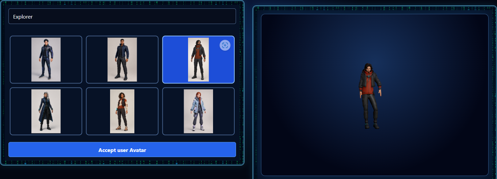
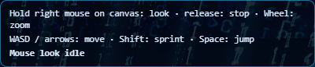
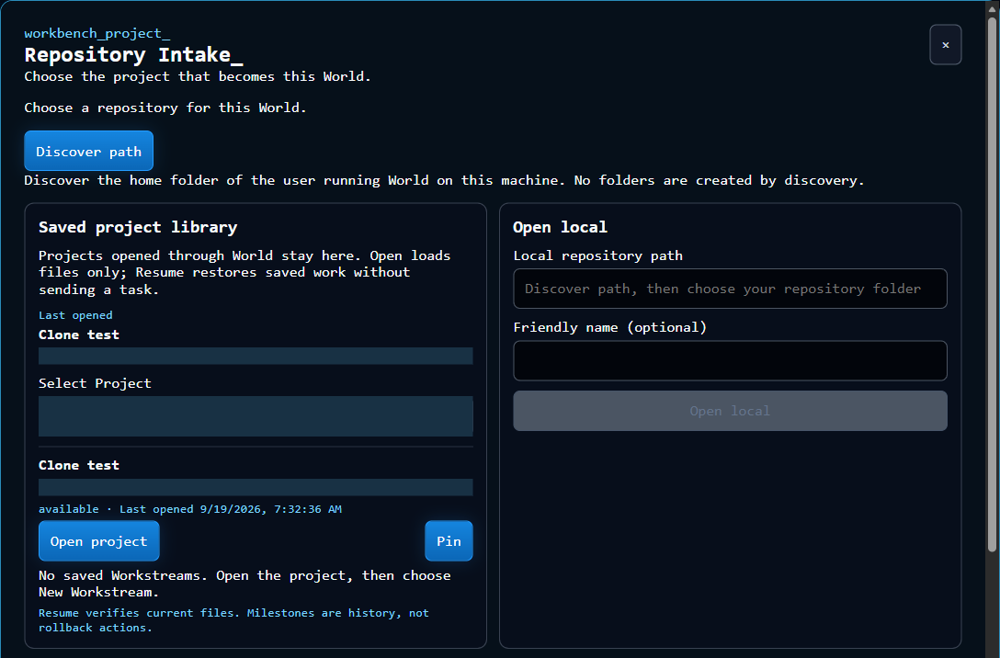

# AgentIntersect World

A local 3D workspace for working with your own Hermes, OpenClaw, Codex and Claude Code agents.

## Explore World

- [Website](https://agentintersect.com/)
- [Field Guide](https://guide.agentintersect.com/getting-started/)
- [Downloads and current availability](https://agentintersect.com/download/)

**Private release-candidate preparation:** `0.15.0-rc.1`. The source repository remains private while Windows/Linux packages undergo hands-on testing. No stable-release or signing claim is made. Download controls activate only after real artifacts are hosted and verified.

## Screenshots

These are real development-build captures, not the website's concept artwork. Images are cropped to the relevant UI; repository-entry personal paths are masked and its dialog backing was made opaque for documentation privacy. They do not imply a completed agent task or successful voice installation.





## Release-candidate installation

World is a browser-based local application. Packages include Node.js; they do **not** install or configure your agents. Install Git and at least one supported, authenticated harness yourself. Use a modern browser with hardware acceleration. Cross-environment Windows/WSL execution additionally needs Python in the target environment, as described below.

### Windows x64

When the candidate is available, verify its SHA-256 against the accompanying `SHA256SUMS`, then run `AgentIntersect-World-0.15.0-rc.1-windows-x64-setup.exe`. Installation is per-user and does not require administrator privileges. Open **AgentIntersect World** from the Start Menu. Keep its console open; type `quit` and press Enter or use Ctrl+C to stop it.

The candidate is **unsigned** until a verified signed replacement is explicitly announced. SignPath approval has not been obtained; signing never guarantees the absence of SmartScreen/antivirus warnings. Do not disable antivirus or device protections to install it.

Uninstall through Windows Installed Apps or the Start Menu uninstall entry. Program files are removed; `%LOCALAPPDATA%\AgentIntersect-World` state and your source repositories/native agent profiles are retained. Remove saved state manually only after backing it up and confirming you no longer need it.

### Linux x64

The tarball targets glibc-based x64 distributions supported by Node24. It is not an ARM or Alpine/musl package.

After downloading the candidate and checksum file to the same directory:

```sh
sha256sum --check SHA256SUMS --ignore-missing
tar -xzf AgentIntersect-World-0.15.0-rc.1-linux-x64.tar.gz
cd AgentIntersect-World-0.15.0-rc.1-linux-x64
./agentintersect-world
```

The launcher prints/opens `http://127.0.0.1:3771` and runs its backend on loopback3770. `--no-open` skips browser auto-open. If ports are occupied, select distinct `AIW_APP_PORT`/`AIW_PORT` values. Do not expose these ports to the Internet. Keep the terminal open; type `quit` and Enter or press Ctrl+C to stop both listeners.

Uninstall by stopping World and removing its extracted package directory. Saved state remains at `$XDG_STATE_HOME/agentintersect-world` (default `~/.local/state/agentintersect-world`); retain or explicitly remove it after backup. Project repositories and native agent profiles are never uninstalled.

## Build from source

Prerequisites: **Node.js 24 or newer**, Corepack, Git, and at least one installed, signed-in supported harness. Same-environment attachment works directly. Windows/WSL cross-environment process execution additionally requires native Python 3 in the target environment and a shared drive-backed World data directory/repository.

```sh
corepack pnpm@11.15.0 install --frozen-lockfile
corepack pnpm@11.15.0 dev
```

Open the local URL printed by Vite (normally `http://127.0.0.1:5173`). The backend defaults to loopback port 3770. World is not an Internet-facing multi-user service.

## Connect your agents

1. After the opening logo, a new installation opens **Agent Setup Menu**.
2. Select **Discover Agents**. This reads installation and native identity metadata. It does not log in, change providers, install plugins or start/restart harness services or stopped WSL distros.
3. Expand a harness, choose the installation and **native identity**, and give that saved connection a name for World. For Hermes, keep the separate-new-conversation default or explicitly list/select an existing native conversation. The World name never searches or renames native history.
4. Select **Attach to Agent Intersect World**. World checks the native interface and saves connection metadata only after success. A readiness check is not a successful model turn; the native model runs when you select/use that connection in a World.
5. Select **Continue to Agent Select**, then choose the saved connections that join this particular World. Complete user/agent avatar selection when requested.

On later launches, completed setup is skipped. **Escape for Menu** is available during opening, setup, avatar/agent selection and the World; its **Agent Setup Menu** action reopens setup without clearing saved work. Explicitly configured legacy adapters retain their existing entry flow until you add saved registrations.

## When setup needs attention

Use **Preview prerequisites** to see the exact native target, proposed changes and manual steps without applying anything. When a backend-local Hermes profile already has the World plugin installed but disabled, approve that one change and select **Apply approved change**. World backs up the config, uses the native CLI, verifies the effect and rechecks readiness; Attach remains separate. Cancel and stale/used plans cannot apply a change. Plugin installation, native login/API setup, gateway restarts and stopped-WSL startup remain owner-managed, not automatic installers. **Recheck selected identity** is available even before attachment.

- **Not found:** expand **Installation not found?** and enter an absolute directory containing the native launcher on the World server. This adds a read-only local search. The native executable must use its normal harness name.
- **Authentication:** complete login in the selected harness's own native application. World does not collect login credentials in the browser. Retry attachment, or use **Recheck** for an existing connection.
- **Hermes:** the selected profile needs its authenticated API server running and the World plugin's required session-coordination capabilities. Refer to [Hermes API server documentation](https://hermes-agent.nousresearch.com/docs/user-guide/features/api-server). World will report missing capabilities rather than silently enabling or restarting the gateway.
- **OpenClaw:** the selected native agent needs a running loopback gateway with authentication and the required session methods. World uses the chosen agent, not an assumed `main` identity.
- **Codex / Claude Code:** complete native setup and choose the model/provider in that harness. Saved-profile connections preserve native configuration rather than forcing the developer's model.
- **Different environment:** Windows/WSL launches are bound to the selected native environment, profile, shared workspace and cancellation supervisor. Install native Python 3 in the target. Use a shared Windows drive for World state and repositories; Windows Codex UNC/WSL-home workspaces and cross-environment `.cmd`/`.bat` wrappers are not supported. A real WSL→Windows Codex coding/resume/cancellation proof passed; other directions are not separately live-native accepted. Missing prerequisites remain **found, not attached**.
- **Stopped WSL:** start that distro yourself if desired, then discover again. Discovery will not start it for you.

Harness product versions are diagnostic; required API/CLI/protocol contracts still have to match. Normal user-managed updates are not blocked by an exact-version allowlist. No compatibility claim is made for arbitrary future breaking changes.

Saved setup is server-owned in the World state directory. Native authentication remains in the native profile or an explicit legacy credential reference, not browser storage. Native configuration changes, plugin installation, service activation, releases and public exposure require separate operator action/approval.

## Development and acceptance

See [Agent Setup scope and acceptance](docs/AGENT_SETUP_MENU.md) for the PR's full criteria and current verification boundaries. Automated tests, live interface readiness, real model execution, saved-work application restart, and human visual acceptance are separate evidence layers.

```sh
corepack pnpm@11.15.0 test
corepack pnpm@11.15.0 typecheck
corepack pnpm@11.15.0 lint
```
