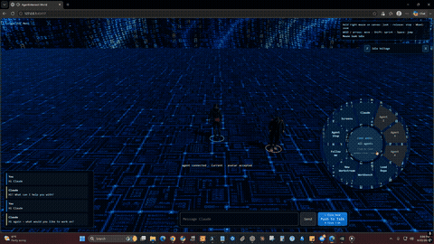

# AgentIntersect World

**Your code becomes a place. Your agents become a presence.**

Local-first 3D workspace where your own coding agents (Claude Code, Codex, Hermes, OpenClaw, and friends) work on your repository as a world you can walk — not another hosted chat IDE, and not a replacement for those agents.

> **Status:** Private pre-release. Packaged Windows/Linux downloads are coming. Site: [agentintersect.com](https://agentintersect.com) · Field Guide: [guide.agentintersect.com](https://guide.agentintersect.com)
>
> **Get notified (no email form):** when this repo is public, click **Watch → Custom → Releases** so GitHub emails you on new Releases. ([Releases](https://github.com/MelaBuilt-AI/AgentIntersect-World/releases))



*GIF: world load → repository city ready (~26s). Full clips linked below.*

## Demos

In-development captures.

Inline GIF above shows the repo-city load. Full MP4s are on the private [launch-demos](https://github.com/MelaBuilt-AI/AgentIntersect-World/releases/tag/launch-demos) release (GitHub’s file viewer often won’t play repo videos — use these download links while signed in):

| Demo | Watch / download |
|------|------------------|
| **Launch reel** (city + coding, ~100s) | [launch-reel.mp4](https://github.com/MelaBuilt-AI/AgentIntersect-World/releases/download/launch-demos/launch-reel.mp4) |
| Repo city / `/repo load` | [repo-city.mp4](https://github.com/MelaBuilt-AI/AgentIntersect-World/releases/download/launch-demos/repo-city.mp4) |
| Agent coding / embodiment | [agent-coding.mp4](https://github.com/MelaBuilt-AI/AgentIntersect-World/releases/download/launch-demos/agent-coding.mp4) |

## Get notified

No email capture. Use GitHub:

1. Open [MelaBuilt-AI/AgentIntersect-World](https://github.com/MelaBuilt-AI/AgentIntersect-World)
2. **Watch** → **Custom** → check **Releases** → Apply

You only get notified when a new [Release](https://github.com/MelaBuilt-AI/AgentIntersect-World/releases) is published (not on every commit). While the repo is private, only collaborators can Watch; once it’s public, anyone can.

**Site CTA (for agentintersect.com when you flip):** “Watch on GitHub for release notifications →” linking here.

## What it is

- **Repository-as-landscape** — intake a repo and explore it as a spatial world (the “repo city”).
- **BYO agents** — attach harnesses you already run locally; World does not log in as you or replace Claude Code / Codex.
- **Conversation → Workstream → World View** — talk, assign work, then see agents as presence in the world.
- **Local loopback** — built for one operator on your machine, not a multi-user internet service.

## What this is not

- Not Cursor / Windsurf (editor replacement)
- Not a hosted agent product (you bring local agents)
- Not unrelated “Intersect AI” products — this is **AgentIntersect World** by [MelaBuilt AI](https://melabuilt.ai)

## Requirements (local / developer)

- **Node.js 24+**, Corepack, Git
- At least one supported harness installed and signed in (Claude Code, Codex, Hermes, OpenClaw, …)
- **Packaged release targets (when shipped):** Windows and Linux
- Windows/WSL cross-environment process execution additionally needs native Python 3 in the target environment and a shared drive-backed World data directory

## Install (when Release ships)

- **Windows / Linux:** artifacts will be attached to the [latest Release](https://github.com/MelaBuilt-AI/AgentIntersect-World/releases/latest) (product build not published yet)
- Checksums will be listed in the Release notes
- Until then: [Watch → Custom → Releases](#get-notified) for the notify path

Until then, local development:

```sh
corepack pnpm@11.15.0 install --frozen-lockfile
corepack pnpm@11.15.0 dev
```

Open the Vite URL (normally `http://127.0.0.1:5173`). Backend defaults to loopback port `3770`.

## Connect your agents

1. After the opening logo, a new install opens **Agent Setup Menu**.
2. **Discover Agents** — reads install / native identity metadata. It does not log in, change providers, install plugins, or start WSL distros for you.
3. Pick harness + **native identity**, name the World connection, then **Attach to Agent Intersect World**.
4. **Continue to Agent Select**, choose who joins this World, set avatars when asked.

Later launches skip completed setup. **Escape for Menu** reopens Agent Setup without wiping saved work.

World does **not** collect harness login credentials in the browser. Finish auth in each harness’s own app.

Deep dive: [docs/AGENT_SETUP_MENU.md](docs/AGENT_SETUP_MENU.md) · full developer README preserved at [docs/launch/README.developer.md](docs/launch/README.developer.md)

## Links

- Product: https://agentintersect.com
- Field Guide: https://guide.agentintersect.com
- Melabuilt: https://melabuilt.ai
- X: [@melabuiltai](https://x.com/melabuiltai)
- Launch drafts: [docs/launch/](docs/launch/)

## License

Not set yet — add before any public open.

## Development

```sh
corepack pnpm@11.15.0 test
corepack pnpm@11.15.0 typecheck
corepack pnpm@11.15.0 lint
```

See [docs/launch/README.developer.md](docs/launch/README.developer.md) for the longer agent-setup and acceptance notes.
